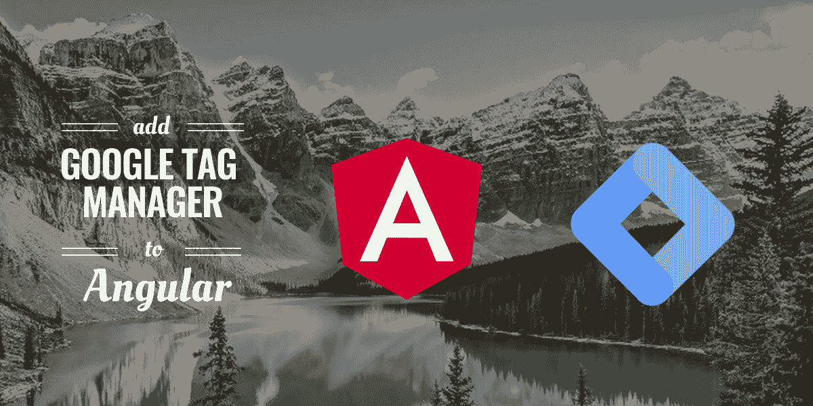
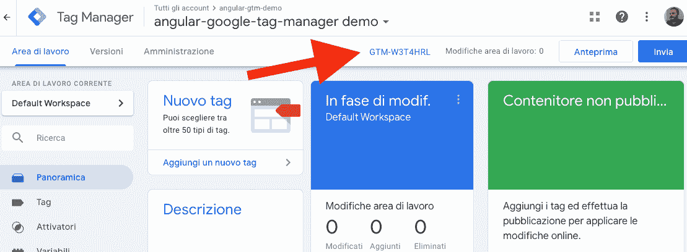
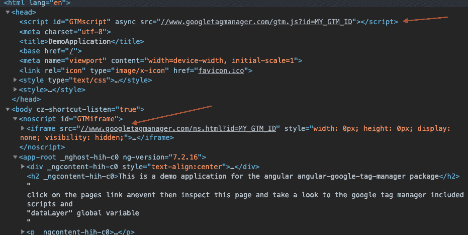
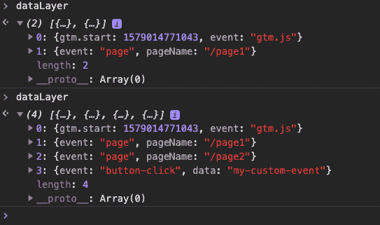
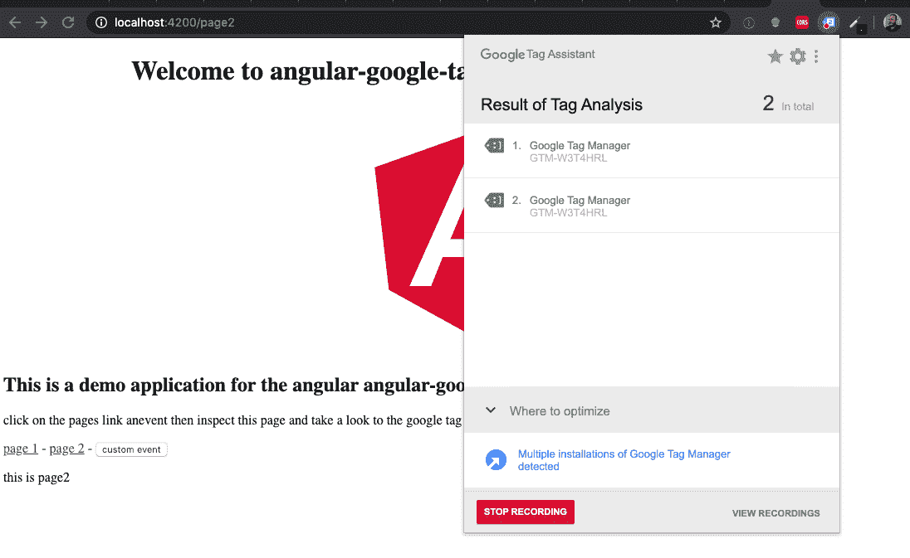
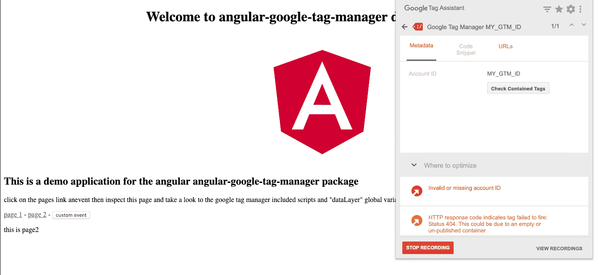

# 如何将 Google Tag Manager 添加到 Angular 应用程序中

> 原文：<https://itnext.io/how-to-add-google-tag-manager-to-an-angular-application-fc68624386e2?source=collection_archive---------0----------------------->

将 GTM 服务添加到 angular 应用程序的简单教程



[**谷歌标签管理器**](https://www.google.com/intl/it/tagmanager/) 是谷歌的免费工具，允许你安装和**管理标签**(脚本，跟踪像素，cookie 处理程序 ecc..)放在你的网站上**，而不需要修改代码**。GTM 是一个很好的工具，允许营销专家在不影响代码库的情况下处理站点/应用程序，并为每个营销自动化干预部署新版本的站点。

在本教程中，我们将**解释如何通过使用专用库将 GTM 脚本正确地包含在您的 Angular 应用程序**中，以及如何**发回 GTM 将转发给 Google Analytics** 的数据。

# 参考知识库

我们将使用的 angular base 项目的一个工作示例位于:[**https://github . com/mzuccaloli/angular-Google-tag-manager/tree/master/demo-application**](https://github.com/mzuccaroli/angular-google-tag-manager/tree/master/demo-application)，这是一个简单的 Angular 项目，使用 angular CLI 和命令“ *ng new* ”生成。更多信息见[角度项目快速入门](https://angular.io/guide/quickstart)。

主存储库是我们将在本教程中使用的库:[https://github.com/mzuccaroli/angular-google-tag-manager](https://github.com/mzuccaroli/angular-google-tag-manager)。

# 入门指南

在本教程中，我们将使用自己制作的一个名为[**angular-Google-tag-manager**](https://github.com/mzuccaroli/angular-google-tag-manager)的**库来简化 GTM 设置和自定义事件的推送。**

# 安装和配置

首先安装 angular-谷歌标签管理器

```
$ npm install --save angular-google-tag-manager
```

安装后，您需要在' *src/app.module.ts'* 中提供您的 **GTM id**

将 id 放在环境变量中是一个好主意:你将能够将不同的环境连接到不同的 GTM 帐户，并且它将允许你在一个受保护的环境中测试你的所有标签。

如果您不知道在哪里可以找到您的 GTM id，请转到您想要跟踪的 **Google Tag manager 帐户**，您可以在那里找到它:



您可以将服务注入到需要与之交互的应用程序的每个控制器中，并推送自定义事件，它是一个**单例实例**，设置(将 GTM 脚本和 iframe 添加到 DOM)将在第一次使用时自动**处理**。

在你的控制器中注入 *gtmService* :

# 页面事件

如果您想**跟踪页面事件并将其发送给 Google Analytics** ，最好的方法是**订阅路由器出口外加载的控制器中的导航事件**(主应用程序或标题控制器也可以)

示例中的 *gtmTag* 是**完全自定义的**，您可以在该对象中发送您的分析所需的所有信息，如页面名称、页面 url、用户登录状态等。

# 自定义事件

如果你想跟踪任何由你的应用程序触发的**特定事件**推送定制事件非常简单:注入服务，然后在你需要跟踪的每个函数调用中调用 pushTag 方法；

# 测试您的标签和数据层

如果你想检查 GTM 脚本的安装和配置，你可以很容易地按照这个步骤

## 检查生成的 HTML

右键单击应用程序，然后单击 inspect，在呈现的 HTML 中，您应该能够在标题中找到一个脚本标记，在正文中找到一个 iframe:

**注意:从 lib 版本 1.2.4 开始,“noscript”iframe 不再是必需的，因此它仅对旧版本有效。**



## 检查数据层变量

在浏览器控制台中查看 **dataLayer** 变量，它应该包含一个由我们的服务触发的事件的数组:查看变量，然后访问一些页面并执行一些应该触发事件的操作，再次查看变量，新的**记录应该被推送到数组**。这是推送到 GTM 的事件数组。



## 检查您的网络通话

如果你的 GTM 账户配置了一些**自定义标签**(比如分析、跟踪像素、cookie 机器人等等)，你可以**检查你的网络调用栈**并找到自定义标签发出的调用。

## 使用谷歌标签助手

Google 提供了一个 chrome 扩展[](https://chrome.google.com/webstore/detail/tag-assistant-by-google/kejbdjndbnbjgmefkgdddjlbokphdefk)**来检查哪些标签正在你的页面上运行，以及它们的配置是否正确。安装并运行它，您将能够记录由您的导航触发的标签列表。**

**有效配置的示例:**

****

**无效配置的示例:**

****

# **Google 标签管理器配置**

**这篇文章是关于应用程序和代码的，**谷歌标签管理器是一个非常先进的工具，需要适当的配置**，这不是一件容易的工作。在许多公司中，GTM 是**在开发者和“营销人员”之间搭建桥梁的主要工具**，如果你处于这种情况，这篇文章对你来说就足够了，如果你的公司中没有人具备管理 GTM 的技能，你将需要深入了解他的配置。官方文档相当不错，你可以[从这里开始分析配置](https://support.google.com/tagmanager/answer/6107124?hl=en)。**

# **关于库的说明**

**本文和参考示例的灵感来自于生产中运行的真实项目 angular-Google-tag-manager 的第一个实现是我参与的一个大型 Angular 项目中的一个服务，然后我决定将它转移到一个 [**NPM 公共包**](https://www.npmjs.com/package/angular-google-tag-manager) 中，以便在其他项目中重用它，并与其他开发人员共享。**

**它并不完美，但**工作良好，并有大量的页面浏览量**，本文的库和代码不是一个 *"hello world"* 演示，而是在生产中运行的真实代码，如果你有兴趣**为这个项目做出贡献**直接在 GitHub 资源库上联系我:[https://github.com/mzuccaroli/angular-google-tag-manager](https://github.com/mzuccaroli/angular-google-tag-manager)，欢迎拉请求和贡献者！如果这篇文章和 NPM 软件包对你有用，请在 Medium 上鼓掌，在 GitHub 上打星。**