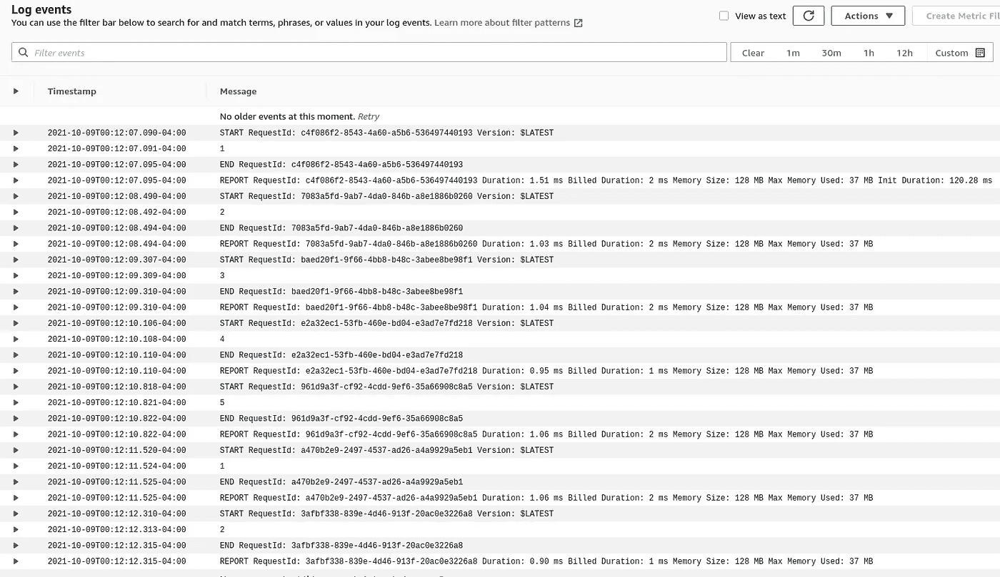

# 如何在没有外部服务的情况下在您的 lambdas 中添加一些缓存—也称为有状态 lambdas

> 原文：<https://itnext.io/how-to-add-some-caching-in-your-lambdas-without-external-service-aka-stateful-lambdas-1d9c2d4c2083?source=collection_archive---------4----------------------->


AWS lambdas

你知道你可以在不同的 lambda 调用之间保持一些数据的持久性吗？如果您想存储一个临时缓存或加速每次调用，这很有用。让我们看看 lambdas 如何在引擎盖下工作，以及我们如何利用它。

# 用例 1:持久性

**今天，有人问我，跨多个 lambda 调用保持 JWT 的最佳解决方案是什么。**如果你的 lambda 调用一个 API，你不希望每次调用都生成一个新的 JWT。一个解决方案是将令牌存储在 Elasticache 或 DynamoDB 中，但这将是多余的，我们希望更喜欢遵循[之吻](https://en.wikipedia.org/wiki/KISS_principle)原则。

# 用例 2:加速

这种方法有用的另一个场景是**，当您需要加载一些静态内容**时。假设您的 lambda 检查一封电子邮件是否存在于存储在 s3 中的黑名单中。当然，列表的大小应该适合 lambda 内存。您不希望每次都下载数据源，或者避免静态 s3 发行版上的 HTTP 调用。

**注意**:如果您的数据可以按需重新生成，并且您的数据可以同时存在于多个 lambdas 上，则此方法有效。第一个场景，在 3 辆 lambdas 上有 3 辆 JWT 是可以的，它们都是有效的，可以单独再生。第二种情况，数据是只读的。

# 简单的解决方案

> 在处理程序之外处理代码。句号。

为了更好地理解解决方案，我们需要了解 lambdas 是如何工作的。lambda 只是一个运行应用程序的容器，每次调用时都会调用处理程序。你可以把它想象成运行一个 API 并调用一个端点，或者加载一个库并调用一个方法。

lambda 初学者的一个常见陷阱是认为每次调用都会启动一个新的 lambda。不，事实上，如果你经常打电话，容器会保持温暖。保持 lambda 预热的一种技术是通过一个 [Eventbridge 规则](https://docs.aws.amazon.com/eventbridge/latest/userguide/eb-create-rule-schedule.html)周期性地调用它。

这里有一个快速的虚拟测试来演示 lambda 的持久性

```
counter = 0

def lambda_handler(event, context):
    global counter

    if counter >= 5:
        counter = 0

    counter = counter + 1
    print(counter)

    return counter
```



正如我们看到的，在多次调用之间，计数器变量被重用。

**在第一个场景**中，您需要一个条件来检查令牌的有效性，并在需要时重新生成一个新令牌，如下所示:

```
token = None
def get_token:
    global token
    if token and token.expiration < time()
        return token token = call_api_auth()return token
```

**在第二个场景**中，通过在函数的第一次实例化期间加载数据集，您可以在后续调用中节省大量时间。这里你可以有一个定期重新加载列表的条件。

# 结论

即使这种方法在某些场景中是有用的，不要忘记你不能依赖 lambda 的持久性，根据定义，它是短暂的。你必须在你的函数被终止、重启或者有两个容器同时运行的情况下处理这个错误。