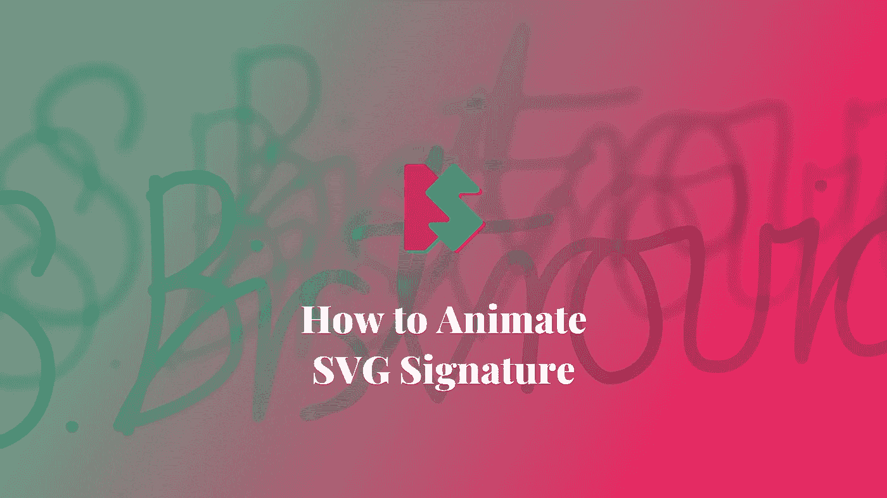
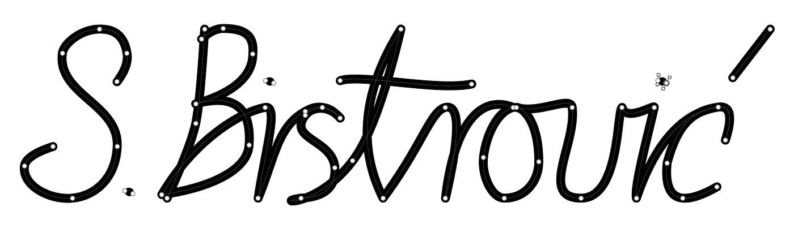

# 如何制作 SVG 签名动画

> 原文：<https://itnext.io/how-to-animate-svg-signature-40adf8aa15c4?source=collection_archive---------6----------------------->

## SVG 动画

## 用 JavaScript 和 CSS 构建动画 SVG 签名



让我们看看如何用一点 JavaScript 和 CSS 来制作 SVG 签名动画。在这个演示中，我将向你展示如何使用 JavaScript 函数来计算 SVG 路径长度和 CSS 动画来制作 SVG 笔画动画。你可以在[上看到关于页面](https://www.silvestar.codes/about-me/)或 [CodePen](https://codepen.io/CiTA/full/abzJqQv) 的最终结果。


# SVG 签名

让我们从创建一个 SVG 签名开始。我正在使用 Sketch 为字母创建 SVG 路径。这是它在编辑模式下的样子:



它包含用于不同签名路径的八个不同路径。例如，一条路径代表字母“S”，一条路径代表点，依此类推。

一旦我从 Sketch 导出了 SVG，我就按照我想要的方式重新排序路径:首先是字母“S ”,然后是点，然后是字母“B ”,依此类推。此外，我还添加了`autograph`和`autograph__path`类来简化 JavaScript 操作和样式。这是最终文件:

```
<svg class="autograph" height="103" viewBox="0 0 424 103" width="424" >
  <g fill="none" fill-rule="evenodd" stroke="#000" stroke-linecap="round" stroke-linejoin="round" stroke-width="3" transform="translate(2 2)">
    <path class="autograph__path"
    d="m52.9053119 30.5944651c4.4979146-5.981029 6.3597765-11.3263744 5.5855855-16.0360361-2.1621621-13.15315311-10.9863929-13.558429-15.4908974-13.558429-10.0900901 0-20 7.99987048-20.7253188 13.558429-3.0543891 23.4076405 31.8852386 28.5472234 30.7253188 52.441571-.9009009 18.5585586-12.9740033 27.7974004-25 29-12.6126126 1.2612613-28.33708674-6.8576105-27-18 .48048048-4.004004 5.81381381-7.6706707 16-11" />
    <path class="autograph__path"
    d="m61.9059048 93.3815042c1.7863267-3.215388-4.287184-4.6444494-4.6444494-1.4290614-.3572653 2.143592 2.8581227 4.6444494 4.6444494 1.4290614z" />
    <path class="autograph__path" d="m102 1c-1.633522 27.1862259-3.3001883 44.8528926-5 53s-7.033145 22.1471074-16 42" />
    <path class="autograph__path"
    d="m100.288288 6.6036036c4.152508-3.963964 8.176532-5.945946 12.072072-5.945946 11.531532 0 17.63964 3.3423424 16.63964 14.3423424 0 13-12.06006 22.3543543-32 28 21.430945-5.8755744 31.400915 1.8721733 29.90991 23.2432432-1.081081 15.4954958-25.606607 24.6336338-48.90991 27.7567568 18.3783784-31.111111 44.546547-46.5975976 58-49 7.684578-1.3722461.201094 23.4415679-4 51 9.626744-23.6648293 10.754389-40.1268415 26.472991-48.7743243 3.062782-1.6849689 5.899902-2.8000991 9.527009-2.2256757 2.58117.4087788 5.287656.9554275 10 6-7-8-16.06468-6.1122883-19.527009-1.6121622-10.472991 13.6121622 15.527009 13.6121622 16.527009 29.6121622.666667 10.6666667-5.666667 16.3333333-19 17-16.664879 2.1642702 8.261928 6.47368 29-21 9.19448-12.1807945 18.19448-36.8474612 27-74-21.276288 33.987688-24.609621 65.6543547-10 95 21.886044-29.4751082 26.735893-49.2438774 35-51 9.609609-2.042042 6.726727 21.4504503 0 51 4.444444-39.2792794 18.42042-58.8078078 38-51-8.828829 2.1621621-15.315998 15.4560012-16.711712 28.1171176-1.126809 10.2217665 4.625073 22.8828824 11.711712 22.8828824 12.252252 0 19.279279-10.0010654 19.279279-20.5405401 0-23.0630631-9.234234-30.4594599-12.477477-30.4594599 12.432432 3.9639639 30.297297-6.8468469 31.198198 0 2.644012 20.0944903-19 51 5 51 22 0 19.936937-49.1981982 23-51 2.342343 8.6486486 18.480018-2.1232717 18 0-3.570281 15.7924726-11.376494 44.5410656-10 51 4.504505-13.1531532 17-47 45.900901-51.1711712 6.669031-.9625192 8.255066 5.4033441 3.963964 18.5585586 4.204205-13.3333334 2.882883-19.5195196-3.963964-18.5585586-13.059803 1.8329549-22.530745 8.0837151-28.69016 31.4759854-1.237235 12.5179014 1.692518 19.0829633 8.789259 19.6951858 4.616353.3982441 10.995909-1.7223734 19.138668-6.3618524" />
    <path class="autograph__path" d="m178 30c11-4 54 6 73.734117 1.8554251" />
    <path class="autograph__path" d="m419 1-21 27.333" />
    <path class="autograph__path"
    d="m140.729905 31.3135042c1.786326-3.215388-4.287184-4.6444494-4.64445-1.4290614-.357265 2.1435921 2.858123 4.6444494 4.64445 1.4290614z" />
    <path class="autograph__path"
    d="m360.729905 31.3135042c1.786326-3.215388-4.287184-4.6444494-4.64445-1.4290614-.357265 2.1435921 2.858123 4.6444494 4.64445 1.4290614z" />
  </g>
</svg>
```

用笔画制作 SVG 是至关重要的，因为我们要制作笔画动画。每一条路或每一笔都有它的长度。我们将在动画中使用这些笔画和长度。

# JavaScript 计算

为了计算一个笔画的长度，我们可以使用手动方法猜测大概的长度。在这种情况下，我们应该使用两个破折号属性:

*   `stroke-dasharray`，这使得中风摔死，和
*   `stroke-dashoffset`，将笔画位置推出可视路径。

这两个属性应该相等才能起作用。现在我们可以试着猜一下中风有多长。但是我们是程序员，我们不需要猜测:我们可以通过编程来实现。这是它应该如何工作的概念:

*   首先，我们设置整体的动画持续时间。
*   接下来，我们利用`[getTotalLength()](https://developer.mozilla.org/en-US/docs/Web/API/SVGGeometryElement/getTotalLength)`函数来计算总路径长度组合。
*   接下来，我们通过总路径长度的比率来计算每条路径的动画持续时间和延迟。
*   接下来，我们设置`stroke-dasharray`和`stroke-dashoffset`，它们将把虚线笔画定位在可见路径之外。
*   最后，我们通过将类`animated`添加到文档主体来开始动画。

下面是整个 JavaScript 函数(为了更容易理解，添加了注释):

```
const calcPaths = (totalDur) => {
  // unset 'animated' class to body which will reset the animation
  document.body.classList.add('animated')

  // get all SVG elements - lines and dots
  const paths = document.querySelectorAll('.autograph__path')

  // prepare path length variable
  let len = 0

  // prepare animation delay length variable
  let delay = 0

  // escape if no elements found
  if (!paths.length) {
    return false
  }

  // set duration in seconds of animation to default if not set
  const totalDuration = totalDur || 7

  // calculate the full path length
  paths.forEach((path) => {
    const totalLen = path.getTotalLength()
    len += totalLen
  })

  paths.forEach((path) => {
    const pathElem = path

    // get current path length
    const totalLen = path.getTotalLength()

    // calculate current animation duration
    const duration = totalLen / len * totalDuration

    // set animation duration and delay
    pathElem.style.animationDuration = `${duration < 0.2 ? 0.2 : duration}s`
    pathElem.style.animationDelay = `${delay}s`

    // set dash array and offset to path length - this is how you hide the line
    pathElem.setAttribute('stroke-dasharray', totalLen)
    pathElem.setAttribute('stroke-dashoffset', totalLen)

    // set delay for the next path - added .2 seconds to make it more realistic
    delay += duration + 0.2
  })

  // set 'animated' class to body which will start the animation
  document.body.classList.add('animated')
  return true
}
calcPaths(5)
```

> *在使用此技术之前，请务必检查* [*浏览器兼容性*](https://developer.mozilla.org/en-US/docs/Web/API/SVGGeometryElement/getTotalLength#Browser_compatibility) *。*

# CSS 动画

CSS 动画包括将最终的`stroke-dashoffset`设置回零。

我用过`linear`代表`animation-timing-function`，用`forwards`代表`animation-fill-mode`。第一个属性使动画线性，这对我来说是最自然的。第二个告诉动画保持 100%的状态。

```
.autograph__path {
  opacity: 0;
  animation-timing-function: linear;
  animation-fill-mode: forwards;

  .animated & {
    opacity: 1;
    animation-name: line;
  }
}

@keyframes line {
  100% {
    stroke-dashoffset: 0;
  }
}
```

我使用了不透明度来防止载入时的闪烁。当与关键 CSS 结合使用时，效果会更好。

# 结论

这就是了，一个动画 SVG 签名。只要掌握一点 SVG、JavaScript 和 CSS 知识，您就可以创建吸引人的绘图动画。我已经找到了很多像这样处理动画的插件，但是我总是喜欢使用更少的代码。我用不到 100 行代码做了这个演示。点击此处查看完整演示:

*最初发布于*[*https://www . silvestar . codes*](https://www.silvestar.codes/articles/how-to-animate-svg-signature/)*。*