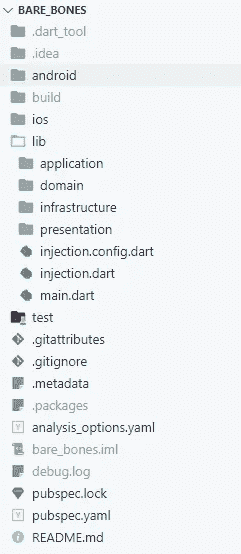
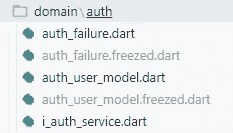
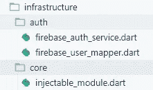

# 如何在 Flutter 中构建生产级应用程序:电话号码认证

> 原文：<https://itnext.io/how-to-architect-a-production-level-app-in-flutter-phone-number-sign-in-263628e1872c?source=collection_archive---------0----------------------->

当开发人员进入 Flutter 时，他们可以找到各种资源来帮助他们开始。教程、存储库和 UI 挑战等资源可以将初学者变成中级 Flutter 开发人员。很快，开发人员就爱上了这个框架。

构建令人惊叹的 UI 是 Flutter 最有趣的方面。然而，没有可维护的业务逻辑支持的漂亮的 UI/UX 不会让你走得太远。如果你的目标是成为一名高级 Flutter 开发人员，不幸的是，没有太多的资源可以帮助你。

我相信没有一个 Flutter 开发者会在整个旅程中感到孤独，所以我决定分享我构建生产级应用程序的经验。因此，我开源了 [Sponty](https://sponty.app/#/) 的电话号码登录功能及其生产级的干净架构。

我将展示如何使用 Firebase 构建一个具有电话号码登录功能的 Flutter 应用程序。本文的范围仅限于架构和如何处理状态管理。你可以在 [Github](https://github.com/erkansahin/phone_number_sign_in) 中找到该项目的完整源代码。

要开始，您可以使用[裸机](https://github.com/erkansahin/bare-bones)项目模板。它预先配置了所需的依赖注入、路由和 linter，因此您不必设置所有这些。基本的文件夹结构如下所示:

# 畴层

首先，我们在域层下为身份验证特性创建一个文件夹。这一层保存 auth 用户模型类、自定义身份验证失败和用于与身份验证服务通信的接口。

[冻结的](https://pub.dev/packages/freezed)包用于生成模型类。freezed 的一个优点是支持值相等。在不冻结的情况下，如果两个实例的对象引用相同，`==`返回 true。Freezed 覆盖了`==`操作符和`hashCode`，这样我们就不用编写样板代码了。你可以从官方文档[中读到更多关于 Dart 语言中的平等的内容。](https://dart.dev/guides/language/effective-dart/design#equality)

我们的用户模型类很简单。任何登录的用户都会有一个用户 id 和一个`phoneNumber`。当用户未登录时，两个字段都将是空字符串:

当用户想要用电话号码登录时，存在一些需要处理的失败场景:

*   用户可能输入了无效的电话号码。
*   输入 SMS 代码的超时时间可能已过。
*   用户输入的验证码可能不正确。
*   用户会话可能会过期。
*   服务器可能关闭了。
*   用户滥用身份验证服务，请求过多。
*   用户设备不支持电话号码登录(模拟器)。

我们需要处理上述场景，并通知我们的用户哪里出错了。 [AuthFailure](https://github.com/spontyapp/phone_number_sign_in/blob/main/lib/domain/auth/auth_failure.dart) 类包含用户在电话号码登录期间可能收到的错误。更具体地说，它是一个冻结的类，一个联合类型。Dart 目前不支持联合；然而，freezed 提供了语法类似于 Kotlin 的联合类:

认证服务负责处理四个主要功能:

*   身份验证状态更改时通知。
*   从服务中注销。
*   发送电话号码到后端，发出错误信息，如果有的话。
*   发送短信代码到后端进行验证，发出错误消息，如果有的话。

我们创建一个接口来与认证服务通信。因此，应用层将只知道接口，这将使认证服务独立于 Firebase。以下方法与任何认证服务都没有严格的关系。认证服务的抽象允许后端的无缝改变(Firebase，AWS，Azure)。

使用的返回类型来自一个名为 [dartz](https://pub.dev/packages/dartz) 的函数式编程包。当用户输入电话号码并按下发送按钮时，就会触发`signInWithPhoneNumber`方法。它会发出一个`AuthenticationFailure`或者一个`verificationId`。收到验证 id 意味着用户将收到一条短信。当用户输入`smsCode`时，我们会将其与验证 id 一起发送到服务器，以完成登录。它返回一个`AuthFailure`或者通过返回`Unit`返回成功。

# 基础设施层

既然认证服务的抽象已经完成，我们就准备好实现`FirebaseAuthService`。与域层类似，为身份验证功能创建了一个子文件夹。该文件夹下有两个文件:

*   `FirebaseAuthService`实现了`IAuthService`。
*   将 firebase 用户映射到我们的`AuthUserModel`类的扩展方法。

依赖注入用于实例化 FirebaseAuthService。如果您不熟悉[依赖注入](https://stackoverflow.com/questions/130794/what-is-dependency-injection)或[可注入](https://pub.dev/packages/injectable)包，您可以查看[链接资源](https://medium.com/r?url=https%3A%2F%2Fresocoder.com%2F2020%2F02%2F04%2Finjectable-flutter-dart-equivalent-to-dagger-angular-dependency-injection%2F)。`InjectableModule`注册第三方依赖项需要类:

接下来，我们创建实现`IAuthService`的`FirebaseAuthService`类。可注入包将为我们创建一个`FirebaseAuthService`的单例实例。如果您想将认证服务从 Firebase 切换到 AWS，您唯一需要做的就是为`AmazonAuthService`实现`IAuthService`接口，并将其注册为`IAuthService`。这提供了在不同服务提供商之间切换的灵活性，而无需修改业务逻辑。

你可以从[官方文档](https://firebase.flutter.dev/docs/auth/phone/)中找到 Firebase 手机认证的设置说明。本文的范围不包括 Firebase Auth 的设置。

`signInWithPhoneNumber`是我们将要编写的最棘手的方法，因为`verifyPhoneNumber`是由 Firebase 实现的。Firebase 要求我们处理四个回调:

> [**验证完成**](https://firebase.flutter.dev/docs/auth/phone/#verificationCompleted) :自动处理 Android 设备上的短信代码。
> 
> [**验证失败**](https://firebase.flutter.dev/docs/auth/phone/#verificationFailed) :处理电话号码无效、是否超过短信限额等失败事件。
> 
> [**codeSent**](https://firebase.flutter.dev/docs/auth/phone/#codeSent) :当一个代码从 Firebase 发送到设备时的处理，用于提示用户输入代码。
> 
> [**codeAutoRetrievalTimeout**](https://firebase.flutter.dev/docs/auth/phone/#codeAutoRetrievalTimeout):处理短信代码自动处理失败时的超时。

在同一个`signInWithPhoneNumber`进程中可以触发多个回调。例如，当从 Firebase 接收到 SMS 代码时，就会触发`codeSent`回调。如果用户有 Android 设备，还会触发`verificationCompleted`回调，让用户自动登录，而无需输入短信代码。此外，在此过程中，用户可能会收到验证失败的消息。我们需要在 UI 中表示这些错误。

大多数教程将 UI 与回调中的逻辑结合在一起。UI 不应该包含任何与 Firebase Auth 实现相关的内容。`signInWithPhoneNumber`返回一个流。如果触发了`codeSent`回调，就会产生一个验证 id。如果验证由于某种原因失败，该方法产生一个`AuthFailure`。

如果`signInWithPhoneNumber`方法成功运行，它将通过`codeSent`回调返回一个验证 id。用户的设备应该很快就会收到来自 Firebase 的 SMS 代码。此时，我们会要求用户填写短信代码。

`verifySmsCode`将输入的 SMS 代码发送给 Firebase Auth 以完成验证。如果出错，该方法将返回相应的失败。例如，用户可能输入不正确的 SMS 代码。在这种情况下，将返回无效的验证码失败。

我们还需要一个让用户退出的方法:

无论是`signOut`还是`verifySmsCode`都没有给我们任何关于用户认证状态是否改变的线索。幸运的是，Firebase 为我们提供了一个观察身份验证状态变化的流。`authStateChanges`流用于了解用户是否登录。

随着`FirebaseAuthService`的实现，域和基础设施层都完成了。恭喜你！在下一部分中，我们将处理应用层中的状态管理。最后，我们将把业务逻辑组件集成到表示层的 UI 中。下一部分再见:

[第二部分:如何在 Flutter 中构建一个产品级的应用:电话号码认证](https://medium.com/@erkansahin/how-to-architect-a-production-level-app-in-flutter-phone-number-sign-in-part-2-63fff0bb79b1)