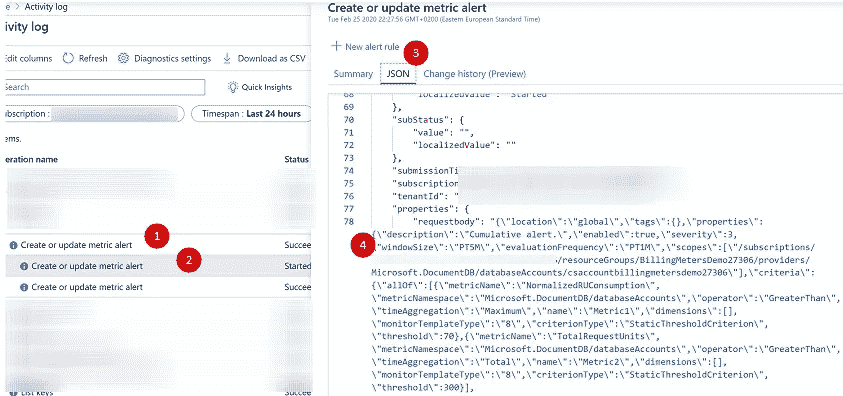
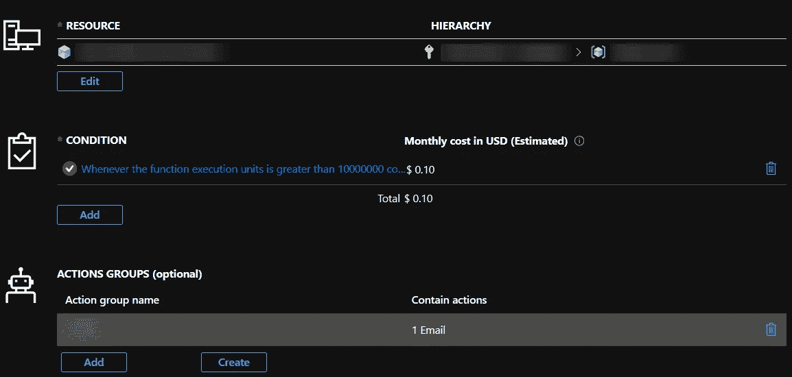
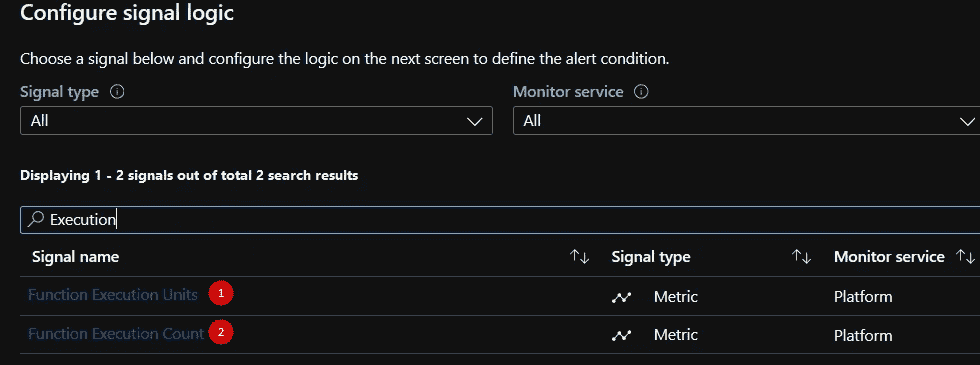
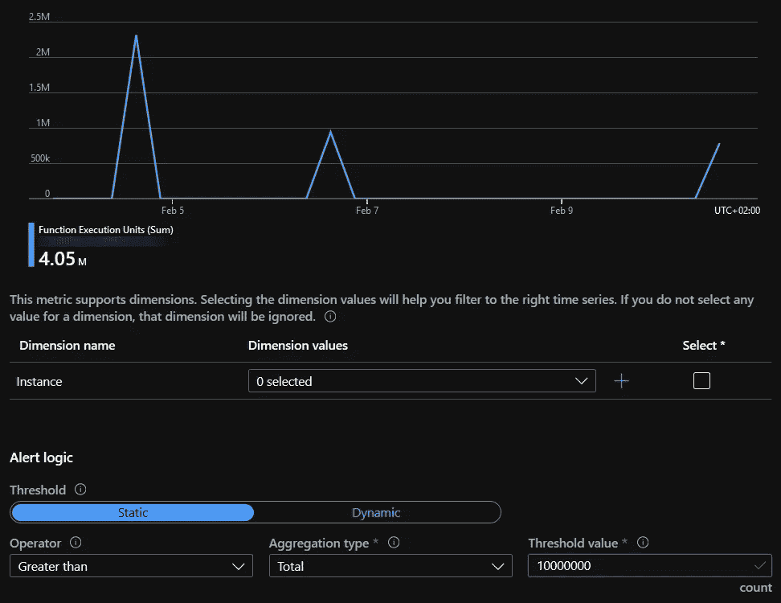

# 如何避免 Azure 无服务器解决方案的计费冲击？

> 原文：<https://itnext.io/how-to-avoid-a-billing-shock-with-azure-serverless-solutions-60029f121456?source=collection_archive---------1----------------------->

## 并通过 Azure CLI 部署警报。

[https://www.azurespringclean.com/](https://www.azurespringclean.com/)

我的计费问题在一段时间前就开始了，它们与 Azure CSP 订阅类型有关(你在那里没有成本管理的权限)。虽然我可以对已部署的基础架构进行成本估算，但要监控其峰值并自动化这一过程相对困难。

所以我决定在 2019 年秋季自动完成这个过程，现在是时候与 [#AzureFamily](https://twitter.com/search?q=%23AzureFamily) 分享了。还有一个带有 Azure CLI 的 GitHub gist 示例，其中包含适当的计费表。本文是 [#AzureSpringClean](https://twitter.com/search?q=%23AzureSpringClean) 社区活动的一部分。

> *TL；DR；*通过为 Azure Functions、SQL Serverless 和 Cosmos DB 的计费计量器设置适当的警报，很容易避免计费冲击。我将解释如何创建它们并自动化部署过程。*。*

# Azure 功能计费仪表的警报。

让我们从创建初始警报的 Azure 门户步骤开始，然后继续使用 Azure CLI 脚本来自动化和重复每个应用程序的部署。

> 计费仪表有: **FunctionExecutionUnits** 和 **FunctionExecutionCount** 。

不幸的是，您应该首先监控这些仪表，以便了解正常的使用模式。然后是时候调整下面的 Azure CLI alert 以获得准确值了。

通过 Azure CLI 自动部署计费仪表警报

现在让我们通过门户浏览 Azure Monitor 警报创建。有一件有趣的事。您可以从 Azure 门户和底层 JSON 组件中的活动日志获得新创建警报的 ARM 模板。

下面的 JSON 包含到监视器警报组和所选计费表的条件的链接，因此您可以在以后使用 Azure CLI 为任意数量的应用程序复制此警报。

让我们继续 Azure 门户流。

第一步是打开 Azure Monitor 并选择 Alerts 选项卡。你会看到用户界面像下面的截图，它包括资源，条件和行动组。

Azure Monitor 警报用户界面。

现在，让我们继续进行 Sigla 逻辑选择，并搜索“执行”指标。

搜索应用程序逻辑信号。

现在，当你选择了一个合适的计费表。现在是决定警报条件的时候了，Azure 提供了一个很好的界面，你可以观察这个计量器的确切用法。

# Azure SQL Serverless。

现在是 Azure SQL 家族的最新成员——无服务器数据库的时候了。你可以在这里阅读我的文章[，但同时，让我们看看可用的计费表。](https://medium.com/microsoftazure/azure-sql-serverless-start-guide-cc2a23e25741)

> 计费米有: **app_cpu_billed** 和存储费用(没那么重要)。

现在是 Azure CLI 脚本的时候了。您应该意识到成本计算可能没有那么简单。截至 2020 年 2 月 27 日，计算成本为 0.0001479 美元/秒，高级存储成本为 0.1265 GB/月。

# Azure CosmosDB。

Cosmos DB 是微软的一个全球分布式多模型，它以较低的价格提供了广泛的功能和高性能。我不会谈论特性，只关注 SQL API 模型的请求单位计费表。有一段时间内使用的标准化消耗百分比和总请求单位。

根据我的经验，糟糕的架构和分区策略会导致过多的账单，因此创建和调整下面的警报尤为重要。

> 计费电表有: **TotalRequestUnits** 和 **NormalizedRUConsumption** 。

# 结论。

无服务器解决方案正在普及，虽然它们相对便宜，但意想不到的事情可能会发生。本文中提到的警报是您的钱包保护措施，每次部署都可以自动进行部署。

**就这些，感谢阅读。干杯！**

# 有用的链接。

*   Azure monitor CLI 上的[微软官方文档](https://docs.microsoft.com/en-us/cli/azure/monitor?view=azure-cli-latest)。
*   [Burke Holland 谈无服务器成本。](https://dev.to/azure/is-serverless-really-as-cheap-as-everyone-claims-4i9n)