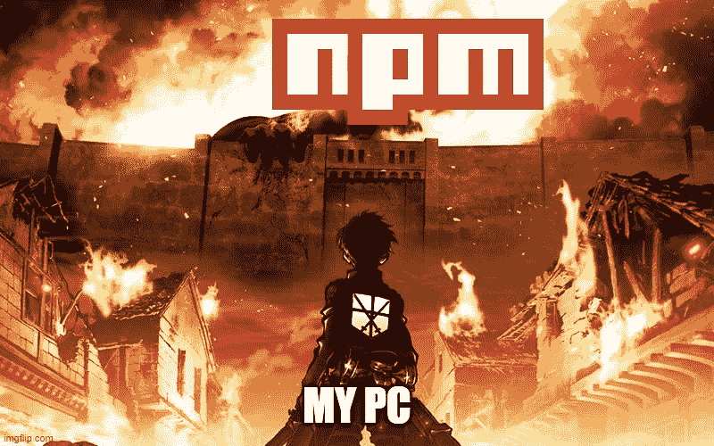
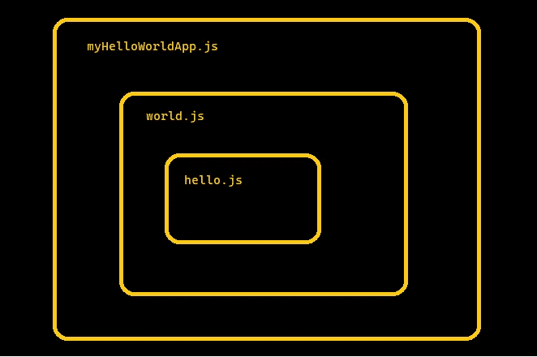
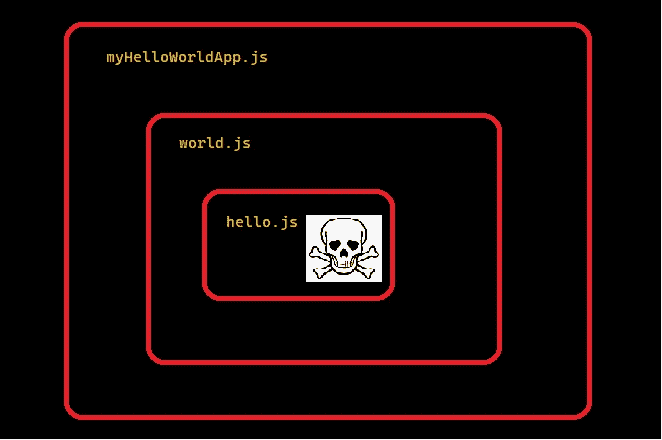
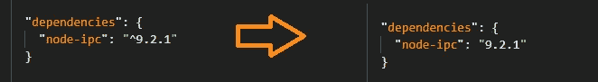
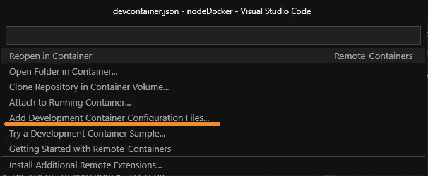

# 如何避免 NPM 供应链攻击？

> 原文：<https://itnext.io/how-to-avoid-npm-supply-chain-attacks-2fb8d7eab4d3?source=collection_archive---------0----------------------->

好吧，你已经听到消息了；NPM 的供应链完全容易受到一些开发者和他们的自负的影响，“抗议软件”风靡一时，整个 javascript 生态系统就像一大堆卡片，随时都会倒下。

好了，现在我们达成了共识，让我们深呼吸，喝杯咖啡，谈谈如何在继续工作的同时，轻松保护自己，并静静地忽略我们周围的所有问题。(开玩笑)

## 目录

1.  为什么现在这成了一件大事？
2.  供应链攻击的工作原理
3.  最佳实践/在不了解 Docker 的情况下如何使用 Docker(我保证现在很容易)

# 为什么现在这成了一件大事？

老实说，这些问题已经存在多年了。在其他生态系统中订阅其他语言的开发人员会很快告诉你 javascript 有多糟糕，因为 javascript 开发人员会安装任何东西来避免编写代码。

嗯，作为一个 javascript 开发者，我不认为他们错了。

最近，我的意思是，在过去的 3 个月里，我们有 2 个高调的软件包作者发布恶意代码到他们的代码库，并可能影响大量的最终用户。

[马拉克](https://github.com/Marak)、 [Faker.js](https://github.com/faker-js/faker) 和 [Color.js](https://github.com/Marak/colors.js) 的作者发布了一个更新，在终端中无限粘贴 algo 文本，阻止任何依赖的应用程序运行。似乎是为了抗议他对更大项目的贡献得不到补偿。

[Brandon Nozaki(又名 RIA evangelist)](https://github.com/RIAEvangelist),[node-IPC](https://github.com/RIAEvangelist/node-ipc)的作者，批准了一个 [pull 请求](https://github.com/RIAEvangelist/node-ipc/pull/270)进入 master，即[用一个心形表情符号](https://gist.github.com/ckcr4lyf/6d96c2bf42ec31c6362053ea275d80d5)替换系统上的所有文件内容。有效地抹去了一切。当这个“抗议软件”瞄准俄罗斯和白俄罗斯的电脑时，[一个美国非政府组织受到了这次攻击的影响](https://github.com/RIAEvangelist/node-ipc/issues/308)。

这也不是恶意代码第一次被发布到 NPM。然而，这些都击中了主流新闻来源，因为它们非常受欢迎，每周都有数千万的下载量。那么这是如何工作的，我们如何保护自己呢？

# 供应链攻击的工作原理(根据上下文)

在讨论解决方案之前，重要的是每个阅读这篇文章的人都理解这个问题。如果你已经熟悉供应链攻击，我建议你跳过这一部分。

在你在谷歌上搜索“供应链软件攻击”之前，请记住，你可能会发现答案与我们今天讨论的略有不同，因为大多数例子都是指组织从其他组织购买代码。由于 NPM 是开源的，记住所有的玩家通常都是个人是很重要的。

我认为类比可能会令人困惑，所以让我们直奔主题吧。NPM 代表“节点包管理器”。这是一个命令行工具。它是一个软件包注册中心，也是一家公司(最近被 github 收购)。

NPM 公司免费提供 NPM 命令行工具，Node.js 社区选择在你安装 Node 时包含它。用户可以向 NPM 注册表提交代码(软件包),并且用户可以使用 CLI 工具从注册表安装软件包。

既然你正在读这篇文章，你可能已经一直在做这件事了，那么有什么问题呢？

我正要说到这一点。就像我说的，你可以跳过这部分。

编写代码是一项挑战和/或乏味的工作，因此用户从 NPM 下载一个包来省去自己重新编写代码的麻烦和浪费所有时间和精力是很常见的。因此，新代码现在**依赖于**前面提到的包才能正常运行。现在，如果新代码被捆绑到一个包中，那么在这个包之上编写的任何代码都将依赖于 2 个包。这里有一个图表，因为这听起来甚至让我感到困惑。

节点模块灯

那么问题出在哪里？答案是读者缺乏耐心。现在和我在一起。

如果编写`myHelloWorldApp.js`的用户安装了`world.js`，他们可能甚至不知道他们也安装了`hello.js`，除非他们彻底查看了`world.js` github 页面，这不太可能。

现在，如果`hello.js`的作者向 NPM 发布了`hello.js`的“更新”。这种“更新”用表情符号覆盖了用户的硬盘，这将是一种供应链攻击。我们成功了。你开心吗？

hello.js 的作者更新了他们的包，加入了恶意软件。现在依赖它的一切都被破坏了。

## 概括起来

当你在你的机器上下载或执行第三方代码时，供应链攻击随时可能发生。这就是为什么你的操作系统总是问你你信任这个应用程序！？！？或者一些变化。所有开源软件包管理器，如 NPM、PIP 等，都极易受到这些类型的攻击，因为任何人都可以上传任何东西到一个可信的平台，这取决于用户来保护自己。幸运的是，社区在自我监管方面做得很好，这样的问题会很快自行解决。通常情况下。

# 最佳实践

好吧，现在怎么办？

幸运的是，我们可以执行一些相对简单的步骤来避免像前面提到的美国非政府组织在安装 node-ipc 时那样引火烧身。我将在这里列出它们，并在下面进行更详细的讨论。

1.  不要相信任何人，即使是你爱的人或狗。
2.  追踪每一个连接到你电脑的 ip 地址，如果你发现一个不熟悉的 ip 地址，就毁掉它。
3.  从你的银行里取出所有的现金，放在你的床垫里
4.  储备一些油炸豆类，期待最好的结果。

好了，好了，玩笑归玩笑，这是真正的清单

1.  将您的版本号固定在`package.json`中
2.  使用一个`package-lock.json`并用`npm ci`安装
3.  使用 docker 或虚拟机
4.  常识
5.  使用您自己的包服务器
6.  使用审查服务

要在你的`package.json`中固定一个版本号，你只需要删除`^`字符，当你第一次安装一个包时，这个字符会自动加在版本号的前面。

移除胡萝卜以锁定版本号。

这将阻止 NPM 安装最新的有效版本，而是只下载你知道你可以信任的版本。更多关于 NPM 包中符号的信息，请点击这里:[https://docs.npmjs.com/about-semantic-versioning](https://docs.npmjs.com/about-semantic-versioning)(我也鼓励你去看看版本计算器)

但是我的依赖的依赖怎么办？这就是`package-lock.json`的用武之地。该文件跟踪您的应用程序所使用的每一个包以及所使用的版本。如果你`npm i`或`npm install`你的包和一些东西更新了，那么`package-lock.json`文件也将被更新以反映这个变化。

但是我们不希望这样。如果我们试图安装一个与列出的版本不匹配的包，我们希望`package-lock.json`对我们大喊大叫。

这就是`npm ci`或`npm clean-install`的用武之地。如果它试图安装与`package-lock.json`文件冲突的东西，就会出错。*对于那些一直在处理* `*package-lock.json*` *合并冲突的人来说，用这个命令安装包也将有助于减轻一些冲突。*

# 还有 Docker！

我知道，我知道。对很多人来说，docker 是一种生活在 DevOps 世界的野兽。当你遇到问题时，YAML 文件有点粗糙，很难调试。

但是，Docker 团队已经做出了惊人的工作，试图使虚拟机的使用每年都变得越来越容易，现在你可以很容易地在一个容器中设置一个持久的开发环境(windows 上的*)!)*不到 5 分钟。

在我们看完 10 秒教程之前，让我们来谈谈为什么它很重要。

锁定你的版本号和检查代码是很好的，而且仍然很重要，但是，开发的部分乐趣是探索互联网和大胆尝试的能力。为什么我们需要小心翼翼，因为一些开发人员决定要进行一次权力之旅？

答案是我们没有。我们可以建立一个安全的空间来下载我们想要的任何东西，同时将它与我们真正关心的东西隔离开来，Docker(和 VSCode)可以轻松实现这一点。以下是将 docker 添加到现有项目的步骤:

1.  [添加远程容器 VSCode 扩展](https://marketplace.visualstudio.com/items?itemName=ms-vscode-remote.remote-containers)
2.  导航到您的项目目录
3.  按 Ctrl+Shift+P 并键入“添加开发容器配置文件”

4.选择 Node.js(如果它是一个节点项目的话)

5.按 Ctrl+Shift+P 并键入“打开容器中的文件夹”

6.如有必要，下载并安装 docker

7.搞定了。VSCode 应该已经重新打开自己，远程连接到您的新容器，其中包含您的所有代码。

现在你可以安装任何你想安装的东西，而不用担心你的硬盘会坏掉。

## 使用您自己的软件包服务器和审查服务

这是 Reddit 上的一个 [u/Laladelic](https://www.reddit.com/user/Laladelic) 提供的建议。我不太熟悉使用这些解决方案，但是用户确实提供了可用解决方案的链接:

审查服务:[https://snyk.io/](https://snyk.io/)

打包服务器:[https://jfrog.com/artifactory/](https://jfrog.com/artifactory/)

# 最后

这些解决方案没有一个是万无一失的。对上述解决方案的错误配置或误解可能会破坏其目的。

这也是由我们每个人来决定什么是正确的安全级别。我们愿意冒多大的风险。

没有完美的安全这种东西，但是，我提出这些建议是因为我热爱开源，并且不愿意看到它的声誉因为互联网上陌生人的虚假信任感而受到损害。

在外面注意安全。

附言:如果你想对我写的东西进行修改或补充，请写下评论，我会尽我所能尽快更新这篇文章！

[编辑]更新为包括软件包服务器和审查服务建议