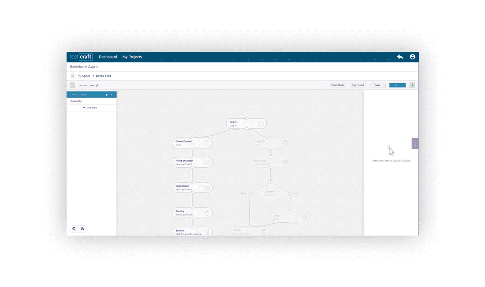
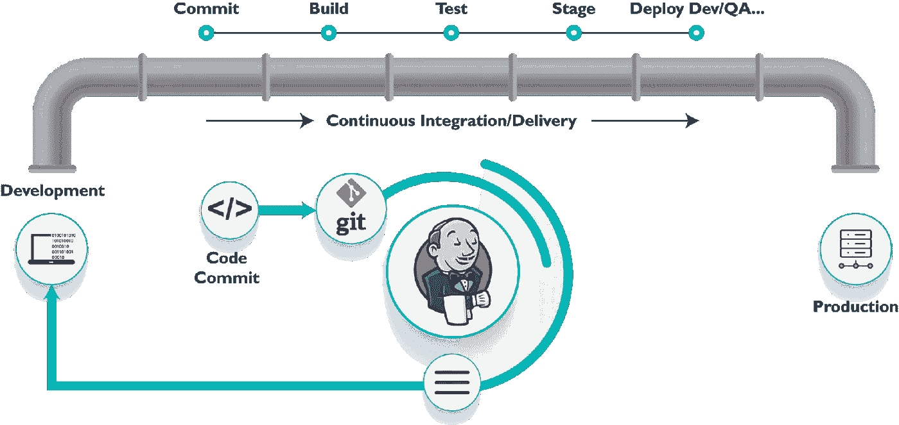

# 如何避免最常见的 UI 自动化陷阱

> 原文：<https://itnext.io/how-to-avoid-the-most-frequent-ui-automation-pitfalls-6b66a16db8f3?source=collection_archive---------5----------------------->

伊利亚·巴甫洛夫在 [Unsplash](https://unsplash.com/?utm_source=unsplash&utm_medium=referral&utm_content=creditCopyText) 上的照片

我们编写和部署代码的方式在不断改进或变化。我们测试的方式也是如此。

今天，最常用和最方便的测试解决方案是自动化。这可以解决许多问题，包括帮助您避免耗时和重复的任务。这种测试的好处不仅体现在软件交付的速度上，还体现在节省的时间和金钱上。

然而，有一些常见的陷阱，你应该注意和避免。

# 太多自动化

毫无疑问，[自动化测试](https://www.testcraft.io/ui-automation/)比[手动测试](https://www.guru99.com/manual-testing.html)要好，但是有时候会差太多。

有些测试不值得自动化。它们要么毫无用处，要么根本无法自动化。这就是为什么，对于一个测试人员来说，理解自动化过程的主要目标以及它会带来什么好处是很重要的。否则就是浪费时间和金钱。

何时应该使用自动化测试的例子:

*   当有耗时且重复的任务时
*   当工作流程涉及短期发布周期时
*   当您想要将测试集成到开发过程中时

您应该自动化您想要定期运行的测试。根据定义，这些是您的[回归测试](https://en.wikipedia.org/wiki/Regression_testing)，确认系统仍然在运行，您的用户仍然可以依赖应用程序。

# 错误的工具

基于这种情况，一些应用程序可以进行快速和异常

生产的巨大变化。如果你发现自己处于这种情况下，那么你需要一个工具，让你能够随着这些变化的发生而快速行动。

维护和更新这些测试可能会花费不必要的时间。

这个问题的一个好的解决方案是一个无代码的解决方案，让测试像浏览网站一样简单。

其中一个工具是 [TestCraft](https://www.testcraft.io/) ，这是一个基于硒的解决方案，在人工智能的帮助下得到改进。

无代码解决方案非常方便，尤其是如果 QA 团队或自动化工程师对编写代码解决方案不是很有经验的话。

这里要考虑的另一件事是开源和企业之间的选择。

第一种选择应该是大多数情况下要走的路，但是可能会有这样的情况，您需要一些通常不可用的定制解决方案，因此企业解决方案对您的团队来说是一个优势。

不用说额外的好处，你可以随时拿起电话向他们寻求支持。

# 忽略部署管道

在选择测试工具时，最重要的关键是考虑*如何与您的* [*部署管道*](https://techbeacon.com/app-dev-testing/running-gauntlet-setting-your-first-deployment-pipeline) *集成？*

[部署管道](https://dzone.com/articles/learn-how-to-setup-a-cicd-pipeline-from-scratch)

您必须选择一个完全符合您需求的工具，或者如果您有首选工具，选择一个不太受欢迎的工具，然后构建部署管道，以便它能够很好地集成。

# 训练不足

团队中的每个人都熟悉满足您需求的最佳工具并知道如何使用它，这是不可能的。

任何工具的引入都需要对将要使用它的团队成员进行适当的培训。一个简短的演示，如*如何…* 是不够的。

您团队中的大多数测试人员应该熟悉您选择的工具。如果那是不可能的，从一个小组开始，一旦他们精通它，他们可以训练其他人。

最好的方法是提供培训，创建培训文档，或者举行多次会议和研讨会。

# 没有设定目标

在开始自动化一切之前，重要的是不要忘记主画面和我们想要[测试](https://www.informit.com/articles/article.aspx?p=759702&seqNum=3)完成的事情:

*   你在测试什么？
*   预期的行为是什么？
*   这是做这件事最简单的方法，还是可以用别的方法？
*   它能与我们的管道整合吗？

如果我们忽略了这些方面，那么我们将会陷入这样的境地:我们将会编写一些没有人真正需要的测试。因此，我们将浪费时间、金钱和精力。

重要的是要记住，测试对我们的应用程序来说是有利的，所以它们的重要性完全在于它们如何与我们的应用程序相关联。

# 跳过维护

测试自动化并没有随着测试的结束而结束，你需要在你的工作流程中加入[维护测试](http://tryqa.com/what-is-maintenance-testing/)来检查和改进你的软件。

很长一段时间完全忽视保养是很常见的。但是这可能意味着性能、质量和代码覆盖率的下降。

# 摘要

自动化，如果做错了，就是浪费时间，对任何人都没有价值。糟糕的自动化测试只会增加维护成本，减缓开发过程。

也就是说，重点应该放在正确的测试、探索系统和大局上。