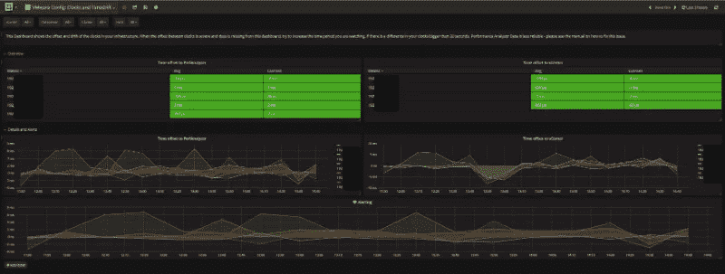
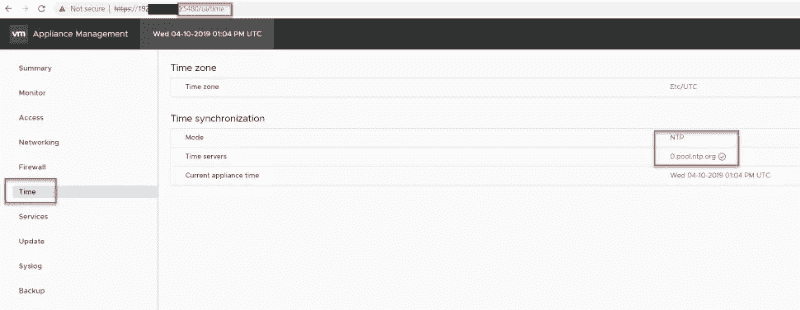
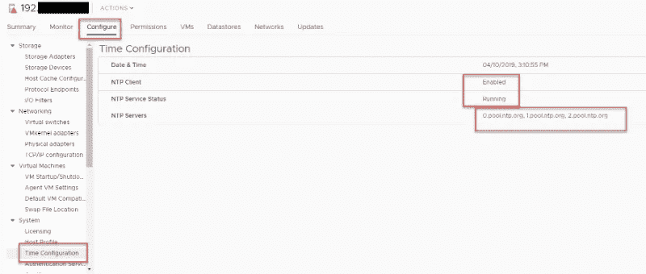

# 如何避免 VMware ESXi 时间漂移— Opvizor

> 原文：<https://itnext.io/how-to-avoid-vmware-esxi-timedrift-opvizor-1758d29cdf4?source=collection_archive---------6----------------------->

无论您查看哪种最佳实践指南，都会有一条重要的建议来确保您的 VMware vCenter 和 VMware ESXi 的时间同步配置正确并正常工作。如果您忽略这一点，VMware ESXi 时间漂移就会开始，情况可能会变得非常糟糕。

使用我们最新版本的[性能分析器](https://www.opvizor.com)，我们拥有一个控制面板和警报，可帮助您控制 vCenter 和 ESXi 时间漂移以采取应对措施。

提到的控制面板名为 VMware Config:Clocks and time drift，它确实可以做到这一点，显示所有 ESXi 主机和 vCenter 的时间和时间漂移。该时间漂移将与 Performance Analyzer 应用装置以及您的 VMware vCSA 进行比较。

Opvizor 性能分析器—检测 VMware ESXi 和 VMware vCSA 时间漂移

你可能会想，有几秒钟的时间漂移并不是什么大问题。事实上，确实如此。它会影响备份、重做日志、活动目录同步、Kerberos 认证、cookie 持续时间和各种数据库操作或查询结果。因此，您应该始终确保尽可能精确地设置正确的时间。

与其他对等机的时间相比，VMware ESXi 时间漂移越高，影响就越严重。我们了解了 AD 用户无法登录或 AD 计算机退出 active directory 的情况，因为时间漂移超过 5 分钟，所以 Kerberos 变得疯狂。

我们还注意到，当客户抱怨看不到填充了数据的仪表板时。或者在图表中有几个小时的间隔。在任何一种情况下，VMware ESXi 时间漂移都远远偏离运行 Performance Analyzer 虚拟机的主机。一旦 ESXi 时间被纠正，一切都很顺利。因为我们经常遇到这些情况，所以我们决定对照我们在客户环境中可以找到的任何时间源进行检查，并尝试对最佳时间进行三角测量。

有很多方法可以确保时间总是正确的，只要确保选择并坚持你的选择，不要混淆。

# VMware vCSA

通过登录到管理页面，您可以非常简单地在 VMware vCSA 上配置时间同步: [https://vcsa:5480，](https://vcsa:5480,)选择时间并编辑时间同步。

最好是使用**三台 NTP 服务器**进行同步(忽略我们的演示截图设置:-))。

# ESXi NTP

ESXi 主机还应该与三台 NTP 服务器同步时间，您可以使用[主机配置文件](https://docs.vmware.com/en/VMware-vSphere/6.7/com.vmware.esxi.install.doc/GUID-77D10F4D-50FE-4BA6-B164-42D20D673F4F.html)、 [powercli 脚本](https://vtechdummies.wordpress.com/2017/10/22/powercli-scripts-to-check-and-configure-ntp-configuration-of-esxi-hosts/)或手动配置。

请确保该服务已启动并且时间正确。如果时间漂移过大，您可能需要在同步开始之前先手动设置时间。

# VMware 工具

在大多数情况下，虚拟机(VMware tools)的时间同步处于活动状态，并与 ESXi 主机的时间同步。更准确地说，虚拟机与运行它的 ESXi 主机的时间同步。

假设一个由 10 台 ESXi 主机组成的集群，其中 9 台主机的时间正确，但有一台主机的时间错误(假设为 30 分钟)。您的虚拟机在所有 9 台 ESXi 主机上运行良好，但是当 DRS 或手动 vMotion 将虚拟机移动到具有高时间漂移的 ESXi 主机时，您的虚拟机很乐意利用这段时间。

当然，如果您在虚拟机中配置了 NTP 或 AD 时间同步，并且不使用 VMware tools 时间同步功能，则不会发生这种情况。

因此，请确保使用 NTP/AD 时间同步或 VMware tools 时间同步，并让所有 ESXi 主机与 NTP 服务器同步时间。

如果您对配置不确定，可以阅读几篇知识库文章:

【www.opvizor.com】最初发表于**。**