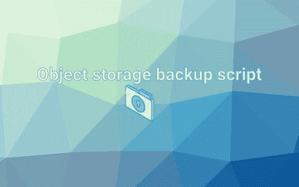
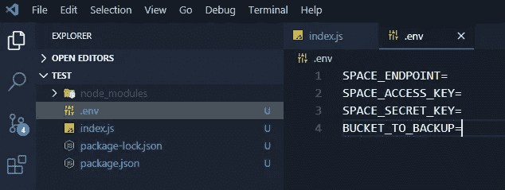
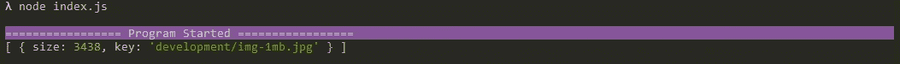

# 如何备份您的对象存储

> 原文：<https://itnext.io/how-to-backup-your-object-storage-29bfb9fe7584?source=collection_archive---------4----------------------->



用这个简单的脚本备份你的空间。

# TL；速度三角形定位法(dead reckoning)

长话短说:[这里是脚本(js 代码)](https://github.com/GeoPablo/s3-backup)这里是 [**100$** 作为引荐链接到数字海洋测试一下。](https://m.do.co/c/f0f252058644)下载它，运行它，享受它。😀

# 在幕后

如何编写 nodejs 脚本来备份您的对象存储。

## 项目设置

1.  创建 **package.json** 文件
2.  安装依赖项
3.  创建两个文件 **index.js** 和**。env** *(环境变量可选)*

— — — — — — — — — — — — — — — — — — — — — —

1.  创建一个新文件夹，并在其中运行该命令以生成 **package.json** 文件:

```
npm init -y
```

> ***-y*** *将创建文件而不询问任何问题*

2.我们需要安装这个依赖项: ***aws-sdk，colors，inquirer，单行日志***

```
npm i aws-sdk colors inquirer single-line-log
```

3.创建文件并放入**中。env** 添加您的凭据

```
SPACE_ENDPOINT=
SPACE_ACCESS_KEY=
SPACE_SECRET_KEY=
BUCKET_TO_BACKUP=
```



项目结构和。环境内容

## 代码📃

1.  添加依赖项

```
const path = require(“path”);
const fs = require(“fs”);
const AWS = require(“aws-sdk”);
const colors = require(“colors”);
const inquirer = require(“inquirer”);
const log = require(“single-line-log”).stdout;
require(“dotenv”).config();
```

> **要求(“dotenv”)。config()；**会得到我们在里面写的环境变量。环境文件

2.声明该脚本所需的所有变量

```
let TOTAL_BYTES_TO_DOWNLOAD = 0;
let BYTES_DOWNLOADED = 0;const endpoint = process.env.SPACE_ENDPOINT.trim();
const accessKeyId = process.env.SPACE_ACCESS_KEY.trim();
const secretAccessKey = process.env.SPACE_SECRET_KEY.trim();
const BUCKET_TO_BACKUP = process.env.BUCKET_TO_BACKUP.trim();if (!(endpoint.length &&accessKeyId.length && secretAccessKey.length && BUCKET_TO_BACKUP.length)) {
  console.log(“Paste your credentials inside .env file.”.red);
  console.log(“================= Program Started =================”.bgMagenta);
  return;
}const OUTPUT_DIR = `backup-${BUCKET_TO_BACKUP}-${Date.now()}`;
const s3 = new AWS.S3({
  endpoint,
  accessKeyId,
  secretAccessKey
});
```

> **TOTAL_BYTES_TO_DOWNLOAD，BYTES_DOWNLOADED** —将用于跟踪下载进度

接下来我们使用一个 if 语句来停止程序 if**。env** 文件为空，并且凭证不存在。

> **OUTPUT_DIR** —下载文件的文件夹名(存储桶名+时间戳)

最后创建一个**新的 S3** 实例。

> 就我个人而言，我用大写字母来写全局变量名称，以便更好地区分它们。

3.创建两个助手函数:一个将字节转换为 MB 或 GB，另一个打印进度(单行日志)

```
function bytesToSize(bytes) {
  const sizes = [“Bytes”, “KB”, “MB”, “GB”, “TB”];
  if (bytes == 0) return “0 Byte”;
  var i = parseInt(Math.floor(Math.log(bytes) / Math.log(1024)));
  return Math.round(bytes / Math.pow(1024, i), 2) + “ “ + sizes[i];
}function printTotalProgress(current, total) {
  const percentage = (current * 100) / total;
  log(`${bytesToSize(current)} / ${bytesToSize(total)}  (${Math.floor(percentage)}%)`);
}
```

> **log()** —该函数来自 **const log = require("单行日志")。stdout**这将在单行上打印一条消息；

4.写一个下载文件的函数

```
async function downloadFile(outputDir, fileKey) {
  const params = {
    Bucket: BUCKET_TO_BACKUP,
    Key: fileKey
  };
  const outputPath = path.join(__dirname, outputDir, fileKey);
  const fileStream = fs.createWriteStream(outputPath); s3.getObject(params)
    .createReadStream()
    .on(“error”, function(err) {
      console.log(err);
      })
    .on(“data”, function(chunk) {
      BYTES_DOWNLOADED += chunk.length;
      printTotalProgress(BYTES_DOWNLOADED, TOTAL_BYTES_TO_DOWNLOAD);
    })
    .pipe(fileStream);
}
```

该函数将根据文件密钥(文件名)从对象存储器下载一个文件，并将其写入 **outputDir + fileKey** (这意味着该文件将保持其原始名称和扩展名，并将被放在同一文件夹中)

> **。on('data')** —从对象存储器中读取文件时，该事件将开始
> 
> **chunk** — chunk.length 将给出字节大小

> file key——不仅表示文件名，还表示您的 bucket 中该图像的完整路径；例如，如果您的图像名称“my-img.png”放在名为“folder1”的文件夹中，则密钥将为:foder1/my-img.png

4.编写一个函数，在您的 **outputDir** 中创建与您的 bucket 相同的文件夹结构

```
async function createFolderStructure(outputDir, Prefix = “”) {
  const params = {
  Bucket: BUCKET_TO_BACKUP,
  Delimiter: “/”,
  Prefix
  }; const { CommonPrefixes } = await s3.listObjects(params).promise();
  if (CommonPrefixes.length) {
    for (let i = 0; i < CommonPrefixes.length; i++) {
      const { Prefix } = CommonPrefixes[i];
      const dirPath = path.join(__dirname, outputDir, Prefix);
      fs.mkdirSync(dirPath);
      await createFolderStructure(outputDir, Prefix);
    }
  }
}
```

> **CommonPerfixes**——你可以说这将是一个数组，其中包含你的桶中的文件夹

如果您的 bucket 中有任何文件夹，这个递归函数将在您的目录中创建相同的文件夹结构。

这是必需的，因为如果你记得我们说过用于下载文件的 **fileKey** 不仅包含文件名，还包含文件的完整路径，包括文件夹。

5.编写一个函数，遍历 bucket 中的所有文件夹，并列出所有文件的关键字。

该函数将返回如下所示的对象数组:



```
async function getAListWithAllFiles() {
  const output = [];
  async function clojure(Prefix = “”) {
    const params = {
      Bucket: BUCKET_TO_BACKUP,
      Delimiter: “/”,
      Prefix
    };
    const { Contents, CommonPrefixes } = await
    s3.listObjects(params).promise();
    if (Contents.length) {
      Contents.forEach(content => {
        const { Size, Key } = content;
        output.push({
          size: Size,
          key: Key
        });
      });
    }
    if (CommonPrefixes.length) {
      for (let i = 0; i < CommonPrefixes.length; i++) {
        const { Prefix } = CommonPrefixes[i];
        await clojure(Prefix);
      }
    }
  }
  await clojure();
  return output;
}
```

> 内容——这是你的文件

5.最后调用所有这些函数来变魔术

```
(async function() {
  console.log(“”.white);
  console.log(“================= Program Started   =================”.bgMagenta); const makeQuestion = (totalFilesLength, totalSize) => {
    return [
      {
        type: “confirm”,
        default: false,
        name: “startProgram”,
        message: `Are you sure you want to download        ${totalFilesLength} files (${bytesToSize(totalSize)})?`,
        filter: function(val) {
          return val.toLowerCase().trim();
        }
      }
    ];
  }; const allFiles = await getAListWithAllFiles();
  const totalSizeOfFilesToDownload = allFiles.map(file =>    file.size).reduce((prev, curr) => prev + curr, 0); TOTAL_BYTES_TO_DOWNLOAD = totalSizeOfFilesToDownload; const { startProgram } = await inquirer.prompt(
    makeQuestion(allFiles.length, totalSizeOfFilesToDownload)
  ); if (!startProgram) {
    console.log(“================= Program Stopped=================”.bgRed);
    return;
  } fs.mkdirSync(OUTPUT_DIR);
  await createFolderStructure(OUTPUT_DIR); allFiles.forEach(file => {
    downloadFile(OUTPUT_DIR, file.key);
  });
})();
```

> makeQuestion() —该函数将创建一个问题，我们将使用**查询者**模块提示该问题

这个**life**将首先从我们的对象存储中创建一个包含所有文件的列表，并以字节为单位计算总大小。

使用**询问器**我们将询问用户是否真的想要下载所有文件，我们将显示文件的总数和它们所需的磁盘大小


如果用户按下 **y** ，那么我们将创建输出目录(放置下载文件的文件夹)，之后我们将在其中创建与我们在 bucket 中相同的文件夹结构，最后我们将下载每个文件。

# **结论**

完整的代码可以在 github 上找到。在那里你会看到这段代码和另一个版本，它允许你跟踪下载的文件，这样每次你做一个新的备份时，你可以只下载新添加的文件。

如果你想测试这个代码或任何其他云功能，这里有一个[到数字海洋](https://m.do.co/c/f0f252058644)的链接，100 美元可以玩。