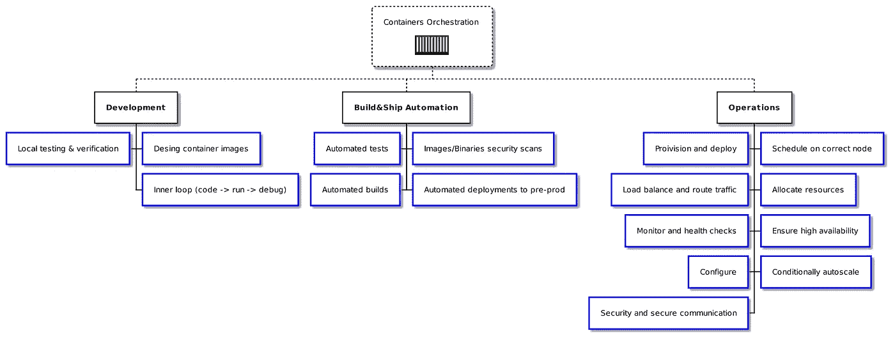

# 如何成为 DevOps 大师:容器编排指南

> 原文：<https://itnext.io/how-to-be-a-devops-maestro-containers-orchestration-guide-b2cf884eaed1?source=collection_archive---------0----------------------->

在 [Unsplash](https://unsplash.com/?utm_source=unsplash&utm_medium=referral&utm_content=creditCopyText) 上由 [Cameron Venti](https://unsplash.com/@ventiviews?utm_source=unsplash&utm_medium=referral&utm_content=creditCopyText) 拍摄的照片

> “万事开头难。”
> 
> —托马斯·富勒

## 介绍

如今，打包成容器映像并在容器中运行的软件是运行和分发应用程序的行业公认标准。使用容器的一些好处是:

*   高度的便携性
*   一致的运营流程
*   主要是可扩展性和弹性
*   开放标准使通用工具成为可能

和所有事情一样，没有免费的午餐！容器提供的能力伴随着复杂性而来。对于有限规模的工作负载或较小规模的工作负载，运行独立的容器实例是可以的。在某一点上，复杂性太多，无法手动处理。

大规模开发和运行容器化工作负载需要高度的自动化和卓越的运营。换句话说，它需要**容器编排。**

阅读本文后，您将:

*   理解什么是容器编排
*   为什么它是运行容器的关键部分
*   它如何让你的生活变得更轻松

它还可以帮助您向您的同事或领导解释为什么以及何时容器编排是重要的。您还将了解有用的工具和模式。

## 什么是容器编排？

传统上，容器编排主要与操作级活动相关联。然而，在扩展到容器编排之前，有许多活动并行发生。通过包括开发以及构建和部署自动化相关的任务，可以应用一个新的定义:**容器化的工作负载管理。**

> 容器化工作负载管理是在容器映像和容器的整个生命周期中自动执行常见任务的过程。容器或业务流程是一个自动化常见操作级任务的过程。

下图显示了**容器化工作负载管理**如何涉及以下领域的开发、安全、运营和其他规程:

来源:作者

在本文中，我们将深入探讨操作的“传统”容器编排方面。

## 示例场景

一个示例场景将有助于说明和理解所有的原则。

假设您需要创建和部署一个传统的 n 层应用程序，该应用程序具有 web 前端、简单的 REST API 和文档数据库作为持久性存储。该设置将在本地和公共云中运行。随着时间的推移，我们预计流量会增加，使用模式会保持稳定。在某个时候，我们的应用程序将接受内部合规性和安全审计，从而产生额外的要求。

## 你所看到的并不是它的全部

典型的教程或博客文章展示了如何开始在容器中运行一些东西，但仅仅触及了皮毛。一旦达到一定的规模，编排就变得至关重要，不幸的是，大部分业务看不到它。

图片由 [Josep Monter Martinez](https://pixabay.com/users/josepmonter-1007570/?utm_source=link-attribution&utm_medium=referral&utm_campaign=image&utm_content=1321692) 从 [Pixabay](https://pixabay.com/?utm_source=link-attribution&utm_medium=referral&utm_campaign=image&utm_content=1321692) 拍摄

让我们从“操作”区域更深入地了解每项任务。目标是展示容器编排试图解决什么问题。我们将着眼于模式和范例，以及有助于处理不同领域的编排的工具。

> **配置和部署**

如果没有工具，**配置**通常意味着登录虚拟机并安装一系列工具，以使节点为接收工作负载做好准备。在我们的例子中，这意味着一个单独的服务器用于前端应用程序，一个单独的服务器用于中间件，另一个用于数据库。

**部署**是在服务器上提取映像并旋转新容器的行为。让我们假设我们的应用程序为每个组件运行一个容器，所以总共有 3 个容器。如果没有编排，这样做将意味着建立一个到远程 docker 主机的连接，并发出类似`docker run etc.`的命令性命令

使用容器编排工具和流程时，这一步看起来如何？

为了实现智能**供应**,我们可以利用两种模式:

*   [基础设施代码](https://en.wikipedia.org/wiki/Infrastructure_as_code)
*   [GitOps](https://github.com/gitops-working-group/gitops-working-group#gitops-principles)
*   [声明式编程](https://en.wikipedia.org/wiki/Declarative_programming)

许多工具在这一领域表现出色。这里重点介绍几个。

 [## 哈希公司的 Terraform

### 博客文章阅读 1.0 发布博客文章-Terraform 是一个开源基础设施，作为一个代码软件工具，它提供了…

www.terraform.io](https://www.terraform.io/)  [## 交叉平面

### Crossplane 将 Kubernetes 风格的声明性和 API 驱动的配置和管理带到了任何一个…

交叉平面. io](https://crossplane.io/)  [## Pulumi -作为代码的现代基础设施

### 欢迎从 50 多家云提供商中选择所有体系结构，包括公共、私有和混合体系结构…

www.pulumi.com](https://www.pulumi.com/) 

部署应该完全自动化，尤其是在大规模部署时。这里使用的模式也是 GitOps。这一领域的示例工具有:

 [## 流量

### Flux 支持容器映像的连续交付，对每个步骤使用版本控制来确保部署…

www.weave.works](https://www.weave.works/oss/flux/)  [## Argo CD -用于 Kubernetes 的声明性 GitOps CD

### Argo CD 是一个用于 Kubernetes 的声明式 GitOps 连续交付工具。应用程序定义、配置和…

argoproj.github.io](https://argoproj.github.io/argo-cd/) 

> 在正确的节点上调度

我们的工作负载已经容器化并准备就绪，我们可以部署它们，但具体在哪里等待呢？在大规模环境中，通常有多个计算节点，此外，节点和可用资源的健康状况会随着时间而变化。如果没有任何工具，我们将不得不根据资源利用率、网络延迟、操作系统版本等做出决策。由于需要人工操作，这种决定通常只需做一次，不需要利用[箱包装](https://en.wikipedia.org/wiki/Bin_packing_problem)。

Kubernetes 附带了一个内置的调度控制器，专门负责这一点。调度不仅是一次性的，而且是动态评估和调整的。

在这方面有帮助的工具:Kubernetes

 [## 生产级容器编排

### Kubernetes，也称为 K8s，是一个开源系统，用于自动部署、扩展和管理…

kubernetes.io](https://kubernetes.io/) 

> 分配资源

每个容器都需要计算资源、CPU、RAM 和存储。如果没有编排，就没有简单的方法来限制容器可以消耗多少资源。我们基本上只剩下系统监控工具和追溯修复问题。

Kubernetes 提供了一个内置机制来声明应该给容器分配多少资源(请求的资源)。它还支持容器可以消耗的资源限制(资源限制)

在这方面有帮助的工具:Kubernetes

 [## 生产级容器编排

### Kubernetes，也称为 K8s，是一个开源系统，用于自动部署、扩展和管理…

kubernetes.io](https://kubernetes.io/) 

> 有条件自动缩放

我们的应用很成功，使用率也在增长。谢天谢地，我们遵循了[的十二因素应用](https://12factor.net/)设计方法，我们的前端和中间件可以[水平扩展](https://en.wikipedia.org/wiki/Scalability#Horizontal_(scale_out)_and_vertical_scaling_(scale_up))而没有问题。

如果没有流程编排，我们前端应用最简单的水平扩展包括:

*   旋转一个新的容器
*   创建一个负载平衡器，作为另一个容器或独立的安装(例如 nginx)
*   将指向容器的新 IP 地址的 nginx 配置更新到负载平衡器
*   如果我们想要扩展到更多的容器，请重复上述步骤

当然，如果需求下降，我们应该移除过多的容器。有了足够大的规模，这就是一份全职工作！

Kubernetes 提供了一个名为 [Horizontal Pod Autoscaler](https://kubernetes.io/docs/tasks/run-application/horizontal-pod-autoscale/) 的内置机制，用于根据资源利用率进行缩放。如果我们想基于完全任意的指标或 API 调用进行扩展，会怎么样？没问题，KEDA 提供了丰富的事件驱动自动伸缩机制。

如果我们的数据库需要一个更“强大”的服务器/节点来支持来自中间件的所有请求，该怎么办？Kubernetes 让我们了解到，我们可以为我们的数据库工作负载创建一个新的节点池，并结合使用[污染和容忍](https://kubernetes.io/docs/concepts/scheduling-eviction/taint-and-toleration/)来自动将我们的数据库 pods 迁移到一个更适合的节点。

在这方面有帮助的工具:KEDA 的 Kubernetes

 [## 生产级容器编排

### Kubernetes，也称为 K8s，是一个开源系统，用于自动部署、扩展和管理…

kubernetes.io](https://kubernetes.io/)  [## KEDA

### KEDA 是一个基于 Kubernetes 的事件驱动自动缩放器。有了 KEDA，您可以推动 Kubernetes 中任何容器的扩展…

科达. sh](https://keda.sh/) 

> 负载平衡和路由流量

让我们想象一下，我们已经向我们的前端应用程序添加了一个新的路由，并且需要将它从面向公众的域负载平衡到适当的 pod 和容器。在没有工具的情况下，它涉及到负载平衡器的手动重新配置，这可能会很快变得非常混乱。

Kubernetes 提供本地原语(服务、入口)来帮助我们自动化负载平衡任务。

尽管 DNS 插件不是“核心”Kubernetes 的一部分，但它几乎总是安装在集群上。DNS 提供服务发现，不要再摆弄配置文件中的 IP 地址，localhost 就足够了！

在这方面有帮助的工具:带有 CoreDNS 插件的 Kubernetes

 [## 生产级容器编排

### Kubernetes，也称为 K8s，是一个开源系统，用于自动部署、扩展和管理…

kubernetes.io](https://kubernetes.io/)  [## 核心域名系统:域名系统和服务发现

### CoreDNS 链插件。每个插件执行一个 DNS 功能，如 Kubernetes 服务发现、prometheus metrics…

coredns.io](https://coredns.io/) 

> 确保高可用性

关键任务系统，如我们的示例应用程序，必须遵守定义服务正常运行时间的 SLA(服务水平协议)。[高可用性](https://en.wikipedia.org/wiki/High_availability)意味着确保系统在指定的时间段内必须保持运行和可用。例如,“四个九”的可用性(99.99%或时间)相当于每年 52 分钟或每月 4.38 分钟不可用。

没有任何工具，很难确保高可用性。

Kubernetes 提供了一种强大的“协调循环”机制，这是一种在集群上运行的控制器，可以持续监控基础设施和应用程序是否偏离了预期状态。一旦检测到这种漂移，Kubernetes 将通过确保所需状态对应于实际状态来自动尝试恢复平衡。

这里我们可以利用两个范例:

*   [GitOps](https://github.com/gitops-working-group/gitops-working-group#gitops-principles)
*   [声明式编程](https://en.wikipedia.org/wiki/Declarative_programming)

在这方面有帮助的工具:Kubernetes

 [## 生产级容器编排

### Kubernetes，也称为 K8s，是一个开源系统，用于自动部署、扩展和管理…

kubernetes.io](https://kubernetes.io/) 

> 监控和运行状况检查

可观测性是带有集中控制平面的分散系统设计的一个很好的例子。为了观察我们的容器，我们需要高度分散的组件在堆栈的不同层次上运行(内核系统调用、系统范围的事件、特定于应用程序的监控端点等)。

所有这些数据都以有意义的方式收集并呈现给人类或自动化流程。Kubernetes 可以启用集群范围的审计策略并收集不同级别的数据。

有很多工具可以支持这个过程，比如 Prometheus、Graphana、Loki、FluentD、Jaeger 等等。

为了在应用程序级别实现监控，Kubernetes 引入了[活性、就绪和启动探测](https://kubernetes.io/docs/tasks/configure-pod-container/configure-liveness-readiness-startup-probes/)的概念。

Cillium 和 Falco 值得一提。这些工具可以与 [eBPF](https://ebpf.io/) 探头一起工作，以提供深层次的可观察性。Falco 专注于与安全相关的监控，而 Cillium 则专注于网络监控。

在这方面有帮助的工具:Kubernetes，Prometheus，Jaeger，Grafana，Fluentd，Cillium，Falco

 [## 法尔科

### 增强容器安全性灵活的规则引擎允许您描述任何类型的主机或容器行为…

falco.org](https://falco.org/)  [## 容器的 Cilium - Linux 原生 API 感知网络和安全性

### 传统的防火墙将其检查限制在 IP 和 TCP 层。Cilium 使用 eBPF 来加速获取数据…

纤毛](https://cilium.io/)  [## 生产级容器编排

### Kubernetes，也称为 K8s，是一个开源系统，用于自动部署、扩展和管理…

kubernetes.io](https://kubernetes.io/)  [## 普罗米修斯监测系统和时间序列数据库

### 利用领先的开源监控解决方案增强您的指标和警报能力。普罗米修斯作者 2014-2021 |…

普罗米修斯](https://prometheus.io/)  [## Jaeger:开源，端到端分布式追踪

### 监控复杂分布式系统中的事务并排除故障

www.jaegertracing.io](https://www.jaegertracing.io/)  [## Grafana:开放观察平台

### Grafana 是适用于所有数据库的开源分析和监控解决方案。

grafana.com](https://grafana.com/)  [## 开源数据收集器

### Fluentd 是用于统一日志记录层的开源数据收集器。

www.fluentd.org](https://www.fluentd.org/) 

> 安装ˌ使成形

有许多方法可以为容器化的工作负载提供配置。读取环境变量、配置文件、外部端点，如数据库或 HTTP/gRPC 服务等。

Kubernetes 通过以下原语提供一致的配置管理:

*   配置映射
*   秘密
*   卷

所有这些配置选项都可以通过各种方式“安装”到 pod 上；提供一致的配置管理模型。

在这方面有帮助的工具:Kubernetes

 [## 生产级容器编排

### Kubernetes，也称为 K8s，是一个开源系统，用于自动部署、扩展和管理…

kubernetes.io](https://kubernetes.io/) 

> 安全性和安全通信

最后，但绝对不是最不重要的，如何确保容器之间的安全通信？没有任何额外的设置或更改的 Kubernetes 是非常宽容的。幸运的是，有一些工具和标准可以帮助我们强化和保护集群。

让我们想象一下，我们的应用程序正在接受审计，并且提出了一个安全建议，以确保我们的数据库容器不能与前端容器对话。只要我们不扩展任何东西，就有可能使用 docker-compose 和网络设置，但这是一个手动过程。

Kubernetes 附带了一个内置的[网络策略](https://kubernetes.io/docs/concepts/services-networking/network-policies/)机制，用于管理哪些 pod 可以相互通信。

这很好，但是过了一会儿，另一个团队向集群部署了一个服务。该服务提供敏感的查找数据，我们必须确保我们的 pod 和服务之间的通信是加密的。

在这里，我们可以使用服务网格类别中的工具。这些工具提供了增强的可观察性和安全通信能力。比如 Istio 和 LinkerD。

也许我们想阻止 pods 使用 Docker 映像的默认公共 Docker Hub 注册表？Kubernetes 附带了[准入控制器](https://kubernetes.io/docs/reference/access-authn-authz/admission-controllers/)，图像策略 Webhook 就是其中之一。如果我们想要创建更细粒度的策略，开放策略代理(OPA)或 Kyverno 等工具将会很有帮助。

在这方面有帮助的工具:Kubernetes、Istio、LinkerD、OPA、Kyverno

 [## 生产级容器编排

### Kubernetes，也称为 K8s，是一个开源系统，用于自动部署、扩展和管理…

kubernetes.io](https://kubernetes.io/)  [## 开放策略代理

### 停止为您使用的每个产品和服务使用不同的策略语言、策略模型和策略 API。将 OPA 用于…

www.openpolicyagent.org](https://www.openpolicyagent.org/)  [## Kyverno

### Kyverno 是为 Kubernetes 设计的策略引擎。与 Kyverno，政策是作为 Kubernetes 的资源和没有管理…

kyverno.io](https://kyverno.io/)  [## 伊斯迪奥

### 一个可观察性、深度安全性和管理的服务网格，可加快部署周期。

istio.io](https://istio.io/)  [## 世界上最轻、最快的服务网。

### Linkerd 为您的 Kubernetes 堆栈增加了重要的安全性、可观察性和可靠性，而无需更改任何代码。

linkerd.io](https://linkerd.io/) 

## 结论

容器编排捕获了我们迟早要处理的“第 2 天”操作任务。幸运的是，有大量的工具和标准可以帮助我们完成这项任务。本文中提到的工具都是例子，而且大部分都是我个人比较熟悉的，但是还有很多替代工具。如果你有兴趣了解更多，去看看不断发展的 [CNCF 风景](https://landscape.cncf.io/?category=application-definition-image-build&fullscreen=yes&grouping=category)。

 [## CNCF 云原生互动景观

### 云原生小径地图(png，pdf)是 CNCF 推荐的穿过云原生景观的路径。云原生……

landscape.cncf.io](https://landscape.cncf.io/?category=application-definition-image-build&fullscreen=yes&grouping=category) 

我希望这个简短的指南能帮助你理解什么是容器编排，为什么它很重要，以及你如何在你的组织中开始考虑它。