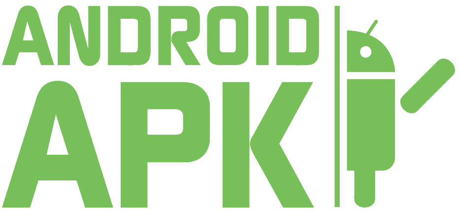
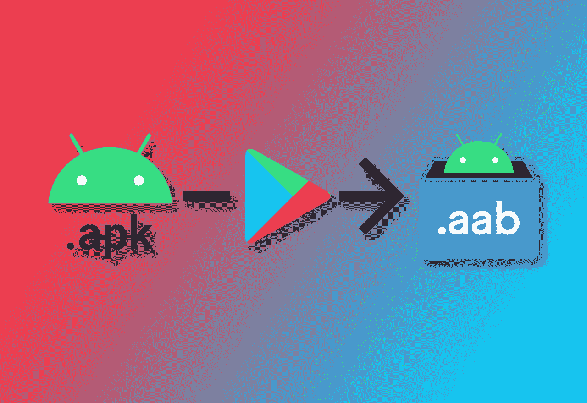
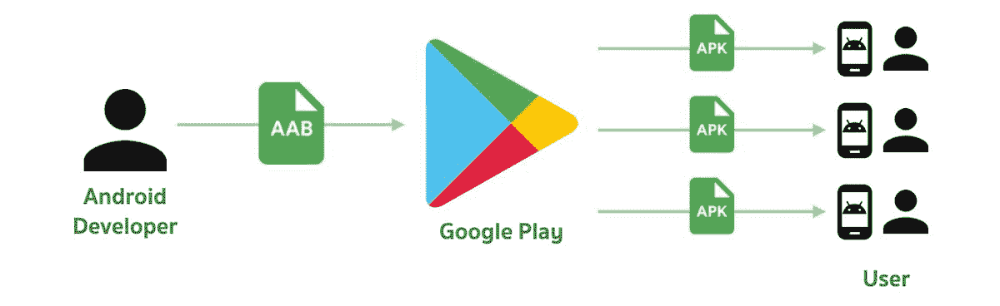
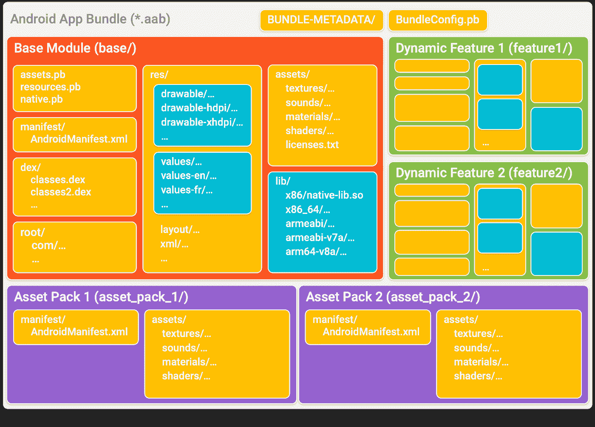
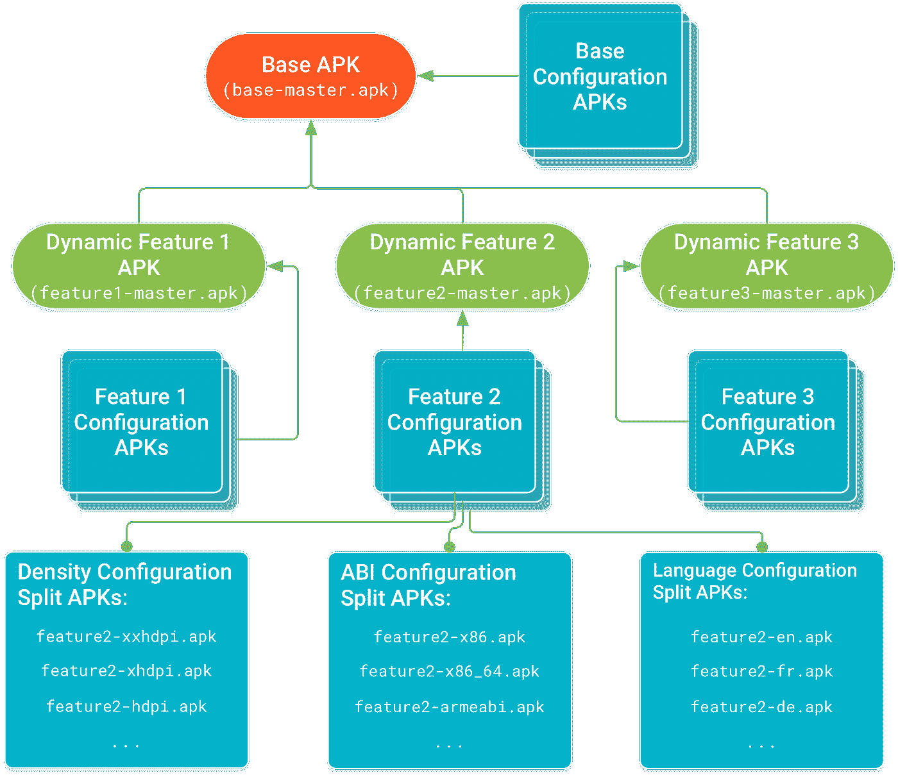
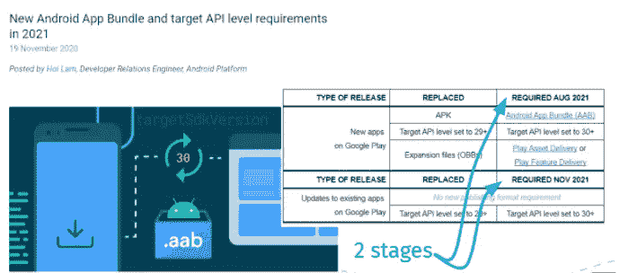
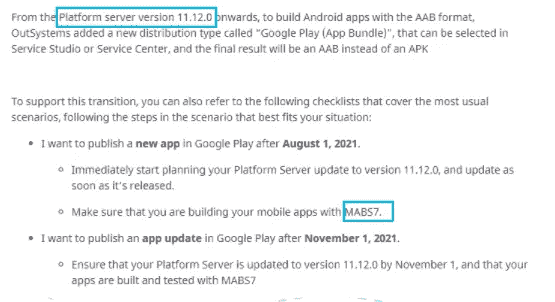
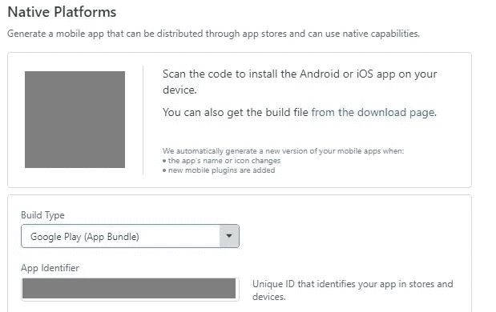

# 如何为 OutSystems 中的 Android 应用捆绑包做好准备

> 原文：<https://itnext.io/how-to-be-prepared-for-android-app-bundle-in-outsystems-5e6ea06c8597?source=collection_archive---------0----------------------->

许多年前当谷歌开始 Android 项目时，我们一直在使用。apk 文件。到目前为止，这是我们需要形成的常识。apk 将我们的 Android 应用分发到客户的设备上，甚至在谷歌 Play 商店发布。

但这种情况即将改变。2020 年底，谷歌宣布在谷歌 Play 商店发布应用的默认包装将被替换为 Android 应用捆绑包或(。aab)。

那么这对我们来说意味着什么，为什么我们需要担心它，这怎么会成为我们外部系统环境中应用交付流程的最大难题呢？

一个 *Android 应用捆绑包*是一种发布格式，包括所有应用的编译代码和资源，并将 APK 的生成和签署委托给谷歌 Play 商店。

应用捆绑包是一种发布格式，而 APK (Android 应用包)是最终将安装在设备上的打包格式。

谷歌 Play 商店使用您的应用捆绑包为每个设备配置生成和提供优化的 apk，因此只需下载特定设备所需的代码和资源即可运行您的应用。您不再需要构建、签署和管理多个 apk 来优化对不同设备的支持，用户可以获得更小、更优化的下载。

应用捆绑包是签名的二进制文件，将应用的代码和资源组织成模块，如下图所示。每个模块的代码和资源的组织方式与您在 APK 中看到的类似——这是有意义的，因为这些模块中的每一个都可以作为单独的 apk 生成。然后，谷歌 Play 商店使用应用捆绑包来生成提供给用户的各种 APK，例如基本 APK、功能 apk、配置 apk 和(对于不支持拆分 apk 的设备)多 apk。蓝色的目录——比如`drawable/`、`values/`和`lib/`目录——代表谷歌 Play 商店用来为每个模块创建配置 apk 的代码和资源。

split APKs 的好处是能够将一个完整的 APK(即一个 APK，其中包含您的应用程序支持的所有功能和设备配置的代码和资源)分解为更小的离散包，这些包根据需要安装在用户的设备上*。*

*例如，一个分割 APK 可能包含只有少数用户需要的附加功能的代码和资源，而另一个分割 APK 仅包含特定语言或屏幕密度的资源。当用户请求或设备需要时，这些分离的 apk 中的每一个都被下载并安装。*

**

# *这些变化什么时候会发生？*

*根据谷歌的时间表，它已经开始了。这一变化分为两个阶段。*

*第一阶段始于 2021 年 8 月，影响我们希望在谷歌 Play 商店发布的所有新应用。*

*第二阶段将于 2021 年 11 月开始，届时我们需要将所有需要上传到谷歌 Play 商店的应用程序的 apk 替换为 aab，包括旧应用程序的更新*

**

# *OutSystems 什么时候能做好准备？*

*好消息是，所有 11.12.0 及以上版本的平台服务器都已经准备好生成 aab 文件。只需要升级我们的环境并确保我们使用的是 MABS7。下面是 OutSystems 今年早些时候发布的社区公告的摘录。*

**

*升级后，当您为 Android 生成移动应用程序时，将有一个新的选项支持 Android 应用程序捆绑包生成。*

**

# *结论*

*如果您正在开发将在不久的将来在谷歌 Play 商店发布的应用程序，请注意并检查您的外部系统环境。请求外部系统支持升级您的服务器或请求您的 IT 团队开始升级程序。**避免惊讶太晚！***

**

**第一版:改正英语的用法，拼错和改写一些糟糕和混乱的结构。特别感谢 Kilian Hekhuis**

**感谢阅读。我希望你喜欢它。请让我知道你的想法。留下你的评论。为下一篇文章提供主题建议。我想听听你的意见。如果你喜欢，请关注我的频道，分享吧。可以通过*[*LinkedIn*](https://linkedin.com/in/fantato/)*或* [*OutSystems 简介*](https://www.outsystems.com/profile/40762/) *联系我。**

> *F ábio 已经在软件开发领域工作了超过 25 年，其中 10 年是在外部系统领域。他决定离开巴西，在葡萄牙开始新的挑战，与 Do iT Lean 团队分享他的经验和每天的学习。这不仅仅是关于生意，而是他觉得自己是一个大家庭的一员。他喜欢听音乐，徒步旅行，现在打理里斯本附近的小农场。作为 OutSystems MVPs 的一员，他可以为整个社区做出贡献，并帮助保持这个平台的领先地位。*

**

*[***精益生产——你可以依靠的系统外专业知识！***](http://doitlean.com/)*