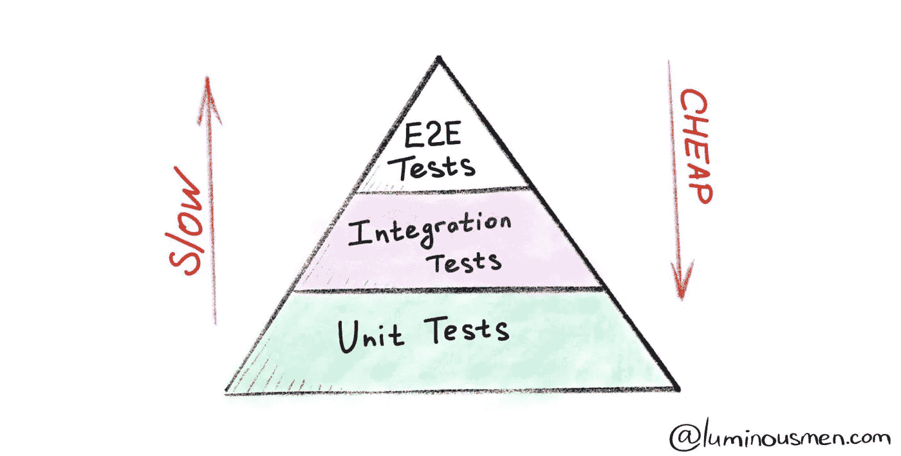
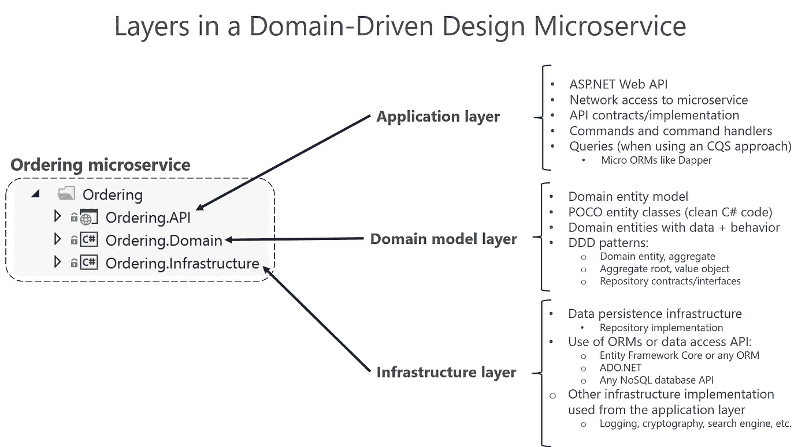
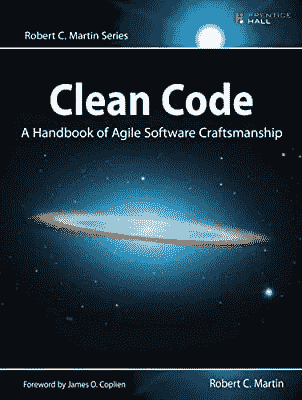
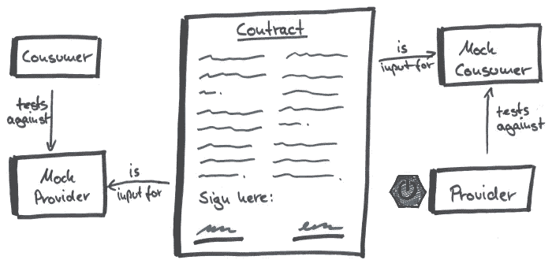
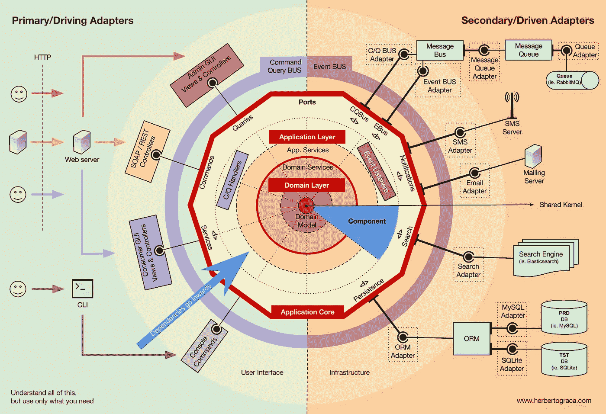
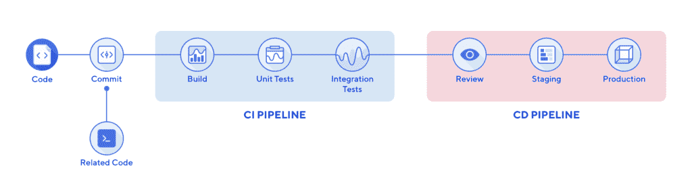
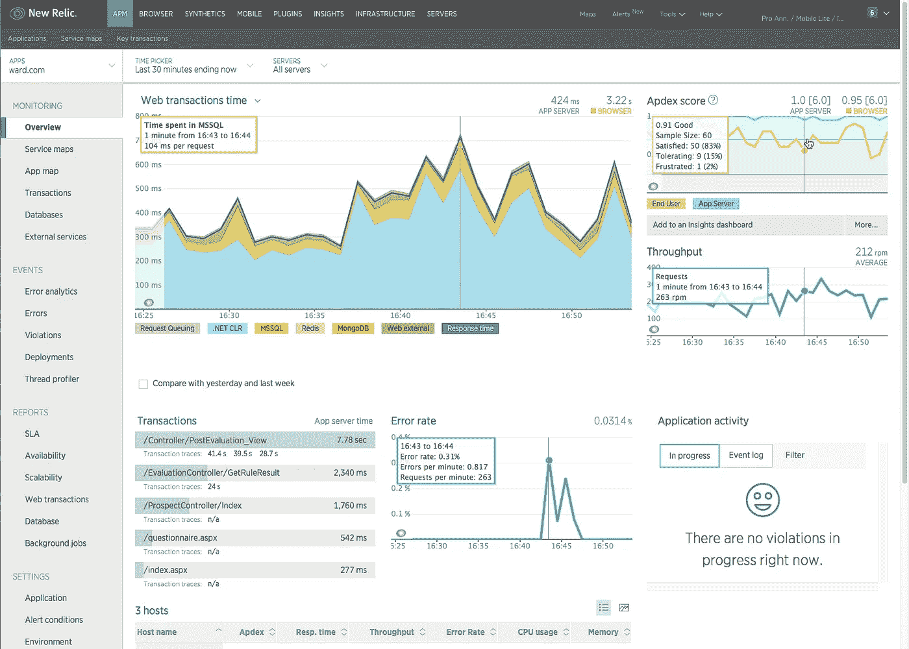
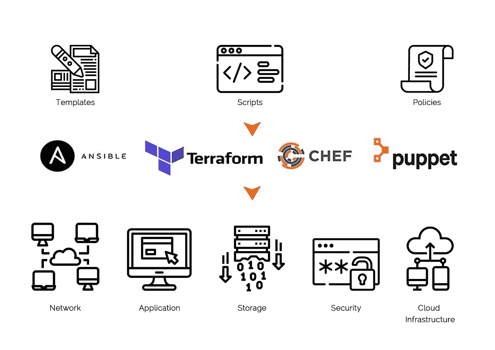
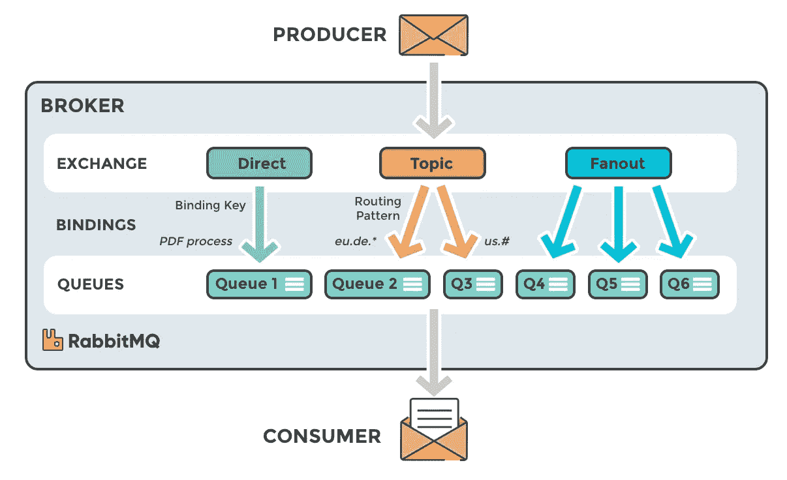
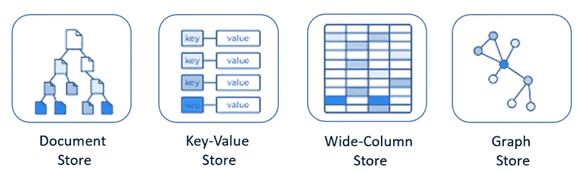

# 如何成为多功能多语种开发者

> 原文：<https://itnext.io/how-to-become-cross-functional-polyglot-developer-7d40ec934605?source=collection_archive---------3----------------------->

如何成为一名生产就绪的开发者？

如今，对于开发人员来说，坚持单一的技术/编程语言/工具是不够的。要考虑的事情太多了，尤其是微服务领域。

这可能会让开发者抓狂。

[CNCF 景观](https://landscape.cncf.io)和开发商— [来源](https://thenewstack.io/the-role-of-event-driven-architectures-in-modern-application-workflows/)

作为一名软件开发人员，在我的日常工作中，我处理不同的事情，如设计架构、编写代码、测试、编写 CI/CD 管道、根据日志或事件创建警报、监控应用程序等。

在这篇文章中，我的目标是启发新的开发人员或那些不涉及多技术栈的人。开发应用程序并将其部署到生产环境中的要求是什么？

需要遵循哪些概念？

1.  **单元测试(编码)**

我们需要开发可测试的应用程序。所有的业务需求和特性都必须是可测试的。通过单元测试，我们证明我们的代码是有效的，尊重业务所说的。

**2。领域驱动设计(架构)**

[https://docs . Microsoft . com/tr-tr/dot net/architecture/microservice/microservice-DDD-cqrs-patterns/media/DDD-oriented-microservice/domain-driven-design-microservice . png](https://docs.microsoft.com/tr-tr/dotnet/architecture/microservices/microservice-ddd-cqrs-patterns/media/ddd-oriented-microservice/domain-driven-design-microservice.png)

为了和商务人士说同样的语言，我们需要开发一种语言。此外，为了构建可扩展、可测试、可理解的应用程序，我们需要遵循一些抽象和规则。在 DDD，我们可以为复杂的业务领域提供干净的解决方案。

我推荐沃恩·弗农的红皮书:“实现领域驱动设计”

**3。清洁代码实践(编码)**

我们需要遵循干净的代码实践来编写干净的、可理解的、可读的代码。

**4。集成&自动化测试(测试)**

我们需要证明我们的应用程序可以顺利地与第三方应用程序一起工作。此外，我们希望从外部的角度测试我们的应用程序。我们希望避免每次发生任何变化时都手动执行该操作。所以我们编写集成和自动化测试来自动化这个过程。

**5。消费者驱动的合同测试(测试)**

[https://reflector ing . io/assets/img/posts/consumer-driven-contracts-with-angular-and-pact/mocks . jpg](https://reflectoring.io/assets/img/posts/consumer-driven-contracts-with-angular-and-pact/mocks.jpg)

当我们在 rest api 中对一个端点进行更改时，我们如何确保我们的消费者不会受到影响？

如果我们不小心更改了消费者使用的字段名称，该怎么办？

疾控中心测试拯救。我们的消费者和我们编写 CDC 测试，并在管道中运行这些测试，以防止部署任何突破性的更改。

看一下项目 pact:[https://docs . pact . io](https://docs.pact.io)

**6。六角形架构&端口适配器& CQRS(架构)**

[https://herbertograca . files . WordPress . com/2018/11/100-explicit-architecture-SVG . png](https://herbertograca.files.wordpress.com/2018/11/100-explicit-architecture-svg.png)

我们需要为我们的项目提供可扩展性和良好的抽象。与我们使用的框架相比，抽象我们项目的应用程序/域/基础设施/api 级别要重要得多。这是六边形架构，端口和适配器映入眼帘。

此外，我们可能希望分别扩展应用程序的读写部分。或者我们想在代码中划分/抽象这个责任。这是 CQRS 告诉我们的。

更多信息请看:[https://herbertograca . com/2017/11/16/explicit-architecture-01-DDD-hexagonal-onion-clean-cqrs-how-I-put-it-all-together/](https://herbertograca.com/2017/11/16/explicit-architecture-01-ddd-hexagonal-onion-clean-cqrs-how-i-put-it-all-together/)

**7。集装箱&码头工人**

[https://i0 . WP . com/www . docker . com/blog/WP-content/uploads/011 F3 ef 6-d824-4d 43-8 B2C-36 dab 8 AAA 72-1 . jpg？fit=650%2C530 & ssl=1](https://i0.wp.com/www.docker.com/blog/wp-content/uploads/011f3ef6-d824-4d43-8b2c-36dab8eaaa72-1.jpg?fit=650%2C530&ssl=1)

我们可以使用 Docker 从更高的层次深入到容器中。集装箱技术中最常用的事实标准。

此外，还有一些其他工具来构建容器，如 buildah & podman。

**8。CI/CD 管道**

[https://qph . fs . quoracdn . net/main-qimg-2 ed 37 e 37 f 01 fa 5a 24091 c 52 f 4a 487479](https://qph.fs.quoracdn.net/main-qimg-2ed37e37f01fa5a24091c52f4a487479)

我们需要自动化应用程序的测试/构建/部署步骤。我们可以通过使用 CI/CD 工具(Jenkins、Gitlab 等)来实现这一点。).

**9。Kubernetes (Devops)**

嗯，K8S 是容器编排的事实上的标准。我们可以通过 kubernetes 运行/扩展/发现我们的服务。

作为开发人员，我们需要熟悉它，以了解我们的应用程序工作的环境。

**10。记录(监控)**

[https://www . tigera . io/WP-content/uploads/2020/10/Solving-micro services-Connectivity-Issues-with-Network-logs . png](https://www.tigera.io/wp-content/uploads/2020/10/Solving-Microservices-Connectivity-Issues-with-Network-Logs.png)

日志是帮助我们理解应用程序行为的方法之一。有了一个好的日志记录系统，我们可以捕捉到意想不到的行为/错误，并对它们采取行动。

有许多不同的测井技术，如 ELK stack。

例如，我们正试图遵循 12 因素应用战略。我们的应用程序不知道关于日志的底层技术。我们所有的微服务都将其日志打印到 stdout，我们在 kubernetes 中用 fluentbit/fluentd 收集它们。这样，我们就从应用程序中抽象出了日志技术。我们可以在不影响应用程序的情况下切换日志存储。

**11。监控**

软件是活的系统。他们需要一直被监视。为了确定任何异常(如高资源使用率、总请求数、响应时间)并优化它们，我们需要跟踪。

像 NewRelic、Jaeger 和 Elastic APM 这样的工具可以帮助我们监控应用程序。

**12。IaC (Devops)**

[https://www . suntechnologies . com/WP-content/uploads/2020/04/image-1-2-scaled . jpg](https://www.suntechnologies.com/wp-content/uploads/2020/04/image-1-2-scaled.jpg)

代码形式的基础设施有助于我们自动化任何机器供应和配置流程。像 Terraform、Ansible、Chef、Puppet、vagger、Docker 这样的工具帮助我们实现 IaC。我们可以用 terraform/ansible 作为代码编写我们的环境，并在管道中自动运行这些代码来引导环境。

**13。消息代理(架构)**

[https://miro.medium.com/max/2412/0*gFwb04MsfqtVB5bY.png](https://miro.medium.com/max/2412/0*gFwb04MsfqtVB5bY.png)

我们可能希望以异步方式设计我们的服务通信。大多数情况下，我们这样做是为了优化性能。例如，在流程结束时发送信息邮件可以是异步的。因此，我们可以分离这些服务，并使用消息代理在分离的服务之间提供通信。

有一些流行的工具，如 RabbitMQ，ActiveMQ，Kafka，Aws Sqs 等。

**14。数据库&缓存(存储)**

[https://docs . Microsoft . com/tr-tr/dot net/architecture/cloud-native/media/types-of-no SQL-datastores . png](https://docs.microsoft.com/tr-tr/dotnet/architecture/cloud-native/media/types-of-nosql-datastores.png)

我们使用存储系统。所以我们需要知道如何使用它们。底层存储系统可能会影响我们的数据结构。错误设计的模式会影响应用程序的性能。

如何存储和检索数据？有没有更快的方法访问数据？我需要一直做 db 调用吗？我们需要能够回答这些问题。

当使用数据库(sql/nosql)时，我们需要了解如何索引数据、应用正确的模式、检索数据等。

我们可能还需要从数据库中提取开销，并使用缓存解决方案。我们可以缓存频繁访问的数据。

我在这里停下来，希望你在阅读的时候能够享受。

这个列表包含了我首先想到的事情。在开发一个应用程序时，有很多其他的部分需要考虑。如最终一致性、事件源、断路器、重试、分布式锁、传奇、状态机等。

如果你对这个列表有任何建议/补充，请写在评论里。

您可以关注我:

[https://twitter.com/mstrYoda_](https://twitter.com/mstrYoda_)

【https://github.com/mstrYoda 号