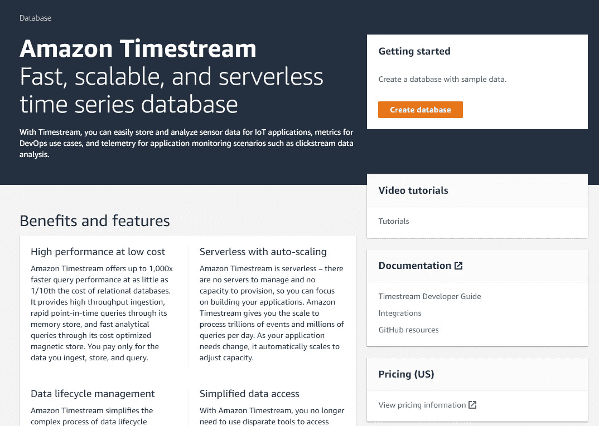
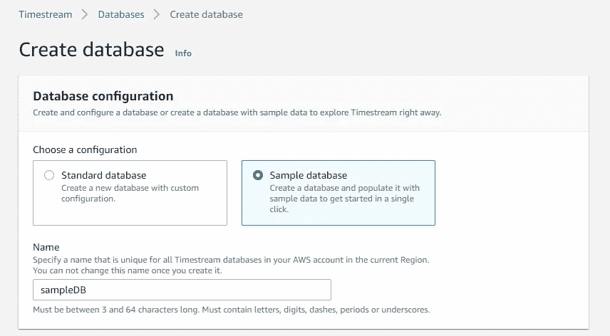
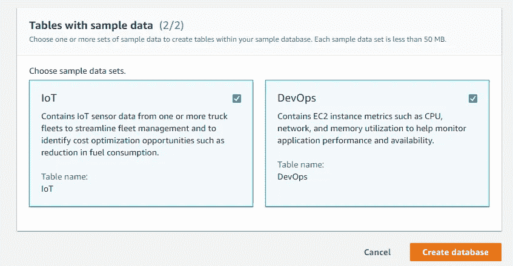
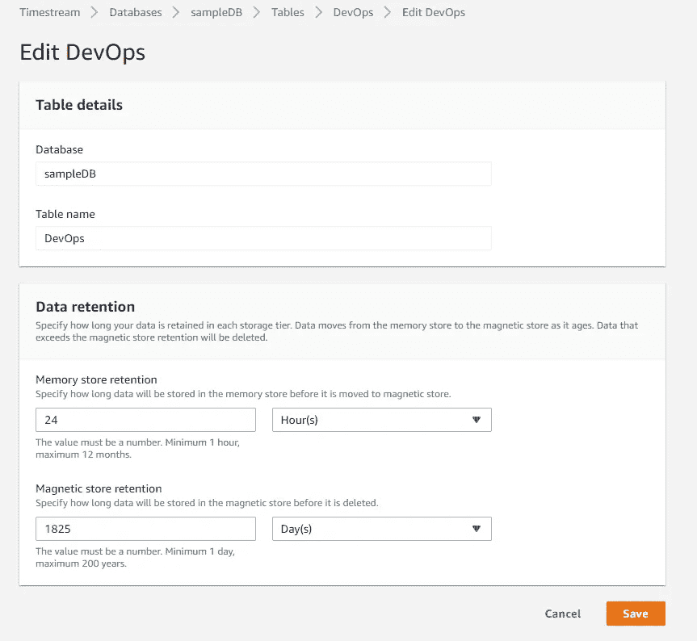
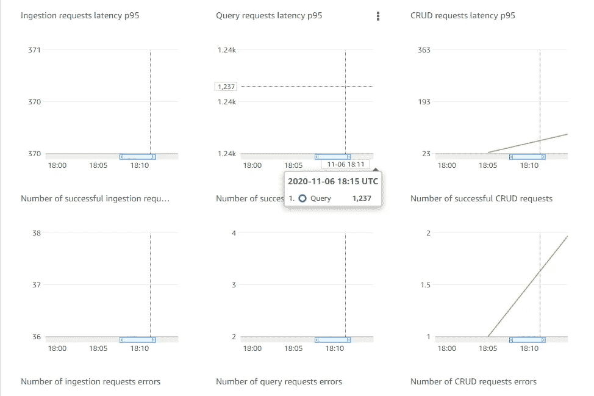

# 如何用 5 个简单的步骤从亚马逊时间流开始

> 原文：<https://itnext.io/how-to-begin-with-the-amazon-timestream-in-5-simple-steps-19c129040d9c?source=collection_archive---------3----------------------->

如果你正在寻找对 Amazon Timestream 的理解以及开始使用它的一步一步的指南，我们已经为你准备好了！

Amazon Timestream 是一个**时间序列数据库**，与关系数据库相比，它提供了更好的功能。它是无服务器的，这使得它能够为用户提供快速和可扩展的特性。

# **分解复杂的技术术语**

如果您对这些术语有一个完整的概念，我们非常欢迎您跳过这一部分，但是如果您正在寻找一些与这些术语相关的易于理解的描述，我们来了:

## **时间序列数据**

随着时间变化的**数据集合被称为时间序列数据。时间序列数据是在等分的时间间隔内收集的。每个值都有一个与其观察时间相关的时间戳。当涉及到平均结果扣除时，这是很重要的。**

时间序列数据的例子可以包括汽车的速度、股票价格的上涨、天气预报等等。所有这些值都是相对于时间测量的，该时间可以是与场景相关的秒到年之间的任何时间。👈❕

## **无服务器**

这是一种云计算模式，允许用户为他/她只使用过的资源付费。它节省了成本，因为它不涉及购买一组预定义的资源和容量。
使无服务器数据库非常适合处理时间序列数据的一个很好的理由是，它能够自动地水平扩展，而不是垂直扩展的关系数据库。

# **为什么选择亚马逊 Timestream？**

Amazon Timestream 拥有众多优势和功能，使其脱颖而出。其中包括:

1.  由于 Amazon Timestream 是无服务器的，它**节省了你的成本，因为你只需为你使用的存储空间**付费。
2.  数据库可以根据数据进行自我调整。
3.  虽然 Amazon Timestream 数据库将数据存储在两个存储层中，但是您甚至可以在不指定存储位置的情况下访问它们。
4.  命名数据库后，输入一个磁性密钥，这样数据库中的所有数据都会保持加密和安全。
5.  将数据从一个存储层转移到另一个存储层的过程是完全自动的。

# **亚马逊时间流数据库的应用**

该数据库的一些实际应用包括:

**物联网应用:**

收集运动、温度和天气信息的设备传感器使用亚马逊时间流数据库来分析数据，并得出某些结论。

**DevOps 应用:**

开发人员使用 Amazon Timestream 通过观察 CPU 利用率和内存使用等指标来分析性能指标。

**应用分析:**

它包括在一个范围内收集数据并从中推导出结论的想法。它可能包括上个月网站的流量；用户在网页上花费的时间；或者用户在视频上花费的平均时间。

# **它是如何工作的？**

对于该数据库，需要考虑以下几点:

*   亚马逊时间流数据库在**双层存储能力**上运行。一个是保存最近数据的**内存**和包含历史或过去数据的**磁性**存储器。它允许系统在整体上有效运行。
*   用户可以对数据(内存中、磁性或两者)执行多次查询，以得出结论。但是，这个数据库不允许“连接”功能，除非是在连接同一个表的数据的时候。
*   亚马逊时间流数据库不允许更新或删除数据。**数据达到保留限制**后，会自动从存储器中删除。
*   可以使用 AWS SDKs 将数据写入该数据库，这些 SDK 可以是 Java、Python、.NET 及相关。用户**可以用 ANSI-2003 SQL** 编写查询。
*   该数据库拥有各种集成和驱动程序，包括 GitHub 上的 Grafana、AWS 实验室、AWX 物联网核心等。🙇🤘

# **设置您的亚马逊时间流数据库**

要设置您的数据库并对其执行分析，请遵循下面给出的步骤。

## **第一步:**

1.  联系亚马逊时间流控制台。
2.  在定价标签下，您可以研究定价选项。
3.  单击入门标题下的创建数据库按钮。

## 第二步:

1.  选择您的数据库配置为标准数据库或样本数据库— *，但这次让我们使用样本数据库*。
2.  在名称占位符中为新数据库命名。

4.如果您已经选择了样本数据库，请选择 IoT、DevOps 或两者都选的样本数据集，然后点击 Create Database。

## **第三步:**

1.  单击数据库选项卡下的数据库。
2.  从 Tables 选项卡中选择相关的表— *在我们的示例中，选择 DevOps 或 IoT 表*。
3.  您将能够看到该表的概要详细信息。如果你想编辑它，点击右上角的编辑按钮。
4.  相应地编辑详细信息。
5.  仔细选择记忆存储保持期和磁性存储保持期，因为一旦该期限结束，数据将从存储中永久删除
6.  保存更改。

## 第四步:

1.  从左侧选项卡中选择查询编辑器。
2.  你可以在这里对你的数据进行无限的查询。
3.  从上面的选项卡中选择示例查询。在这里，您可以访问大量预定义的查询。

对物联网表的示例查询，用于获取车队中每辆卡车的所有传感器属性和值的列表

## **第五步:**

1.  从左侧选项卡点击监控。
2.  您可以看到许多图表和数据分析的可视化表示。

总而言之，正如承诺的那样，我们已经为你提供了一个详细的一步一步的亚马逊时间流入门指南。是时候对你的数据做一些实验了，你准备好了吗？

***祝您查询愉快！感谢*的阅读！**🙌