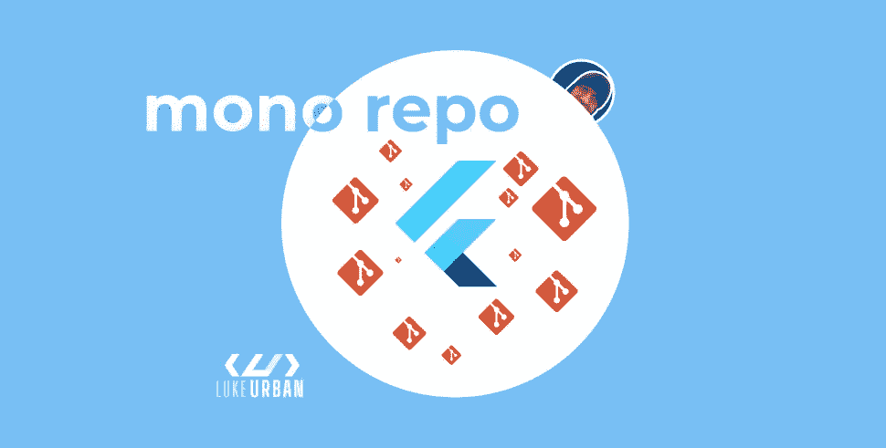

# 如何更好地管理你的 Flutter 应用程序中的业务逻辑

> 原文：<https://itnext.io/how-to-better-manage-business-logic-in-flutter-apps-bbbc8efe5dab?source=collection_archive---------0----------------------->



你好👋

我是卢克，我是一名软件开发人员，我喜欢学习新事物。每天都是提升自己，做点事情的机会！

我开始了我的颤振系列，作为我对社区的投入。感觉棒极了。当我觉得有些话题被忽略或谈得不够多时，我会试着加入进来。

管理业务逻辑就是其中之一，所以我跳了下去😉

让我们看看如何更好地管理您的应用程序业务逻辑。

# 简单—使用 monorepo...但这是什么呢？🧐

对于那些不知道的人来说，monorepo 是一种将多个项目存储在单个存储库中的软件开发策略。

> 在现实生活中意味着什么？

当您在一个存储库中包含前端、后端应用、配置和其他相关子项目时，如下所示:

```
pick_of_destiny
    -> front-end
    -> backend-end
    -> configuration
```

有人喜欢 monorepos，也有人反对它。我不是上面的人。我的政策是你应该使用最适合你需要的。这并不是说你必须永远坚持下去。需要时，您可以拆分或合并存储库。我想不出有哪种语言或框架会强迫开发人员使用这种或那种。颤振也不例外。

# 良好的颤振模块化

你可以在一个回购中存储多个 Flutter 应用程序，但我心中的想法有点不同。我在之前的文章中提到过这个问题( [Flutter 不再是一个跨平台的框架——它有更多的含义。"](/flutter-is-no-longer-a-cross-platform-framework-b53c87b14c39))我在这里提到了模块化，以及我们应该如何分离不同平台之间的逻辑。不幸的是，我没有具体说明如何在 Flutter 中实现它，人们认为 monorepo 是唯一的方法。

> 我再说一遍——不是的:)

为了便于解释，假设你负责一个类似优步的应用程序(在这种情况下，我会嫉妒😉)并且你必须维护 3 个应用程序:

*   客户 app—app**A**
*   司机 app—app**B**
*   仅显示您的乘坐位置的网页版——app**C**

由于用户界面/UX 的感觉以及手机或浏览器等媒介提供的优势，你不会在一个应用程序基础上开发移动和网络版本。是的，您可以使用布局生成器。但是为什么呢？web 应用程序的用途与移动应用程序完全不同，因此不同的代码库在公司中更容易管理。那是我的观点，你的可以不同。

因此，app **A** 和 **B** 有一些相似之处，如登录、应用内通信、地图和一些地图机制，但 app **C** 有一个唯一的地图和一个非常简化的地图，只显示位置和预计到达时间。

在这种情况下，我将创建 3 个(Flutter)应用程序，每个应用程序位于不同的存储库中，大约十几个或更多的包和插件存储在一个 monorepo 中。所有的共享登录、应用内通信、ETA 计算等等都可以存在那里。

为什么我要这样使用它？主要是为了避免代码重复，但另一个理由是让开发团队只致力于特定的应用目标。应用程序 **A、B、**和 **C** 上的开发人员不应该在相同的修复功能上工作。这会让公司付出很大代价——金钱和时间！

请记住，您不必从一开始就这样做。当你写你的第一个应用程序时，试着遵循一些好的编程实践，使代码可重用和可伸缩。记住这一点，你就可以轻松地将你的代码转移到一个单独的代码库中，而不会出现更大的问题。

如果你对 monorepo 插件/包的想法感兴趣，让我们看看如何在你的 Flutter 项目中使用它。

# 范例—“世界上最好的范例”

创建 monorepo 非常简单。只需创建一个目录，在其中放置所有需要的包和插件，然后将该目录设置为 repo 的根目录。你准备好出发了吗😉

## 如何在你的颤振项目中使用？

您可以以两种方式使用 monorepo:本地和远程(通过 git)

在开发过程中，我经常将本地克隆的 repo 与我的包一起使用，如下所示:

```
dependencies:
  kicka💩:
    path: ../the_best_package_in_the_world/kicka💩
```

我正在使用来自`tbpitw(the_best_package_in_the_world)`回购的 `kicka💩`包。

然后，当应用程序准备好发布时，我把它改成使用 git——就像这样:

```
dependencies:
  kicka💩:
    git:
      url: git://github.com/lukeurban/tbpitw.git
     ** path: kicka💩**
```

我可以使用尽可能多的插件，结构看起来是一样的:

```
dependencies: kicka💩:
    git:
      url: git://github.com/lukeurban/tbpitw.git
     path: kicka💩 belzeboss😈:
    git:
      url: git://github.com/lukeurban/tbpitw.git
      path: belzeboss😈
```

> 对于那些思考这些奇怪名字的人来说，这是一个顽固的 D 参考。一对伟大的喜剧摇滚组合。如果你认识他们——你太棒了🤘如果你没有，那么你一定要检查一下！

# 共享代码 monorepo 的优势

正如我所说，很多人喜欢 monorepo，也有很多人讨厌它。对我来说，使用 monorepo 为您的私有依赖项带来了以下好处:

*   一个词
*   模块性
*   复用性

如果用于多个项目，共享代码存储在 monorepo 中，而不是多个项目存储库中。这可以确保每个应用程序都使用相同的功能集，并且它们不会因使用位置不同而表现不同。谁有时间去研究:“为什么这个在 app A 上行得通，在 app B 上行不通”。我们可以说:“好的，我们需要修复这个包”，而不是无休止的调试。

# 我应该一直使用 monorepo 吗？我们应该用单一回购做什么？🥸

对我来说，当我独自开始一个项目时，将所有东西放在一个回购中更容易。当更多的出现时，我通常建议将每个部分分成单独的库。它可以呆在一起，但就我个人而言，我不是一个球迷。

我用 monorepo 做我公司的内部插件/包。并非我们所做的一切都可以开源，我们的大多数应用程序都将使用通用逻辑，所以——为什么不呢？

我和我的好朋友在谈论 monorepos，我们得出结论，人们真的不喜欢它们。这很可悲。也许这篇小文章会改变他们的想法。如果读完这篇文章后有人考虑使用 mono repo——我达到了我的目标！我非常赞同你的决定。

# 摘要

在本文中，我想“推销”最简单、但却被遗忘的 monorepo 理念。在我看来，这是更好地管理我们的业务逻辑的方法。

一位开发人员告诉我，在他的公司里，我以前的一篇文章被用作反对 Flutter 的论据，因为模块化意味着它必须保持在一个单一的、类似单一回购的结构中。可以，但不是唯一的选择。所以才写了这篇文章。

在 Flutter 中，你想如何管理你的逻辑取决于你自己。但我要重复一遍:

> Flutter 没有强迫你使用 monorepo。

所以对于更大的多 app 公司，在我看来这是一个完美的选择。由于 Flutter 2.0 的发布允许在 iOS、Android、Mac、Windows、Linux 和 web 上构建应用程序，我们几乎可以创建任何东西。谁喜欢浪费时间一遍又一遍地写相同的特性呢？

感谢阅读！如果您有任何问题，请在 [Twitter](https://twitter.com/ThatLukeUrban) 上问我，我的 DMs 是开放的。你可以跟着我去那里和这里，在媒体上！

我刚刚推出了我的新网站( [https://lukeurban.tech](https://lukeurban.tech) )，在那里你可以找到我所有文章和作品的链接。

在那里的时候，考虑订阅我的时事通讯，不要错过我的任何工作。偶尔，我会发送一些迷因和其他编程内容。😅

*让代码与你同在！*

卢克(男子名)