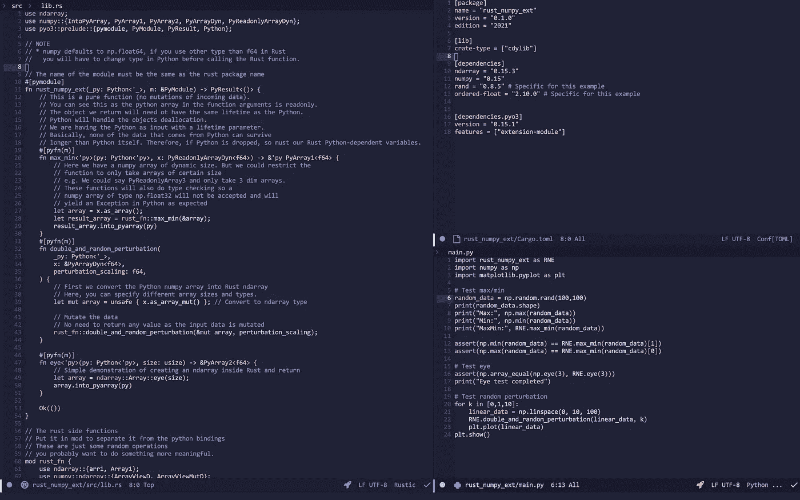
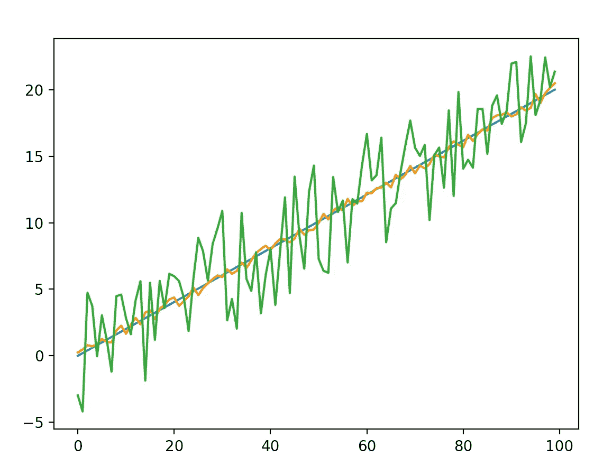

# 如何将(Python + NumPy)与(Rust + Ndarray)绑定

> 原文：<https://itnext.io/how-to-bind-python-numpy-with-rust-ndarray-2efa5717ed21?source=collection_archive---------0----------------------->



这只是一张图片，让文章看起来更漂亮。不过，这是我们将要构建的代码。如果你想知道“这是 Emacs 吗？”是的，这是 Emacs，是的，有时它看起来很漂亮。也许我们会在下一篇文章中讨论 Emacs、Neovim 和 VScode。谁知道呢？我知道。

# 内容

本文将讨论:

*   PyO3 绑定(Rust to Python)
*   Python NumPy to Rust Ndarray(无拷贝，即快速)
*   Rust Ndarray 到 Python NumPy
*   可变和不可变的例子

如果您只想阅读如何实现绑定，请跳过“背景”部分。

# 背景

自然 Python 代码不是最快的(迄今为止)，有时会使 Python 成为不太合适的任务选择。然而，用 Python 构建更大的数据(或其他)项目是好的，因为存在所有好的包。

那么，我们如何处理速度的问题呢？如今常见的方式是使用 C 进行扩展，大部分主流包(如 NumPy 和 PyTorch)都是用 C、C++甚至 CUDA 实现的。对于许多习惯于使用简单 Python 代码的 Python 人员来说，一直使用 C 或 C++通常不是一种有趣的体验。

幸运的是，其他低级语言确实存在，相对较新的语言 Rust 就是一个很好的例子。让铁锈成为杀手的特征(IMHO)是:

*   优秀包装经理(货物)。
*   无垃圾收集，性能可预测。
*   处理记忆的安全方式(有利于新人少犯错误)。
*   由于其令人难以置信的工具(例如 VSCode 的 rust-analyser ),易于上手。不过，与编译器斗争有时会很乏味，也很有教育意义。

# 入门指南

## 包装

为 Python 编写 Rust 绑定出奇的简单(经过几次拼命的尝试)。首先，我们将依赖几个包:

锈

*   [n 数组](https://docs.rs/ndarray/latest/ndarray/)
*   [numpy](https://docs.rs/numpy/latest/numpy/)
*   [PyO3](https://pyo3.rs/v0.15.1/)

计算机编程语言

*   [numpy](https://numpy.org/install/)
*   [maturin](https://github.com/PyO3/maturin) (有趣的名字，食物-尿液直接从瑞典语翻译过来)

## Rust 设置

首先创建一个新项目(您可以随意命名)。注意，选择的名称将是您在 python 中导入的名称。

```
cargo new --lib rust_numpy_ext
```

然后将这些包添加到您的货物中(在撰写本文时，这些都是最新的版本)。

```
[package]
name = "rust_numpy_ext"
version = "0.1.0"
edition = "2021"[lib]
crate-type = ["cdylib"][dependencies]
ndarray = "0.15.3"
numpy = "0.15"
rand = "0.8.5" # Specific for this example
ordered-float = "2.10.0" # Specific for this example[dependencies.pyo3]
version = "0.15.1"
features = ["extension-module"]
```

## Python 设置

*对于不知道什么是 Python 虚拟环境的人，请查一下，因为需要将 Rust 包/模块安装到虚拟环境中。网上有很多很棒的教程。它可能因操作系统而异。*

为了安装 Rust 包，我们需要一个 Python 虚拟环境。您可以使用以下命令创建一个本地环境(取决于您为 Python 取的名称)。

```
python3 -m venv ./test_venv
```

下一步是激活环境，这可以通过调用

```
source ./test_venv/bin/activate
```

一旦激活，你应该在你的终端上看到你的 venv 的名字，见下面的例子。


激活环境后的终端外观示例。

现在我们还需要在 venv 中安装我们的依赖项。注意，当激活虚拟环境时，您的 python 可能会以不同的名称被调用(python3 -> python)。

```
python -m pip install numpy
python -m pip install maturin
python -m pip install matplotlib
```

注意，matplotlib 仅用于可视化，对于绑定不是必需的。

# 密码

现在，我们将大致按照 PyO3 中的[示例进行操作，该示例包含许多感兴趣的内容。因为他们例子已经存在，所以我选择做一些新的“花哨”的函数来测试。](https://github.com/PyO3/rust-numpy)

*Rust 和它的社区的一个奇妙的部分是伟大的软件包的数量每天都在增加，并且超级容易安装。我们将使用 Rust 包“numpy ”,它让我们可以轻松地将 Python“numpy”数据转换为本地 Rust“ndarray”数据。壮观！*

让我们转储[所有的代码](https://gist.github.com/Machine-Jonte/9117f826af0c7f2267441dfeb3e57a04)，然后遍历它！

## Rust 创建 Python 模块

生锈的一面乍一看可能很吓人。但是我们正在做的是指定 Python 模块，它必须与包同名。空模块将看起来像

```
#[pymodule]
fn rust_numpy_ext(_py: Python<'_>, m: &PyModule) -> PyResult<()> {
    Ok(())
}
```

不太恐怖。我们将 Python 和对 PyModule 的引用作为输入，并返回一个 PyResult。这个不用想太多。您可以复制它并将模块重命名为包名。标准程序。

## Rust 填充 Python 模块

下一步是在 Python 模块中创建第一个函数。让我们从最简单的一个函数开始。

```
 #[pyfn(m)]
    fn eye<'py>(py: Python<'py>, size: usize) -> &PyArray2<f64> {
        let array = ndarray::Array::eye(size);
        array.into_pyarray(py)
    }
```

这将在 pymodule 内部创建，完整代码如下。我们可以看到，我们的 pyfn 会将我们的 *PythonModule* *m* 作为输入，将我们的函数添加到模块中，即代码部分“#[pyfn(m)]”。

```
#[pymodule]
fn rust_numpy_ext(_py: Python<'_>, m: &PyModule) -> PyResult<()> { #[pyfn(m)]
    fn eye<'py>(py: Python<'py>, size: usize) -> &PyArray2<f64> {
        let array = ndarray::Array::eye(size);
        array.into_pyarray(py)
    } Ok(())
}
```

这里的包装将为我们处理很多。PyO3 将尝试并自动将 Python 参数转换为 Rust 类型。在这种情况下:

Python int -> Rust usize

每个 pyfn 都需要 Python 作为输入，然后是其他类型。同样，我们可以将此视为创建 Rust/Python 函数的标准过程。

接下来，我们使用 Rust 包 ndarray 来创建眼睛矩阵(即对角线上的一个)。为了将它发送回 Python，我们需要将 ndarray 转换成 Python numpy 数组。这里我们使用 Rust 中的包“numpy ”,带有特征“IntoPyArray”。将这作为一个特征的好处是，这个特征也可以在其他 Rust 包中实现，比如“nalgebra”。这使得将 Rust 数据转换成 Python numpy 数据的过程标准化成为可能。太好了！

我们将要编写的其他函数遵循相同的逻辑，只是在幕后多了一些操作。其中一个函数改变了 numpy 数组，这可能会更有效。另一个将 numpy 数组作为只读数组，这样就不可能改变输入数据。

## Rust 用 NumPy 输入填充 Python 模块

**只读** 第一个例子是取一个 numpy 数组作为输入，它是**不可变的**。如果你遵循纯函数式编程，这是非常好的！现在，我们可以确保数组没有任何变化(不同于 Python/C/C++)。

```
#[pyfn(m)]
    fn max_min<'py>(py: Python<'py>, x: PyReadonlyArrayDyn<f64>) -> &'py PyArray1<f64> {
        let array = x.as_array();
        let result_array = rust_fn::max_min(&array);
        result_array.into_pyarray(py)
    }
```

我们将输入的 numpy 数组“x”转换成一个 ndarray 的“ArrayView”。as_array()"。这意味着“数组”变量是不可变的。然后我们可以调用 Rust 函数 *min_max* ，该函数将一个 ndarray 作为输入，找到最大值和最小值，并将其作为 ndarray [max，min]返回。

太好了！然后，正如已经讨论过的，我们可以使用特征“IntoPyArray”将其转换回 Python numpy 数组。现在我们可以将结果返回给 Python 了！

**可变** 在下一个例子中，我们将获取一个可变的 numpy 数组，对它进行循环，将每个值加倍，并向它添加一个随机扰动。和以前很像。不同之处在于，在将 numpy 数组转换为 ndarray 时，我们必须使用“as_array_mut()”使其可变。这将是一个不安全的操作。

```
#[pyfn(m)]
    fn double_and_random_perturbation(
        _py: Python<'_>,
        x: &PyArrayDyn<f64>,
        perturbation_scaling: f64,
    ) {
        let mut array = unsafe { x.as_array_mut() };
        rust_fn::double_and_random_perturbation(&mut array, perturbation_scaling);
    }
```

我们现在可以调用 Rust 函数来改变 ndarray。我们不需要返回数组，因为 ndarray 上的突变直接发生在 numpy 数组上，因为 **ndarray 和 numpy 数组共享数据**。

# 构建/安装软件包

*确保在建造之前激活你的 venv*

为了能够从 Python 导入包，我们必须构建它。为此，我们将使用“maturin”。在你的 Rust 包的根目录下运行

```
maturin develop
```

一旦你对这个包满意了，你就可以用 release 标志来运行，以获得一个更加优化的版本(也就是说，你的 Rust 代码运行得更快)。

```
maturin develop --release
```

运行 *maturin* 命令将使模块可以在 Python 中导入。
模块可以从任何 python 文件导入，只要你在运行 Python 时使用相同的 venv。也就是说，您的 Python 项目可以从 Rust 模块中分离出来，这太棒了！

# Python —测试我们的模块

*运行*前，确保您的 venv 已激活

## 导入包

从 Python 的角度来看，事情的表现和预期的一样。我们可以将模块导入为

```
import rust_numpy_ext as RNE
```

或者，如果我们只想要一个功能，我们可以做到

```
from rust_numpy_ext import double_and_random_perturbation
```

我们唯一的问题是 Python linter(至少在 VSCode 中)不会自动完成我们的函数，我们看不到函数想要什么参数。为了解决这个问题，我们可以用 Python 函数包装我们的函数。如果我们要为 numpy 数组使用非默认类型(例如 u8、f32 等),这些 Python 侧函数也可以处理我们的类型转换。).

包装函数可能类似于下面的代码块。请注意，您可以将所有函数包装在同一个文件中。包装该模块将使它成为 Python 的一等公民，并像 numpy 一样具有本机行为。

## 运行简单的测试

现在，让我们测试一下我们编写的函数是否正常工作。这与之前列出的 Python 代码相同(main.py)。我把它放在这里是为了方便。只要在运行期间激活了正确的 venv，main.py 文件可以在任何地方。这应该没有任何问题。你应该得到如下的图，我们可以看到 numpy 数组的加倍和扰动。

main.py



double_and_random_perturbation 函数的输出。看起来不出所料。

# 结论

使用 Rust 和 Python 很棒，PyO3 和其他助手包完成了很多工作。根据经验，我发现使用 Rust 比编写 C/C++扩展有趣得多。尽管 PyTorch 在启用 C++扩展方面做得很好，但这是一个例外(依赖于 pybind11)。

最终，这一切都归结于偏好，以及团队拥有的专业知识。Rust 是现代的，最近越来越受欢迎，但是 C/C++在业界已经很成熟，很难与之竞争。

如果你喜欢这篇文章，支持我的最好方式就是鼓掌和/或关注我！如果你非常善良，你会和你的朋友一起分享。但是说实话，我很高兴你能走到这一步，享受它，最重要的是学到了一些东西。

干杯！