# 如何使用视频和画布实时模糊对象

> 原文：<https://itnext.io/how-to-blur-objects-in-real-time-with-video-and-canvas-898cddc01ae6?source=collection_archive---------2----------------------->

[西格蒙德](https://unsplash.com/@sigmund?utm_source=unsplash&utm_medium=referral&utm_content=creditCopyText)在 [Unsplash](https://unsplash.com/?utm_source=unsplash&utm_medium=referral&utm_content=creditCopyText) 上拍照

保密是现代社会非常重要的一部分。当你在公共场所用手机拍摄视频时，进入画面的人不会总是对此感到高兴。为了防止这种情况，面部被模糊或像素化。

今天我想在网上分享这种视频(图像)模糊/像素化的实现。

我们所拥有的:

*   浏览器
*   录像
*   视频的元数据
*   每一帧的人脸坐标数组(之前使用人脸检测算法获得)
*   关于 JavaScript、Canvas 和一些 CSS 的知识

我们将分别模糊面部和整个图像，除了面部。

看起来是这样的:

外部模糊

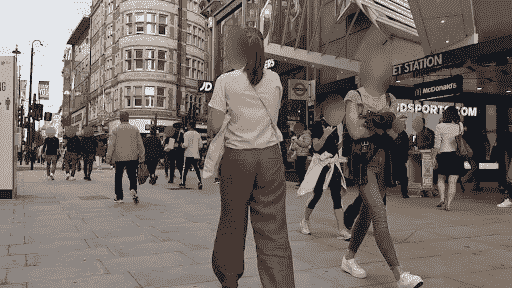

内心模糊

我们走吧。

# 如何获取视频的元数据

首先，我们需要获取视频的元数据。为此，请访问网站`[https://gpac.github.io/mp4box.js/test/filereader.html](https://gpac.github.io/mp4box.js/test/filereader.html)`并上传视频。

打开`src/constants/video.ts`并更改参数。

`framesCount`是在`Box View -> Tree View-> moov -> trak ->mdia -> minf -> stbl -> stts`的`sample_counts`

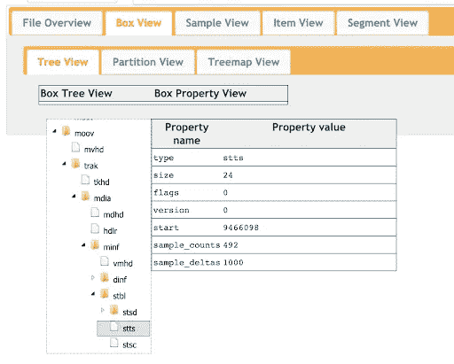

如何找到 framesCount 参数

`framesDurations`是`Box View -> Tree View-> moov -> trak ->mdia -> minf -> stbl -> stts`里的`sample_deltas`

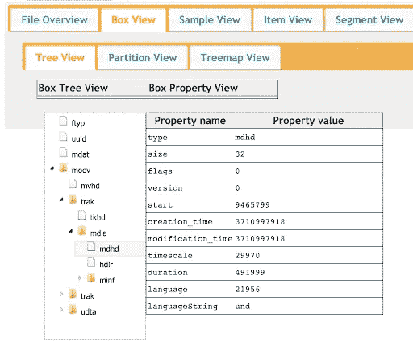

如何找到框架尺寸参数

`timeScale`是`Box View -> Tree View-> moov -> trak ->mdia -> mdhd`里的`timescale`

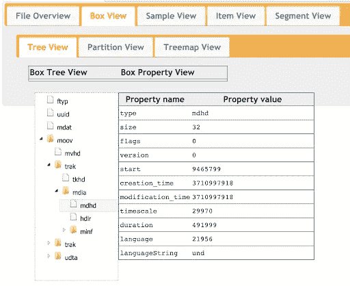

如何查找时间刻度参数

我们将需要所有这些元数据来根据视频当前时间正确地确定帧。

# 如何使用视频

我们有视频，我们想播放它，并在上面模糊面孔。但是我们不能只使用一个视频标签，因为我们不能在运行中编辑它，也不能在浏览器中使用它。要做到这一点，你可以在画布上绘制这个视频。

渲染算法非常简单:

1.  创建一个视频元素，并将 URL 设置为视频

2.创建一个画布元素，并将其宽度和高度设置为视频元素，获取其上下文

3.在画布上绘制当前帧

> *方法`drawImage`接受接口:`HTMLOrSVGImageElement` | `HTMLVideoElement` | `HTMLCanvasElement` | `ImageBitmap` | `OffscreenCanvas`，这就是为什么我们可以传递视频元素，当前帧会自己绘制。

执行这段代码后，我们会看到一个黑色的矩形。这是因为我们的视频当前在时间线 0 中。要在打开视频时看到图像，你需要做一点黑客。首次渲染视频时，将当前视频时间设定为 0.0001。

现在另一个问题出现了:我们需要在回放时绘制视频帧。

可以尝试订阅`timeupdate`活动，但是结果会让你不爽。它每秒被触发 4-5 次，我们将得到一个幻灯片作为渲染的结果。

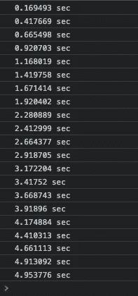

timeupdate 事件调用频率

我们的视频以每秒 30 帧的速度播放。是的，这不是我们所期望的，让我们进一步尝试。

使用对`requestAnimationFrame`的递归调用，我们可以更频繁地(在最好的情况下每秒 60 次)调用一个方法来接收视频上的时间并确定帧。

现在我们有了画布上的“玩家”。还有待学习如何模糊面部。

我们对模糊的选择:

*   对象内部的高斯模糊
*   对象外部的高斯模糊
*   像素化内部对象
*   像素化外部对象

# **高斯模糊**

为了实现这种情况，我们需要在画布上再画两个画布，并渲染视频帧。一个是模糊整个画布，第二个是根据坐标从模糊的画布中剪切出必要的对象。

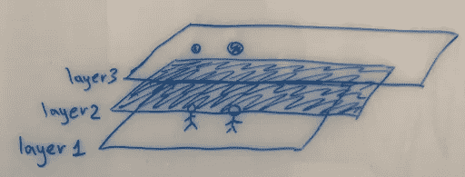

用于模糊对象的带有画布的层

模糊整个图层很容易。要做到这一点，你需要应用一个给定强度的模糊过滤器，在我的实现中，它是 30。这里使用亮度是为了增强模糊效果，因为对于明亮的图像，你仍然会看到太多模糊的东西。然后剩下的就是在这块画布上画出我们的视频帧。

现在我们需要通过坐标来切割我们的对象。我们有每个帧上所有对象的数据(坐标为 x，y，高度和宽度，模糊类型)，所以你只需要遍历帧上的所有对象，然后施一点魔法。

我们形成关于物体所在区域的数据。

这将是一个长方形，但我们需要一个椭圆形…好吧，好吧，现在一切都将完成。

用一点学校知识，我们得到高度和宽度的半径，并找到椭圆的中心。使用`clip`绘制椭圆并约束其绘制区域。

最后一步。`drawImage`方法将根据我们如何模糊(物体内部或外部)来选择不同的图层。如果我们需要模糊物体的外部，我们从视频中获取图像，如果在内部，我们从模糊的画布中获取图像。

您可能已经注意到，出于某种原因，对象是按`isBlurOut`字段排序的。

这是针对当我们在帧上有外部模糊的对象和内部模糊的对象，并且它们在某些区域相交的情况。为了让一个内部模糊的物体覆盖在图像上，我们首先需要绘制所有外部模糊的物体，然后在图像上绘制内部模糊的物体。

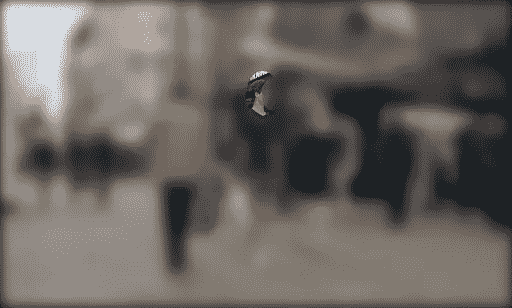

对象的交集

# 像素化

像素化会有一点困难。让我们首先考虑对象内部像素化的情况。我们在画布上也有两层渲染视频。但是这里也有一个小黑客。

在我们模糊了整个画布的图层上，现在我们将图像缩小 12.5 倍并上色。在`downsizeRatio`公式中有一个`blurIntensity`，这样我们可以减小或增加像素大小。

我们得到以下结果

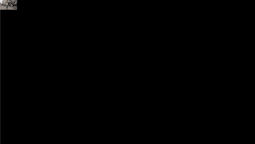

缩小图像

现在，当我们遍历框架中的所有对象时，我们会得到这个结果，因为我们正在以真实大小绘制椭圆，但我们从左上角的小图像中获取图片。结果是我们拉伸它，得到一个像素化的图像。

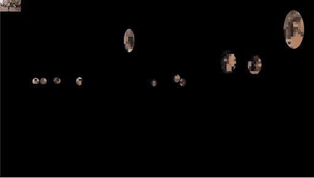

获取像素化图像

太神奇了！

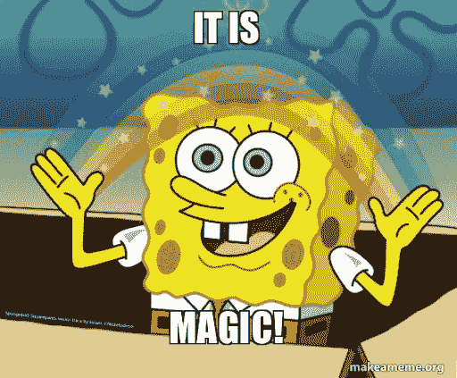

还需要考虑整个帧的像素化。这是一个相当困难的操作，需要的不仅仅是几行代码。

你需要从带有渲染视频的画布中获取`imageData`，这将是一个包含图像像素描述的巨大数组。该阵列中的每 4 个元素描述每个像素的 RGBA。

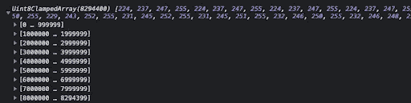

ImageData 数组

这就是为什么像素化整个帧需要很多时间。

但并非所有事情都如此糟糕，我们不需要检查整个阵列。根据`pixelSize`(一个像素的大小，或者换句话说，我们想要将多少个像素合并到一个矩形中)，我们需要遍历这个数组的次数会少得多。

运行每个像素，它是`pixelSize`的倍数，我们使用以下公式计算它在具有图像的 RGBA 表示的阵列中的位置:

然后，我们通过使用`pixelSize`绘制像素及其颜色，将我们的更改应用到画布上:

你还记得我们用高斯模糊滤镜使图像变暗吗？所以，忘了这个实现吧:)

当我们尝试用这个实现像素化时，需要很长时间，一帧需要几秒钟，你可以通过点击[演示](https://objects-blur-demo.vercel.app)中的`Pixelate with canvas filter`按钮来检查。

但是我们不会放弃这一点，我们对 CSS 有一点了解，所以是时候应用它了。

已应用:)

您可以通过点击`Pixelate with CSS filter`按钮在[演示](https://objects-blur-demo.vercel.app)中检查结果。它真的会让你大吃一惊。

# 结论

谢谢你把文章看完。你可以在 [GitHub](https://github.com/yantsishko/objects-blur-example) 上找到代码，并查看[在线演示](https://objects-blur-demo.vercel.app)。

没有什么不可能，只是时间问题。

P.S .如果有人能告诉我如何在像素化时混合相邻像素的颜色，使其不那么“粗糙”，我将非常感谢。`OpenCV.js`不提供应用程序的开销。