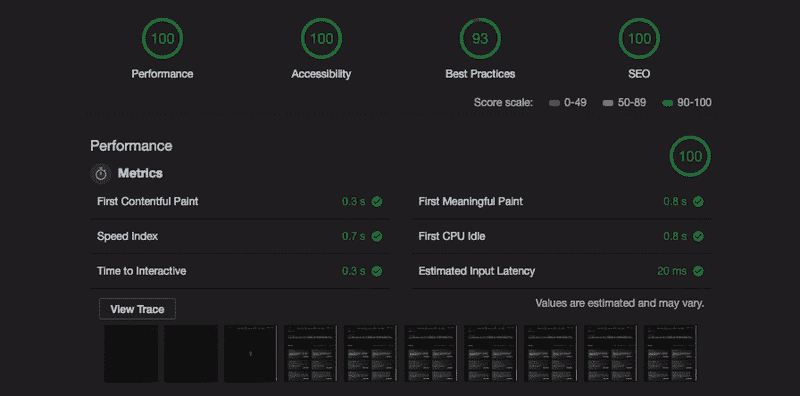
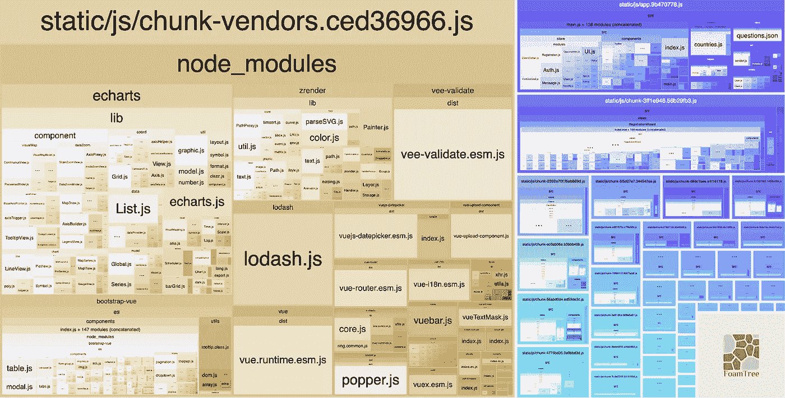
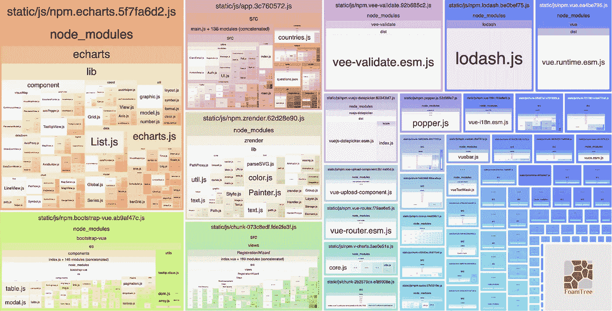
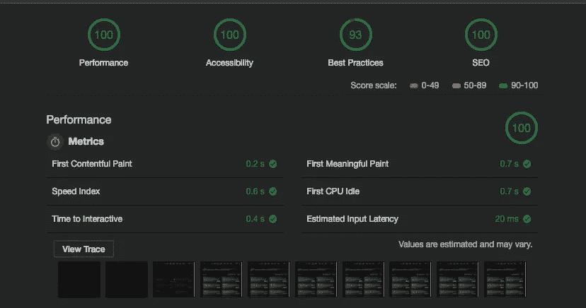
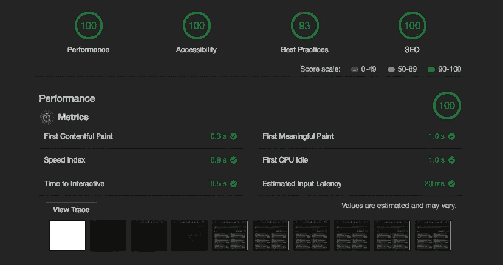
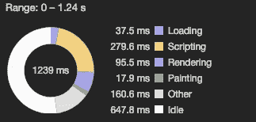
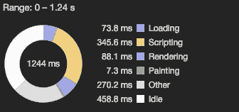

# 如何提升 Vue.js 性能

> 原文：<https://itnext.io/how-to-boost-vue-js-performance-c7df027ff3f5?source=collection_archive---------0----------------------->



**避免巨大的网络负载**

> 减少网络请求的总大小可以加快页面加载速度，并节省用户在蜂窝数据上的开支。—谷歌

当我们第一次在 Vue 中启动 SPA 项目时，通常我们会用 [CLI 3.0](https://cli.vuejs.org/) +快速准备项目框架和开发环境，并开始创建页面和组件。

然后我们继续以这种加速度发展。我们的页面增加，我们放在这些页面上的组件成倍增加。但是在背景中，还有一件事我们忘记了，那就是尺寸的增加。这是我们的捆绑文件。

你有没有想过你的用户甚至不会访问那个页面的可能性？或者是在某种条件下无法满足你所渲染的组件需求的可能性。你创造的大多数模型可能永远不会被看到。

我们将所有这些冗余代码发送给我们的用户。然而，用户只想查看单个页面。

# 好的..我们能做什么？

## 首先..代码分割和延迟加载

通过应用基于路由和基于组件的代码分割和延迟加载，我们可以将包文件分割成小块。

为了用 [vue-router](https://router.vuejs.org/guide/advanced/lazy-loading.html) 实现这一点，我们可以用这种特殊的语法导入页面，而不是直接导入。

```
const router = new VueRouter({
  routes: [
    { 
      path: '/foo', 
      component: () => 
        import(/* webpackChunkName: "foo" */ '@/views/foo'), 
    }
  ]
})
```

`**webpackChunkName**` 是一个特殊的关键字。有时，我们希望将几个页面或组件合并到同一个块中。webpack 将识别这个关键字，并在同一个块下组合具有相同名称的页面和组件。

在组件中，我们有条件地呈现:

```
<template>
  <div> 
    <admin-panel v-if="userRole === 'admin'" />
  </div>
</template><script>
 const adminPanel = () => import('AdminPanel.vue') export default {
   components: { adminPanel }
 }
</script>
```

我们可以这样使用它。一旦满足条件，就会包含此组件。在那之前它不会被包括在内。因此，只有当条件满足时，用户才会下载该组件的代码。

我举过一个例子，特别是如上。因为我想提的是，你可以开发一个`**multi-role**`应用。如果您正在开发一个具有多个角色的应用程序，那么拆分代码的重要性就变得更加重要。

假设您有一个三层系统，客户端、管理员和来宾。

如果我们没有拆分代码，用户就会下载属于所有角色的代码，而不管他的角色是什么。除了生成包含过多不必要代码的大文件的问题之外，这也是一个安全漏洞。

## 樱桃采摘

如果你使用的组件库使用像`[**bootstrap-vue**](https://bootstrap-vue.js.org/)`这样的 es 模块，你可以挑选它的组件，而不是全局注册它们。

不要这样做:

```
import Vue from 'vue';
import BootstrapVue from 'bootstrap-vue';

Vue.use(BootstrapVue);
```

你可以这样使用它:

```
import {
 Modal,
 Table,
 Pagination,
 Button,
 Layout,
} from 'bootstrap-vue/es/components';import bTooltipD from 'bootstrapvue/es/directives/tooltip/tooltip';[Modal, Table, Pagination, Button, Layout].forEach(*comp* => {
  Vue.use(comp);
});Vue.directive('b-tooltip', bTooltipD);
```

或者用`[**lodash-es**](https://www.npmjs.com/package/lodash-es)`代替`[**lodash**](https://www.npmjs.com/package/lodash)`。

您可以搜索您使用的其他库的支持。这也意味着许多不会被使用的代码不会被发送给用户。

完成此操作后，我们的 JavaScript 和 CSS 代码将以类似于以下结构的方式分离:



您可以使用**vue-CLI-service build-report**来获取该报告。

是的，我用 lodash 代替 lodash-es。我还没碰过。因为我就是文章开头提到的那个家伙:)我在考虑马上换一个。

如果你已经注意到了，我们的“块供应商”文件也很大。如果你想对此做些什么，你可以在我们的`**vue.config.js**`文件中根据[David Gilbertson](https://hackernoon.com/the-100-correct-way-to-split-your-chunks-with-webpack-f8a9df5b7758)[的](https://hackernoon.com/@david.gilbertson)这篇文章进行设置。

```
module.exports = {
...
  configureWebpack: {
    optimization: {
      runtimeChunk: 'single',
      splitChunks: {
        chunks: 'all',
        maxInitialRequests: Infinity,
        minSize: 0,
        cacheGroups: {
          vendor: {
            test: /[\\/]node_modules[\\/]/,
            name(module) {
              const packageName = module.context.match(/[\\/]node_modules[\\/](.*?)([\\/]|$)/)[1];
              return `npm.${packageName.replace('@', '')}`;
            },
          },
        },
      },
    },
  },
...
};
```

这将为我们的 [npm](https://www.npmjs.com/) 包创建单独的块:



然而，考虑一下 Webpack 团队的 Sean T. Larkin 的解释是很有用的。

 [## 嘿大卫，

### 这是一篇很好的文章，但是作为 webpack 的维护者之一，我想对这一批评做出权威性的评价…

medium.com](https://medium.com/@TheLarkInn/hey-david-b6649337d331) 

未分割(左)和分割(右)“大块供应商”的表现。

正如您可以从跟踪中看到的，您可能并不真正需要分割您的“块供应商”文件。

## 最后..捆

如果我们在传统浏览器支持下编译我们的代码，我们为什么要将那些具有冗余传统支持功能的编译代码发送到支持原生 ES2015 的现代浏览器？

幸运的是，有了 Vue 的'[Mode](https://cli.vuejs.org/guide/browser-compatibility.html#modern-mode)'选项，我们可以轻松解决这个问题，不需要任何特殊的开发。

只需将“modern”标志`**vue-cli-service build --modern**`传递给构建脚本。仅此而已。结果呢？

> 对于 Hello World 应用程序来说，modern bundle 已经小了 16%。在生产中，现代包通常会显著加快解析和评估速度，提高应用程序的加载性能。

我想写一篇文章，结合我在发展和关心绩效时所学到的东西。希望对你有帮助。感谢您的阅读。

*原载于【radity.com】[](https://radity.com/en/digital-magazine/how-to-boost-vue-js-performance/)**。***