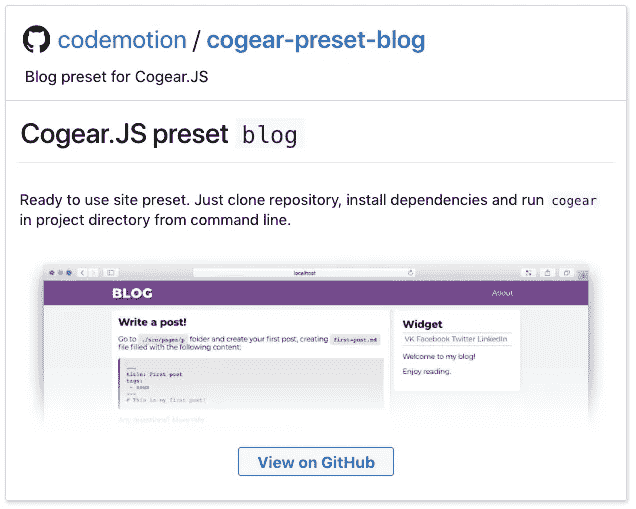
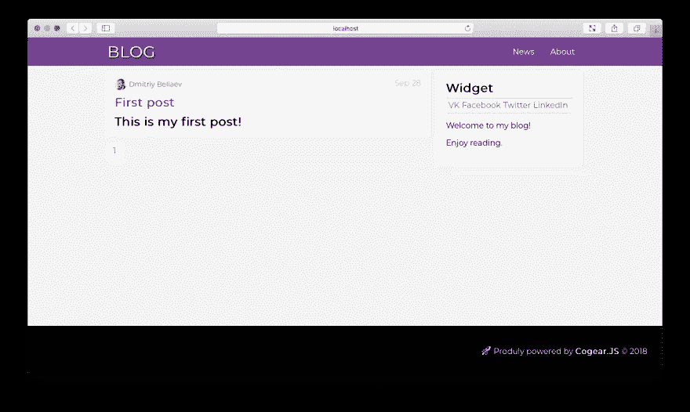

# 如何用 Cogear 建立博客？射流研究…

> 原文：<https://itnext.io/how-to-build-a-blog-with-cogear-js-fd45a6cfbde1?source=collection_archive---------8----------------------->

让我们用 [Cogear 建立一个博客。JS](https://cogearjs.org/) 。

首先可以看一个真实的工作实例:
[https://cogearjs.org/blog](https://cogearjs.org/blog)

# 装置

确保[符合要求](https://cogearjs.org/docs#requirements)。

安装**齿轮。JS** 接下来做:

```
$ npm install -g cogear
# or
$ yarn global add cogear
```

如何安装 Cogear？射流研究…

# 博客制作

我们需要转换成博客默认网站。

这需要两件事:

1.  [博客插件](https://github.com/codemotion/cogear-plugin-blog)。
2.  [博客主题](https://github.com/codemotion/cogear-theme-blog)。

有一种通过内置生成器的标准方法:

```
$ cd ~/Sites
$ cogear new blog
```

但是我已经为你准备了一个预置，包括插件和主题。



[https://github.com/codemotion/cogear-preset-blog](https://github.com/codemotion/cogear-preset-blog)

让我们用预设安装博客。

```
$ git clone --recurse-submodules https://github.com/codemotion/cogear-preset-blog blog
```

现在您需要安装依赖项:

```
$ cd ~/Sites/blog
$ npm install
# of
$ yarn install
```

# 完成的

真的，这就是你要做的。

现在启动**齿轮。JS** 处于开发模式。

```
$ cogear
```

您的博客已准备好:

我已经把结果上传到:
[https://cogear-blog . now . sh](https://cogear-blog.now.sh/)

看看这个。

是时候创建第一个帖子了。

创建包含以下内容的`./src/pages/p/first-post.md`文件:

```
---
title: "First post"
tags:
  - news
---
# This is my first post!
```

干得好。保存它，浏览器页面将自动重新加载。



结果也可以通过链接得到:
[https://cogear-blog-with-post . now . sh](https://cogear-blog-with-post.now.sh/)

为什么博客选择了`p`文件夹？

定制这种行为很容易。

由此编辑`./config.yaml`文件

```
title: Blog | Cogear.JS – modern static websites generator
description:
keywords:
theme: blog
blog:
  index: ""
  regex: "^p/"
  tagUri: 'tag'
  perPage: 5
pages:
  ^p/:
    layout: post
    author:
      login: Dmitriy Beliaev
      avatar: 'https://www.gravatar.com/avatar/400caf343d3bab57ab93f63e21a12be7?s=24'
      link: [https://cogearjs.org](https://cogearjs.org)
```

对此

```
title: Blog | Cogear.JS – modern static websites generator
description:
keywords:
theme: blog
blog:
  index: ""
  regex: "^blog/"
  tagUri: 'tag'
  perPage: 5
pages:
  ^blog/:
    layout: post
    author:
      login: Dmitriy Beliaev
      avatar: 'https://www.gravatar.com/avatar/400caf343d3bab57ab93f63e21a12be7?s=24'
      link: [https://cogearjs.org](https://cogearjs.org)
```

并将文件夹`./src/pages/p`重命名为`./src/pages/blog`。

以下视频中关于配置文件的更多信息:

不客气！

附:一堆有用的资源:

[](https://cogearjs.org) [## 齿轮。JS -现代静态网站生成器

### 齿轮。JS -现代静态网站生成器

齿轮。JS -现代静态网站 generatorcogearjs.org](https://cogearjs.org) [](https://github.com/codemotion/awesome-cogear) [## codemotion/awesome-cogear

### 最佳插件、主题等列表。通过在…上创建帐户，为 codemotion/awesome-cogear 开发做出贡献

github.com](https://github.com/codemotion/awesome-cogear) [](https://github.com/codemotion/cogear.js) [## codemotion/cogear.js

### 现代静态网站生成器(Node.JS/Webpack)-code motion/cogear . js

github.com](https://github.com/codemotion/cogear.js) 

齿轮。JS 也有带教程的 YouTube 频道。不要忘记订阅它，不要错过新的系列！