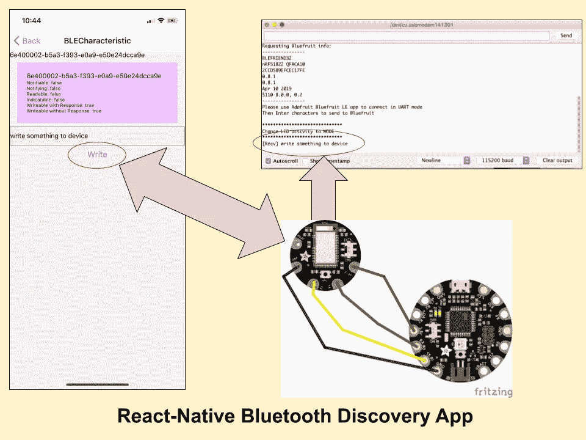
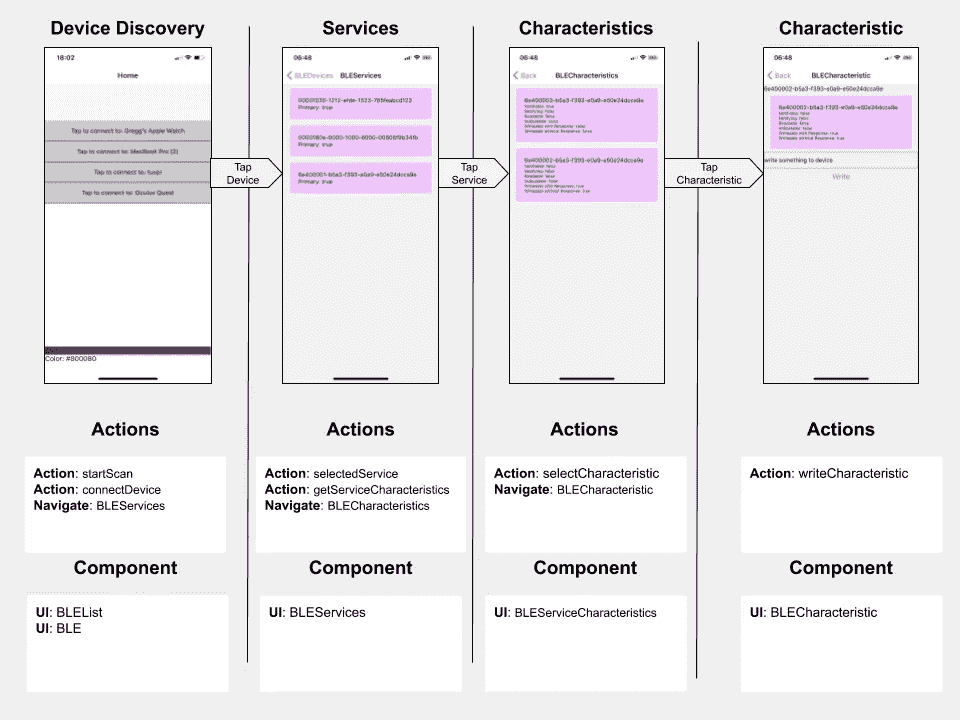
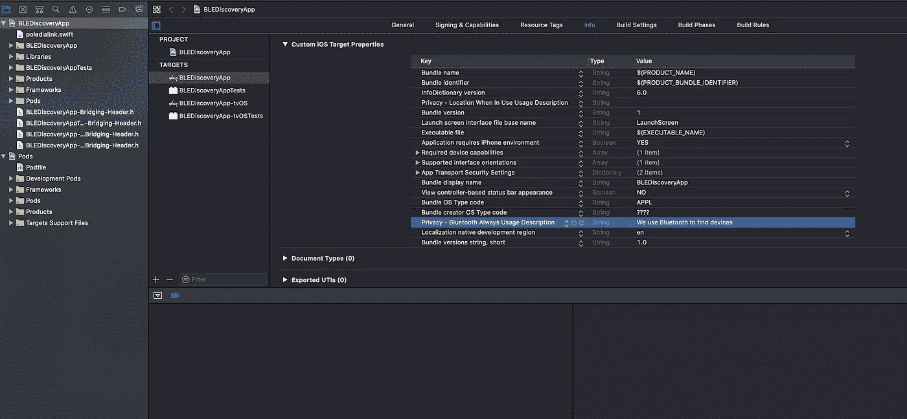
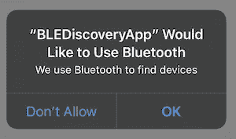
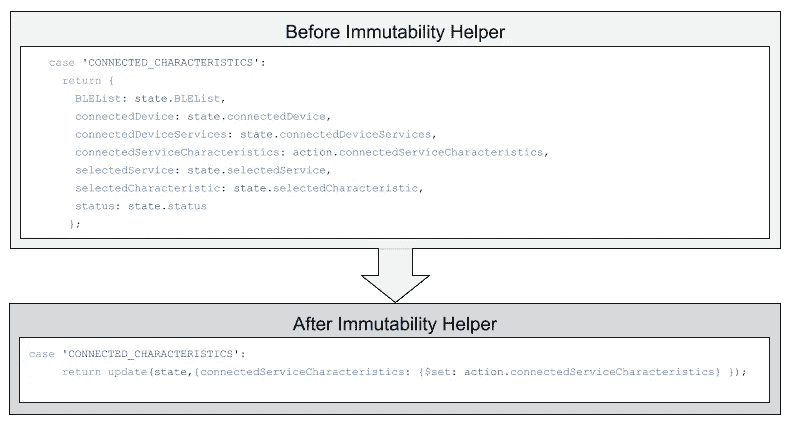
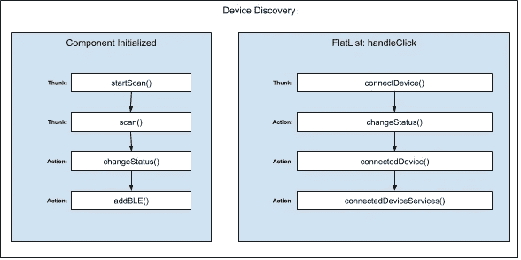

# 如何使用 react native 构建蓝牙低能耗扫描仪

> 原文：<https://itnext.io/how-to-build-a-bluetooth-low-energy-scanner-using-react-native-4e30bf877d7?source=collection_archive---------0----------------------->

本文探讨了如何创建一个基于 Polidea 的 react-native 蓝牙低能耗库的 react 原生应用程序。该应用程序可以发现蓝牙设备，查询它们的服务，确定每个服务的特征，并与读写特征进行交互。我的目标是帮助您了解如何与预配置的蓝牙低能耗(BLE)设备进行交互。为了演示这一功能，应用程序将使用标准 Nordic UART RX/TX 连接模式编写一个文本字符串。



我使用的是兼容 Arduino 的 Adafruit Flora 平台和专为可穿戴设备定制的 bluefruit LE add on。这个应用大致基于[AdaFruit iOS blue fruit _ LE _ Connect](https://github.com/adafruit/Bluefruit_LE_Connect_v2)应用，我用它来了解他们是如何实现 UART 传输功能的。我试图尽可能详细地让你理解扫描蓝牙设备和服务的概念。我有一个我在文章结尾写的源代码的链接，我确实建议你下载代码并尝试一下，以及调试它，无论你选择什么，我更喜欢使用 [react 本机调试器](https://github.com/jhen0409/react-native-debugger)。本文假设您已经在没有使用 Expo 的情况下构建了一个 react 原生应用程序，并且已经完成了在手机上安装它的步骤。如果这是您第一次使用 react 原生应用程序或者尝试学习 redux，您可能会感到沮丧。

这里展示的流程是与大多数 BLE 设备通信的标准方式:首先搜索设备，然后连接到设备并确定其服务，选择一个服务来确定特征，然后与特定特征进行交互。虽然没有明确作为标准包括在内，但从微控制器的角度来看，Nordic UART 服务已经变得非常普遍，因为假设您可以使用 Arduino 或 Raspberry Pi 等 IDE 对您的设备进行编程，您可以使用它来发送文本字符串形式的命令，这些文本字符串可以在您的设备上轻松翻译并可用于执行功能。Adafruit 应用程序在其控制器中使用这一点，例如改变 LED 的颜色。应用程序会发送一个字符串，如“！C00FF00 用于表示命令，接下来的值被解释为用于改变颜色的十六进制值。这是设备上的一段代码:

这个应用程序基于我在以前文章中的工作，所以它使用了类似的架构:我们将使用 Polidea 的 [React Native BLE PLX](https://github.com/Polidea/react-native-ble-plx) 作为库来执行所有蓝牙通信， [Redux](https://redux.js.org/) 用于状态管理， [Redux Thunk](https://github.com/reduxjs/redux-thunk) 用于控制蓝牙管理器和设备并与之交互， [Native Base](https://nativebase.io/) 用于 UI 元素， [React Native Flat List](https://facebook.github.io/react-native/docs/flatlist) 用于显示 BLE 设备、服务和特性的列表， [活动指示器](https://facebook.github.io/react-native/docs/activityindicator)在我们查询蓝牙设备时显示一个微调器，以及[反应导航](https://reactnavigation.org/)用于管理应用程序屏幕。 我还擅自改进了以前代码的某些方面:我将 react-navigation 库更新到了最新版本，我使用了不变性助手来降低我的 reducer 的复杂性，我添加了一个数据活动 UI 组件，用于在与蓝牙设备通信时显示一个旋转的轮子。

该应用的基本流程如下图所示:



# iOS 上的蓝牙

开发一个蓝牙 app，你将无法使用 Expo，也无法在电脑上使用模拟器。我在以前的文章中概述了这些步骤，请阅读“[如何与 React Native](/using-a-raspberry-pi-to-control-leds-part-iii-react-native-app-29ee3f4afb8c) 蓝牙”一节来了解所需的步骤。我想为 iOS 开发概述的另一个步骤是，您需要在 Xcode 中修改您的 info.plist，以允许用户接受您的应用程序使用蓝牙。否则，在运行应用程序时会出现以下错误:

```
**BLEDiscoveryApp[21467:5688265] [access] This app has crashed because it attempted to access privacy-sensitive data without a usage description.  The app's Info.plist must contain an NSBluetoothAlwaysUsageDescription key with a string value explaining to the user how the app uses this data.**
```



为此，请在 Xcode 中打开您的工作区。在项目浏览器中，单击位于顶部的项目，然后选择您正在构建的目标应用程序。完成后，点击顶部的信息选项卡。要添加新密钥，请单击要添加新密钥的项目旁边的加号。这将在下面添加一个新项目。你可以滚动到隐私部分，也可以剪切粘贴“nsbluetooth alwaysusagedescription”。当用户第一次启动应用程序时，我选择了“我们使用蓝牙来查找设备”。



# Redux:状态

该应用程序的状态旨在使在 FlatList 组件中显示数据变得简单:应用程序中的每个屏幕都使用一个组件，该组件使用 FlatList 中的数据属性绑定到 redux store 中的一个对象:设备发现屏幕使用 BLEList 对象，服务屏幕使用 connectedDeviceServices 对象，特征屏幕使用 connectedServiceCharacteristics。

除了填充每个屏幕上的列表之外，我还使用 store 来保存关于用户选择的设备、服务和特性的信息。这是与设备和底层服务正确通信所必需的。为此，当用户点击列表中的设备、服务和特性时，我会将它们分别存储为 connectedDevice、selectedService 和 selectedCharacteristic。

# Redux:减速器

正如我前面提到的，我添加了来自 [Moshe Kolodny](https://github.com/kolodny) 的棒极了的库，叫做[不变性助手](https://github.com/kolodny/immutability-helper)，它极大地简化了我的缩减器。在我之前的应用程序中，我明确地返回了每个 reducer 的整个状态。每当我向存储中添加一个新对象时，这就变得容易出错和麻烦。为了解决这个问题，不变性助手函数允许我修改我的 reducer 中的特定对象，而不必显式地复制每个对象。



因为这个库允许您用一个方法改变 redux 存储的深层副本，所以我可以减少状态对象的数量，但是，为了使事情易于理解，我使用带有$set 参数的 update 函数来改变我的状态和从蓝牙管理器返回的对象。这有点像使用传播函数，但更容易阅读。

还原剂

# Redux:动作

大多数操作都是从一个 thunks 中分派的，用于专门更新状态。为了更容易理解，我的动作的名称与它们正在修改的对象相对应。

行动

# Redux: Thunk

理解应用程序中的思维和动作流可能会变得非常困难。每个组件的基本流程是相同的，所以我将突出显示第一个屏幕中发生的事情，以填充设备列表，我希望这将有助于您理解如何破译其他组件，以及它们各自的 thunks 和操作。



我使用 thunks 来控制我的应用程序与 BLE 设备的通信。每个功能根据应用程序窗口和用户交互执行特定的任务。这使得理解 BLE 需要执行的每个任务变得更加简单，也使得将它们与特定的用户交互联系起来变得更加简单。这些承诺的结果使用上述动作之一存储在 redux 存储中。查看上面的图表，当初始化 BLEList 组件时(调用构造函数)，我调用了 thunk startScan()。

该函数确保您手机的蓝牙处于开机状态，然后调用 scan() thunk，查找您手机范围内的所有设备。如果在扫描设备之前没有检查电源是否打开，将会出现错误。

scan()函数与蓝牙设备管理器交互，以执行 startDeviceScan 函数。我将 redux store 中的状态更改为“scanning”，这是应用程序上的一个可视指示器，每次找到一个设备时，都会调用 addBLE 操作，将找到的设备作为输入。这将调用 ADD_BLE 缩减器，它将设备追加到 BLEList 数组中。将设备添加到阵列后，Flatlist 组件会更新以反映新设备。

应用程序保持在上面列出的状态，直到用户点击他们想要连接的设备。如上面设备发现图的右侧所示，这将启动一个 handleClick 事件，该事件开始操作，使设备管理器连接到设备，更新存储中的设备对象，发现设备中的服务集，最后用提供的服务更新存储。

屏幕和组件遵循与我上面描述的 BLE 列表流相似的模式。例如，当用户选择一个服务时，在服务屏幕上触发一个 handleClick 事件，该事件将用户导航到特征组件，该组件调用“getServiceCharacteristics。这告诉 Bluetooth 设备管理器为连接的设备查找服务，然后调用“connectedServiceCharacteristics”操作，该操作调用“CONNECTED _ CHARACTERISTICS”缩减器，最后更新存储。

# 与特征交互

到目前为止，我所描述的代码应该可以在手机连接范围内的任何蓝牙设备上运行。我很惊讶有这么多设备，尤其是在你家里！我发现我的电动牙刷竟然还有蓝牙！既然我们正在研究与特定特征的实际交互，那么你就要自己学习如何与你的特定设备进行交互。如果这些设备遵循任何标准化的 GATT 服务定义，你应该能够编写或找到一些代码来使用它们。我写这个应用程序的目标是与基于 Arduino 的蓝牙设备通信，并能够向它们发送特殊命令来帮助我完成项目，这些项目主要是关于[可穿戴设备和 led](https://www.linkedin.com/pulse/my-bluetooth-enabled-led-tuxedo-gregg-larson/)。

为了演示这种能力，我想指出的最后一个函数是“write character istic”thunk，它执行向连接的设备发送数据的工作。此功能可能需要根据您正在通信的设备进行调整:我正在使用基于 Arduino 的蓝牙连接，一些设置(如 packetsize)已写入 Arduino 代码。如果看不到结果，您可以尝试将该数字调整为较小的值。这个函数接收一个 ASCII 字符串，将其转换成一个 uint8 数组，然后将数据作为 20 字节的数据包进行传输，直到所有信息都发送完毕。为了实现这一点，我使用了名为“writecharacteringwithouttresponseforservice”的蓝牙功能，该功能允许在设备没有响应的情况下发送数据包。Arduino 设备正在寻找“\n”或字符代码(10)来表示字符串的结束。我在 handleClick 事件中追加了这个值:

# 助手功能

我使用了几个函数来帮助通过蓝牙传输字符串。第一个是将字符串转换为 uint8array 的函数:

第二个功能是在传输结束时添加一个循环冗余校验(CRC)字节，用于确保数据包正确到达设备。像这样通过蓝牙传输数据可能会有问题，因此在传输结束时包含一个 CRC 值是一个很好的做法，您的设备可以使用它来确保成功传输。我没有使用它，因为我使用的 Arduino 代码不需要它。

# 反应导航

与我之前的代码相比，另一个改进是我将 react-navigation 库升级到了最新版本，这简化了一些事情，并认为我应该突出这些变化。大部分的改动都是在 [app.js](https://github.com/momolarson/BLEServiceDiscovery/blob/master/App.js) 中处理的。我们现在导入新的库并创建一个 StackNavigator，并返回一个导航容器，该容器使用一堆用于导航的屏幕。

组件之间最大的区别是移除了 withNavigation 包装。导航栈包含在 redux store 中，您可以简单地调用导航函数，并将上面定义的一个屏幕的名称传递给它。

# UI 组件

显示设备、服务和特性列表的 UI 组件都依赖于一个 Flatlist 和一个处于 redux 状态的数组，所以我将突出显示其中一个，其他的组件可以查看代码来找出每个组件的细节。

**黑名单**

我还想强调一下用于确定特征是读还是写的组件，我将向您展示用于向设备写入数据的 UI。

**数据活动指示器**

FlatList 组件的一个很好的特性是能够附加另一个组件，当没有要显示的项目时，这个组件就会显示出来。使用[“ListEmptyComponent”属性](https://reactnative.dev/docs/flatlist#listemptycomponent)，我创建了一个特殊的组件，它使用了 [React 本机活动指示器](https://reactnative.dev/docs/activityindicator)，这是一个旋转的图标，当应用程序搜索设备、服务和特性时会显示出来。这有助于给用户一些关于正在发生什么的反馈，这比空白屏幕好得多。

# 摘要

我开发这个应用程序的动机是帮助我更好地理解蓝牙通信，而不是专注于控制设备执行特定任务的特定问题集。实际上，如果您知道您正在使用的设备、服务和特征，您就不需要特意要求用户交互来完成每个步骤。也就是说，需要使用设备管理器执行发现操作，以便它能够理解如何通信，因此，您需要以编程方式执行每个步骤，以免出错。如果您不这样做，设备管理器会抱怨服务或特性不存在，即使您知道它们存在。

# 密码

[](https://github.com/momolarson/BLEServiceDiscovery) [## momolarson/BLEServiceDiscovery

### 通过在 GitHub 上创建帐户，为 momolarson/BLEServiceDiscovery 开发做出贡献。

github.com](https://github.com/momolarson/BLEServiceDiscovery) 

# 关于我

[](https://www.linkedin.com/in/gregglarson/) [## Gregg Larson -软件开发副总裁- Concept3D Inc. | LinkedIn

### 我的职业生涯一直致力于帮助初创公司成长为盈利的公司，我有一个成功的记录…

www.linkedin.com](https://www.linkedin.com/in/gregglarson/) 

# 了解更多信息

了解循环冗余校验:

[](https://en.wikipedia.org/wiki/Cyclic_redundancy_check) [## 循环冗余校验

### 循环冗余校验(CRC)是一种错误检测代码，通常用于数字网络和存储设备中，以…

en.wikipedia.org](https://en.wikipedia.org/wiki/Cyclic_redundancy_check)