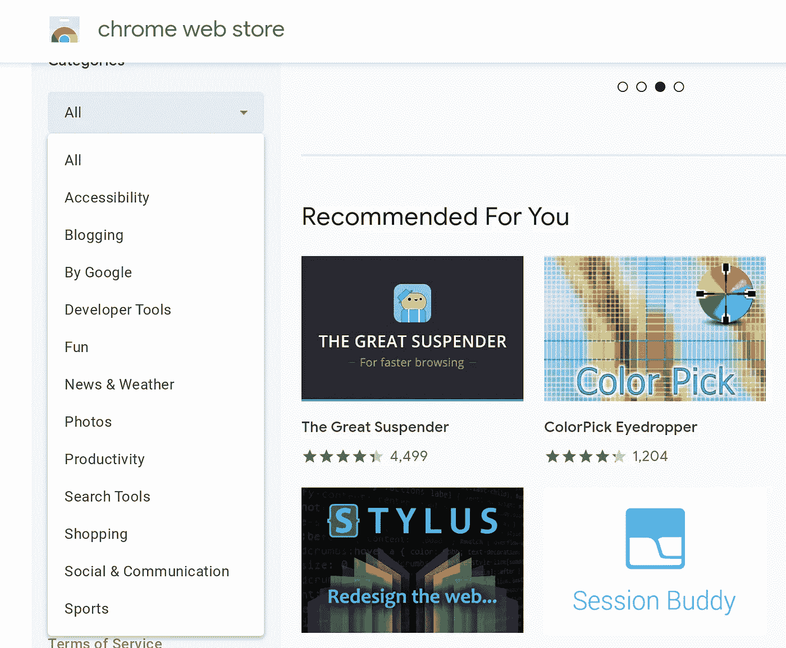
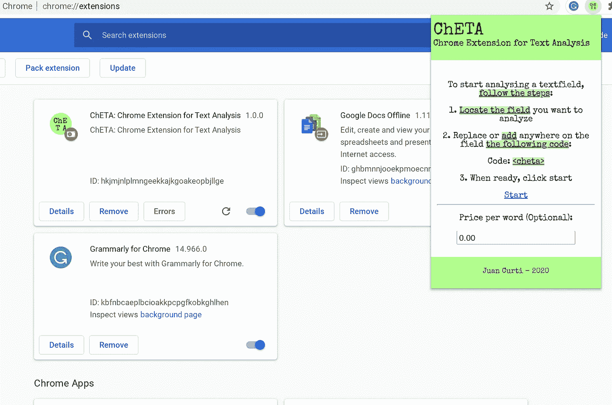
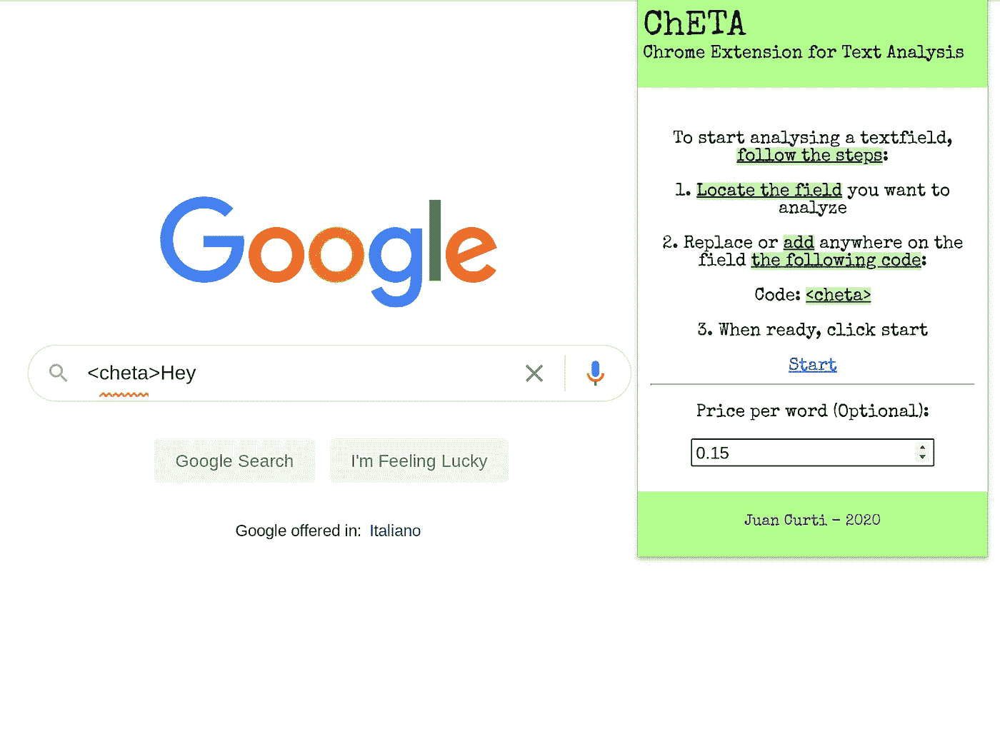
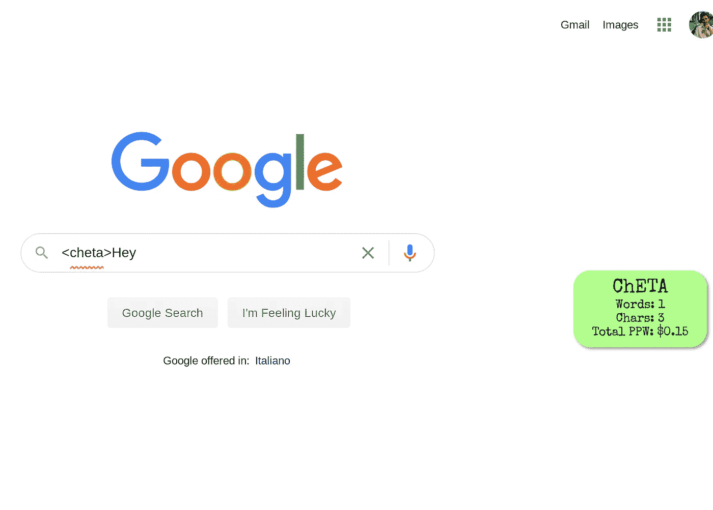
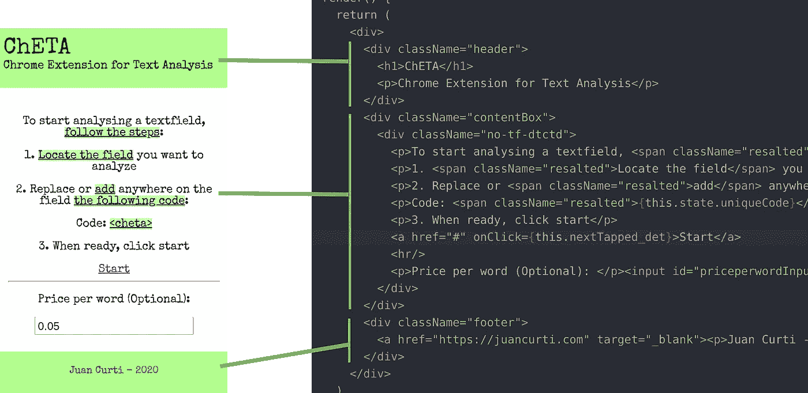
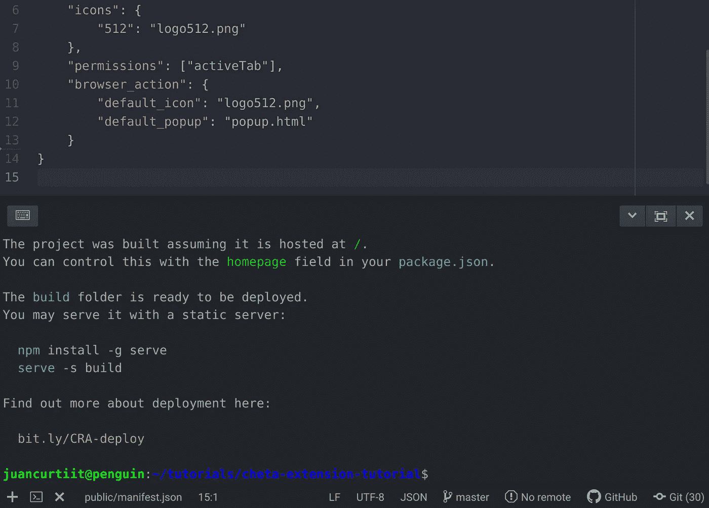
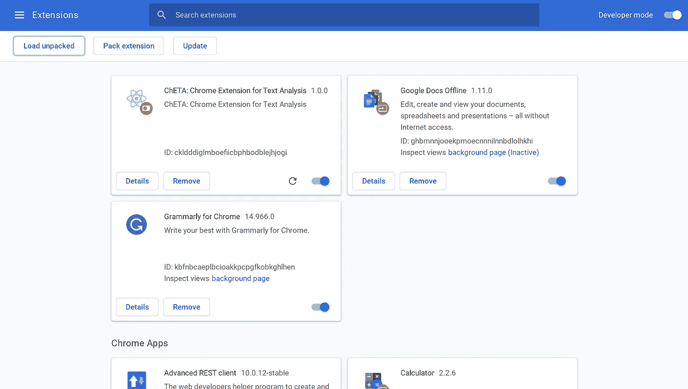
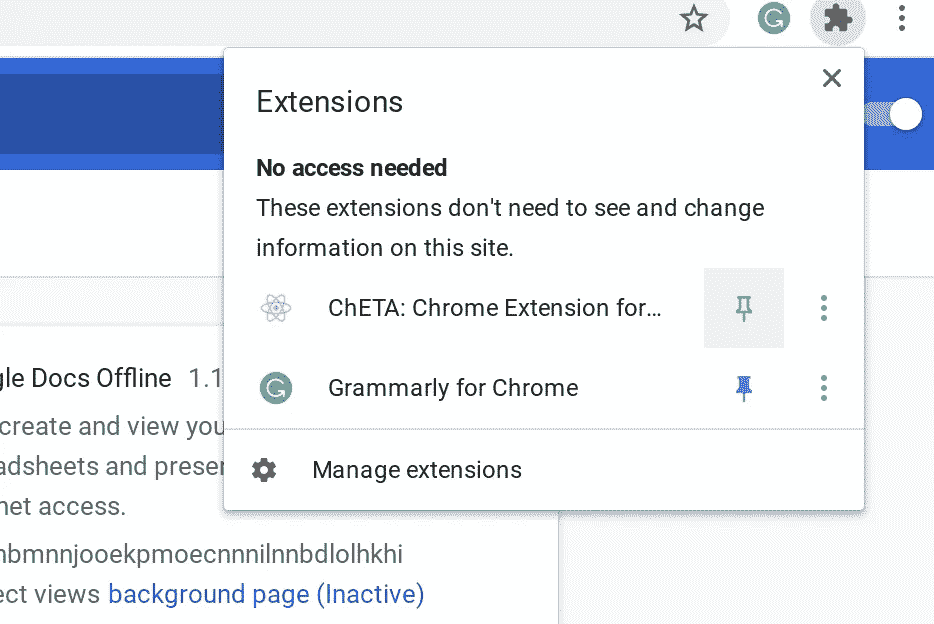
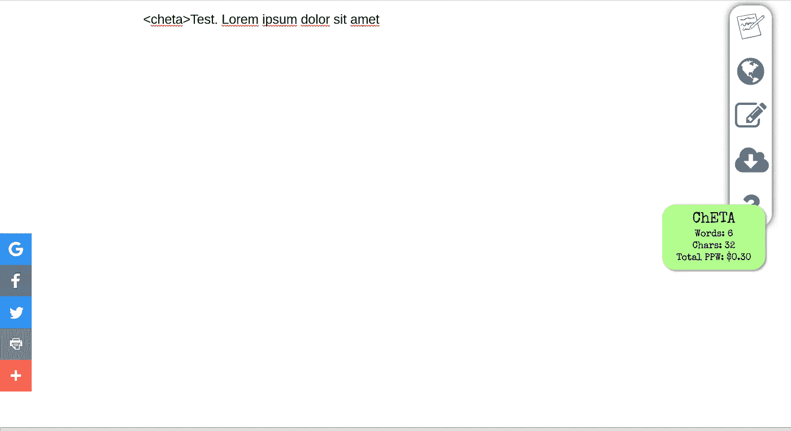

# 如何构建一个 Chrome 扩展来分析你写的文本

> 原文：<https://itnext.io/how-to-build-a-chrome-extension-to-analyze-text-as-you-write-a1c0ab1923f9?source=collection_archive---------0----------------------->

构建你自己的 chrome 扩展来计算你写作时的字数、字符数和每字价格


[安德鲁·尼尔](https://unsplash.com/@andrewtneel?utm_source=medium&utm_medium=referral)在 [Unsplash](https://unsplash.com?utm_source=medium&utm_medium=referral) 上拍照

# 介绍

不久前，我开始在 Medium 上写作，作为兼职，与我的自由职业交替进行。不是英语母语的人，我发现使用 chrome 扩展像 Grammarly 真的很有帮助。(如果你还不知道，这是一个数字写作工具，它使用人工智能和自然语言处理来帮助进行语法检查、拼写检查、抄袭检测以及关于清晰度、正式程度、语气和词汇的建议)。无论如何，我没有使用它的所有功能，因为它有不同的计划(免费，个人高级和商业高级)，或者至少我没有必要使用这些功能。所以我想开发自己的 chrome 扩展，只实现我需要的功能，以便了解这项技术提供的可能性。

然而，扩展并不仅仅针对谷歌浏览器。其他流行的浏览器如 Microsoft Edge 和 Mozilla Firefox 也支持扩展，但扩展对每个人来说都是一样的:它们是使用 HTML、CSS 和 JavaScript 构建的小应用程序，以特定的方式与配置文件打包在一起。
他们需要遵循 [Web 扩展 API 标准](https://developer.mozilla.org/en-US/docs/Mozilla/Add-ons/WebExtensions)，该标准受到基于 Chromium 的浏览器的支持，如谷歌 Chrome、微软 Edge、Mozilla Firefox 和微软 Edge。

## Chrome 扩展是干什么用的？

Chrome 扩展不仅仅用于文本分析。他们可以使用权限与 Chrome 浏览器的标签进行交互，检测 URL 匹配，注入代码(例如 HTML、JavaScript、CSS)，执行 API 调用，等等。
如果我们查看一下 [Chrome 网上商店](https://chrome.google.com/webstore/category/extensions)，我们可以查看所有不同的类别:



Chrome 网上商店的类别

# 我们要建造什么？

我们将建立一个扩展来计算我们输入的文本字段或输入的单词和字符，并计算你将获得的钱总数(例如，为自由撰稿人)设置每个单词的价格(PPW)。我们将称之为 **ChETA** ，代表**Ch**Rome**E**extension 代表**T**ext**A**analysis，在我的祖国阿根廷，这意味着酷/棒。

当从 Extensions 选项卡打开时，我们的扩展将如下所示:



我们将要求用户找到他想要使用的输入。然后，他需要在上面写下 *< cheta >* (在输入的任何地方添加或替换内容，都一样)并点击开始。可选地，他将能够设定每个词的价格( **PPW** 从现在开始)。

例如，在谷歌的输入上:



预览:在 ChETA 上单击开始之前

单击“开始”时，我们将在页面 HTML 代码中注入我们需要的内容，开始使用浮动容器监听输入的变化:



预览:点击 ChETA 上的开始后

# 扩展架构

扩展由相互交互的不同组件组成。组件可以包括**后台脚本**、**内容脚本**、一个**选项页面**、 **UI 元素**以及各种**逻辑文件**。扩展组件是用 web 开发技术创建的:HTML、CSS 和 JavaScript。扩展的组件将取决于它的功能，可能不需要每个选项。

1.  manifest.json:描述源包中的内容。它定义了浏览器可以在哪里找到背景、内容脚本、弹出窗口和选项页面。它还描述了扩展所需的权限(例如，允许扩展检查所有选项卡、仅检查当前选项卡、使用存储等)
2.  background.js:当扩展启动时启动的一个脚本或一段代码，直到扩展被移除或浏览器关闭时才会终止。这个文件可以访问所有 chrome APIs，其他部分仅限于此。这个脚本不包含 UI，并且不能访问 DOM。
3.  popup.html:当用户点击“浏览器操作”时显示的用户界面，这是浏览器地址栏右侧的按钮，扩展位于该按钮上。大多数扩展需要一个弹出窗口作为入口，但是它们也可以被开发成在页面上右击来调用。
4.  选项:它是扩展的可选部分，不是所有的扩展都包括它。它被用作扩展的配置 UI，以便启用多个视图。
5.  内容脚本:在具有特定 URL 模式的选项卡中运行的脚本或代码片段，在 manifest.json 中定义。如果 URL 与清单描述匹配，浏览器将启动内容脚本。当 URL 更改或选项卡关闭时，它将被终止。需要它来操作 DOM。
    当我们需要在 web 流的特定 URL 或特定实例上启动我们的脚本时，URL 匹配会很有用。

对于本教程，我们将使用 React.js 来构建扩展。源代码可以在 Github([https://github.com/juancurti/cheta-extension](https://github.com/juancurti/cheta-extension))上找到。

# 让我们建立扩展

首先，我们将创建 react 应用程序，并删除我们不会使用的不必要文件:

```
npx create-react-app cheta-extension
cd cheta-extension/
cd src/
rm -rf setupTests.js serviceWorker.js logo.svg index.css App.test.js App.js App.css
```

我们将安装 node-sass，这不是强制性的，但它将帮助我们编写更快的 CSS 代码:

```
npm i node-sass — save
```

现在，我们将替换位于与 React.js 相关的 **public/** 文件夹中的 manifest.json，用于对应于上面解释的 **manifest.json** 概念的以下代码:

```
{
 “name”: “ChETA: Chrome Extension for Text Analysis”,
 “version”: “1.0.0”,
 “manifest_version”: 2,
 “description”: “ChETA: Chrome Extension for Text Analysis”,
 “icons”: {
 “512”: “logo512.png”
 },
 “permissions”: [“activeTab”],
 “browser_action”: {
 “default_icon”: “logo512.png”,
 “default_popup”: “popup.html”
 }
}
```

***注:logo512.png 文件可以在资源库上找到:*** [***链接此处***](https://github.com/juancurti/cheta-extension/blob/master/cheta-extension/public/logo512.png)

如前所述，Chrome 扩展的起始点应该是一个 popup.html，所以我们将创建一个构建脚本，将 React build 生成的 index.html 重命名为 popup.html。
我们将添加一个新文件: **script/build.sh** ，内容如下:

```
#!/bin/bashbuild() {
 echo ‘building react’rm -rf dist/*export INLINE_RUNTIME_CHUNK=false
 export GENERATE_SOURCEMAP=falsereact-scripts buildmkdir -p dist
 cp -r build/* distmv dist/index.html dist/popup.html
}build
```

## 重要的是要知道！

INLINE_RUNTIME_CHUNK 设置为 false 是为了禁用 HTML 中的 webpack 内联 JavaScript 生成，因为通常它会将自己的运行时放入脚本中，这是浏览器扩展标准所不允许的。

我们需要使用以下命令向脚本添加权限:

```
chmod +x script/build.sh
```

最后，我们需要修改我们的 **package.json** 文件，开始用我们的脚本而不是 react-scripts 构建。替换以下内容的构建脚本:

```
"scripts": {
    "build": "./script/build.sh"
},
```

# 使用用户界面

如前所述，我们将使用 node-sass 而不是简单的 CSS，只是为了在本教程中少写几行。创建一个新文件 **src/styles/styles.scss** ，内容如下:

```
[@import](http://twitter.com/import) url('[https://fonts.googleapis.com/css2?family=Special+Elite&display=swap'](https://fonts.googleapis.com/css2?family=Special+Elite&display=swap'));
html{
  width:100%;
}
body{
  margin: 0px;
  height: 400px;
  width: 280px;
  font-family: 'Special Elite', sans-serif;
  background: white;.header {
    width: 280px;
    height: 50px;
    margin: 0px;
    background-color: #B0FF8B;
    padding: 12px 0px;h1 {
      font-family: 'Special Elite';
      font-size: 28px;
      opacity: 0.9;
      margin: 0px 4px 0px 4px;
      font-weight: 500;
    }p {
      margin: 0px 4px;
      font-family: 'Special Elite';
      font-weight: 400;
      font-size: 14px;
    }input, #priceperwordInput {
      text-align: center;
      font-family: 'Special Elite';
      font-weight: 400;
      font-size: 14px;
    }#priceperwordInput {
      width: 80px;
    }
  }.footer {
    width: 280px;
    height: 40px;
    margin: 0px;
    background-color: #B0FF8B;
    padding: 6px 0px;
    text-align: center;a {
      text-decoration: none;
    }
  }.contentBox {
    width: 280px;
    height: 310px;.resalted {
      background-color: rgba(176, 255, 139, 0.7);
      text-decoration: underline;
    }.no-tf-dtctd {
      margin: 0 10px;
      text-align: center;
      font-size: 14px;
      position: relative;
      top: 50%;
      transform: translateY(-50%);a {
        text-align: right;
      }
    }
  }
}
```

现在让我们清理我们的 **index.js** 文件，并为我们的扩展设置一个入口点:

```
import React from 'react';
import ReactDOM from 'react-dom';
import './styles/styles.scss';
import Home from './Home';ReactDOM.render(
  <React.StrictMode>
    <Home />
  </React.StrictMode>,
  document.getElementById('root')
);
```

现在让我们创建我们的组件。我们需要在文件的顶部添加/* global chrome*/，以防止 ESLint 将其检测为错误。使用以下格式创建 **src/Home.js** :

```
/*global chrome*/
import React, { Component } from 'react';class Home extends Component {}export default Home;
```

我们现在将添加一个构造函数。我们要使用的变量基本上有两个:

1.  uniqueCode:这将是用户需要键入的字符串，以便检测工作输入。在状态中有这个变量，让我们可以根据自己的需要去摆弄它；例如，如果我们想制作这个应用程序的付费版本，这个代码可以在 30 分钟内有效，然后用户需要充值他的帐户才能继续使用它。
2.  输入:有了这个映射，我们将负责 React 应用程序的输入。我使用一个地图，而不是一个变量，以便在需要其他文本字段的情况下能够放大。

```
constructor(props){
    super(props);
    this.state = {
      uniqueCode: `<cheta>`,
      inputs: {
        priceperword: '0.05'
      }
    }
  }
```

此外，我们需要添加一个 helper 函数来检测输入变化(在我们的 chrome 扩展中，而不是在 DOM 中),以更新我们的 price per word 变量。

```
handleInputChange = event => {
    const { name, value } = event.target;
    var inputs = this.state.inputs;
    inputs[name] = value;
    this.setState({
      inputs: inputs
    })
  }
```

现在我们将添加 **render()** 方法，这个方法大部分是 HTML。我们已经添加了样式(用。scss 文件)，现在我们将添加如下图所示的结构:



ChETA 用户界面示意图

可以从这里复制粘贴，这样会更快:

```
render() {
    return (
      <div>
        <div className="header">
          <h1>ChETA</h1>
          <p>Chrome Extension for Text Analysis</p>
        </div>
        <div className="contentBox">
          <div className="no-tf-dtctd">
            <p>To start analysing a textfield, <span className="resalted">follow the steps</span>:</p>
            <p>1\. <span className="resalted">Locate the field</span> you want to analyze</p>
            <p>2\. Replace or <span className="resalted">add</span> anywhere on the field <span className="resalted">the following code</span>:</p>
            <p>Code: <span className="resalted">{this.state.uniqueCode}</span></p>
            <p>3\. When ready, click start</p>
            <a href="#" onClick={this.nextTapped_det}>Start</a>
            <hr/>
            <p>Price per word (Optional): </p><input id="priceperwordInput" name="priceperword" value={this.state.inputs.priceperword} onChange={this.handleInputChange} type="number" step="0.01"/>
          </div>
        </div>
        <div className="footer">
          <a href="[https://juancurti.com](https://juancurti.com)" target="_blank"><p>Juan Curti - 2020</p></a>
        </div>
      </div>
    )
  };
```

这里的最后一件事，我们需要添加我们的 **nextTapped_det** 方法，当按下开始按钮时会调用该方法。在这里，我们将做几件事:

1.  声明一个配置映射，它将被发送到目标 DOM。如果我们想将动态数据从我们的扩展发送到 DOM，这真的很重要。在这个映射中，我们将添加我们的脚本将尝试查找的唯一代码和每个单词的价格，前提是它高于 0.00；如果不是，那么我们不会显示每字计数器的价格，因为它总是为零。
2.  然后我们声明一个 CSS 文件来注入。我们还使用@import 方法发送自定义字体。利用 **chrome API** ，我们使用 **insertCSS** 方法来注入它。
3.  执行我们稍后将编写的自定义脚本，但只能在声明我们的配置变量之后。

**nextTapped_det** 方法的代码如下

```
nextTapped_det = () => {
    var config = {
      code: this.state.uniqueCode
    };if(this.state.inputs.priceperword > 0) {
      config['priceperword'] = this.state.inputs.priceperword;
    }var css = "[@import](http://twitter.com/import) url('[https://fonts.googleapis.com/css2?family=Special+Elite&display=swap'](https://fonts.googleapis.com/css2?family=Special+Elite&display=swap')); #cheta-flt-dv { padding: 8px; z-index: 999; position: fixed; width: 140px; bottom: 40%; right: 40px; background-color: #B0FF8B; color: black; border-radius: 20px; text-align: center; box-shadow: 2px 2px 3px #999; } .cheta-flt-p { margin: 2px; font-family: 'Special Elite'; font-size: 22px; } .cheta-pfnt { margin: 2px; font-family: 'Special Elite'; font-size: 14px; }";
    chrome.tabs.insertCSS({code: css});chrome.tabs.executeScript({
      code: 'var config = ' + JSON.stringify(config)
    }, function() {
      chrome.tabs.executeScript({
        file: 'chetalib/chetalib.js'
      });
    })}
```

# 最后一步:实时分析

最后，我们需要添加脚本来检测输入，监听变化，并开始分析文本。如果没有包含我们正在寻找的代码的文本字段，我们将终止脚本。此外，我们将利用一个助手函数来检测输入和文本区域，这是最常见的场景。

让我们在 src/之外的 **public** 文件夹 **chetalib/chetalib.js** 中创建如下内容:

```
function init() {
  console.log("Initializing ChETA");
  var link = document.createElement('link');
  link.setAttribute('rel', 'stylesheet');
  link.setAttribute('type', 'text/css');
  link.setAttribute('href', '[https://fonts.googleapis.com/css2?family=Special+Elite&display=swap'](https://fonts.googleapis.com/css2?family=Special+Elite&display=swap'));
  document.head.appendChild(link);if(!config.code) {
    console.log("Error loading ChETA: Unique code not found")
    return;
  }
  var inputs = getInputsByValue(config.code);
  if(inputs.length == 0) {
    console.log("Error loading ChETA: Input not found")
    return;
  }
  var text = inputs[0].value.split(config.code).reverse()[0];
  // alert(text)
  inputs[0].value = inputs[0].value;
  inputs[0].addEventListener('input', (e) => {
    var inputs = getInputsByValue(config.code);
    if(inputs.length == 0) {
      console.log("Error loading ChETA: Input not found");
      return;
    }
    var text = inputs[0].value.split(config.code).reverse()[0];
    var wordCountSpan = document.getElementById("cheta-data-wordcount");
    wordCountSpan.textContent = ""+text.split(" ").length;var charCountSpan = document.getElementById("cheta-data-charcount");
    charCountSpan.textContent = ""+text.length;if(config.priceperword) {
      var pricePerWord = document.getElementById("cheta-data-priceperword");
      var priceVal = text.split(" ").length * config.priceperword;
      pricePerWord.textContent = ""+priceVal.toFixed(2);
    }
  });
  const div = document.createElement('div');
  var finalHTML = '<div id="cheta-flt-dv"><p class="cheta-flt-p">ChETA</p>';
  finalHTML += '<p class="cheta-pfnt">Words: <span id="cheta-data-wordcount">'+text.split(" ").length+'</span></p>';
  finalHTML += '<p class="cheta-pfnt">Chars: <span id="cheta-data-charcount">'+text.length+'</span></p>';
  if(config.priceperword) {
    var priceVal = text.split(" ").length * config.priceperword;
    finalHTML += '<p class="cheta-pfnt">Total PPW: $<span id="cheta-data-priceperword">'+priceVal.toFixed(2)+'</span></p>';
  }
  finalHTML += '</div>';
  div.innerHTML = finalHTML;
  document.body.appendChild(div);
}function getInputsByValue(value)
{
    var allInputs = document.getElementsByTagName("input");
    var results = [];
    for(var x=0;x<allInputs.length;x++)
        if(allInputs[x].value.includes(value))
            results.push(allInputs[x]);var allTextArea = document.getElementsByTagName("textarea");
    for(var x=0;x<allTextArea.length;x++)
        if(allTextArea[x].value.includes(value))
            results.push(allTextArea[x]);return results;
}init();
```

# 测试您的新扩展

现在我们完成了，让我们测试我们的扩展。首先，我们需要构建我们的项目，我们将生成 dist/ folder。为此，让我们运行我们的项目文件夹:

```
npm run build
```

如果一切顺利，我们应该在命令行中看到这条消息:



npm 运行构建的结果— ChETA

我们现在打开谷歌 Chrome，进入 chrome://extensions。在屏幕的右上角，您应该会看到启用开发人员模式的选项。让我们激活它:



在 chrome://extensions 中启用开发者模式

现在你可以上传了！点击 **Load unpacked** 按钮，找到您的 dist/ folder，并加载。最后，和所有扩展一样，你只需要点击这个小按钮就可以看到它:



激活 ChETA 扩展

最后，为了测试它，我们可以去**shrib.com**，激活我们的扩展，看看结果:



我们新的 Chrome 文本分析扩展的结果

# 结论

开发 Chrome 扩展并没有人们想象的那么难。在 JavaScript 中，可能性是无限的。

作为家庭作业，你可以尝试实现情感分析(在我的另一个教程中解释过，[链接此处](https://medium.com/analytics-vidhya/sentiment-analysis-of-restaurant-reviews-542727dc24e2))以检测文本的语气(肯定——否定)，或者实现谷歌视觉 API 来为盲人大声朗读给定网页上图像的文本([在此解释](/convert-paper-based-notes-to-html-content-with-google-vision-api-e398fdb45cb9))。