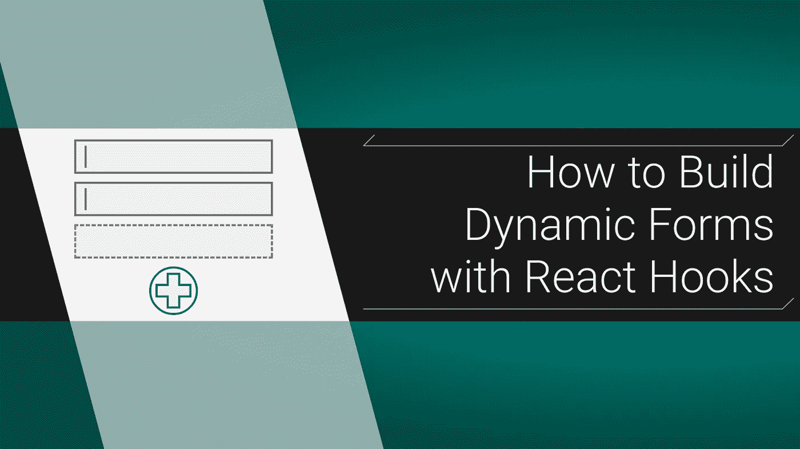
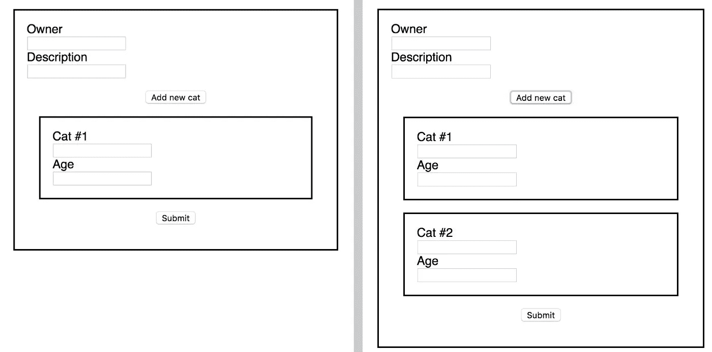
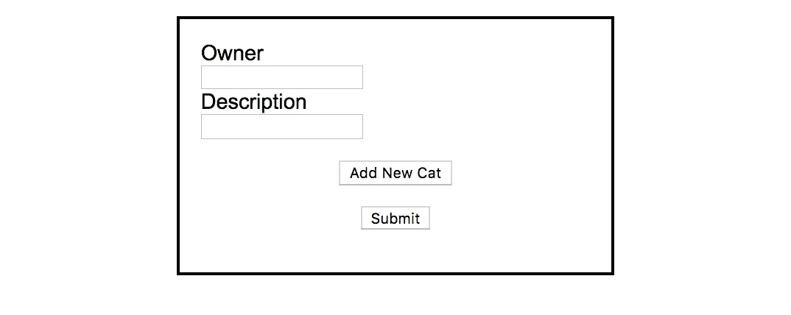
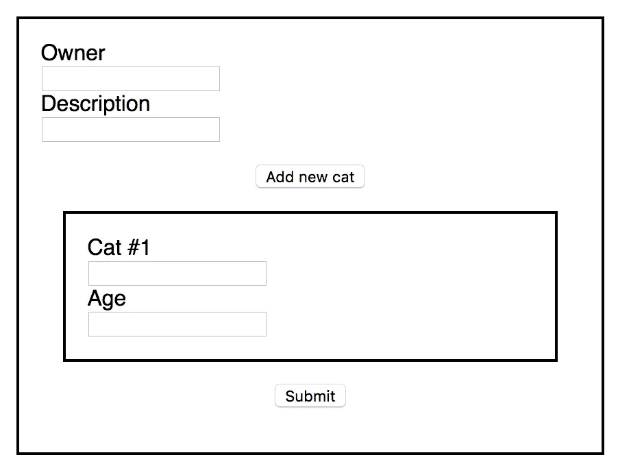

# 如何使用 React 挂钩构建动态的受控表单(2019)

> 原文：<https://itnext.io/how-to-build-a-dynamic-controlled-form-with-react-hooks-2019-b39840f75c4f?source=collection_archive---------0----------------------->

## React 挂钩有助于简化一个棘手的概念



[React](https://reactjs.org) 的新[钩子](https://reactjs.org/docs/hooks-intro.html)使得构建 UI 比以往任何时候都更容易，但是有些东西像 ***动态表单*** 仍然有点难以理解。动态表单是由*用户*决定有多少输入的表单。对于这段代码，我们将有猫主人的名字和简短描述的标准输入，然后动态添加他们的猫。每只新的猫都会有一个名字和年龄，只是为了好玩。



这就是我们今天设计的全部。因为我们使用了新的钩子，我们不会像以前那样使用任何类。我们所有的组件都将是函数，但仍然可以访问状态！如果你不知道新的钩子是什么，我建议你先查看一下[解释](https://reactjs.org/docs/hooks-intro.html)，然后再回来。这段代码是观察`useState`运行的一个很好的方式，但是如果你至少对它有一点熟悉的话会有所帮助。

# 开始制定计划

规划和反应是至关重要的。如果你在开始编码之前*就想好自己想要什么，这会节省你很多时间。我们知道它将会是什么样子，但是它将如何被制造出来呢？我喜欢浏览一个小小的反应清单:*

1.  我需要什么组件？
2.  他们中的哪一个会有状态？
3.  有用户触发的事件吗？

在这种情况下，我觉得最好有一个主`Form`组件，然后是一个呈现动态输入的`CatInputs`组件。至于状态，我们的`Form`组件将需要它，因为我们将控制每个输入。但是我们的`CatInputs`组件不需要状态，因为我们可以将所有东西作为道具传入。

最后，有 2 个事件:我们需要处理对每个输入的更改，我们需要处理添加新输入的按钮。对于本教程，我们不会担心提交操作，因为它是不相关的。提交动态表单与提交常规表单是一样的。

# 攻击顺序

总的来说，我喜欢首先呈现我需要的任何输入，然后开始处理交互性。在这种情况下，我们将呈现静态基础`Form`，然后找出如何呈现新的输入，然后*最后*我们将处理控制它们。我将首先在`Form`组件中构建一切，然后一旦一切正常，我将把适当的部分重构为一个`CatInputs`组件。

# 入门:渲染出来

让我们首先构建表单的非交互部分([要点链接](https://gist.github.com/MostlyFocusedMike/a20061d465adf6140e0ce78846fea98b)):

```
*// /src/Form.js* import **React** from *'react'*; 
const **Form** = () => {    
  return (        
    <**form**>            
      <**label** htmlFor=*"owner"*>Owner</**label**>   
      <**input** type=*"text"* name=*"owner"* id=*"owner"* /> 
      <**label** htmlFor=*"description"*>Description</**label**> 
      <**input** type=*"text"* name=*"description"* id=*"description"* />
      <**input** type=*"button"* value=*"Add New Cat"* />            
      <**input** type=*"submit"* value=*"Submit"* />        
    </**form**>   
  );
}; export default **Form**;
```

这是我们做的([这是*漂亮的*造型](https://gist.github.com/MostlyFocusedMike/94235edc67548361572f4baccf0f31db)):



# 将数组用于动态输入

在我们编码之前，我们应该谈谈我们将如何做这件事。基本上，我们的状态中会有一个 cat 对象数组。每个对象都有一个`name`和`age`值。我们的`Form`将遍历这个列表，并为`name`和`age`创建两个新的输入。当我们单击“添加新猫”按钮时，我们将向数组中添加一个新对象。因为这将改变我们的状态，它将触发重新渲染。然后，我们的表单将迭代这个*新的*猫列表，并添加另一对输入。

首先，让我们只考虑将第一个空白的 cat 对象放入我们的状态。现在，新的钩子来了！记住，我们使用[数组析构](https://developer.mozilla.org/en-US/docs/Web/JavaScript/Reference/Operators/Destructuring_assignment)进行赋值，第一项是我们的状态本身，第二项是我们用来更新它的函数。我们把我们的初始状态作为`useState`的参数。另外，你可以随便叫这些，我只是把“状态”放在最后，因为我喜欢它([要点链接](https://gist.github.com/MostlyFocusedMike/ad5b9a1a4203b8df631b7136e6651f23)):

```
import **React**, { **useState** } from *'react'*; 
const **Form** = () => {  
  const [**catState**, **setCatState**] = **useState**([
    { name: '', age: '' },
  ]); return (        
    <**form**>            
      <**label** htmlFor=*"owner"*>Owner</**label**>   
      <**input** type=*"text"* name=*"owner"* id=*"owner"* /> 
      <**label** htmlFor=*"description"*>Description</**label**> 
      <**input** type=*"text"* name=*"description"* id=*"description"* />
      <**input** type=*"button"* value=*"Add New Cat"* />      
      {
        **catState**.map((*val*, **idx**) => {
          const **catId** = `*name-${***idx***}*`;
          const **ageId** = `*age-${***idx***}*`;
          return (
            <**div** key={`*cat-${***idx***}*`}>
              <**label** htmlFor={**catId**}>{`*Cat #$*{**idx** + 1*}*`}</**label**>
              <**input**
                type=*"text"*
                name={**catId**}
                data-idx={**idx**}
                id={**catId**}
                className="*name*" 
              />
              <**label** htmlFor={**ageId**}>Age</**label**>
              <**input**
                type="*text*"
                name={**ageId**}
                data-idx={**idx**}
                id={**ageId**}
                className="*age*"
              />
            </**div**>
          );      
        })
      }
      <**input** type=*"submit"* value=*"Submit"* />        
    </**form**>   
  );
};export default **Form**;
```



这是一个新的大块，但如果你分解它，它并不复杂。我正在映射来自我的`catState`的猫的数组，并使用映射的索引值为每对输入分配惟一的 id、名称、键和标签。你应该始终包括标签，以确保您的网站是可访问的和屏幕阅读器友好的。这个属性对于以后控制我们的输入是至关重要的。它将把输入与数组中相应的 cat 对象的索引相匹配。

# 添加输入

所以我们使用了一个数组，但它还不是动态的。由于我们的表单正在创建两个新的输入，我们知道迭代方面正在工作。但是为了让它真正动态，我们必须能够让用户添加输入。我们只需要给我们的组件一个方法，向我们的数组添加一个新的空白猫。我们只需要将它添加到我们的`button`类型输入中。类型`button`输入(不是按钮元素)不提交表单，所以我们不需要担心停止提交([要点链接](https://gist.github.com/MostlyFocusedMike/9cb2fff55930ae717f7bb0a392e039e4)):

```
import **React**, { **useState** } from *'react'*; 
const **Form** = () => {  
  const **blankCat** = { name: '', age: '' };
  const [**catState**, **setCatState**] = **useState**([
    {...**blankCat**}
  ]);

  const **addCat** = () => {
    **setCatState**([...**catState**, {...**blankCat**}]);
  }; return (        
    <**form**>            
      <**label** htmlFor=*"owner"*>Owner</**label**>   
      <**input** type=*"text"* name=*"owner"* id=*"owner"* /> 
      <**label** htmlFor=*"description"*>Description</**label**> 
      <**input** type=*"text"* name=*"description"* id=*"description"* />
      <**input** 
         type=*"button"* 
         value=*"Add New Cat"* 
         onClick={addCat}
      />      
      {
        **catState**.map((*val*, **idx**) => {// rest unchanged
```

所有的`addCat`所做的就是用前一个状态的`cats`数组的[展开](https://developer.mozilla.org/en-US/docs/Web/JavaScript/Reference/Operators/Spread_syntax)来设置状态，并在末尾标记一个新的`blankCat`对象。注意，我将起始的 cat 对象重构为一个变量。我用它作为基础来*克隆*对象，如果你不知道这样复制对象为什么重要，[这里有一个对象引用的解释](/javascript-interview-prep-primitive-vs-reference-types-62eef165bec8)。另外，注意我们不需要像`prevState`这样简单的东西。酷吧？挂钩是`FUTURE`。现在，每当我们点击我们的`addCat`按钮，它将添加一只猫到我们的状态，这将触发一个重新渲染，并显示我们新的，用户添加的输入！

# 控制静态输入

现在我们已经完成了输入，让我们来控制它们。首先是简单的部分，非动态输入。我们将通过添加一个单独的所有者状态([要点链接](https://gist.github.com/MostlyFocusedMike/1449f1a7064e5add0e5c8245819190b1))来实现这一点:

```
const **Form** = () => {
  const [**ownerState**, **setOwnerState**] = **useState**({
    owner: '',
    description: '',
  });
  const **handleOwnerChange** = (**e**) => **setOwnerState**({
    ...**ownerState**,
    [**e**.target.name]: [**e**.target.value],
  }); const **blankCat** = { name: '', age: '' };
  const [**catState**, **setCatState**] = **useState**([
    { ...**blankCat },**
  ]);

  const **addCat** = () => {
    **setCatState**([...**catState**, { ...**blankCat** }]);
  }; return (        
    <**form**>            
      <**label** htmlFor=*"owner"*>Owner</**label**>   
      <**input** 
        type=*"text"* 
        name=*"owner"* 
        id=*"owner"* 
        value={**ownerState**.owner}
        onChange={**handleOwnerChange**}
      /> 
      <**label** htmlFor=*"description"*>Description</**label**> 
      <**input** 
        type=*"text"* 
        name=*"description"* 
        id=*"description"* 
        value={**ownerState**.owner}
        onChange={**handleOwnerChange**}     
      />// rest unchanged
```

通过使用另一种状态，我们也使事情更具可读性。这是新状态挂钩的好处之一，它们有助于使事情变得更容易处理。为了获得用户输入的值，我们使用了传统的`e.target.value`。但是我们使用的是[计算属性名](https://developer.mozilla.org/en-US/docs/Web/JavaScript/Reference/Operators/Object_initializer)(属性周围的`[]`)，这样我们就可以通过使用`name`属性来动态匹配属性。分解一下，我们的`owner`输入有一个名字`'owner'`，这意味着我们的状态转换为`owner: "whatever-was-typed"`。我们还扩展了当前的所有者状态。这是至关重要的，因为新的`useState`钩子没有合并状态，它完全取代了它。如果我们不传播，我们将失去所有其他属性。

# 控制动态输入

现在是精彩的部分；处理我们的动态输入:

```
const **handleCatChange** = (e) => {
  const **updatedCats** = [...catState];
  **updatedCats**[**e**.target.dataset.idx][**e**.target.className] = **e**.target.value;
  **setCatState**(**updatedCats**);
};
```

我们做的第一件事是克隆我们的`catState`，这样我们就能保持渲染的纯净。接下来，我们使用`idx`数据属性来定位特定 cat 输入集的索引。然后，为了找出是`name`还是`age`发生了变化，我们使用了`className`属性。请注意，我们必须使用`className`，而不仅仅是`name`。这是因为会有不止一只猫，而且因为`name`属性必须是唯一的，所以我们不能使用它。通过使用`className`,我们可以将其设置为与我们的卡特彼勒资产名称相匹配，然后就结束了。

所有这些为我们提供了确切的 cat 和 property，因此我们可以使用`e.target.value`来实际设置值，就像之前一样。最后，我们用更新后的猫数组调用`setCatState`。

将`value`和`onChange`属性添加到我们的 cat 输入中有一个小问题。虽然`onChange`功能是相同的，但是要确保每个`value`都获得正确的属性，无论是`.name`还是`.age`:

```
{
  **catState**.map((*val*, **idx**) => {
    const **catId** = `*name-${***idx***}*`;
    const **ageId** = `*age-${***idx***}*`;
    return (
      <**div** key={`*cat-${***idx***}*`}>
        <**label** htmlFor={**catId**}>{`*Cat #$*{**idx** + 1*}*`}</**label**>
        <**input**
          type=*"text"*
          name={**catId**}
          data-idx={**idx**}
          id={**catId**}
          className="*name*" 
          value={**catState**[**idx**].name}
          onChange={**handleCatChange**}
        />
        <**label** htmlFor={**ageId**}>Age</**label**>
        <**input**
          type="*text*"
          name={**ageId**}
          data-idx={**idx**}
          id={**ageId**}
          className="*age*"
          value={**catState**[**idx**].age}
          onChange={handleCatChange}
        />
      </**div**>
    );      
  })
}
```

# 打开卡特彼勒输入

您刚刚使用 React 钩子创建了一个动态的、受控的表单！呜！这是整个事情在[要点](https://gist.github.com/MostlyFocusedMike/89df311d03e551456836c2d897477eaf)上的完整记录。最后一步，为什么不试着把`CatInputs`分解成一个独立的部分？正如我们前面讨论的，让我们把它变成一个没有状态的纯功能组件，它只呈现一对输入:

```
import **React** from *'react'*;
import **PropTypes** from '*prop-types*';const **CatInputs** = ({ **idx**, **catState**, **handleCatChange** }) => {
  const **catId** = `*name-$*{**idx**}`;
  const **ageId** = `*age-$*{**idx**}`;
  return (
      <**div** key={`*cat-${***idx***}*`}>
        <**label** htmlFor={**catId**}>{`*Cat #$*{**idx** + 1*}*`}</**label**>
        <**input**
          type=*"text"*
          name={**catId**}
          data-idx={**idx**}
          id={**catId**}
          className="*name*" 
          value={**catState**[**idx**].name}
          onChange={**handleCatChange**}
        />
        <**label** htmlFor={**ageId**}>Age</**label**>
        <**input**
          type="*text*"
          name={**ageId**}
          data-idx={**idx**}
          id={**ageId**}
          className="*age*"
          value={**catState**[**idx**].age}
          onChange={handleCatChange}
        />
      </**div**>
    );
};**CatInputs.propTypes** = {
  idx: **PropTypes**.number,
  catState: **PropTypes**.array,
  handleCatChange: **PropTypes**.func,
};export default **CatInputs**;
```

为了看到所有的东西放在一起，检查最后的[要点](https://gist.github.com/MostlyFocusedMike/e3b8e38ed6d525235f5205d4cc905a5a)(不要忘记[使用道具类型](https://reactjs.org/docs/typechecking-with-proptypes.html))。遵循这个基本模式作为你下一个项目的起点，一旦你理解了这个过程，试着找到一些可以简化的部分。

大家编码快乐，

麦克风