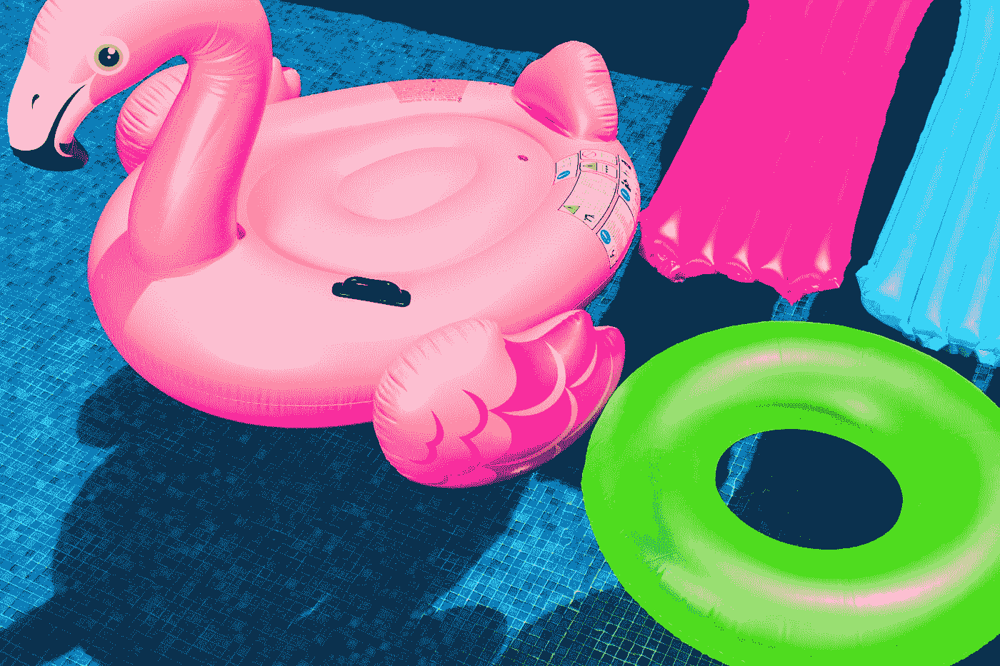
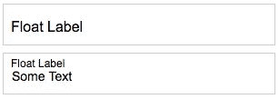
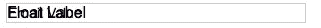
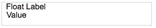
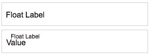
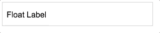
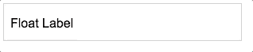

# 如何构建浮动标签输入字段

> 原文：<https://itnext.io/how-to-build-a-floating-label-input-field-f9b21669fe2f?source=collection_archive---------1----------------------->



托尼·昆卡在 [Unsplash](https://unsplash.com?utm_source=medium&utm_medium=referral) 上拍摄的照片

浮动输入标签有助于提高可用性，尤其是在页面空间非常宝贵的情况下。许多研究和媒体文章争论他们的优点和缺点。与其争论，不如让我们探索如何构建它的一个版本。

什么是浮动标签输入字段？浮动标签是一种文本标签，以全字体大小出现在输入字段中。当与交互时，标签“浮动”在上面，为用户输入值腾出空间。



标签“浮动”在输入值之上

从头开始构建，您可能会看到 css 伪类:`::before`和`::after`。输入字段不能使用这些伪类，因为它们不能包含其他元素。一种解决方法是将输入放在另一个元素中，比如一个`<div>`，并模拟输入字段的外观。移除`<input>`的边框和轮廓，我们将它们放置在`<div>`上。

```
.float-container {
  border: solid 1px #ccc;
}.float-container input {
  border: none;
  outline: 0;
}<div id="floatContainer" class="float-container">
  <input type="text">
</div>
```

我们现在可以向输入字段添加一个文本标签。虽然可以使用任何元素，但`<label>`元素是最佳选择。标签提供了可访问性，当点击时，焦点在相关的`<input>`上。记住在输入中添加一个`id`，在标签中添加一个匹配的`for`属性。

```
<div id="floatContainer" class="float-container">
  **<label for="floatField">**
  <input **id="floatField"** type="text">
</div>
```

如果没有样式，标签将出现在输入的上方。向标签添加绝对位置将使其看起来在输入字段内。将`position: relative`添加到容器中将使标签保持在内部而不是外部。

```
.float-container {
  border: solid 1px #ccc;
  **position: relative;**
}.float-container input {
  border: none;
  outline: 0;
}**label {
  position: absolute;
}**<div id="floatContainer" class="float-container">
  <label for="floatField">
  <input id="floatField" type="text">
</div>
```



带有标签和值的输入

当标签在容器内时，输入文本看起来很混乱。在容器内创建空间将有助于设置标签和输入的字体大小。

```
.float-container {
  border: solid 1px #ccc;
  **padding: 0 8px;**
  position: relative;
}.float-container input {
  border: none;
  **font-size: 16px;** outline: 0;
  **padding: 16px 0 10px;** }label {
  **font-size: 16px;**
  position: absolute;
}
```



给容器增加空间有助于可读性

增加空间有助于看到标签和文本。目前，标签处于可以看到字段值的正确位置。我们希望它从与值相同的位置开始向上移动。当值存在时，标签也应该减小它的文本大小，以不降低值的重要性。我们可以设计边缘或顶部属性的样式。相反，我们使用 transform 属性和 [translate](https://developer.mozilla.org/en-US/docs/Web/CSS/transform-function/translate) 。平移将设置 x/y 坐标。标签不会向左或向右移动，所以我们将 y 设置保持为 0。x 将被设置为向下放置，覆盖真正的输入字段。由于这是标签的默认设置，我们还想将初始比例设置为 1，这意味着 100%的原始大小。

```
label {
  font-size: 16px;
  position: absolute;
  **transform: translate(0, 16px) scale(1);**
}
```

通过改变字段的状态，我们创建了一个“活动”类。我们希望标签在用户点击输入字段时改变它的大小。容器上的活动类允许其中的元素使用活动状态。激活时，标签将向上移动，在这种情况下，将向上移动 12px。我们还希望浮动时标签小一点。我们不需要改变字体大小，只需要将比例改为 0.75，也就是原来大小的 75%。

```
.float-container.active label {
  transform: translate(0, 4px) scale(.75);
}
```



我们的标签现在是浮动的…哦哦

转换 x 坐标和比例按预期工作，但定位有点偏离。我们可以更新 y 坐标，但这不是问题。标签更改了大小，默认情况下，使用标签的中心点。将原点调整到左上角应该可以。同时，我们将添加动画。过渡设置动画属性、持续时间和[速度曲线](http://cubic-bezier.com/)。

```
label {
  font-size: 16px;
  position: absolute;
  **transform-origin: top left;**
  transform: translate(0, 16px) scale(1);
  **transition: all .1s ease-in-out;**
}.float-container.active label {
  transform: translate(0, 4px) scale(.75);
}
```

对于我们的活动类，我们需要使用 javascript 在单击时添加和删除该类(在示例中使用*es6*)。输入字段有 2 个事件，这将有助于我们的互动，不是“点击”。这些事件是“聚焦”和“模糊”。点击或按 tab 键(按下 *tab 键*键)，触发“聚焦”事件。单击标签字段时，它将聚焦于相关联的输入。模糊是专注的反义词。当用户在焦点输入之外单击或关闭制表符时，将触发模糊。

```
const floatField = document.getElementById('floatField');
const floatContainer = document.getElementById('floatContainer');floatField.addEventListener('focus', () => {
  floatContainer.classList.add('active');
});floatField.addEventListener('blur', () => {
  floatContainer.classList.remove('active');
});
```



浮在

我们目前的代码是:

```
***== css ==***.float-container {
  border: solid 1px #ccc;
  padding: 0 8px;
  position: relative;
}.float-container input {
  border: none;
  font-size: 16px;
  margin: 16px 0 10px;
  outline: 0;
}label {
  font-size: 16px;
  position: absolute;
  transform-origin: top left;
  transform: translate(0, 16px) scale(1);
  transition: all .1s ease-in-out;
}.float-container.active label {
  transform: translate(0, 4px) scale(.75);
}***== html ==***<div id="floatContainer" class="float-container">
  <label for="floatField">
  <input id="floatField" type="text">
</div>***== javascript ==***const floatField = document.getElementById('floatField');
const floatContainer = document.getElementById('floatContainer');floatField.addEventListener('focus', () => {
  floatContainer.classList.add('active');
});floatField.addEventListener('blur', () => {
  floatContainer.classList.remove('active');
});
```

此时，我们在输入字段上有了一个动画浮动标签。我们的工作还没有完成。我们需要考虑这个输入字段的所有用例。目前，该字段将标签返回到其在“模糊”上的原始位置。它不考虑输入是否有值。我们的标签目前还会覆盖字段中的任何占位符文本。最后，我们的输入字段也只适用于页面上的 1 个输入字段。我们将需要建立我们的代码，以便多个输入字段将使用浮动标签。

我们的浮动标签脚本将使用一个[模块模式](https://www.google.com/search?q=javascript+module+pattern)来处理我们的用例。我们将捕获我们想要应用浮动标签的输入字段。我们还将焦点和模糊事件绑定到这些字段。这些事件还会考虑字段的条件，看它是否有值。

这是我们的初始结构:

```
const FloatLabel = (() => { const handleFocus = () => {
  }; const handleBlur = () => {
  }; const bindEvents = () => {
  }; const init = () => {
  }; return {
    init: init
  };
})();FloatLabel.init();
```

我们的第一个动作是找到所有的输入并绑定事件。我们收集具有类`float-container`的输入。我们将它们存储在一个数组中，并使用`forEach`遍历它们。

```
const init = () => {
  const floatContainers = document.querySelectorAll('.float-container');

  floatContainers.forEach((element) => {
    bindEvents(element);
  });
};
```

对于每个元素，我们为“焦点”和“模糊”添加了与之前相同的事件侦听器。我们的新侦听器将调用函数，而不是在侦听器中定义它们。

```
const bindEvents = (element) => {
  const floatField = element.querySelector('input');
  floatField.addEventListener('focus', handleFocus);
  floatField.addEventListener('blur', handleBlur);    
};
```

聚焦输入调用接收聚焦事件的`handleFocus`功能。`target`变量存储聚焦的元素。我们决定将`active`类放在输入的容器中，但是我们不知道该类的 id 或索引。我们可以传递索引，但是我们也可以选择目标输入字段的父元素并应用该类。

```
const handleFocus = (e) => {
  const target = e.target;
  target.parentNode.classList.add('active');
};
```

退出输入字段时，我们希望删除`active`类，但前提是没有值。如果有值，我们将使容器保持活动状态。

```
const handleBlur = (e) => {
  const target = e.target;
  if(!target.value) {
    target.parentNode.classList.remove('active');
  }  
};
```

在页面加载时，字段可以包含一个值。我们需要在输入字段上添加活动类，但是要在用户采取任何动作之前。我们将在 init 函数中完成这项工作。当我们遍历每个容器时，我们找到它的输入并检查它是否有值。

```
const init = () => {
  const floatContainers = document.querySelectorAll('.float-container');

  floatContainers.forEach((element) => {

 **if (element.querySelector('input').value) {
      element.classList.add('active');
    }**

    bindEvents(element);
  });
};
```

占位符值有助于用户了解更多关于在输入字段中输入内容的信息。这些占位符在字段未输入值时出现，在用户输入值时消失。占位符文本将出现在标签下，我们需要管理它何时显示。我们不想在输入字段上使用占位符属性，但是我们可以使用数据属性来存储文本:

```
<input type="text" id="floatField" **data-placeholder="some text"**>
```

获得焦点后，添加带有数据属性值的占位符属性。

```
const handleFocus = (e) => {
  const target = e.target;
  target.parentNode.classList.add('active');
  **target.setAttribute('placeholder', target.getAttribute('data-placeholder'));**
};
```

当退出该字段时，我们删除占位符属性本身。

```
const handleBlur = (e) => {
  const target = e.target;
  if(!target.value) {
    target.parentNode.classList.remove('active');
  }
  **target.removeAttribute('placeholder');**
};
```

我们的最终模块如下所示:

使用浮动标签的 codepen:
[https://codepen.io/steamforge/pen/NBqMYj](https://codepen.io/steamforge/pen/NBqMYj)



我们都会浮在水面上

使用 css 动画和 javascript，我们可以为输入字段创建一个浮动标签。我们可以扩展输入字段，但我们现在拥有的是浮动标签的良好开端。我们可以添加的其他功能有错误状态、提示文本和字体颜色。

在后续的文章中，我将探索使用样式化组件在 React 中构建浮动输入标签。

请让我知道你是否觉得这有用或者你是否有改进。

约书亚·斯图德利是凯利蓝皮书的高级 UI 工程师。他拥有超过 15 年的前端 web 开发经验，曾与多个领域的领先交互公司合作，从医疗软件到汽车媒体。Josh 还在 UCI 编码训练营教授全栈 web 开发。乔希不建网站的时候，他就在建网站。说真的。