# 如何在 AWS 服务堆栈上构建 GitOps 管道

> 原文：<https://itnext.io/how-to-build-a-gitops-pipeline-on-a-stack-of-aws-services-63f7670b5f95?source=collection_archive---------1----------------------->

## 软件工程

## 使用 ArgoCD 和其他 AWS 服务，如 CodeCommit、CodePipeline、CodeBuild、亚马逊 EKS


照片由 [Fotis Fotopoulos](https://unsplash.com/@ffstop?utm_source=unsplash&utm_medium=referral&utm_content=creditCopyText) 在 [Unsplash](https://unsplash.com/s/photos/coding?utm_source=unsplash&utm_medium=referral&utm_content=creditCopyText) 上拍摄

在本帖中，我们将探讨如何构建 GitOps 管道来在亚马逊 EKS(弹性 Kubernetes 服务)上部署应用程序。我们将使用 ArgoCD 和各种 AWS 服务，如 CodeCommit、CodePipeline、CodeBuild 和 Amazon Elastic Container Registry(ECR)。

> 不久前，我写了一篇关于 [GitOps 和我们通常会遇到的一些挑战的帖子，以及在采用 GitOps](/gitops-is-powerful-but-is-your-organization-ready-a18288238a21) 之前需要考虑的一些要点。如果你想快速复习，请随意看看。
> 
> 或者，如果您是 GitOps 的新手，在我们研究这篇文章中更多的实现细节之前，也花几分钟浏览一下这篇文章。
> 
> 如果你想深入了解，也可以参考 [Weaveworks 博客](https://www.weave.works/technologies/gitops/)。

# 挑选工具

虽然 Kubernetes 的 GitOps 可以通过 FluxCD 或 ArgoCD 来实现，但我选择 ArgoCD 来完成这篇文章，主要是因为 ArgoCD 有一个直观的 GUI，可以帮助以更好的方式交互和理解 GitOps 模式。对于喜欢 CLI 胜过 GUI 的人来说，这不是问题。

ArgoCD 和 FluxCD 各有优缺点。两支队伍都可能很快缩小差距。我们永远不知道。我在这两方面都不是专家，所以，我将避免进一步进行任何深入的特性比较。

*Segue:* 值得一提的是 [gitops-engine](https://github.com/argoproj/gitops-engine) 的诞生是为了汇聚各方力量，为 gitops 社区提供尽可能好的价值。它正在积极开发中，并且发展迅速。让我们拭目以待，直到它可以使用。

关于 AWS 服务，我们将使用 **AWS CodeCommit** 进行代码存储； **AWS 代码管道**为 DevSecOps 持续集成管道提供结构； **AWS CloudWatch 事件**(现在是 Amazon EventBridge 的一部分)来触发构建；AWS 代码构建来运行构建；**亚马逊 ECR** 存储 Docker 图片。

# 管道如何工作

管道架构如下图所示。

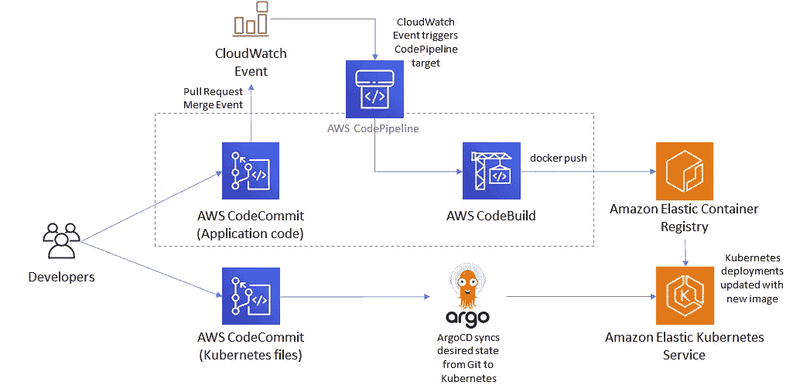

*那么，为什么会发生 CloudWatch 事件呢？*我们可以让 CodeBuild 轮询 CodeCommit 存储库中的代码变更，并触发构建。是的，但是让我们保持基于事件。我们将在后面的小节中查看事件配置细节。

*为什么有两个 CodeCommit 存储库？我们将在后面的章节中看到这一点。*

关键组件 ArgoCD operator 负责将声明的所需状态配置从 Git 存储库(CodeCommit)同步到 EKS 集群。期望的状态可以是任何东西，比如更新的映像版本、Kubernetes 部署对象规范、副本数量、端口配置等等。

# 设置亚马逊 EKS 集群

为了简单起见，我不会涉及太多关于提供一个强化的亚马逊 EKS 集群的细节。在这篇文章中，让我们考虑一个使用类似于`eksctl create cluster -f ../eks-cluster-config.yml`的`eksctl`命令创建的公共可访问集群，其配置如下所示。或者，您可以使用现有的 EKS 集群。

有关所有支持的配置属性的详细信息，请参考 [eksctl 模式](https://eksctl.io/usage/schema/)。

请注意，`eksctl`将为 EKS 集群创建所有必需的 AWS 服务和组件—专用 VPC、子网、安全组、IAM 策略等。

在幕后，eksctl 创建 CloudFormation 堆栈。您可以参考堆栈的所有详细信息和资源，如下所示—

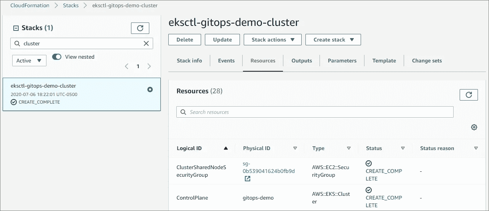

> **注意:不要使用可能不符合您特定安全性和合规性要求的集群。**

# 代码提交配置

我已经为这个管道建立了两个 AWS CodeCommit 存储库。

现在，我们是否需要单独的存储库或者单一的存储库就足够了，这是有争议的。根据您的选择，管道工具配置需要相应地调整。

对于这篇文章，我选择使用两个存储库，主要有两个原因:

*   没有直接的方法可以根据特定的文件更改，通过 CodePipeline 或 CodeBuild 有条件地触发构建。例如，如果我们将 Kubernetes 文件放在与应用程序代码相同的存储库中的一个文件夹中，那么即使只在 Kubernetes 文件中有一个更改，构建过程也会被触发。这可能是不可取的。下面的链接解释了一些解决方法，但对我来说它看起来像是一个黑客。 r *的原因是，如果文件/文件夹名称模式有任何变化，它可能会破坏功能，除非工程师在每次有变化时保持逻辑同步。*参考 h[ttps://AWS . Amazon . com/blogs/infra structure-and-automation/how-to-trigger-AWS-code build-jobs-for-selective-file-changes-in-AWS-code commit/](https://aws.amazon.com/blogs/infrastructure-and-automation/how-to-trigger-aws-codebuild-jobs-for-selective-file-changes-in-aws-codecommit/)。
*   独立的存储库有助于保持整洁，对于本文来说，管道配置简单易懂。

***#1)一个应用程序代码库。***

这是一个包含以下文件的示例代码库。

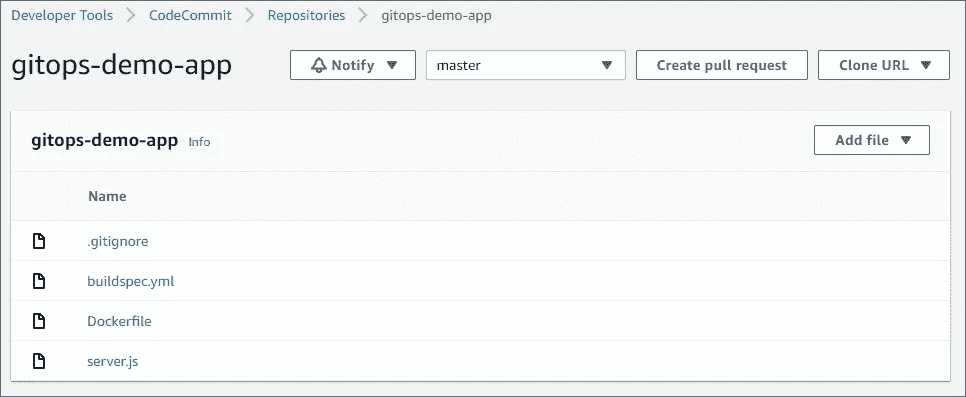

*   Node.js 图像的 Dockerfile

*   server.js 运行一个返回 HTML 页面的简单 Node.js web 服务器。

*   AWS CodeBuild 项目配置的 buildspec.yml。

***# 2)Kubernetes 配置文件的另一个存储库。***

它有一个包含 Node.js docker 映像的简单部署规范，以及一个 LoadBalancer 类型的服务规范来公开部署。

您可以根据需要调整设置。

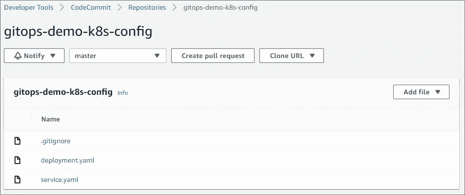

deployment.yaml & service.yaml —

我现在只使用一个副本。因此，滚动更新策略会在终止旧 pod 之前创建一个新 pod。如果我们使用 5 个副本，一次将更新 1 个 pod。有关部署策略配置的更多详细信息，请参考[https://kubernetes . io/docs/concepts/workloads/controllers/deployment/](https://kubernetes.io/docs/concepts/workloads/controllers/deployment/)。

# 设置 Amazon ECR 存储库、AWS 代码管道、AWS 代码构建

我使用下面的 CloudFormation 模板来设置所有需要的 AWS 组件。它创造了以下资源—

1.  亚马逊 ECR 知识库
2.  云观察事件规则
3.  代码构建项目
4.  代码管道
5.  管道工件的 S3 桶
6.  代码构建、代码管道、云观察事件规则的 IAM 服务角色

如果这个模板不适用于您的特定安全标准或管道功能需求，请根据您的需要随意调整它。

## 使用 CloudWatch 事件规则触发代码管道

AWS CloudBuild 使我们能够配置构建触发器，这些触发器可以轮询代码库中的任何更改。但是，我更喜欢基于事件的模型，主要是作为避免不必要的处理开销的最佳实践。

*CloudWatch Events 现隶属于* [*亚马逊 EventBridge*](https://docs.aws.amazon.com/eventbridge/index.html) *。EventBridge 还可以让我们为整体架构构建未来的可扩展性。*

## 基于拉取请求(PR)合并构建与基于每次提交构建

在这个模板中，我在 CloudWatch 事件规则中使用了`pullRequestMergeStatusUpdated`事件。而且，构建是为作为拉请求目的地的`master`分支配置的。

参考[此链接](https://docs.aws.amazon.com/codecommit/latest/userguide/monitoring-events.html#pullRequestMergeStatusUpdated)了解可支持的其他事件类型。为了前任。如果你想在每次提交时触发构建，那么你应该使用`referenceUpdated`事件类型。

*因此，事件配置可能需要根据何时需要触发构建的决策标准进行相应的调整。*

在将请求合并到目标分支之前，建议对请求本身运行构建&测试。PR 构建可以提供第一级的健全性检查和对交付的代码质量的可见性。您可以进一步探索如何使用 CloudWatch 事件来自动化 PR 构建。提示:`pullRequestCreated`和`pullRequestSourceBranchUpdated`事件。

## 云形成模板:

## 亚马逊 ECR 图像扫描

容器静态扫描是 DevSecOps 管道的关键部分。亚马逊 ECR 允许扫描某些 docker 图像类型。可以在将图像推送到存储库时或稍后执行扫描。如果 ECR 扫描不能满足您的安全需求，可以使用其他第三方工具和服务作为管道的一部分。

a̶l̶t̶h̶o̶u̶g̶h̶̶q̶u̶i̶t̶e̶̶u̶n̶e̶x̶p̶e̶c̶t̶e̶d̶,̶̶c̶l̶o̶u̶d̶f̶o̶r̶m̶a̶t̶i̶o̶n̶̶d̶o̶e̶s̶̶n̶o̶t̶̶s̶u̶p̶p̶o̶r̶t̶̶s̶c̶a̶n̶-̶o̶n̶-̶p̶u̶s̶h̶̶o̶u̶t̶̶o̶f̶̶t̶h̶e̶̶b̶o̶x̶.̶̶i̶f̶̶y̶o̶u̶̶d̶e̶c̶i̶d̶e̶̶t̶o̶̶b̶u̶i̶l̶d̶̶t̶h̶e̶̶e̶c̶r̶̶r̶e̶p̶o̶s̶i̶t̶o̶r̶y̶̶u̶s̶i̶n̶g̶̶t̶e̶r̶r̶a̶f̶o̶r̶m̶̶y̶o̶u̶̶w̶o̶u̶l̶d̶̶n̶o̶t̶̶b̶e̶̶d̶i̶s̶a̶p̶p̶o̶i̶n̶t̶e̶d̶.̶̶t̶e̶r̶r̶a̶f̶o̶r̶m̶̶s̶u̶p̶p̶o̶r̶t̶s̶̶t̶h̶i̶s̶̶o̶p̶t̶i̶o̶n̶.̶

> ̶t̶h̶e̶r̶e̶̶i̶s̶̶a̶n̶̶o̶p̶e̶n̶̶i̶s̶s̶u̶e̶̶f̶o̶r̶̶c̶l̶o̶u̶d̶f̶o̶r̶m̶a̶t̶i̶o̶n̶̶t̶o̶̶s̶u̶p̶p̶o̶r̶t̶̶i̶t̶,̶̶b̶u̶t̶̶u̶n̶t̶i̶l̶̶t̶h̶e̶n̶,̶̶w̶e̶̶c̶a̶n̶̶e̶i̶t̶h̶e̶r̶̶w̶r̶i̶t̶e̶̶a̶̶c̶u̶s̶t̶o̶m̶̶r̶e̶s̶o̶u̶r̶c̶e̶̶t̶o̶̶a̶c̶h̶i̶e̶v̶e̶̶t̶h̶e̶̶s̶a̶m̶e̶,̶̶o̶r̶̶u̶s̶e̶̶a̶n̶y̶̶o̶t̶h̶e̶r̶̶a̶p̶p̶r̶o̶a̶c̶h̶̶a̶s̶̶y̶o̶u̶̶s̶e̶e̶̶f̶i̶t̶.̶

[](https://github.com/aws/containers-roadmap/issues/552) [## [ECR][请求]:ECR 漏洞扫描问题#552 的云信息集成…

### 解散 GitHub 是超过 5000 万开发者的家园，他们一起工作来托管和审查代码，管理项目，以及…

github.com](https://github.com/aws/containers-roadmap/issues/552) 

【更新:CloudFormation 现在支持 ECR 的扫描推送模式。以上门票已关闭。]

我在这里使用的图像不是受支持的类型。所以，你会看到`UnsupportedImageError`错误。有关图像扫描的相关问题，请参考此链接。

 [## 图像扫描问题疑难解答

### 以下是常见的图像扫描故障。您可以在 Amazon ECR 控制台中查看这样的错误，方法是显示…

docs.aws.amazon.com](https://docs.aws.amazon.com/AmazonECR/latest/userguide/image-scanning-troubleshooting.html) 

但是，如果您使用受支持的映像，如果检测到漏洞，您可能会看到如下所示的漏洞报告。

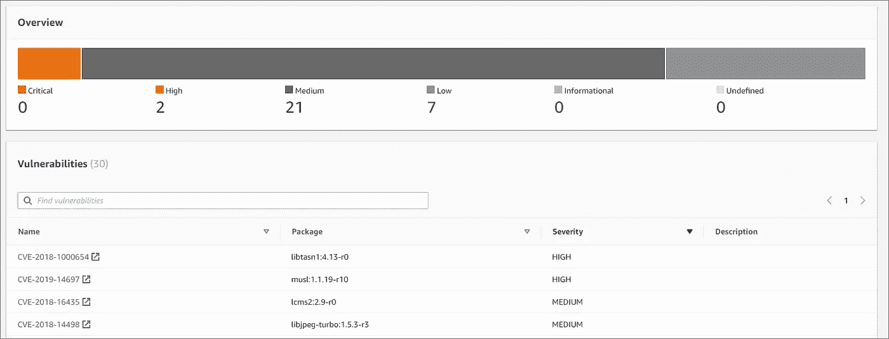

# ArgoCD 配置

您可以按照我在下面提到的命令进行操作，或者使用下面的文档为您的 Kubernetes 集群安装和配置 ArgoCD。

[](https://argoproj.github.io/argo-cd/getting_started/) [## 用于 Kubernetes 的声明性 GitOps CD

### 提示本指南假设您对 Argo CD 所基于的工具有所了解。请阅读理解…

argoproj.github.io](https://argoproj.github.io/argo-cd/getting_started/) 

我在这篇文章中使用了下面的命令。

## **安装 ArgoCD**

```
#Install Argo CD
kubectl create namespace argocdkubectl apply -n argocd -f [https://raw.githubusercontent.com/argoproj/argo-cd/stable/manifests/install.yaml](https://raw.githubusercontent.com/argoproj/argo-cd/stable/manifests/install.yaml)
```

## 安装 ArgoCD CLI

我用的是 Linux 服务器。查找适用于您的系统的说明。

```
VERSION=$(curl --silent "[https://api.github.com/repos/argoproj/argo-cd/releases/latest](https://api.github.com/repos/argoproj/argo-cd/releases/latest)" | grep '"tag_name"' | sed -E 's/.*"([^"]+)".*/\1/')sudo curl --silent --location -o /usr/local/bin/argocd [https://github.com/argoproj/argo-cd/releases/download/$VERSION/argocd-linux-amd64](https://github.com/argoproj/argo-cd/releases/download/$VERSION/argocd-linux-amd64)sudo chmod +x /usr/local/bin/argocd
```

## 公开 ArgoCD API 服务器

```
kubectl patch svc argocd-server -n argocd -p '{"spec": {"type": "LoadBalancer"}}'export ARGOCD_SERVER=`kubectl get svc argocd-server -n argocd -o json | jq --raw-output .status.loadBalancer.ingress[0].hostname`
```

## 登录到服务器

```
ARGO_PWD=`kubectl get pods -n argocd -l app.kubernetes.io/name=argocd-server -o name | cut -d'/' -f 2`argocd login $ARGOCD_SERVER --username admin --password $ARGO_PWD --insecure#It is better to change the default password.
argocd account update-password
```

## 创建 EKS 集群配置

```
CONTEXT_NAME=`kubectl config view -o jsonpath='{.contexts[].name}'`argocd cluster add $CONTEXT_NAME
```

## 使用 AWS 代码提交存储库配置 ArgoCD

我们可以建立 SSH 或 HTTPS 连接。按照以下步骤创建一个 SSH 连接—

*   创建有权访问代码提交的 AWS IAM 用户。
*   使用`ssh-keygen`生成一个 SSH 密钥对。
*   在 IAM 用户的“安全凭据”部分，上传公钥以设置用户的 CodeCommit 凭据。这也可以通过 AWS CLI 来完成。记下密钥 ID。我们以后会需要它。

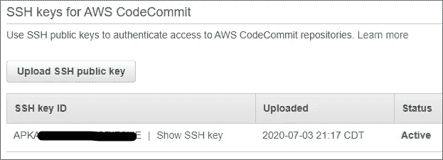

*   将 CodeCommit 证书添加到 ArgoCD，这样我们就不必在建立连接时跳过服务器验证。

```
ssh-keyscan git-codecommit.<AWS REGION>.amazonaws.com | argocd cert add-ssh --batch
```

*   将 CodeCommit repo 添加到 ArgoCD 服务器。这也可以通过 ArgoCD GUI 来完成。注意，当我们从 CodeCommit 复制 SSH URL 时，它没有 SSH 密钥 ID。因此，我们需要提供上面复制的 SSH 密钥 ID 作为存储库 URL 的一部分。私钥是我们在上面第二步中生成的。

```
argocd repo add ssh://[**<SSH KEY ID>**@git-codecommit.us-east-1.amazonaws.com](mailto:APKA4B2MCB3T3CRIP3ME@git-codecommit.us-east-1.amazonaws.com)/v1/repos/gitops-demo-k8s-config --ssh-private-key-path ~/.ssh/123_codecommituser_rsa
```

# 让我们部署我们的应用程序

GitOps 支持基于拉的方法，而不是通常的基于推的连续部署方法。ArgoCD 提供了支持基于推和基于拉的部署的能力。无论哪种方式，部署都是通过 ArgoCD 操作员进行的。在 ArgoCD 上下文中，为应用程序启用自动同步使其成为基于拉的模型。并且，手动同步过程使其基于推送。

## 在 ArgoCD 中创建应用程序

在 ArgoCD 和 CodeCommit 之间建立连接后，我们就可以使用 ArgoCD 在 EKS 集群上部署应用程序了。

*   让我们为应用程序创建一个单独的 Kubernetes 名称空间。然后，创建应用程序。根据您的要求替换名称空间和应用程序名称。

```
kubectl create namespace gitops-demoargocd app create **gitops-demo** --repo ssh://[<SSH KEY ID>@git-codecommit.us-east-1.amazonaws.com](mailto:APKA4B2MCB3T3CRIP3ME@git-codecommit.us-east-1.amazonaws.com)/v1/repos/gitops-demo-k8s-config --path ./ --dest-server [https://kubernetes.default.svc](https://kubernetes.default.svc) --dest-namespace **gitops-demo**
```

*接下来:*如果您使用 HTTPS 连接，那么 repo URL 将类似于`[https://git-codecommit.us-east-1.amazonaws.com/v1/repos/gitops-demo-k8s-config](https://git-codecommit.us-east-1.amazonaws.com/v1/repos/gitops-demo-k8s-config)`，您必须提供 IAM 用户的用户名和密码。您需要为用户创建相应的凭证。下面是一个可以访问 CodeCommit 的 IAM 用户的安全凭据部分的屏幕截图。

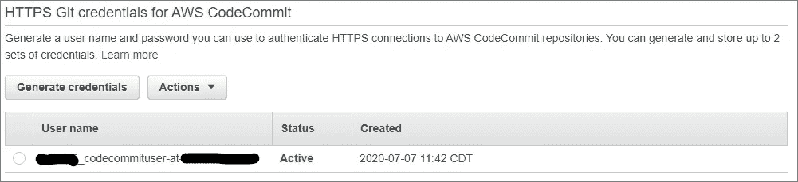

如果你的 Kubernetes 文件在一个非根目录下，比如文件夹`k8s-files`，那么路径应该是`--path k8s-files`而不是`./`。如果一个回购下的文件被多个文件夹分割，这将非常方便。

此时，我们应该在 ArgoCD GUI 中看到应用程序处于 OutOfSync 状态，除非我们将同步策略设置为`automated`。检查`argocd app create --help`下的`--sync-policy, --auto-prune, --self-heal`选项。

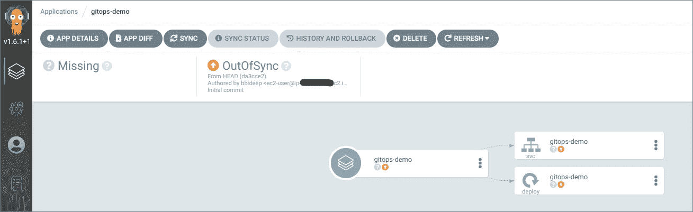

*   使用以下命令或 ArgoCD GUI 本身同步应用程序状态。

```
argocd app sync gitops-demo
```

一旦同步完成，我们可以在 ArgoCD GUI 中看到状态，Kubernetes 对象也成功创建。

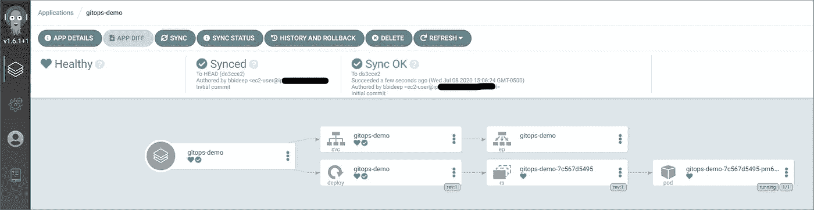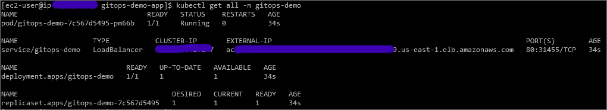

在检查 AWS 负载平衡器 URL 时，我们得到一个亮蓝色的页面。

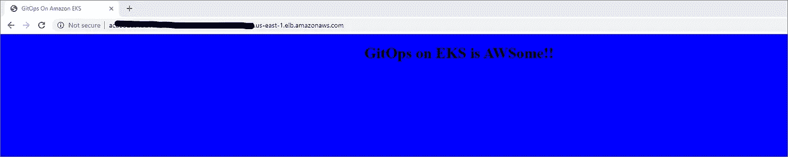

任务完成！！

## 现在更新怎么样？

不确定蓝色是否好看。我们换个颜色吧！

能否在 server.js 中改变颜色，创建一个新的 docker 镜像，ArgoCD 会部署这个新镜像吗？不完全是。

> 这是 FluxCD 战胜 ArgoCD 的一个领域。

FluxCD 可以监控映像库，并使用新映像自动更新部署。有一个功能增强请求，但是在撰写本文时它仍然是开放的。参考—

[](https://github.com/argoproj/argo-cd/issues/1648) [## 图像标签更新问题#1648 argoproj/argo-cd

### Weave Flux 的一个很好的特性是能够监控 docker 图像报告以发布新图像…

github.com](https://github.com/argoproj/argo-cd/issues/1648) 

到今天为止，ArgoCD 对这个问题有不同的观点。请将此评论作为上述已创建问题的一部分阅读:[https://github . com/argoproj/Argo-CD/issues/1648 # issue comment-546006238](https://github.com/argoproj/argo-cd/issues/1648#issuecomment-546006238)

*ArgoCD 检测为应用程序定义的路径下的任何 Git 更改。因此，更新清单文件就可以了。*

*那么，我们需要做些什么来改变颜色呢？我们需要更新颜色并提交代码。CodePipeline 将被触发来构建新图像并将其上传到 ECR。假设我们将颜色改为`background-color: lightskyblue`。*

然后，我们可以使用这些注释中列出的步骤更新部署规范中的映像[https://github . com/Argo proj/Argo-CD/issues/1648 # issue comment-546006238](https://github.com/argoproj/argo-cd/issues/1648#issuecomment-546006238)，或者任何适合您的类似方法。

现在，新图像可以同步到 ArgoCD。在这个阶段，我们可以在同步状态之前看到 ArgoCD 中的差异。如果自动同步已使能，我们无需担心这一部分。

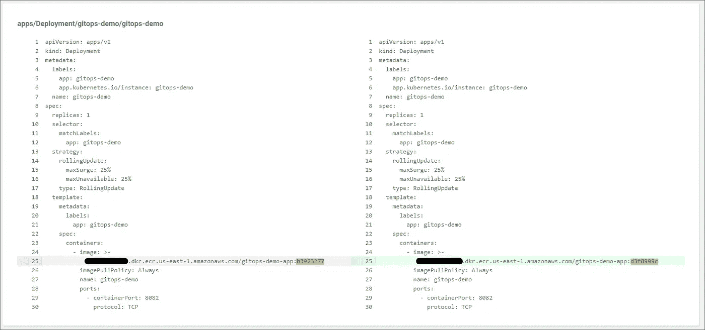

一旦同步，瞧！我们得到了具有新颜色的新部署的图像。

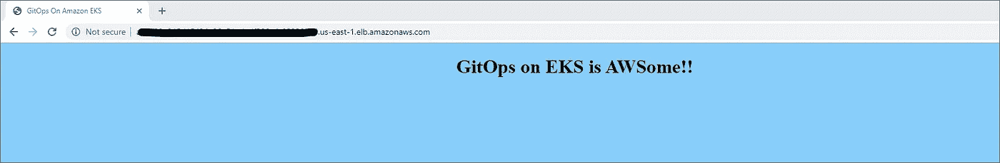

# 包扎

因此，我们已经看到了如何在完整的 AWS 服务堆栈上构建 GitOps 管道。

GitOps 模式不要求使用任何特定的工具。基本原则是在基于 Git 的存储库中定义期望的集群状态(真实的来源),并让操作者(ArgoCD/FluxCD)按照期望的方式维护集群状态。

虽然我们使用 ArgoCD 创建了这个管道，但是我也强烈推荐探索 FluxCD。

FluxCD 有一个不同的架构，对 GitOps 采取了稍微不同的方法。正如我前面提到的，它可以监控映像存储库的任何更新，并相应地同步部署。

它究竟是优势还是风险因素还存在争议。这将取决于各种因素，如团队的成熟度、职责分离和其他企业准则。

在另一篇文章中，我试图介绍 GitOps 的一些方面(优势和挑战)。如果觉得有用，请随意探讨。

[](/gitops-is-powerful-but-is-your-organization-ready-a18288238a21) [## GitOps 功能强大；但是，您的组织准备好了吗？

### GitOps 为什么强大？采用 GitOps 之前的主要考虑事项。

itnext.io](/gitops-is-powerful-but-is-your-organization-ready-a18288238a21) 

*关注我*[*LinkedIn*](https://www.linkedin.com/in/bideep/)*，*[*Twitter*](https://twitter.com/bbideep)*。*

[*订阅上媒*](https://bbideep.medium.com/subscribe) *获取更多此类帖子。*