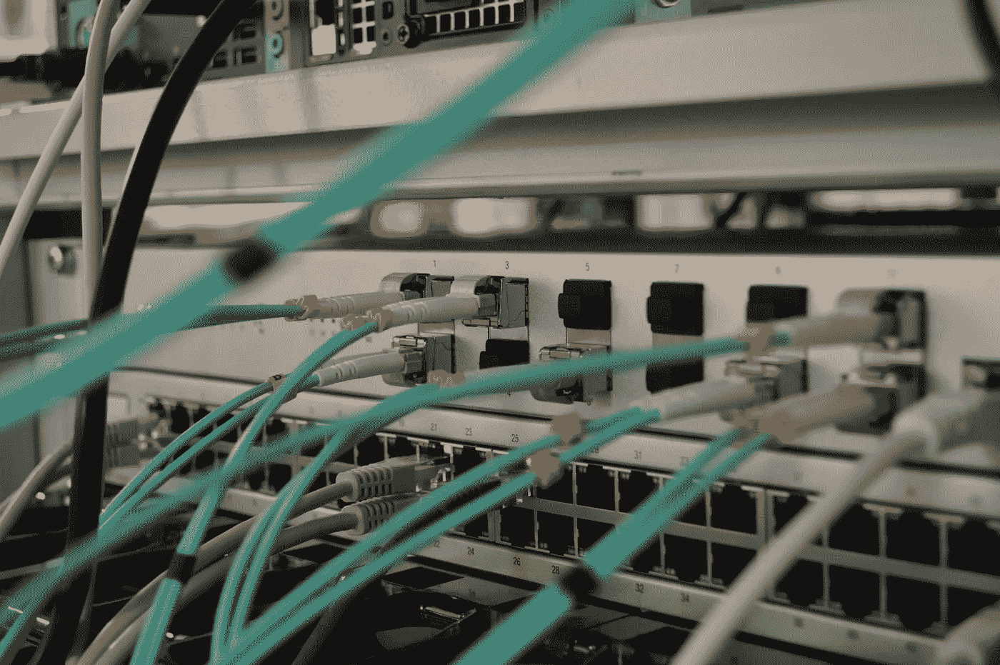
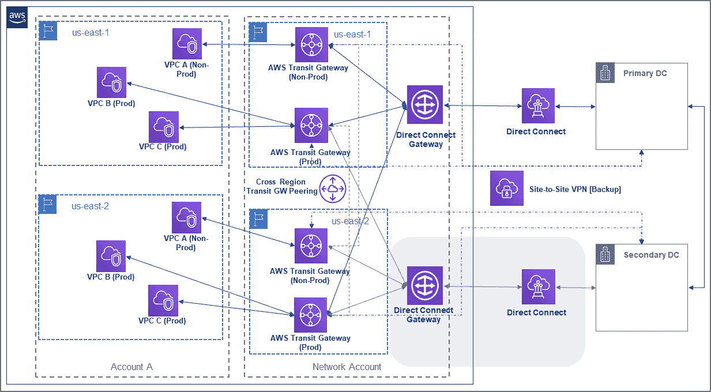
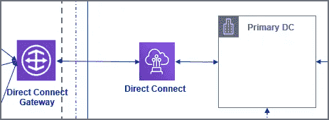
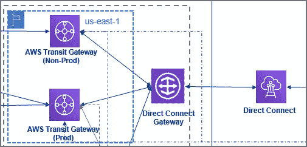
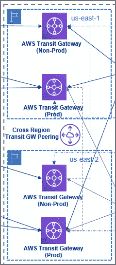
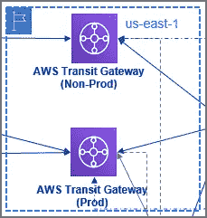
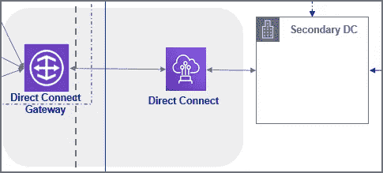
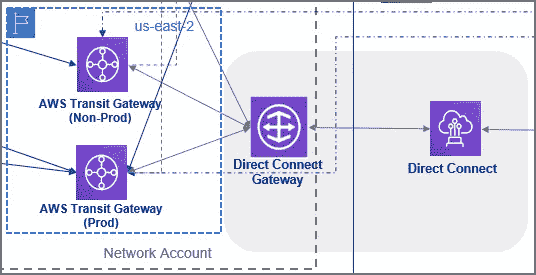

# 如何构建高度可用的 AWS 直连架构

> 原文：<https://itnext.io/how-to-build-a-highly-available-aws-direct-connect-architecture-24d4099d68c7?source=collection_archive---------2----------------------->

## AWS 网络

## 具有 AWS 网络服务和组件的参考 HA 体系结构，没有单点故障和其他考虑事项

托马斯·詹森在 [Unsplash](https://unsplash.com/s/photos/server-rack?utm_source=unsplash&utm_medium=referral&utm_content=creditCopyText) 上的照片

在本文中，我们将探讨如何构建一个高可用性(HA) **AWS 网络解决方案，使用直连**连接 AWS 和内部数据中心。我们还将研究其他 AWS 服务，如 **Direct Connect Gateway** 和 **Transit Gateway** 如何帮助简化整体架构及其管理。

尽管我假设您对 AWS 网络服务有相当的了解，但在我们研究架构之前，我们将快速回顾一下。

> 快速绕道-

了解 AWS 帐户以及各种帐户结构如何帮助构建可扩展的解决方案非常重要。作为本文的一部分，我们将涉及几个方面。但是，我不想提供详细的解释，并希望将其排除在本次讨论的范围之外。我强烈建议详细探讨多 AWS 帐户结构的各种策略的重要性，以及它如何帮助构建一个安全、可扩展且经济高效的 AWS 基础。

> *因此，这里是与本文相关的 AWS 网络服务 R**的简化定义*

## ***亚马逊 VPC***

*亚马逊虚拟私有云(VPC)是 AWS 网络的基础构建模块。它允许您在 AWS 中创建一个私有网络来提供资源。VPC 可以有公共和/或私有子网。*

*VPC 和子网与各种网络服务和组件相关联，如路由表、网络 ACL、NAT 网关、Internet 网关、安全组。*

## ***AWS 直连(DX)***

*直连支持建立从内部到 AWS 云的专用网络连接。它可以提供比公共互联网更可靠的网络连接，降低网络成本，并增加带宽吞吐量。*

## ***AWS 站点到站点 VPN***

*在这种情况下，VPN 连接将位于内部网络和 AWS VPC 之间。在这里，我们将 VPN 视为直接连接的故障转移，而不是主连接。*

## ***AWS 直连网关(DXGW)***

*DXGW 是属于同一个 AWS 帐户的虚拟专用网关(VGW)和专用虚拟接口(专用 VIF)的组合。它允许将相同或不同区域中的多个转接网关(通过转接虚拟接口)或 VPC(通过 VGWs)连接到直接连接(通过专用 VIF)。*

*基本上，它通过允许单个 DX 位置连接到多个 AWS 区域来简化架构。因此，它也降低了管理的复杂性。*

*浏览[https://docs . AWS . Amazon . com/direct connect/latest/user guide/working with Virtual Interfaces . html](https://docs.aws.amazon.com/directconnect/latest/UserGuide/WorkingWithVirtualInterfaces.html)和[https://docs . AWS . Amazon . com/direct connect/latest/user guide/direct-connect-Gateways . html](https://docs.aws.amazon.com/directconnect/latest/UserGuide/direct-connect-gateways.html)了解有关虚拟接口和网关的更多信息。*

## ***AWS 中转网关(TGW)***

*TGW 使我们能够互连多个 VPC，或连接到 DXGW 或 VPN。TGW 通过消除对 VPC 对等的需求并为连接策略提供中央管理中心，简化了 VPC 到 VPC 的互连。这种中心辐射式连接模式可以轻松扩展网络。*

# *高级参考架构*

*我考虑了以下内容作为参考:*

**将连接到 AWS 云的 2 个内部数据中心。**

**2 个 AWS 账户— 1 个企业账户(账户 A)。以及托管网络服务的网络帐户。**

*没有必要以这种方式设置帐户，但是按照多帐户策略，出于可扩展性和运营效率的原因，我将与直连相关的网络资源保存在一个专用帐户中。有多种方法可以在 AWS 和内部数据中心之间建立高度可用、可靠和冗余的连接。*

**

*参考架构*

> *让我们看看架构的不同部分，以理解每个组件和服务的用途。*

*为了简化起见，我们假设现有的数据中心已经连接，这一部分与直接连接到 AWS 的上下文无关。*

## ***1。主数据中心与 AWS 的连接***

**

*主数据中心通过双管直接连接(DX)连接到网络帐户中 AWS 上的直接连接网关(DXGW)。建议使用双连接，以获得更高的弹性，因为连接端接在不同的设备上。**这将为设备故障提供弹性。**对于跨位置弹性，建议跨位置使用双管。我们将在后面的章节中对此进行更深入的研究。*

*通过 AWS Direct Connect Gateway 设置连接以简化 Direct Connect 连接设置，这使得跨 AWS 传输网关和 VPC 的配置更加容易。*

## ***2。通过直接连接网关的主要连接***

**

*连接到主 DX 连接的 DXGW 又可以跨 AWS 区域连接到 3 个 TGWs 是撰写本文时的 AWS 硬限制)。*

*在这种情况下，2 个 TGWs 个生产和 1 个非生产)位于同一区域，而第 3 个 TGW(生产)位于另一个区域。**这可以确保 Prod 流量仍然可以路由到其他地区托管的应用程序。**这对于需要接近 100%正常运行时间的应用来说至关重要。是的，我说“接近 100%”是因为实现 100%的正常运行时间不仅极具挑战性，而且可能不具成本效益或实际要求。*

## ***3。跨区域中转网关对等***

**

*配置 AWS 转接网关，以简化跨 VPC 和直连网关的 VPC 连接和流量路由。中转网关也可以跨区域对等。**这有助于扩展跨多个 AWS 区域的连接，并构建全球网络。**这种流量是安全的，因为它位于 AWS 全球网络基础设施内，并且经过加密。*

*DXGW 和 TGW 一起可以简化本地和 AWS 之间的连接配置(跨客户和区域)。*

*请注意，在撰写本文时，AWS TGW 对等附件仅支持静态路由。仔细考虑所有限制和其他特定于您的 AWS 基础、安全性和路由要求的因素。*

## ***4。生产与非生产 TGW 连接***

**

*单独的中转网关可用于跨 AWS 帐户连接到单独的生产和非生产 VPC。*

*像生产与非生产这样的环境中没有必要有多个 tgw。我以这种方式展示了一种方法，在这种方法中，它可以帮助跨生产和非生产环境进行流量监控，或者在生产环境中实现类似的更改之前，能够模拟非生产环境中的路由更改。*

## ***5。辅助数据中心与 AWS 的连接***

**

*根据直连 HA 要求，辅助数据中心可以连接到备用直连位置。在这种情况下，第二个直接连接连接到 us-east-2。*

*请注意，如果主要仅从主数据中心需要 AWS 连接，此辅助连接可以是可选的(灰色部分)。辅助数据中心应该仍然能够通过连接数据中心的现有链路到达 AWS。*

***这种二级直接连接可以提高定位故障时的弹性。像主连接一样的双管辅助 DX 可以跨位置和设备故障提供最高级别的弹性。**但是，这需要考虑更高的成本。*

## ***6。二级连接直连网关***

**

*出于操作效率的原因，即使是辅助 DX 也应通过 DXGW 连接，类似于主连接。*

*该 DXGW 应该与连接区域中的 TGWs 相关联。地区 us-east-2 以及本例中的生产和非生产 TGWs。**这允许在 us-east-2 区域故障的情况下 Prod 流量到达 us-east-1。***

## *7.站点到站点 VPN 故障转移*

*如果单位置直接连接满足 HA 连接要求，则应设置备份站点到站点 VPN 以满足故障切换要求。*

***与多个 DX 连接相比，拥有故障转移 VPN 可能是一种成本较低的解决方案，但其代价是降低网络可靠性和带宽吞吐量。如果即使在故障转移期间也需要一致的网络性能，那么最好选择多个 DX 连接来满足要求。***

# *其他考虑*

> *在设计任何关键的 AWS 网络解决方案时，在着手实施之前，需要仔细考虑各种因素。*

*这里有一些基本的领域可以开始—*

1.  *网络带宽吞吐量要求。*
2.  *将托管的应用程序的最高级别的 RTO/RPO 要求。由于成本和可用性因素，这可能是整体设计中的一个决定性因素。*
3.  *网络分段。*
4.  *访问控制安全性——用户与 AWS、网络与安全工程师等等。*
5.  *传输中的数据安全性。*
6.  *运营效率和管理开销。*
7.  *监控和审计要求。*
8.  *未来网络扩展计划。*
9.  *AWS 服务针对您计划使用的每项服务的软限制和硬限制。*

# *结论*

*我希望这篇文章能为您提供一些关于构建高可用性 AWS Direct Connect 架构的指导。使用 DXGW 和 TGW 有助于简化架构，同时保持较低的成本和运营开销。*

*这种特定的参考架构旨在实现最大的弹性；可以设计更简单的架构，以更低的成本满足更低的可用性要求。例如，如上所述，使用 VPN 作为故障转移路由，而不是多个直接连接。*

## *重要参考*

* [## AWS 直接连接

### AWS Direct Connect 是一个云服务解决方案，可以轻松地从您的…

aws.amazon.com](https://aws.amazon.com/directconnect/)  [## AWS 直接连接虚拟接口

### 您必须创建以下虚拟接口之一，才能开始使用 AWS Direct Connect 连接。私人…

docs.aws.amazon.com](https://docs.aws.amazon.com/directconnect/latest/UserGuide/WorkingWithVirtualInterfaces.html)  [## 使用直连网关

### 使用直接连接网关- AWS 直接连接您可以使用…使用 AWS 直接连接网关

docs.aws.amazon.com](https://docs.aws.amazon.com/directconnect/latest/UserGuide/direct-connect-gateways.html)  [## AWS 中转网关-亚马逊网络服务

### 轻松扩展数千个 Amazon VPCs、AWS 帐户和内部网络 AWS 中转网关之间的连接…

aws.amazon.com](https://aws.amazon.com/transit-gateway/)  [## 中转网关对等附件

### 您可以对等两个转接网关，并在它们之间路由流量，包括 IPv4 和 IPv6 流量。要做到这一点…

docs.aws.amazon.com](https://docs.aws.amazon.com/vpc/latest/tgw/tgw-peering.html) 

*关注我上* [*LinkedIn*](https://www.linkedin.com/in/bideep/) *，*[*Twitter*](https://twitter.com/bbideep)*。*

[*在*](https://bbideep.medium.com/subscribe) *媒体上订阅更多此类帖子。**