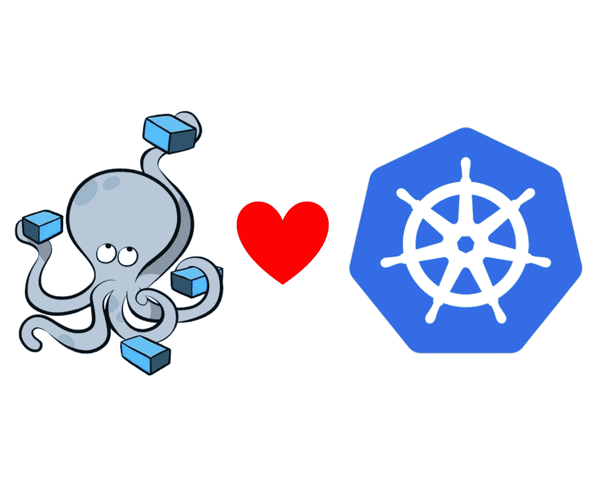
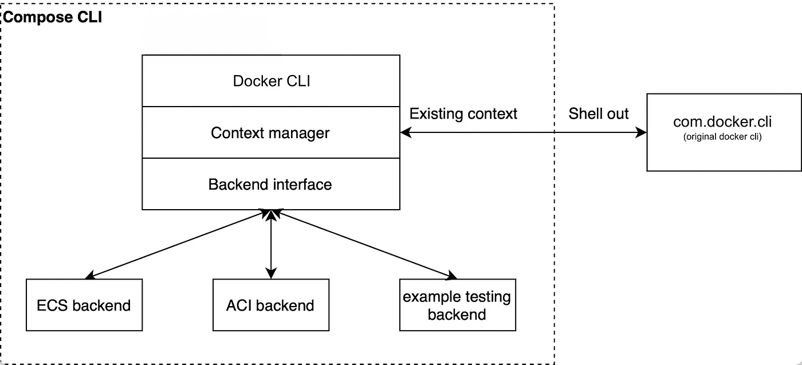
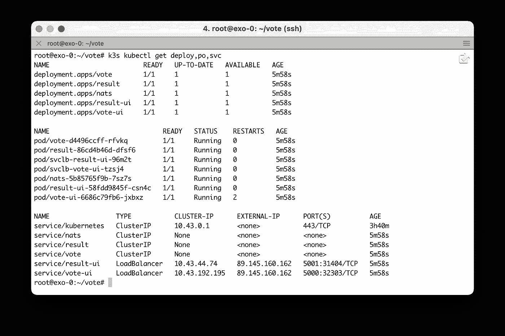

# 如何在 Compose CLI 中构建 Kubernetes 后端？

> 原文：<https://itnext.io/how-to-build-a-kubernetes-backend-in-compose-cli-7ec79b071700?source=collection_archive---------0----------------------->

## …并使用它将合成应用程序直接部署到 K8s 中



Docker Compose 是 Docker 的一个很棒的工具，数百万人使用它来部署和管理多容器应用程序。Docker 撰写基本上是两件事:

*   Compose 文件是 yaml 中的一个规范(默认情况下名为*Docker-Compose . YAML*), Docker Compose 将它作为输入。这个文件定义了容器化应用程序的组件以及它们是如何连接在一起的。应该是按照[编写规范](https://compose-spec.io/)编写的，规范的细节可以从[这个库](https://github.com/compose-spec/compose-spec/blob/master/spec.md)里得到
*   Docker Compose 是处理这个合成文件的工具:它检查它是否是根据合成规范编写的，并部署应用程序组件

来自 Docker 的安卡·约尔达切解释了 Compose 规范的公开化，以及她是如何作为一个附带项目开始为 Compose CLI 开发 kube 后端的:

> “由于其简单性，Compose 格式在开发人员中非常受欢迎，人们总是对在平台上部署 Compose 文件的工具感兴趣，而不是单个 Docker 引擎或 Swarm。为了让 Compose 超越 Docker 和 Swarm，在 2020 年初，我们开放了 Compose 规范，使任何人都可以围绕它构建工具。我们使用新的开放规范和参考库在 Docker CLI 中构建对 Amazon ECS 和 Microsoft ACI 的支持，以便在这些平台上部署 Compose 应用程序。一个明显的下一个目标是 Kubernetes，因为它非常受欢迎，人们对在其上部署 Compose 应用程序非常感兴趣。我们写了一个初步的概念证明来测试这种集成，但它还没有被添加到 Docker 的产品路线图中。我把它作为我的黑客项目，继续在这个集成上取得进展。Kubernetes 后端的当前代码可以在公共存储库 [docker/compose-cli](https://github.com/docker/compose-cli) 中找到，欢迎每个人对其做出贡献。”

正如 Anca 所说， [Compose CLI](https://github.com/docker/compose-cli) GitHub 存储库是托管不同后端的地方:

[](https://github.com/docker/compose-cli) [## docker/compose-cli

### 这个编写 CLI 工具使运行 Docker 容器和 Docker 编写应用程序变得容易:在本地作为一个命令在…

github.com](https://github.com/docker/compose-cli) 

但是，等等…我们谈论的后端到底是什么？

下面的图片(来自 compose-cli GitHub 库的图片的略微修改版本)使事情变得更加清楚:



来自 https://github.com/docker/compose-cli[的修改图片](https://github.com/docker/compose-cli)

后端是 Compose API 的一个实现，每个后端针对一个特定的平台(Amazon ECS，Azure ACI)。另外，Docker compose 是这个 compose api 的 cli 客户机。

我们如何选择我们想要使用的后端？

Docker compose cli 知道使用哪个后端的方式是通过当前使用的 Docker 上下文。从"*docker context create-help "*命令中，我们可以看到 **aci** 和 **ecs** 上下文都可以在更常见的 Docker 引擎之上创建:

```
Create docker engine context:
$ docker context create CONTEXT [flags]Create Azure Container Instances context:
$ docker context create aci CONTEXT [flags]
(see docker context create aci --help)Create Amazon ECS context:
$ docker context create ecs CONTEXT [flags]
(see docker context create ecs --help)
```

因此，基于当前上下文选择后端。

目前有 3 个官方后端:

*   **本地**:部署在本地机器上。这个后端是 [Compose V2](https://docs.docker.com/compose/cli-command/) ，它将作为 CLI 插件发布，取代原来的 python docker-compose
*   **aci** :部署在 [Azure 容器实例上](https://docs.docker.com/cloud/aci-integration/)
*   **ecs** :部署在[亚马逊弹性容器服务](https://docs.docker.com/cloud/ecs-integration/)

除此之外，Anca 还在开发后端项目 kube。该后端将允许在 Kubernetes 集群上部署一个组合应用程序。

在接下来的部分中，我们将详细介绍用于设置整个环境的步骤。因为这个项目还很年轻，没有附带 Docker CLI，所以有必要从源代码编译它，但是你会发现它并不复杂。

# 设置环境

**Linux 虚拟机**

首先，我们创建一个 Ubuntu 虚拟机。为了这篇文章的目的，我用 Terraform 配置文件在一个伟大的欧洲云提供商 Exoscale 上创建了它。

```
**$ terraform apply** ...
Outputs:instances_names = {
  "exo-0" = "89.145.160.162"
}
```

以下指令将通过新虚拟机中的 shell 运行。

**码头工人安装**

接下来，我们在其中安装 Docker，这可以通过下面这个方便的命令来完成:

```
$ curl -sSL [https://get.docker.com](https://get.docker.com) | sh
```

**获取撰写 CLI 报告**

接下来，我们获取 Compose CLI 源代码并移入其中

```
$ git clone [https://github.com/docker/compose-cli.git](https://github.com/docker/compose-cli.git)
$ cd compose-cli/
```

编译编写命令行界面

🔥下面的几个说明是必需的，因为 kube 后端没有在 Compose 版本中发布，它需要从源代码中构建。

首先我们需要安装 *make* 实用程序:

```
$ apt-get install make
```

然后我们可以针对 compose-cli 项目运行它:

```
$ make
```

编译是在一个容器中完成的，只需要几分钟。然后在*中创建一个新的 *docker* 二进制文件。/bin* 文件夹(旁边是一个 docker-compose 二进制文件，我们在这个例子中不会用到它)。

```
root@exo-0:~/compose-cli# tree bin
bin
├── docker
└── docker-compose
```

为了使用新的 docker 二进制文件，我们需要将之前的二进制文件重命名为 *com.docker.cli* ，并将当前的二进制文件移动到 PATH 中

```
$ mv /usr/bin/docker /usr/bin/com.docker.cli
$ mv ./bin/docker /usr/bin/docker
```

它目前的工作方式是: *compose* 子命令将由我们刚刚构建的 *docker* 二进制文件处理，所有其他命令(容器、图像……)将由 *com.docker.cli* 二进制文件运行。

**Kubernetes 集群**

下一步是创建一个 Kubernetes 集群。我们将采用简单的方法，建立一个本地单节点 [k3s](https://get.k3s.io) 集群。只需一个命令(几十秒钟)就可以启动并运行集群:

```
$ curl -sSL [https://get.k3s.io](https://get.k3s.io) | sh
```

k3s 自带 kubectl 二进制文件，这使得直接检查集群是否正在运行变得容易

```
$ k3s kubectl get nodes
NAME   STATUS   ROLES                  AGE   VERSION
demo   Ready    control-plane,master   87s   v1.21.1+k3s1$ kubectl get pods -A
```

我们只是把 k3s 创建的 kubeconfig 文件(位于*/etc/rancher/k3s/k3s . YAML*)复制到默认的 *~/中。kube/config，*我们将在后面的步骤中需要它。

```
$ cp /etc/rancher/k3s/k3s.yaml ~/.kube/config
```

我们需要创建的最后一件事是 Docker 上下文。我们使用 **kubernetes** 类型选择默认的 *kubeconfig* 文件( *~/)。kube/config* )来获取集群的信息:

```
**$ docker context create kubernetes k3s** ? Create a Docker context using: Context from kubeconfig file
? Select kubeconfig context default
Successfully created kube context "k3s"
```

然后我们需要使用这个新的上下文:

```
$ docker context use k3s
```

现在我们应该看到“compose”子命令是可用的。它会生成一个空列表，因为我们还没有部署应用程序:

```
$ docker compose ls
NAME                STATUS
```

我们已经安装了 Compose CLI，现在可以开始使用了。在下文中，我们将展示如何部署一个示例应用程序

# 在示例应用程序上使用 kube 后端

kube 后端实现了 Docker Compose 命令，用于在 Kubernetes 集群上部署容器化的应用程序。

注意:由于这个后端不是官方的，我们需要考虑到并不是所有的编写命令都被实现了，只有下面的命令被实现了:

*   docker 组合起来部署一个组合应用程序
*   *docker compose ls* 列出当前部署的合成项目
*   *docker 编写 ps* 列出 pod
*   *docker compose exec* 在容器中运行 shell
*   *docker 编写日志*以获取一个容器的日志
*   *docker 撰写关闭*卸载撰写应用程序

此外，并不是所有在合成文件中定义的属性都会被考虑在内

为了说明 kube 后端的用法，我们将使用投票应用程序 v3 的简化版本(如[https://gitlab.com/voting-application/config](https://gitlab.com/voting-application/config)中所定义的)。

```
**$ cat <<EOF > compose.yaml** services:
  nats:
    image: nats:2.2-alpine3.13
    expose:
      - 4222:4222
  vote:
    image: registry.gitlab.com/voting-application/vote:v3
    expose:
      - 80
  vote-ui:
    image: registry.gitlab.com/voting-application/vote-ui
    ports:
      - 5000:80
  result:
    image: registry.gitlab.com/voting-application/result:v3
    expose:
       - 80
  result-ui:
    image: registry.gitlab.com/voting-application/result-ui
    ports:
      - 5001:80
**EOF**
```

在部署应用程序之前，我们可以检查 kubernetes 的规范，这会产生:

*   描述该项目的 README.md 文件
*   包含项目元数据的 Chart.yaml
*   应用程序的每个微服务的部署和服务

[要点](https://gist.github.com/lucj/a75b29e671f84b4a1e8da5f7dbc9c0b6)中输出是命令*docker compose converter*的结果，它从 *compose.yaml* 文件中生成 Kubernetes 规范

🔥目前，在 Compose 文件中定义的服务是在 Helm 档案中转换的，但是这种行为在不久的将来可能会改变，直接访问 Kubernetes API，从而避免 helm vendoring。

我们现在可以测试应用程序的部署了

```
**$ docker compose up** [+] Running 7/7
 ⠿ Convert Compose file to Helm charts      0.0s
 ⠿ Install Compose stack                    0.4s
 ⠿ nats                                     22.5s
 ⠿ vote                                     22.5s
 ⠿ result                                   22.5s
 ⠿ vote-ui                                  22.5s
 ⠿ result-ui
```

使用 kubectl，我们可以看到已经创建了部署和服务。



使用上面信息中指定的节点端口，我们可以访问投票界面，为我们最喜欢的小猫投票。


几个组合命令可用于获取信息和管理应用程序的整个生命周期:

*   列出用 compose-cli 创建的项目。只有当前项目出现在这个列表中，它被命名为 vote，因为它是从 *vote* 文件夹中运行的。

```
**$ docker compose ls** NAME                STATUS
vote                deployed
```

*   列出创建的窗格

```
$ docker compose ps
```

*   我们可以在容器中运行 shell

```
$ docker compose exec www bash
```

*   还要检查正在运行的容器的日志

```
$ docker compose logs nats
```

一旦我们完成了我们的测试，我们可以简单地删除项目，因为我们已经习惯了:

```
$ docker compose down
```

## 关键要点

这个 kube 后端仍处于起步阶段，但绝对是一个伟大的举动，它将在 Compose 规范中定义的应用程序和 Kubernetes 资源之间架起一座桥梁。

想尝试一下这个项目，甚至为它做点贡献吗？不要再想了，勇往直前:)

非常感谢来自 Docker 的 Anca 约尔达切启动了这个 kube 后端，并花时间向我展示了代码的当前状态，并一步一步地展示了如何通过一对一的视频通话来设置整个事情👍也感谢她对这篇文章的详细评论，以及她在 Docker 博客上写的所有精彩文章。