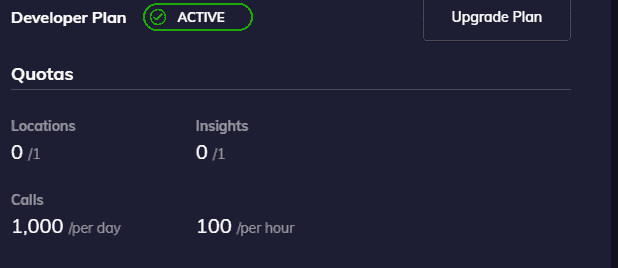
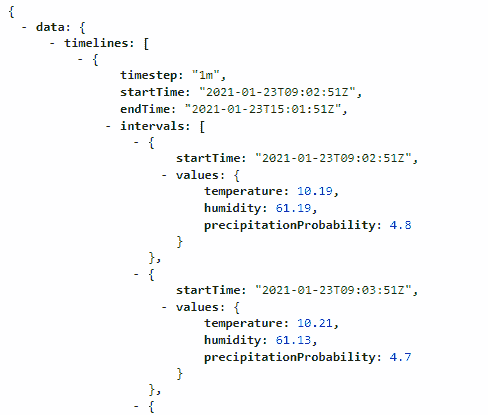
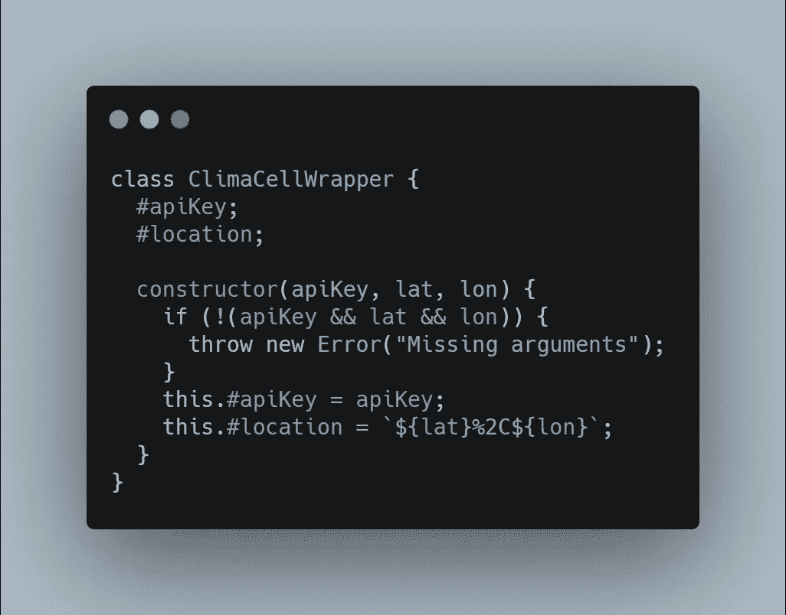
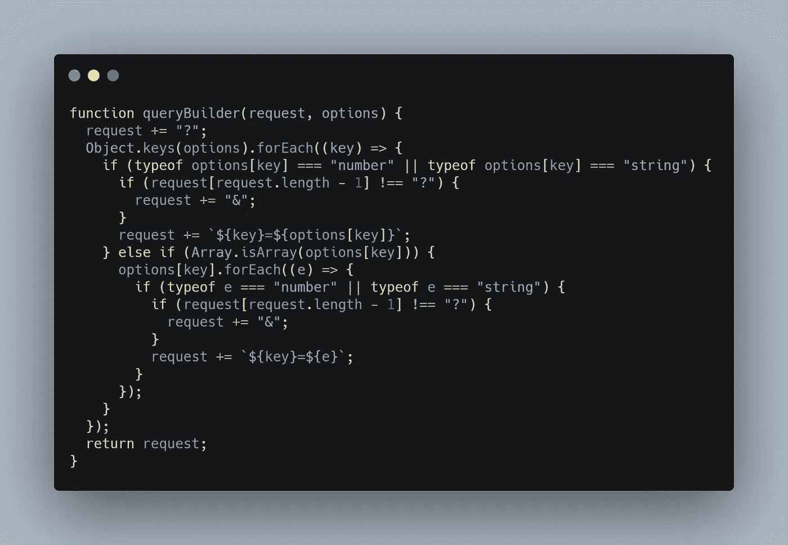
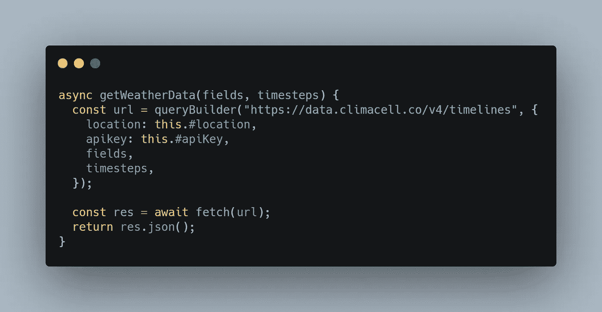
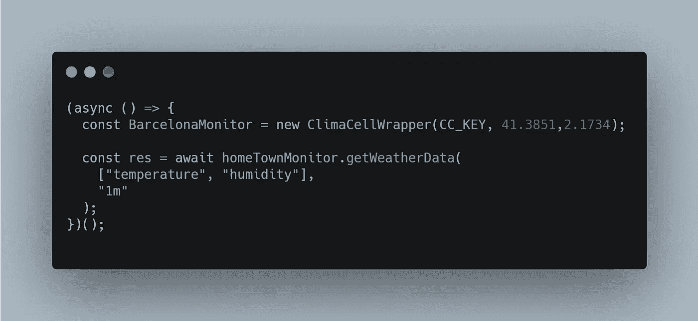

# 如何为天气 API 构建 NodeJS 包装器

> 原文：<https://itnext.io/how-to-build-a-nodejs-wrapper-for-a-weather-api-28404caedfdb?source=collection_archive---------0----------------------->


由 [Unsplash](https://unsplash.com/?utm_source=unsplash&utm_medium=referral&utm_content=creditCopyText) 上的 [Mael BALLAND](https://unsplash.com/@mael_balland?utm_source=unsplash&utm_medium=referral&utm_content=creditCopyText) 拍摄的照片

如果您点击了这篇文章，您可能希望将天气 API 集成到您的应用程序中。也许这是一个需求，而您的应用程序主要面向天气数据，或者只是一个增强。这个想法是你需要获得一些天气信息，并用它们做一些事情。

大多数 API 使用 REST、GET 和 POST 调用与客户端通信并发送所需的数据。通常，您必须为 GET 请求创建一个长的 URL，或者创建一个复杂的 POST 主体，其中还包含一些其他的头。您可以将这些 get 或 POST 调用封装在一些易于使用的函数中，并使它们在整个项目中都可用，而不是每次想要获取天气数据时都编写这些调用。

毕竟， [DRY](https://deviq.com/principles/dont-repeat-yourself) 是编程的核心原则，我们在这里也应该应用它。

在本文中，我们将看到一种可以围绕天气 API 构建小型包装器的方法。

主要思想是封装收割代码，并通过函数、方法或属性公开其功能。

作为编程范例，我们将使用 [OOP](https://en.wikipedia.org/wiki/Object-oriented_programming) 并将代码封装在一个类中。

# 代码

对于本文，我选择使用 Tomorrow.io [天气 API](https://www.tomorrow.io/weather-api/) 。这是一个免费使用的 API，提供了多个数据层。你可以用它来获取有关空气质量、花粉火灾风险等数据。文档也非常全面，易于理解，为开发人员提供了许多资源和指南。

最重要的是，通过最新的 API 更新，所有端点都在一个数据调用中被折叠，因此引入接受任何天气查询的一体化端点使集成变得更加容易。

如果您有不同的天气 API，您仍然可以修改本文中的代码并应用相关的模式。

**第一步:项目设置**

我们正在为应用程序的后端构建一个 NodeJS 包装器。项目设置非常简单。

打开一个新的命令行，在你想要的文件夹中运行命令`npm init -y`，然后运行命令`npm i node-fetch`。这将创建文件`package.json`并安装模块 node-fetch，这是一个轻量级模块，将`window.fetch`引入 Node.js

要完成这个设置，需要创建一个 index.js 文件并导入 node-fetch 模块。

`const fetch = require("node-fetch");`

**第二步:文档**

为了构建 API 的包装器，我们首先需要与 API 进行通信。在这种情况下，API 的[文档](https://docs.climacell.co/reference/migrating)是我们最好的朋友。这是来自 Tomorrow.io 文档的 URL:

`[https://data.tomorrow.io/v4/timelines?location=LAT%2CLONG&fields=FIELD_NAME&timesteps=1m&apikey=API_KEY](https://data.tomorrow.io/v4/timelines?location=LAT%2CLONG&fields=FIELD_NAME&timesteps=1m&apikey=API_KEY)`

要从该提供商处获取天气数据，我们需要提供:

*   我们想要的位置的纬度和经度
*   我们的 API_KEY
*   时间步长: **1m** 为实时， **1h** 为每小时， **1d** 为每日数据。

`fields`参数将是一个包含字段的数组，我们需要获取这些字段的数据。这些值在[数据层](https://docs.climacell.co/reference/data-layers-overview)下可用。

API_KEY 可以通过在他们的平台上创建一个免费账户来获得。他们提供了一个免费的 API 密匙，每天最多只能使用 1000 次。



从这些信息开始，假设我们想要实时获得巴塞罗那的温度、湿度和降水概率。我们需要向以下 URL 发出 GET 请求:

`[https://data.tomorrow.io/v4/timelines?location=41.3851%2C2.1734&fields=temperature&fields=humidity&fields=precipitationProbability&timesteps=1m&apikey=API_KEY](https://data.tomorrow.io/v4/timelines?location=41.3851%2C2.1734&fields=temperature&fields=humidity&fields=precipitationProbability&timesteps=1m&apikey=API_KEY)`

为了测试这一点，您可以用自己的密钥替换 API_KEY，然后将这个 URL 粘贴到一个新的选项卡中，您应该会看到下面的输出。



默认情况下，数值将以**国际制**的**为单位。**如果你想检索**美国惯用单位的数据，**那么你必须添加参数`&units=imperial`。

# 第三步:包装

现在我们知道了如何编写 URL，我们可以开始编码了。

我们将从定义我们的类和构造函数开始。



构造函数将接收 API_KEY 和所需位置的坐标作为参数，并将它们存储为[私有字段](https://developer.mozilla.org/en-US/docs/Web/JavaScript/Reference/Classes/Private_class_fields)。

# 第四步:获取数据

正如我们之前提到的，在最新的 Tomorrow.io 更新中，所有端点都被合并到一个端点中，其中包含了我们需要的所有数据，因此我们需要创建一个通用方法来接收我们想要作为参数获取的字段，以及时间步长:实时、每日或每小时。

因为`node-fetch`是`window.fetch`的轻量级包装器，它不提供用查询参数构建复杂 URL 的方法。因此，为了使事情变得简单，我编写了一个简单的函数来为我们构建 URL:



请记住，我们的测试 URL 是:

`[https://data.tomorrow.io/v4/timelines?location=41.3851%2C2.1734&fields=temperature&fields=humidity&fields=precipitationProbability&timesteps=1m&apikey=API_KEY](https://data.tomorrow.io/v4/timelines?location=41.3851%2C2.1734&fields=temperature&fields=humidity&fields=precipitationProbability&timesteps=1m&apikey=API_KEY)`

我们可以使用这个助手函数 `queryBuilder()`来构建这个 URL。函数调用如下所示:

```
const url = queryBuilder("https://data.tomorrow.io/v4/timelines", {
 location: '41.3851%2C2.1734',
 apikey: API_KEY,
 fields:['temperature','humidity','precipitationProbability']
 timesteps:'1m',
});
```

现在，我们所要做的就是创建一个通用方法，通过提供`fields`数组和`timesteps`作为参数来获取我们想要的数据。



这个函数的目的是计算正确的 URL，将请求发送到 Tomorrow.io，并返回没有任何改动的响应。

# 第五步:如何使用它

要使用这个简单的包装器，我们需要使用我们刚刚创建的类实例化一个新对象，并调用`getWeatherData()`:



我们还可以包括来自其他数据层的字段。例如，如果我们希望了解温度、湿度以及空气质量，我们可以使用空气质量数据图层中的值更新字段数组:

`["temperature", "humidity", "particulateMatter25","particulateMatter10"]`

就是这样！基于这个 API，你可以进一步扩展这个简单的包装器。

在当前状态下，因为纬度和经度是作为构造函数中的参数发送的，所以您需要为每个想要监视的位置创建一个新的实例。如果您想监视多个位置，并且不想为每个位置创建一个新的对象，那么您可以创建一个[静态](https://developer.mozilla.org/en-US/docs/Web/JavaScript/Reference/Classes/static)方法，它将以相同的方式接收`fields`和`timesteps`，而且还接收`latitude`、`longitude`和`apikey`。