# 如何在 React 中构建生产力应用程序:第 1 部分

> 原文：<https://itnext.io/how-to-build-a-productivity-application-in-react-part-1-9f0c7ee65772?source=collection_archive---------1----------------------->

## 建立一个功能性的待办事项列表

如果你是一个开发者，你还没有听说过番茄工作法，我强烈建议你去看看。特别是作为一个全栈学生，我发现它是一个很棒的工具，可以跟踪我花了多长时间来处理新思想、新语言和新库。在学习 React 的时候，我整理了一个生产力应用程序，包括一个番茄定时器，我想我可以和大家分享一下。

学习 React 及其众多功能的最佳方式之一是构建一个生产力应用程序。我知道，我知道，这里有几十个这样的人，他们都可能比这个更好。但是，本教程将从头到尾向您介绍如何构建 React 应用程序:待办事项列表、待办事项输入表单、Pomodoro 计时器、搜索功能和本地存储登录验证。

要在 GitHub 上查看这个项目的代码，点击[这里](https://github.com/csinozich/productivity-app)。对于本教程，我将使用[创建反应应用](https://github.com/facebook/create-react-app)、[纱线](https://yarnpkg.com/en/)和[样式的组件](https://www.styled-components.com/)。本教程将一步一步地引导你，从创建你的 React 应用程序到用样式化的组件对它进行样式化。

# 创建和启动 React 应用程序

首先是第一步:让我们设置我们的 React 应用程序。使用 Yarn 和 Create React 应用程序，我创建了一个名为 *timer-tutorial* 的项目文件夹，其中存放了我的 React 应用程序:

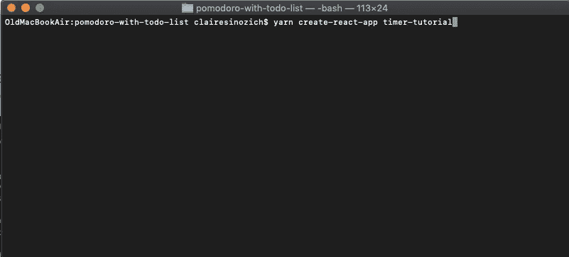

使用 Create React app 和 Yarn 创建 React App 的命令行

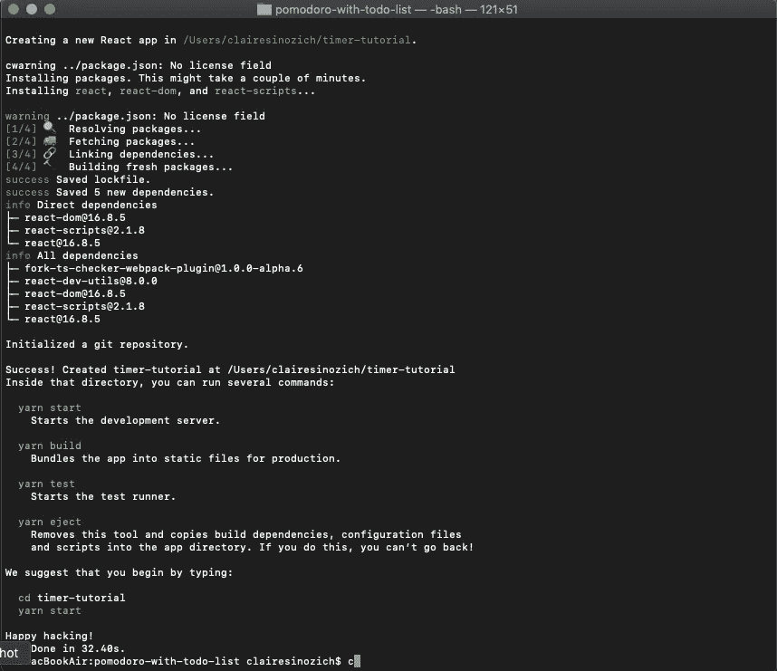

创建应用程序后，您的终端将为您提供要运行的后续命令的选项。

此时，您可以在您的终端中运行命令 *yarn start* ，您的应用程序将在带有 [http://localhost:3000/](http://localhost:3002/) 的浏览器中打开。当您打开您的文档时，您的文件树将如下所示:

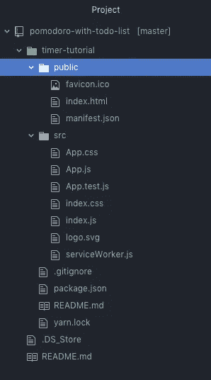

现在，如果您只是构建一个像这个定时器和待办事项列表这样的简单应用程序，可以随意删除其中的一些文件，以及它们在 javascript 文件中的引用。我通常会在开头删除 *logo.svg* 、 *serviceWorker.js* 和 *App.test.js* ，以及我所有的 CSS 文件(CSS 文件被删除是因为这个项目是用样式化组件进行样式化的)。这会给你一个干净的石板来开始你的项目！请记住，更复杂的应用程序将需要您保留其中的一些文件。

到目前为止，您的应用程序应该看起来像这样:

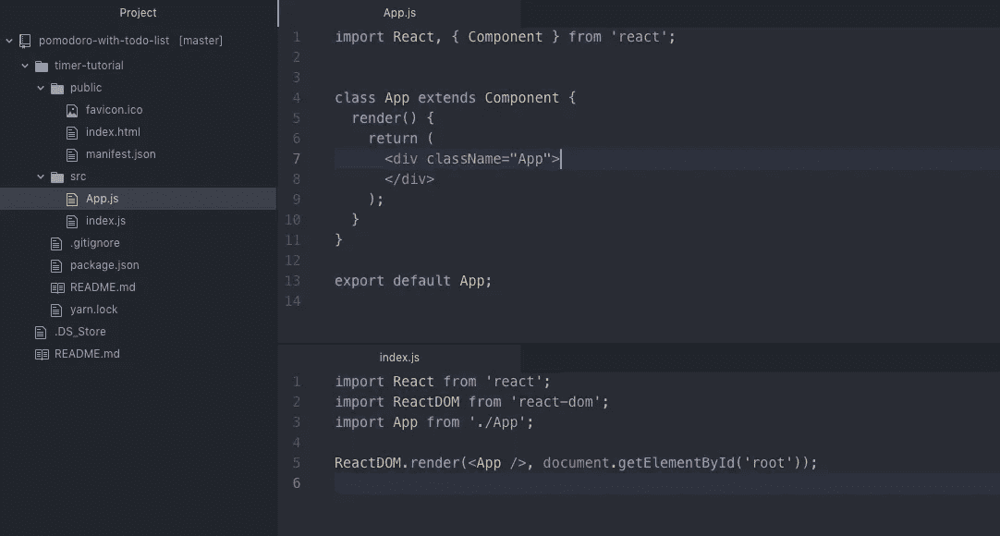

请注意显示 App.js 和 index.js 的拆分页面

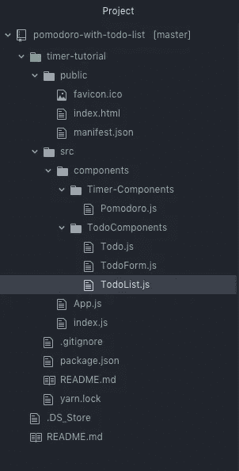

在这一点上，我更愿意基于我认为我将需要的组件，提前构建我的所有文件。我在这个项目开始时的文件树在下面，但是你当然应该以你认为最好的方式管理你的文件！请记住，您必须在您的 *src* 文件夹中构建这些文件树，最佳实践是拥有一个包含所有组件的*组件*文件夹。此外，你的目录和文件都应该有[语义命名惯例](https://library.si.edu/sites/default/files/tutorial/pdf/filenamingorganizing20180227.pdf)。

# 启动你的待办事项应用

此时，如果您删除了 *App.js* 文件中的内容以及 CSS 文件中的样式，您的本地服务器应该是完全空白的。

## 介绍状态

我们要做的第一件事是将状态引入我们的 *App* 类。我们的*状态*将包含任务和计时器的数据。让我们首先给 *state* 一个空数组来保存我们所有的待办事项，以及一个空字符串来保存一个单独的待办事项。

添加这些空的键-值对将允许我们以后在添加和删除待办任务时操作状态。如果这感觉像太多的“待办事项”使用，使用这些变量的其他名称！请确保在整个应用程序中保持一致。

让我们也给 *todos* 数组一些形式。这不会被正式实例化，但是我们将在构建应用程序时使用我们的 *todos* 的这些方面:

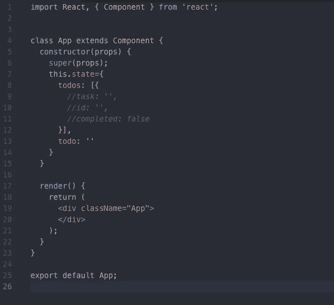

每个 *todo* 将包含一个任务名称、一个 id 和一个基于项目完成的布尔值。我们的每一个*待办事项*条目都将作为对象存在于我们的*待办事项*数组中，如上所示。

## 构建待办任务组件

现在，让我们进入我们的 *Todo.js* 文件。这是单独的 *todo* 组件将存在的地方，它们将在我们的 *TodoList.js* 文件中被重复呈现。现在，我们要做的就是构建一个基本的组件，稍后我们会回来添加样式和点击处理程序。

首先，构建一个以*道具*为参数的功能组件。一会儿我们将把道具从 *TodoList.js* 传递给 Todo。在功能组件中，返回 JSX 内部一个 div 和一个段落，任务名称用道具动态传递。请记住，我们的应用程序状态中有一个空白的 *todo* 项目。

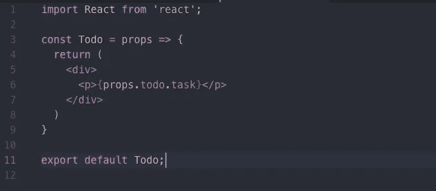

## 在待办事项列表中呈现我们的待办事项组件

现在我们将弹出到 *TodoList.js* ，在这里我们将呈现我们进入表单的 Todos。为了呈现我们的待办事项，我们必须创建一个功能组件，然后从我们之前定义的应用程序的 *this.state* 映射到 *todos* 数组。该数组当前为空！稍后我们将能够添加到它。

用。 *map* 方法需要一个回调函数，我们在这里匿名构建。我们将从 App 的 *this.state* 这里通过 props 传入每个 *todo* 。React 要求组件的子组件有唯一的标识符(称为*键*，所以我们也将传入每个待办事项的 id。然后使用我们的箭头函数，对于每个待办事项及其 id，我们将呈现我们的 Todo 组件。这里，我们成功地将数组中的每个待办事项作为道具传递给 Todo 组件。

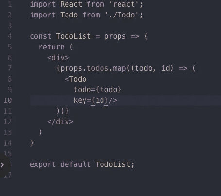

## 构建待办事项输入表单

我们的下一步是构建输入表单的基础，它将允许您添加任务。我们来构建一个功能组件，以 props 为参数(来自 App 的*状态*)，返回一个表单。在这个表单中，您需要一个输入(我已经添加了一些我们需要的细节，比如 *name* )，以及两个按钮:一个用于添加任务，一个用于删除已完成的任务。

在下一节中，我们将开始构建函数来确保您的输入被分配给 state，并且您的按钮是有效的。现在，我们就随它去吧。

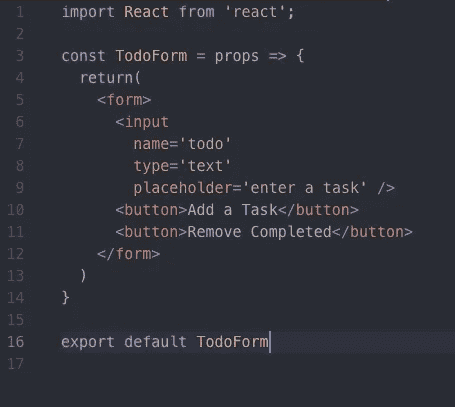

## 向我们的应用添加组件

为了完成我们的待办事项列表的设置，让我们确保我们已经通过我们的 *App.js* 文件渲染了组件，并传递我们现在需要的所有适当的道具。

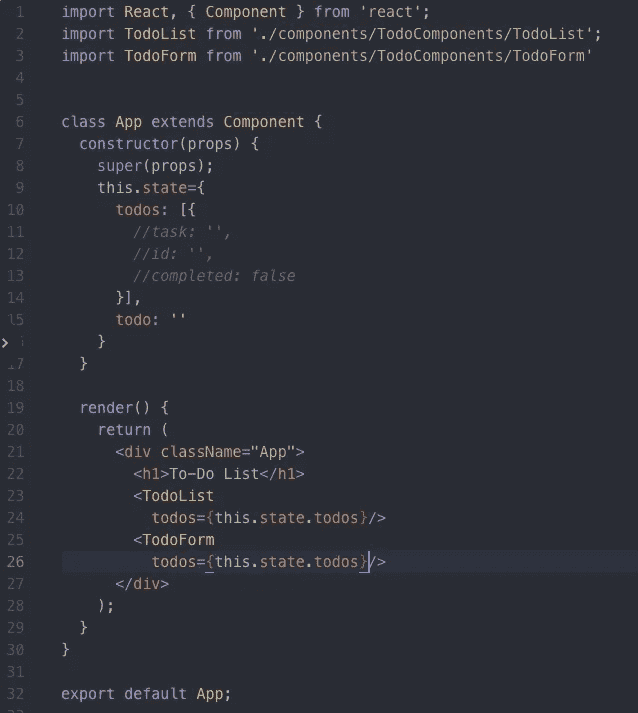

恭喜你！这样，您应该能够在浏览器中看到一个非常基本的应用程序:

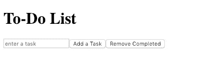

# 向我们的待办事项列表和表单添加功能

下一步是让待办事项清单真正发挥作用！让我们从输入函数开始。我们希望能够在我们的输入字段中键入任务，并将其添加到我们的状态中。我在可能的地方用功能组件构建了这个应用程序，所以我的所有功能都将存在于 *App.js* 中，在那里它们可以访问*状态*。

## 向表单输入添加一个更改处理程序

在下面的函数 *inputChangeHandler* 中，通过使用 *this.setState()* 在我们 App 的类组件上设置*状态*。输入更改处理程序将事件作为参数，将事件目标的名称设置为事件目标的值。这个函数实际上是将您输入到输入栏中的内容添加到 state 中。

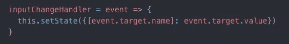

现在，让我们继续使用 props 将我们的函数和*值*变量从 App 向下传递到我们的 TodoForm。*值*变量作为我们的空 *todo* 字符串从应用程序的状态中传递。这是因为输入字段的值将是单个 *todo* 项目的名称。

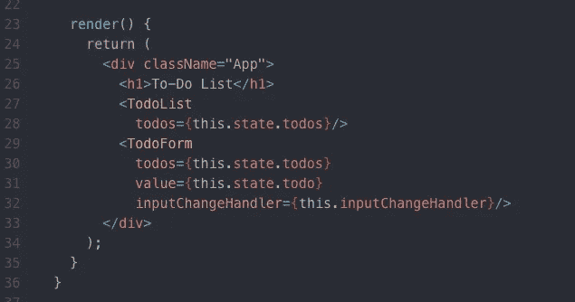

让我们使用 props 将我们的值和输入更改处理程序添加到我们的 TodoForm 组件中。我们的函数 *inputChangeHandler()* 将作为 onChange 函数传递到我们的输入字段，这样应用程序的*状态*将随着输入值的变化而设置。

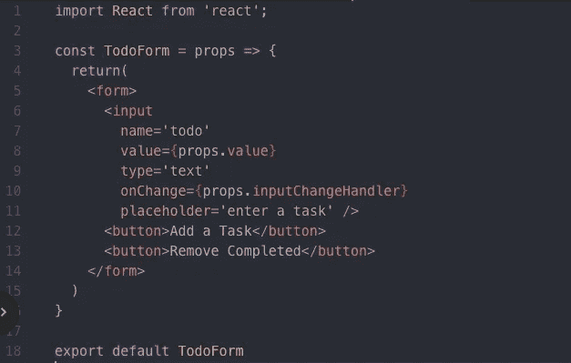

## 将任务添加到我们的待办事项列表

将 *inputChangeHandler()* 函数绑定到 TodoForm 之后，让我们为 Add a Task 按钮添加更多的功能。在您的 *App.js* 文件中，在您的类上创建一个名为 *addTask* 的方法。这个函数将接受一个点击事件，并创建一个新的任务，它是在我们之前布局的 *todo* 格式之后构建的。不要忘记使用我们的 *event.preventDefault()* 方法，这将阻止页面在每次添加新的待办事项时刷新。

在这个 newTask 中，您将任务的名称设置为 *this.state.todo* ，以将输入字段的值传输到 newTask。id 可以是任何东西，只要你能保证它们是每个任务的唯一标识符。这里，我使用了 Date.now()方法来自动捕获本地时间并将其作为 id 添加。而且，如果你在待办事项列表中添加一项任务，它肯定还没有完成！因此，将用于*已完成*的布尔值设置为假。

一旦你建立了一个新的任务，我们希望能够将它添加到显示在待办事项列表中的待办事项数组中。让我们使用 *setState()* 方法将 newTask 添加到 *this.state.todos* 中，使用 spread 操作符确保只有一个数组。之后，将 todo 重置为空字符串，以便可以再次填充。

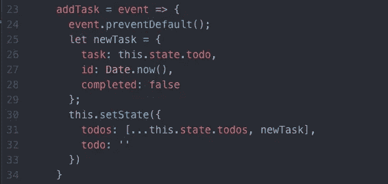

现在，我们将使用 props 将其传递给我们的 TodoForm 组件:

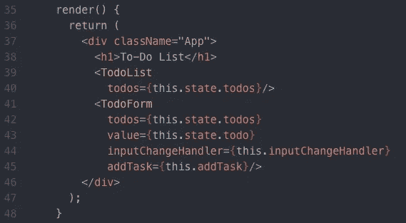

然后，我们将添加 *addTask()* 作为 onClick 函数到我们的*添加任务*按钮:

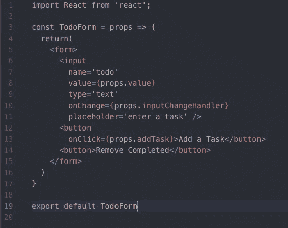

然后，*瞧！你现在可以在输入框中输入任务，当你点击按钮时，它会将任务添加到你的待办事项列表中。恭喜你！你已经用 React 正式建立了一个待办事项列表。*

准备好继续了吗？转到[第 2 部分](https://medium.com/@claire.sinozich/how-to-build-a-productivity-application-in-react-part-2-7a5f9b8fed3)，在这里我们将添加将项目切换为已完成的功能，并移除已完成的项目。