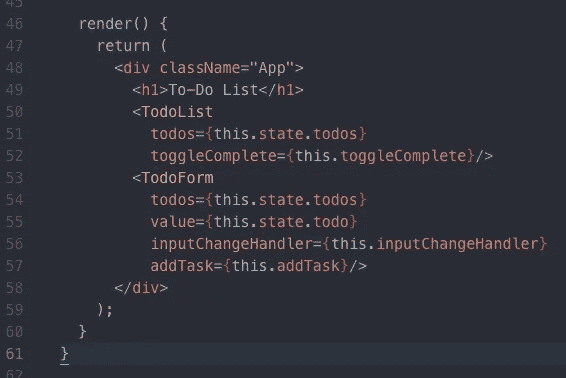
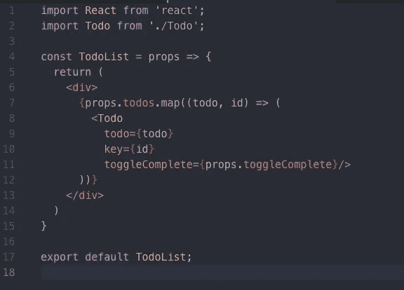
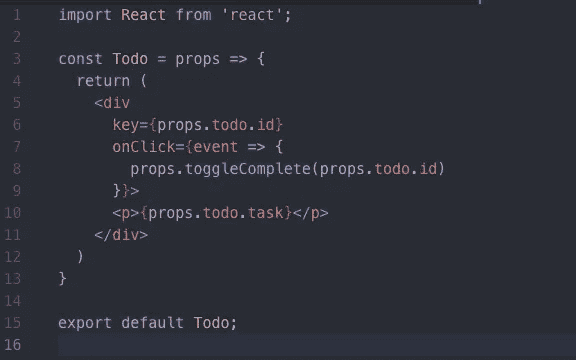
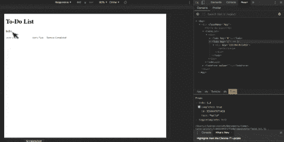
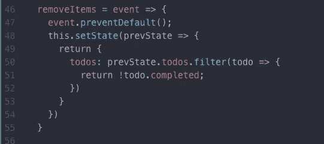
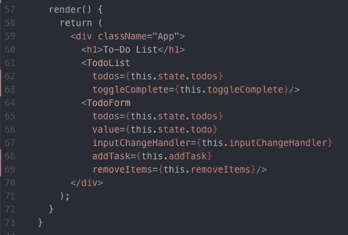
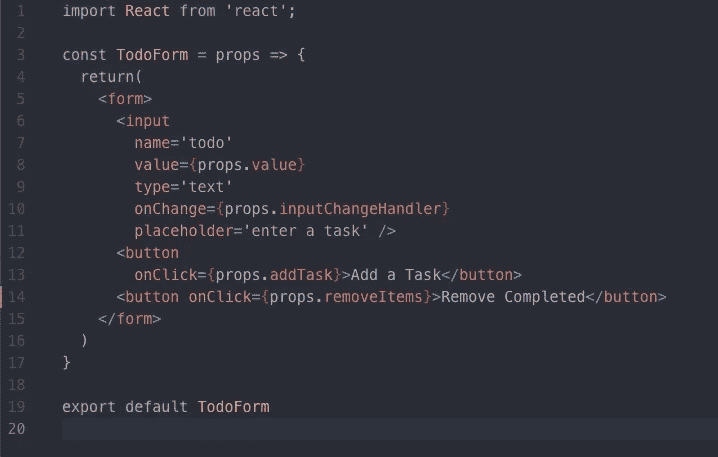

# 如何在 React 中构建生产力应用程序:第 2 部分

> 原文：<https://itnext.io/how-to-build-a-productivity-application-in-react-part-2-7a5f9b8fed3?source=collection_archive---------1----------------------->

## 切换道具和从待办事项列表中删除项目

嘿，伙计们。在我上一篇名为 [*如何在 react:第一部分*](https://medium.com/@claire.sinozich/how-to-build-a-productivity-application-in-react-part-1-9f0c7ee65772) 中构建生产力应用程序的文章中，我展示了如何使用同样名为[的来自脸书的 Create React App](https://github.com/facebook/create-react-app) 和用于设置开发服务器的 [yarn](https://yarnpkg.com/en/) 来创建 React 应用程序。我还演示了如何使用函数和类组件在 React 中创建待办事项列表，以及如何使用状态向该待办事项列表添加项目。

在本系列的第二部分中，我将介绍如何将项目标记为完成并删除已完成的项目。这部分教程的起始代码可以在 GitHub 库[这里](https://github.com/csinozich/productivity-app/commit/27838935a6db4b76dbeccf88ddbe874c91862df4)找到。

这一系列文章既是对你的启迪，也是对我的启迪，所以如果我做错了什么，请不要犹豫让我知道，或者提出问题。就这样，让我们开始吧！

## 将项目标记为完成

这部分教程的第一步是在 true 和 false 之间切换来自我们的 *todos* 数组的布尔 *complete* 。因为我在我的 *App.js* 文件中处理我的所有状态，所以我将在这里放置一个 *toggleComplete()* 方法。

这个 *toggleComplete()* 方法将一个唯一的标识符(这里称为 *itemID* )作为参数，然后映射到我们的 *todos* 数组，对照 *itemID* 检查我们的 *todo* 对象中的每个 ID。如果标识符相同，我们将 *todo* 对象上的 *completed* 值设置为与其当前状态相反的值，例如，如果 *todo.completed* 为真，则将 *todo.completed* 设置为假，反之亦然。这是允许我们切换*完成*布尔的原因。

但是，如果标识符不匹配，则返回不变的 *todo* 对象。现在，我们使用我们的 *this.setState()* 方法设置在 *toggleComplete()* 中声明的常量 *todos* (第 37 行)，然后将 *todo* 对象重置回空字符串。

现在，让我们将 *toggleComplete()* 函数传递给 *App.js* 中的 TodoList 组件:

让我们更进一步，将 *toggleComplete()* 传递给 *TodoList.js* 文件中的 Todo 组件:

最后但同样重要的是，我们将把我们的 *toggleComplete()* 方法赋予我们的 *Todo.js* 文件中的每个 Todo 组件:

## 使用 React 开发工具查看您的工作

瞧啊。您可以通过点击待办事项列表中的每项任务来切换您的*已完成*值。等等，那是什么？没用吗？其实是！不幸的是，我们根本没有给我们的应用程序添加任何样式，所以当你点击一个任务时，你看到的*和*没有什么不同。而且，因为我们还没有添加删除功能，所以更难看到。

如果你想看看这个切换功能的运行，请使用 Chrome 中的 [React 开发工具](https://chrome.google.com/webstore/detail/react-developer-tools/fmkadmapgofadopljbjfkapdkoienihi?hl=en)。打开您的应用程序，在您的 TodoList 组件中，您将找到您添加到屏幕上的 Todo 组件。如果您在底部的 todo 选项卡中查看显示 *todo{…}* 的道具，您将能够看到当您点击您的 Todo 时，道具*已完成*会打开和关闭。当我们稍后开始设计我们的应用程序时，这将更容易看到。

## 移除已完成的项目

让我们跳回我们的 *App.js* 文件，向我们的 App 类添加另一个方法。在这里，我调用了方法 *removeItems* ，它将一个点击事件作为参数。我们很快会将点击事件添加到我们的*移除已完成的*按钮中。

在我们的 *removeItems* 函数中，我们希望从使用我们的内置方法 *event.preventDefault()* 开始，这与我们的 *addTask* 函数一样，将阻止按钮在每次单击时刷新服务器。

之后，我们将通过使用回调函数来设置*状态*。这个回调函数将允许您检查 *prevState* ，或者*状态*的最近迭代(在这里阅读更多关于使用*状态*和*先前状态* [)。 *prevState* 存在于原始*状态*的对立面，在应用的构造函数中声明。](https://css-tricks.com/understanding-react-setstate/)

基于我们的 *setState()* 离开我们的 *prevState* (第 48 行)*，*，然后我们想要返回(第 49 行)一个新的数组 *todos* (第 50 行)。这个新的*todo*数组将使用我们的*来构建。filter()* 方法，该函数检查 *todos* 数组中的每一个 *todo* 项，看*完成*是否为真或假。在第 51 行，我们看到所有*已完成*为**假**(基于*前状态*)的项目被返回到 *todos* 数组。这个 *todos* 数组随后被设置为*状态*(第 48 行)，为您提供应用程序中尚未完成的任务列表。

现在，让我们把这个 *removeItems()* 函数交给我们应用程序中的 TodoForm 组件:

然后，将 *removeItems* 作为 onClick 添加到 TodoForm 组件中的 *Remove Completed* 按钮:

我们走吧！您现在可以从列表中删除已完成的项目。同样，在我们开始应用程序的样式化之前，这一点看起来有点困难。但是，继续尝试吧！您的应用程序现在应该可以顺利运行了。

这是关于如何在 React 中创建生产力应用程序的教程系列的第 2 部分。点击这里查看第 1 部分[，接下来，前往](https://medium.com/@claire.sinozich/how-to-build-a-productivity-application-in-react-part-1-9f0c7ee65772)[第 3 部分](https://medium.com/@claire.sinozich/how-to-build-a-productivity-application-in-react-part-3-a1c4e212fdcb)，在那里我们将很快把数据添加到本地存储中！