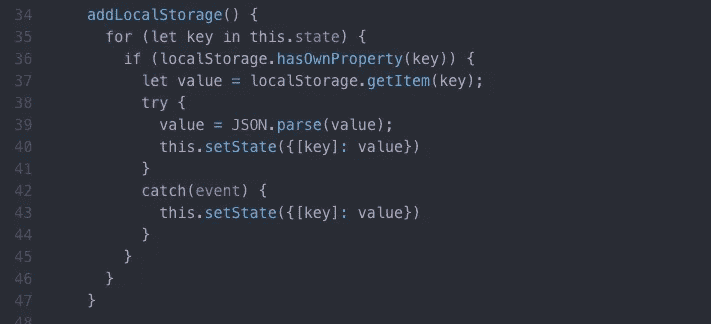
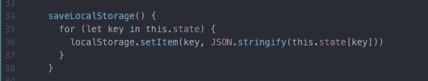
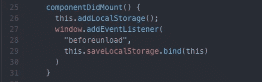
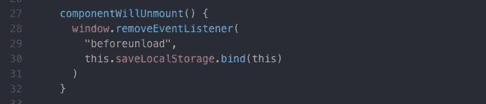
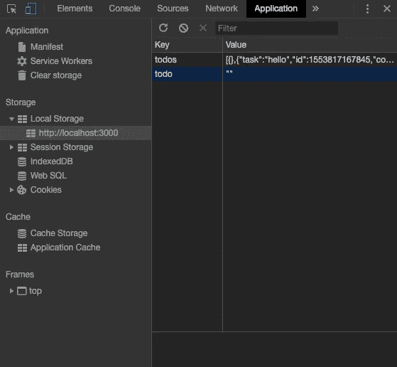

# 如何在 React 中构建生产力应用程序:第 3 部分

> 原文：<https://itnext.io/how-to-build-a-productivity-application-in-react-part-3-a1c4e212fdcb?source=collection_archive---------2----------------------->

## 将应用程序的数据添加到本地存储

欢迎回到我的教程，如何在 React 中构建生产力应用程序，第 3 部分！如果你错过了本教程的前两部分，请查看第一部分的[和第二部分的](https://medium.com/@claire.sinozich/how-to-build-a-productivity-application-in-react-part-1-9f0c7ee65772)。如果你刚刚开始阅读第 3 部分，这一部分的开始代码在 GitHub [这里](https://github.com/csinozich/productivity-app/commit/46dbb4fab6898a515a33b718fe564b9265af8705)。

在本教程的这一部分，我们将暂停更新应用程序的功能，继续将数据存储在浏览器的本地存储中。本地存储是一个非常普遍的 web API，它允许您在用户的浏览器中存储小块数据，这样当他们离开页面并稍后返回时，他们的数据会保存在您的应用程序中。如果你想了解更多关于 localStorage 在 Javascript 中是如何工作的，我可以看看这篇关于 localStorage 方法基础的文章。

提醒一下，这个系列既是对你的启迪，也是对我的启迪，所以如果我做错了什么，请不要犹豫让我知道，或者提出问题。就这样，让我们开始吧！

# 将您的应用程序数据存储在本地存储上

添加本地存储的第一步是在组件上设置一些生命周期功能。我们将设置我们的应用程序，使 localStorage 在退出应用程序时更新，然后在应用程序再次加载时再次呈现，而不是每次改变我们的*状态*时更新 localStorage。

## 将本地存储中的项目添加到我们的应用程序

我们首先在我们的 *App.js* 文件中给我们的应用程序一个名为 *addLocalStorage()* 的函数。该函数将获取所有处于*状态*的项目，对照本地存储中保存的数据检查唯一标识符，并将正确的数据呈现到屏幕上。一会儿我们将把这个函数添加到我们的生命周期中。

在我们的 *addLocalStorage* 函数中，我们将首先使用 *for* 关键字来检查存在于 *this.state* 中的所有项目。在这些条目中，我们将使用 *if* 关键字来确定处于*状态*的每个条目的唯一标识符(键)是否与本地存储中条目的唯一标识符(键)相匹配。当键匹配时，我们希望将这些项目返回到屏幕上。

首先，让我们声明一个名为 *value* 的变量，根据其唯一标识符从本地存储中抓取一个项目(使用 *getItem* 方法)。然后，同样在我们的 *if* 语句中，我们将使用一个 [try-catch 块](https://javascript.info/try-catch)。这种模式本质上试图执行我们的 *try* 块中的代码，如果失败，我们的 *catch* 块中的代码将会执行。这是一种错误处理的方法，以确保您的应用程序不会因错误而中断。

在我们的 *try* 块中，您将看到我们将值设置为另一个名为 *JSON.parse()的函数。*因为本地存储只能读取字符串，所以你必须包含这个方法来将这些项目字符串转换成 JavaScript 对象。然后，我们的应用程序可以将 JS 对象作为 todo 任务来读取。在我们解析之后，我们将用一个惟一的标识符将任务设置为从本地存储中提取的已解析的 JSON 值。

这个函数不会做任何事情，因为我们还没有将它添加到组件的生命周期中。但是别担心，我们会成功的！在我们开始我们的生命周期方法之前，让我们也添加一个 *saveLocalStorage* 函数。这个函数将收集关于我们的*状态*的所有信息，并在注销时将其保存到本地存储器。

## 将状态中的项目添加到我们的本地存储

虽然前面的函数将用于在加载应用程序时呈现项目，但我们还需要一个在离开应用程序时将项目添加到本地存储的函数。为此，我们将向我们的 *App.js* 文件添加一个名为 *saveLocalStorage* 的函数。该函数将收集所有关于*状态*的信息，并将其保存到本地存储器中。

当这个函数被调用时，我们将首先再次使用关键字的*，并检查处于*状态*的所有项目。对于其中的每一项，我们将使用 localStorage 上的 *setItem()* 方法，使用其唯一标识符和实际任务将每一项添加到我们的本地存储中。您将在这里看到方法 *JSON.stringify()* ，它接受每个 JS 对象任务并以字符串格式返回。我们这样做是因为，就像我们之前说过的，localStorage 只能读取字符串。*

## 将我们的方法添加到组件生命周期中

现在，我们将把我们的方法 *addLocalStorage()* 和 *saveLocalStorage()* 添加到组件的生命周期中。为此，我们将首先使用标准的生命周期函数， *componentDidMount()* 。在加载应用程序时，该函数将允许我们将那些已经保存到本地存储的项目提取出来，并将其呈现到页面上。

首先，我们将在装载页面时调用 *this.addLocalStorage()* ，这将把我们保存的每个待办任务呈现到页面上。之后，我们将在卸载之前向名为*的窗口添加一个事件监听器。这个事件监听器名副其实:它在卸载我们的应用程序时调用函数，并确保在我们卸载之前运行我们的 *saveLocalStorage()* 函数。*

之后，让我们确保在卸载应用程序时删除窗口上的事件侦听器，以便进行清理:

就是这样！现在，您应该能够将项目保存到本地存储。如果你想看到这被添加到本地存储的效果，请使用你的 Chrome 开发工具。在 Application 选项卡上，您应该会看到一个名为 local storage 的部分，它会在您每次向应用程序添加任务时进行更新:

去玩你的应用程序吧！你对你的每一段代码和 Chrome 开发工具的每一个方面越熟悉，你就越能理解。

这是关于如何在 React 中创建生产力应用程序的教程系列的第 3 部分。查看第 1 部分[这里](https://medium.com/@claire.sinozich/how-to-build-a-productivity-application-in-react-part-1-9f0c7ee65772)，第 2 部分[这里](https://medium.com/@claire.sinozich/how-to-build-a-productivity-application-in-react-part-2-7a5f9b8fed3)，并留意第 4 部分，加入我们的番茄定时器，即将推出！

*特别感谢*[*@*](https://hackernoon.com/@ryanjyost)*ryanjyost at HackerNoon 为他的* [*文章*](https://hackernoon.com/how-to-take-advantage-of-local-storage-in-your-react-projects-a895f2b2d3f2) *上本地存储着 React 项目。*