# 如何在 React 中构建生产力应用程序:第 4 部分

> 原文：<https://itnext.io/how-to-build-a-productivity-application-in-react-part-4-14f1ed04dc8f?source=collection_archive---------6----------------------->

## 创建番茄定时器

正如我在本教程的第一部分中所说的，创作这个系列的动机是我想做一个番茄定时器。我*喜欢*番茄工作法(不，这不是广告！)，尤其是因为它让我在参加在线课程的同时还能全职远程工作。

因此，在我们教程的第 4 部分，我们将建立一个小的倒计时器！这个计时器将从 25 分钟开始计时(番茄工作法的标准时间)。当它达到 0 时，计时器将重置为 5 分钟，并开始为您的休息倒计时。五分钟后，循环将重新开始！因为人无完人，我们将添加启动和暂停计时器的功能。

如果你一直在关注这个系列，很高兴你回来了！如果你是第一次加入我们，你想看看以前的材料，请检查零件 [1](/how-to-build-a-productivity-application-in-react-part-1-9f0c7ee65772) 、 [2](/how-to-build-a-productivity-application-in-react-part-2-7a5f9b8fed3) 和 3，并前往 [GitHub 库](https://github.com/csinozich/productivity-app)查看以前的代码。

## 设置我们的番茄定时器

让我们从设置应用程序来接收计时器功能开始。首先，我们将进入 *App.js* 并在我们的状态上放置一些键值对。如果你还记得的话，我们已经有了*todo*和 *todo* 的键值对。在这里，我们将添加:

*   *休息分钟*代表 5 分钟的休息间隔，设置为 5。
*   *工作分钟*代表 25 分钟的工作周期，设置为 25。
*   *秒*表示整分钟之间的倒计时，设置为 0。(这样想吧:你会从 25 分 0 秒开始，那么我们的计时器会移动到 24 分 59 秒，58 秒，57 秒……所以我们要从 0 开始。
*   *break* 是一个布尔值，告诉你的应用程序是否应该显示 *restMinutes* 。我们首先将它设置为 false，因为我假设您没有以休息开始一天的工作！
*   *start* 是一个布尔值，其功能与 *break* 相反。它告诉应用程序是否应该显示*工作分钟*。我们也将把这个设置为 false，这样你的计时器就不会在你加载应用程序时就开始计时，并给它一个*开始按钮*来启动你的计时器。
*   *interval* 指的是计时器动作之间的时间间隔。你的计时器改变它的倒计时被认为是一个动作，将在一个设定的*间隔*毫秒内完成，这个间隔稍后将被添加到你的浏览器中，然后被清除。我们稍后将对此进行更深入的探讨！

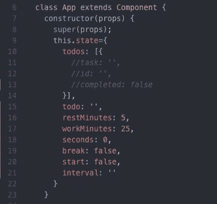

让我们用一个功能组件快速地在组件目录中设置我们的 *Pomodoro.js* 文件。我们不会在这个文件中操作状态，因为我们会将所有的函数放在我们的 *App.js* 文件中。然而，我们将传入*道具*。我们将需要*道具*来跟踪我们的*中断/启动*开关，以及我们的*休息分钟*、*工作分钟*和*秒*。

该功能组件将返回一个段落标记，我们将在那里放置倒计时器，从 25:00 开始。下面是我们的按钮，它会根据我们的状态在*暂停*和*启动*之间切换。

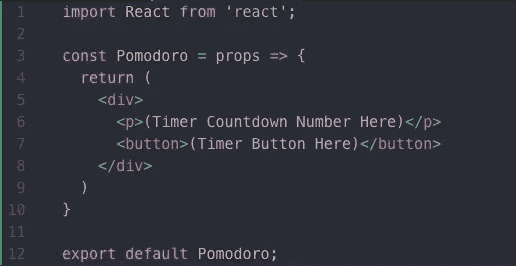

现在，在我们开始我们的定时器功能之前，继续在 *App.js* 中导入您的 *Pomodoro* 组件，并将其添加到我们的 App 类组件中。

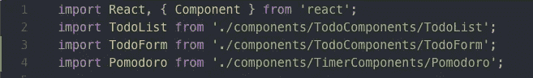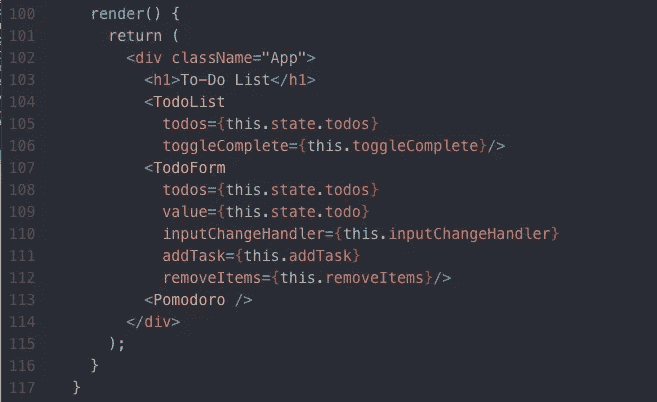

## 构建番茄定时器功能

让我们开始我们的定时器功能。首先，在 *App* 组件中构建一个名为 *timer* 的函数。我们在*定时器*函数中要做的第一件事是为我们的秒数设置*状态*。这是我们计时器最基本的部分:我们的*状态*上的*秒*将从 0 开始，移动到 59，并再次倒计时到 0。一旦我们的计时器到零，秒就会重置。我们将使用如下的三元运算来构建这个功能。

如果你不熟悉三元运算符，可以查看一下 [MDN 文档](https://developer.mozilla.org/en-US/docs/Web/JavaScript/Reference/Operators/Conditional_Operator)，以及一些很棒的文章[这里](https://codeburst.io/javascript-the-conditional-ternary-operator-explained-cac7218beeff)，这里[这里](https://scotch.io/tutorials/understand-the-javascript-ternary-operator-like-abc)。三元运算符本质上是条件语句，以类似于 *if/else* 语句的方式运行代码。就个人而言，我喜欢在有必要保持一行简短的情况下使用它们。当在语句中执行的代码更复杂时，我经常使用 *if/else* 语句。因此，在本教程中，你会看到我同时使用这两种方法。

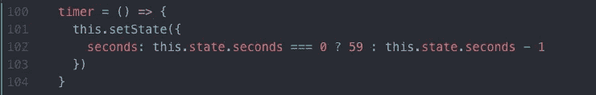

处理微小的功能会稍微复杂一些。我们需要从一个 *if* 语句开始，检查 *break* 是否被设置为真或假。如果设置为真，我们将*在我们的分钟上设置状态*，检查我们的秒钟是否从我们的总计数中减去一分钟。我们将再次使用一系列三元运算来实现这一点:

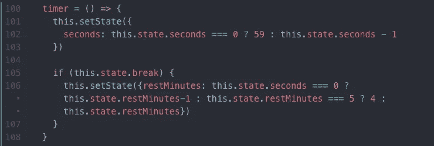

在此之后，我们将添加另一个 *if* 语句。如果前面的 *if* 语句为 *restMinutes* 返回-1，我们将重置 *break* 为假，重置 *restMinutes* 为 5。此声明也将启动我们的*工作分钟*。

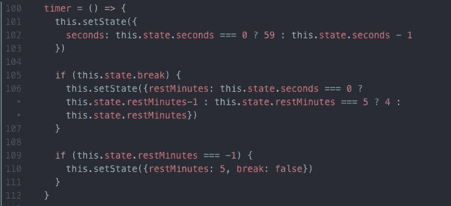

最后，对于该功能，我们将在 *else* 语句下添加相同的逻辑，以充实*工作分钟的相同倒计时。*嵌套的 *if* 语句也将负责复位，将*工作分钟*推回到 25 并中断到 *true* 。

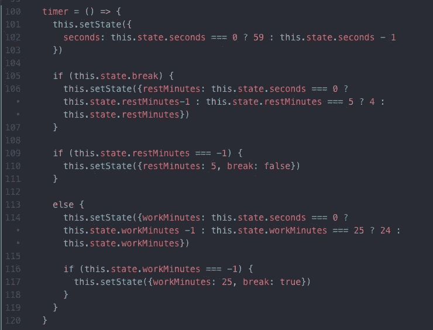

最后，让我们在我们的 *App.js* 文件中传递我们的番茄计时器所必需的所有道具，并呈现我们的计时器。在我们的 *App* 组件的 render 函数中，将我们的 *timer* 函数和我们的其他相关项 *state* 传递给 *Pomodoro* 组件。

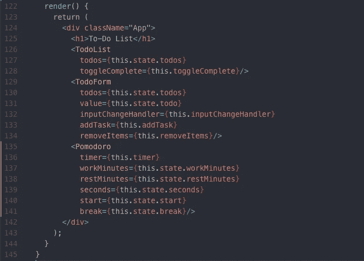

然后，我们将在我们的 *Pomodoro.js* 文件中使用一个三元函数来正确显示计时器的分钟和数字。该函数适用于十以下的数字；当低于十秒时，0 将显示在*秒*计数的前面。

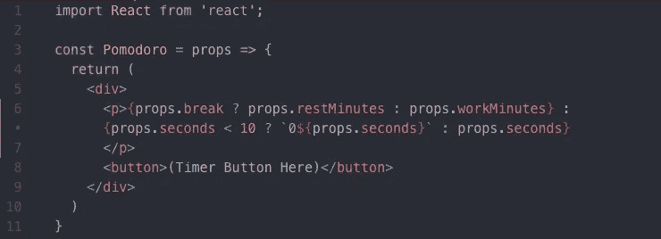

此时，您应该能够进入本地服务器并查看一个显示 25:00 的暂停计时器。接下来，让我们为计时器添加启动和暂停功能。

## 开始和暂停功能

进入 *App.js* 添加一个函数(我的叫做 startTimer)。在我们的函数内部，我们将*设置状态*来更新我们的*间隔*和*开始*键值对。 *Interval* 将有 *setInterval* 方法，它接受一个函数和一个代表毫秒的数字。此外，我们将更新 *start* 以将其布尔值翻转到与当前状态相反的状态。

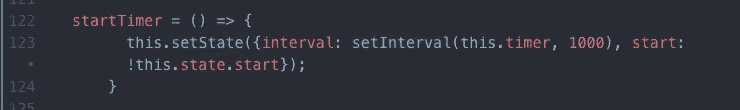

现在我们将添加另一个函数来暂停计时器(同样，不出所料，我的函数叫做 pauseTimer)。我们的暂停功能将利用**，就像我们在 *removeItems* 函数中所做的那样。基于计时器之前的状态，我们将返回状态项的静态版本。 *Start* 将被设置为 false(因为我们正在休息)，间隔将使用 *clearInterval* 清除，以停止计时器的动作。**

**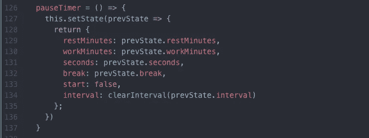**

**现在，让我们将这些功能传递给 *Pomodoro* 组件中的按钮。在我们的 *App* 组件的渲染函数中，让我们将函数作为道具传递:**

**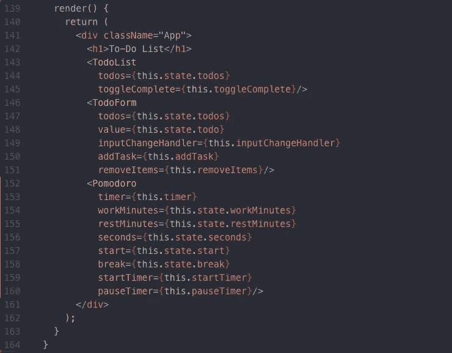**

**现在，在我们的 *Pomodoro.js* 文件中，我们将设置我们的按钮。首先，我们将添加一个 *onClick* 方法，该方法使用一个三元运算符来检查 *props.start* 是否被设置为 true。如果是的话， *onClick* 函数将是我们的 *pauseTimer* 函数。如果设置为 false， *onClick* 函数将是我们的 *startTimer* 函数。然后，我们还将使用一个三元运算符将按钮的文本改为*暂停*或*开始*，这取决于 *props.start* 是否设置为 true。**

**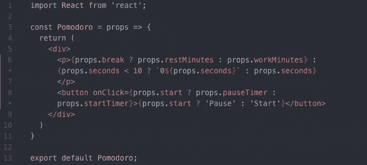**

**恭喜你！你已经完成了你的计时器。您可以随意调整时间，或者创建单独的暂停和开始按钮。请确保您理解每一个三元运算符，因为它们经常令人困惑。**

**这是关于使用 React 构建生产力应用程序的教程系列的第 4 部分。正如我以前说过的，这些对我和你都有启迪作用！如果我犯了什么错误，或者可以改进的地方，请告诉我。请查看下周发布的第 5 部分，在那里我们将使用样式化组件(React 的一个方便的样式化库)来样式化我们的(相对难看的)应用程序。**

***这个 Pomodoro 功能是与了不起的网络开发者* [*道格拉斯·乔丹*](https://www.douglasjordan.me/) *合作开发的。***