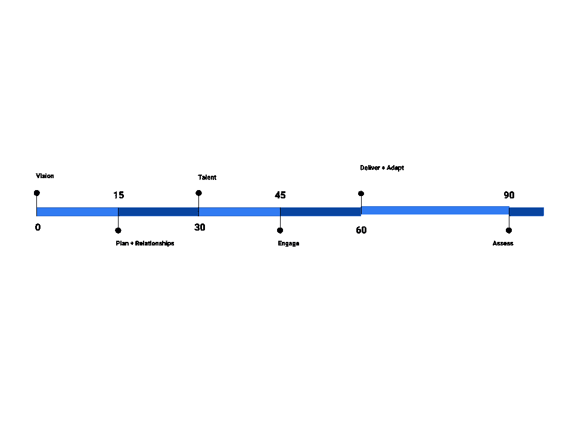

# 冲刺马拉松:如何在 90 天内建立一个敏捷项目管理办公室

> 原文：<https://itnext.io/how-to-build-a-project-management-organization-in-90-days-783b907f4a12?source=collection_archive---------4----------------------->

我最近在一家生物技术公司担任了 IT 领导的角色，在那里软件开发是一项关键能力，我有机会从零开始建立一个敏捷项目管理办公室(PMO)。这篇文章代表了我对项目管理和组织变革管理的敏捷和务实的观点。

## **有远见。**

良好的 PMO 能力是什么样的？把它作为 PMO 章程文件写下来。您的团队将需要这份使命陈述、原则和责任，以及您将如何衡量成功的 SMART 指标。这是你的真理，它将播下文化的种子，成长并引导你周围的团队。

就我而言，我的使命宣言是这样的:

*“我们的项目管理办公室(PMO)是一种面向服务的能力，其目的有三:*

*   *每次都能按时、按预算、高质量地交付成功的项目和产品。*
*   *为一致的 PP 交付建立一个原则性的、以标准为中心的、基于证据的基础。*
*   *发展成可重复、主动、可衡量和持续改进的 PP 流程和方法。”*

我对 PMO 基本职责的解释来自于 PMI PMBOK 文档，从敏捷/精益的角度出发。

*   范围管理—了解业务/技术需求；在 backlog 中定义史诗和故事。
*   时间管理——根据业务优先级安排 PP；对 WBS 中的积压项目进行排序和评估。
*   资源管理—识别、分配和监控资源分配；平衡供需。
*   财务管理—跟踪项目成本并与财务目标保持一致(例如，预算、IRR、ROI、NPV)。
*   变更管理—讨论、评估、记录和协商范围变更。
*   质量管理—确保 PP 可交付成果满足质量保证(QA)团队设定的质量标准。
*   风险管理——识别、评估和减轻项目风险。
*   供应商管理——采购产品/服务；监控供应商的表现和他们的 PP 可交付成果。
*   沟通管理—向领导层、项目团队和利益相关者报告项目状态。

## **计划项目管理办公室。**

是的，*甚至*PMO 本身也必须像其他项目和产品一样进行规划。你需要回答一个永恒的问题:什么时候由谁完成了什么？在我持续 180 天的计划中，我有 20 个项目。但是首先，首先。确保你与你的主管和组织的优先事项保持一致。

*   项目管理办公室(PMO)章程草案。
*   安排与利益相关者的介绍会议。
*   了解正在进行的项目和产品(PP)。
*   与利益相关方一起确定 PP 优先级。
*   管理需要立即关注的活动项目和产品。
*   草拟 IT 组合路线图、PP 仪表板和标准文档模板。
*   设想和设计 PMO 未来状态。
*   评估活动项目、系统和组织流程。
*   改进 PP 范围管理流程。
*   改进 PP 沟通管理流程。
*   改进 PP 变更控制管理流程。
*   改进 PP 风险管理流程。
*   改进 PP 资源管理流程。
*   改进 PP 质量管理流程。
*   每月建立 PMO 项目审计和评审。
*   建立 PMO 组合审计并按季度审查
*   建立 PMO KPIs、指标和绩效目标
*   改进 PP 财务管理流程。
*   评估 PMO 当前状态和前 90 天后的组织成熟度。

## 在整个组织内建立良好的关系。

找出谁是决策者，谁是影响者，谁在不同的部门完成工作。安排会议。去吃午饭。在公司欢乐时光联系。了解人们以及对他们来说什么是重要的。第一印象很重要！要有耐心；用时间赢得他们的信任。一旦人们站在你这边，那么小心翼翼地培养更广泛的联盟，这是组织变革所需要的。

## **慢慢雇佣合适的人。**

让合适的人上车，但请不要匆忙或不顾一切地去填补空座位。保持高标准。将角色和职责与才能结合起来。确保人们有正确的激励和决策权，这样你就不需要微观管理每一种情况。

## **决定团队流程、技术和文档模板。**

我的个人项目模板过于简约，我强调使用现有的组织工具(例如 **JIRA** 、**合流**和**谷歌**文档)而不是扰乱日常信息流。因此，当 PMO 新员工带着新的 Microsoft Office 模板向高级管理层展示我们的项目组合级工作时，常识告诉我们，我们要根据场景和受众混合使用工具和模板(例如，JIRA 和谷歌用于日常项目和文档管理，方便工程师，Office 用于高管演示)。

## **接合。信任但要核实。**

卷起袖子，参与细节。无论是与产品负责人的冲刺级规划还是与高管的组合规划(**范围**)，跨项目的依赖性跟踪(**风险**)，在架构讨论中提出可能影响未来多个产品的问题(**质量**)，与第三方(**供应商**)协商合同，联系团队领导以确保他们有足够的人员(**资源**)， 或者安排与关键利益相关者的每月检查点(**沟通**)，你需要对项目和产品需要帮助的不同方面保持警惕，并准备好提供帮助。

## **快速实现早期成功。评估。适应。**玩得开心！

成功就像滚雪球。早期的成功建立了可信度，并增进了重要的关系。确定对业务影响最大的唾手可得的果实。根据您的平衡计分卡，整合利益相关者的反馈。评估并适应变化。

工作可以很快变得严肃，但是当人们仍然可以微笑、大笑、*和*把事情做好的时候，你就会知道已经为项目管理办公室种下了合适的种子。

如何在 90 天内建立一个敏捷的项目管理办公室

*欣赏文章？关注我的* [*中的*](https://medium.com/@bishr_tabbaa) *和* [*推特*](https://twitter.com/bishr_tabbaa) *了解更多更新。*

**参考文献**

*   [敏捷宣言](http://agilemanifesto.org/)
*   约翰·科特的变革管理八步流程
*   史蒂夫·麦康奈尔的软件项目生存指南
*   Jez Humble 和 Barry O'Reilly 的《精益企业》
*   吉恩·金和杰兹·亨布尔撰写的《开发工作手册》
*   [新领导人的 100 天行动计划](https://www.amazon.com/New-Leaders-100-Day-Action-Plan/dp/1118097548)乔治·布拉特
*   [前 90 天](https://www.amazon.com/First-Days-Updated-Expanded-Strategies-ebook/dp/B00B6U63ZE)迈克尔·沃特金斯著
*   [良好的利润](https://www.amazon.com/Good-Profit-Creating-Successful-Companies-ebook/dp/B00TWEMGE8)由查尔斯·科氏