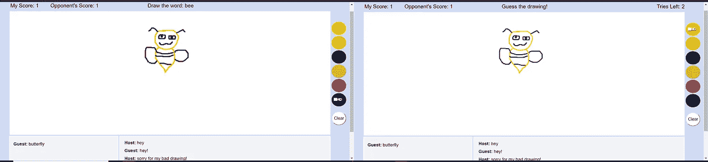

# 如何用 PubNub 用 JavaScript 构建一个实时多人游戏

> 原文：<https://itnext.io/how-to-build-a-realtime-multiplayer-game-in-javascript-using-pubnub-5f410fd62f33?source=collection_archive---------0----------------------->


“游戏玩家不会死。他们重生了！”

> 场景:您想要构建一个在线多人游戏。这是你第一次这样做，你很兴奋！但是你如何实现玩家之间的实时互动呢？经过一些快速研究后，您发现您可以使用 socket.io。您在网上查找并找到了如何实现 socket.io 的教程。您需要安装 Node.js 和 Express，设置 Express 服务器，将 socket.io 代码添加到与 Express 代码相同的文件中，最后将客户端连接到服务器。咻，所有这些只是为了设置！此外，由于这是你第一次在游戏中实现实时基础设施，你需要学习一些网络概念，比如客户端预测。花在这些事情上的时间是你可以用来开发你的游戏的时间！

事实是，在应用程序中实现实时功能并不是一件容易的事情。有很多很棒的工具可供您使用，但是在这个过程中您可能会遇到一些问题，尤其是当您开始扩展用户增长时。这就是 PubNub 的用武之地。PubNub 提供实时基础设施，为用户提供安全可靠的连接，以连接他们的设备并使用 PubNub 的全球数据流网络传输数据。这是以 0.25 秒的全球全向消息传递速率完成的。

使用 PubNub 的 API 可以完成的应用数不胜数，比如聊天应用、拼车应用、零售应用、多人游戏等。在多人游戏的情况下，PubNub 促进了玩家之间的实时交互，并增强了游戏功能和社交功能，从而创造了流畅的游戏体验。

对于本教程，PubNub 将用于连接游戏中的两个玩家，他们可以在游戏中相互交流和聊天。游戏 UI 将由一个用于绘图的画布和两个聊天框组成，一个用于书写猜测的单词，另一个供玩家相互发送消息。这个游戏将使用 PubNub 的 JavaScript V4 SDK 和 ChatEngine JavaScript SDK 以 JavaScript 构建。

# 游戏概述

在本教程中，我们将从头开始构建一个绘画和猜谜游戏。在游戏中，一个玩家画一个单词，另一个玩家根据画猜这个单词。玩家猜中正确的单词可获得一分。得分最高的玩家获胜。

整个项目可以在我的 GitHub [资源库中找到。](https://github.com/ocastroa/GuessWordPubNub)这是我们将要构建的游戏的截图:



# 设置发布

在此注册一个免费的 PubNub 账户[。注册后，您将被带到管理页面，在那里您可以获得您的发布/订阅密钥。您可以从“演示项目应用程序”中获取密钥，也可以创建一个新的应用程序来获取一组新的密钥。将密钥复制粘贴到一个新文件中，并将密钥标记为“游戏密钥”(注意:该文件用于临时存储您的密钥，不会用于游戏)。](https://dashboard.pubnub.com/signup)

我们将使用[状态](https://www.pubnub.com/products/presence/)来检测大厅和游戏频道中的玩家。要启用频道显示，请单击您获取密钥的应用程序，单击演示密钥集框，然后转到应用程序加载项。寻找存在并单击开关将其打开。在 TCP FIN 或 RST 上选中“生成休假”复选框，并在此处选中“全球休假”复选框。

为了让玩家实时聊天，我们将使用 PubNub 的[聊天引擎](https://www.pubnub.com/docs/chat-engine/getting-started)。要设置 ChatEngine，您需要使用与游戏不同的发布/订阅密钥。你可以在这里获得免费的预配置密钥。将这些键添加到上面使用的同一个文件中，并将这些键标记为“主聊天键”。由于游戏使用两个独立的聊天框(一个用于消息传递，另一个用于猜词)，您需要重新加载页面(或点击[此处](https://www.pubnub.com/tutorials/chatengine/))来获得不同的密钥。将这些键添加到文件中，并标记为“猜词聊天键”。

现在我们已经完成了上面的工作，我们可以开始游戏了。创建一个目录来存储游戏文件。对于本教程，您可以使用任何文本编辑器。我个人喜欢将 [VS 代码](https://code.visualstudio.com/download)与 Live 服务器扩展一起使用。

# 设置 HTML/CSS 文件

创建一个新文件，index.html，并将其添加到您为游戏创建的目录中。我们将设置画布、两个聊天框容器和色样。确保您的外部文件包含 PubNub 的 JavaScript SDK 和 ChatEngine JavaScript SDK。

html 文件到此为止！你可以从[这里](https://github.com/ocastroa/GuessWordPubNub/blob/master/style.css)得到 css 文件。

# 设置大厅

创建一个新文件 lobby.js，并将其添加到您的游戏目录中。

大厅的代码将在一个[匿名函数](https://en.wikibooks.org/wiki/JavaScript/Anonymous_functions)中。

```
(function() {
  // Lobby code goes here
})();
```

我们首先初始化*播放器*变量。

```
const player = {
  name: '',
  sign: '',
  score: 0
}
```

*玩家*变量包含 3 个对象属性:

1)名称:开始为空，但后来设置为“主机”或“客人”。
2)标志:开始为空，但后来设置为“H”或“G”。
3)评分:设置为 0。

因为我们要改变文本，我们需要从 html 文件中获取元素。我们是这样做的:

```
function $(id) { 
  return document.getElementById(id); 
}let score = $('score'), triesLeft = $('triesLeft'),          guessWord = $('guessWord'), opponentScore = $('opponentScore');
```

在新游戏开始时，玩家将输入一个大厅名称。

```
let lobby = prompt("Enter name of lobby");
let game = lobby; // game is the channel where the game takes places
lobby = lobby + 'Lobby'; // separate channel for lobby
```

我们将*游戏*设置为 lobby 的值，并将‘Lobby’追加到 *lobby。*我们做这个来分别从两个通道得到玩家的存在。

让我们初始化将在这个文件中使用的变量。

```
const newUUID = PubNub.generateUUID();
let isHost = false;
let ChatEngine = '';
let GuessWordChatEngine = '';
```

实例化一个新的 PubNub 实例，用你的“游戏密钥”替换“游戏 _pub_key”和“游戏 _sub_key”。

```
const pubnubGuessGame = new PubNub({
  uuid: newUUID,
  publish_key: 'game_pub_key',
  subscribe_key: 'game_sub_key',
  ssl: true
});
```

创建一个新的监听器，以接收连接状态和存在的通知。另外，添加侦听器。

让我们检查一下代码。监听器中有两个回调函数:存在和状态。在线状态检测大厅频道中的新玩家。第一个进入新大厅的玩家成为主人，第二个进入同一大厅的玩家成为客人。当两个玩家在一个大厅时，监听器将被移除，玩家将从大厅频道退订(但仍订阅游戏频道)，游戏将开始。

由于玩家不再订阅大厅频道，其他玩家将可以访问大厅，因为它是空的。为了防止这个问题，我们调用 hereNow()来检查游戏通道中的人数。如果两个玩家在游戏频道中，那么我们通知新玩家游戏正在进行中，移除监听器，并取消新玩家的订阅。

在状态回调函数中，我们通过调用 connectToChat()将玩家连接到聊天引擎。

用您的“主聊天键”替换“主聊天键”和“主聊天键”。将“guess_word_chat_pub_key”和“guess_word_chat_sub_key”替换为您的“guess word 聊天键”。玩家的 uuid 或者是“主机”(如果他们是主机),或者是“客人”(如果他们是客人)。这是他们互相发信息时的样子，一旦游戏开始，他们就可以开始发信息了。

建立连接后，状态回调函数中的 event.category 返回“PNConnectedCategory”。发生这种情况时，会调用 setUpCanvas()。

在我们刚刚实现的监听器的正下方，订阅大厅频道并启用 presence。

```
pubnubGuessGame.subscribe({
  channels: [lobby],
  withPresence: true
});
```

现在我们已经完成了大厅，我们可以开始为游戏本身编写代码了。

# 实现游戏

创建一个新文件 guessDrawing.js，并将其添加到您的游戏目录中。

游戏的代码将在函数 gameStart()中。这些参数是 lobby.js 文件中的变量。

```
function gameStart(pubnubGuessGame, ChatEngine, GuessWordChatEngine, game, player){
  // Game code goes here
}
```

初始化将用于游戏的变量。

将从数组*字*中选择一个随机元素，并将其从数组中移除。选中的单词将只显示给画出该单词的玩家。第一个抽到的玩家是主人，客人有 3 次猜词的机会。

同样，我们需要访问 html 文件中的文本。

```
function $(id){ 
  return document.getElementById(id); 
}let chatLog =  $('chatLog'), chatInput = $('chatInput'), guessWordChatLog =  $('guessWordChatLog'), guessWordInput = $('guessWordChatInput'), clearCanvasButton = $('clearCanvasButton'),     score = $('score'), colorSwatch = $('colorSwatch'), triesLeft = $('triesLeft'), guessWord = $('guessWord'), opponentScore = $('opponentScore');
```

当 ChatEngine 成功连接时，会出现一个' $。激发“就绪”事件。因为我们已经在 lobby.js 文件中连接了 ChatEngine，所以我们需要为' $ '编写代码。“就绪”事件。

```
ChatEngine.on('$.ready', function(data){
   // Every time a message is recieved from PubNub, render it.
   ChatEngine.global.on('message', onMessage);
});GuessWordChatEngine.on('$.ready', function(data){
   GuessWordChatEngine.global.on('message', onMessageGuessWord);
});
```

ChatEngine 已经设置完毕，可以使用了。每当玩家在主聊天框中发送消息时，都会调用 sendMessage()。

当按下一个键时，监听器调用 sendMessage()。在函数内部，我们检查按下的键是否是“enter”或键代码 13，以及输入是否大于 0。如果是这样的话，玩家写的文本，以及他们被分配的名字(主人或客人)被发送。聊天输入被设置为一个空字符串，这样玩家可以写一个新句子。

收到消息时，调用 onMessage()将消息添加到主聊天日志中。

我们将稍后实现猜词聊天框的功能，因为我们需要首先设置游戏。现在，让我们创建一个新的监听器，“gameListener”，并添加监听器。

我们添加了一个新的回调函数 message，它监听发布到游戏通道的任何消息。该通道将接收几个消息，但我们只需要处理 3 个特定的消息:

1)*msg . message . chosen word*:无论何时从数组中选择一个随机字，我们都将该字发布到通道，并将其添加到变量 *chosenWord* 的值中。我们只对轮到猜抽牌的玩家这样做。

2) *msg.message.plots* :一旦玩家停止在画布上绘图，我们就将绘图的路径添加到 *plots* 数组，并将该数组以及绘图的颜色发布到通道。另一个玩家会收到这条消息，并调用 drawFromStream()，后者调用 drawOnCanvas()在他们的画布上进行绘制。

确保在 drawFromStream()之前初始化变量。

3)*msg . message . clearthecanvas*—当抽签的玩家按下清除按钮时，或者在新一轮中，发布一条消息，为双方玩家清除画布。当收到消息时，调用 clearCanvas()。

```
function clearCanvas(){
  ctx.fillStyle = 'WHITE';
  ctx.clearRect(0,0,window.innerWidth, window.innerHeight);
  ctx.fillRect(20,20,window.innerWidth, window.innerHeight);     
}
```

对于存在回调函数，我们需要检查玩家是否在游戏结束前离开了游戏。如果是，那么 response.action 是“离开”,另一个玩家被宣布为获胜者。然后，两个玩家都退订游戏频道，并与聊天引擎断开连接。游戏结束后，玩家也会退订并断开连接。

当连接建立后，状态被调用。如果 event.category 返回‘PNConnectedCategory’，那么游戏开始。在我们实现 startGame()之前，让我们订阅频道。

```
pubnubGuessGame.subscribe({
  channels: [game],
  withPresence: true
});
```

在此之下，我们添加了一个函数 publish()，当我们需要向通道发布数据时，就会调用这个函数。为了发布，我们需要传入通道的名称和我们想要发布的数据。

```
function publish(data){
  pubnubGuessGame.publish({
    channel: game,
    message: data
   });
}
```

现在让我们实现 startGame()。

该轮到谁猜抽彩的玩家将被返回。另一个玩家将会看到一个随机的单词，这个单词将会发布到频道上。然后，播放器将通过监听器访问色板、清除按钮和绘图功能。有 3 种绘图功能:

1) startDraw():当玩家在画布上按下时，调用该函数将变量 *isActive* 设置为 true，这意味着玩家准备好开始绘制了。

```
function startDraw(e) {
  e.preventDefault();
  isActive = true;
}
```

2) draw():玩家一开始在画布上移动，就调用这个函数。显示路径的画布坐标被推送到数组 *plots* 中，并与颜色一起发送到 drawOnCanvas()。由于这个游戏可以在触摸屏上玩，所以坐标是四舍五入的。

3) endDraw():一旦玩家停止在画布上移动，就调用这个函数。变量 *isActive* 再次被设置为 false，颜色和绘图被发布到通道，并且*绘图*数组被设置为空数组。

当画图的玩家按下 clear 按钮时，调用 clear button()来清除画布。变量 *clearTheCanvas* 设置为真，并发布到通道。

```
function clearButton(e){
  e.preventDefault();
  clearTheCanvas = true;
  publish({
     clearTheCanvas: clearTheCanvas
   })
}
```

一旦玩家猜对了图画中的单词，或者试完了，角色就会互换。玩家不断交换角色，直到有人达到 3 分。当玩家切换角色时，调用 nextRound()。

首先，该函数检查某个玩家的分数是否为 3，如果是，则宣布获胜者，并调用 unsubscribeFromGame()。否则，为两个玩家清除画布，清除猜词聊天日志，并将*尝试*重置为 3。如果没有轮到玩家画图，那么*guess sword*和 *triesLeft* 被设置为适当的文本，用于画图的监听器以及清除按钮被移除，因此它们将无法访问画布。玩家抽奖将把*guess sword*和 *triesLeft* 设置为空字符串，并调用 startGame()。

剩下唯一要实现的是猜词聊天框的功能。让我们实现 onMessageGuessWord()。

无论何时收到消息，我们都会将其显示在猜词聊天日志中。这条消息应该是猜测的单词。我们检查它是否与为该轮选择的单词匹配。如果单词匹配并尝试大于 0，那么我们奖励猜中正确单词的玩家一分。我们增加玩家分数，并在他们的屏幕上显示为“我的分数:#”。更新后的分数显示给其他玩家，显示为“对手分数:#”。之后调用 switchTurns()来交换玩家的角色并开始新一轮。

```
function switchTurns(){
  turn = (turn === 'H') ? 'G' : 'H';
  nextRound();
}
```

如果玩家用完了所有的尝试，他们将不会得到任何分数，角色也会被交换。否则，我们减少剩余的尝试次数。

既然我们已经处理了接收来自猜测单词聊天框的消息，那么让我们添加一个新的按键监听器并实现函数 sendMessageGuessWord()。

这几乎与 sendMessage()相同，只是我们添加了一个 if 语句来检查只有猜测图画的玩家才能发送消息。玩家抽奖没有发送消息的权限，如果他们试图发送消息，将会收到警告。这是作为一种边缘情况来完成的，因为在大多数情况下，绘制的玩家不会发送他们正在绘制的单词。毕竟，这样做不符合他们的最佳利益。

仅此而已！总共你应该有 4 个文件:index.html，风格. css，大厅. js 和 guessDrawing.js。如果你使用的是 VS 代码与直播服务器扩展，运行直播服务器，并输入一个大厅名称。如果你使用另一个文本编辑器，运行 index.html 文件。复制并粘贴网址到另一个标签，或最好是一个新的窗口，输入相同的大厅名称，游戏将开始！

# 怎么玩

1)大厅中的第一个玩家是主持人。第二个加入同一大厅的玩家是客人。

2)当大厅中有两名玩家时，游戏开始。

3)给主持人一个词，需要在画布上画出来。

4)游客有 3 次机会猜测代表绘画的单词，并在猜测聊天框中输入他们的猜测。如果客人猜出正确的单词，他们将获得一分。
—注意:虽然游客可以看到他们画布上的图画，但在轮到他们画单词之前，他们不能在画布上画画。

5)一旦猜对了一个单词，或者尝试次数等于 0，角色就交换，客人画一个新单词，而主人猜这个画。

6)角色不断切换，直到一个玩家达到 3 分。宣布该玩家获胜，游戏结束。
—如果一名玩家在游戏结束前离开，另一名玩家将被宣布获胜。

# 最后一个音符

游戏保持简单，因为这个游戏的目的是演示如何在多人游戏中实现 PubNub 的 API。这个游戏的可能性是无限的。你可以在一个大厅中允许更多的玩家，让玩家选择一个类别来抽奖(如动物)，将获胜分数从 3 增加，添加更多的颜色供选择，添加抽奖的时间限制等。

我希望你喜欢这个教程！

# 致谢:

游戏的灵感和一些代码来自 PubNub 的开源项目: [codoodler](https://github.com/pubnub/codoodler) -一个多用户涂鸦网络应用。

其他使用的资源包括:[开发你的第一个多人游戏](https://www.pubnub.com/tutorials/javascript/multiplayer-game/)和[用聊天引擎为多人游戏添加游戏内聊天](https://www.pubnub.com/blog/in-game-multiplayer-chat-with-chatengine/)