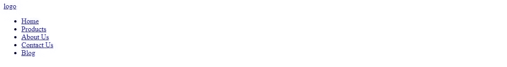
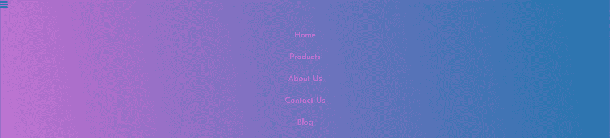
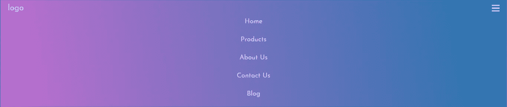
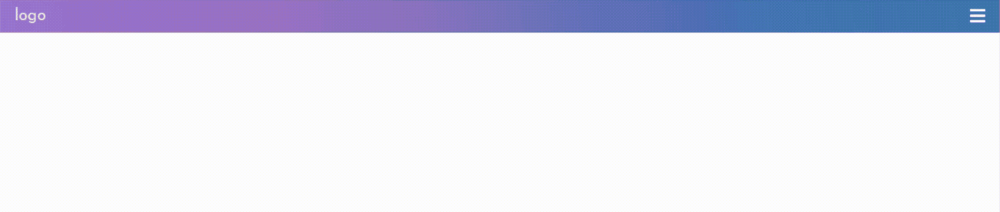

# 如何使用 CSS Flexbox 和 Javascript 构建响应式导航栏

> 原文：<https://itnext.io/how-to-build-a-responsive-navbar-using-flexbox-and-javascript-eb0af24f19bf?source=collection_archive---------0----------------------->


[Kobu 机构](https://unsplash.com/@kobuagency?utm_source=medium&utm_medium=referral)在 [Unsplash](https://unsplash.com?utm_source=medium&utm_medium=referral) 上拍摄的照片

在本文中，我们将从头开始创建一个完全响应的导航栏，只使用 flexbox 和一点 Javascript(用于切换菜单)。所以我假设你有 HTML、CSS 和 Javascript 的基础知识，也就是说，你应该知道基本的 HTML 标签以及如何将 CSS 和 Javascript 文件链接到 HTML 文件。

我将采取移动优先的方法来构建导航栏。也就是说，我们将首先为移动设备制作导航栏，然后使用媒体查询为桌面制作导航栏。

# **入门**

下面是布局的基本 HTML:

您可以为类和 id 使用任何名称。



这是我们写完上面的代码后得到的，这不多，但我们会通过使用 CSS 样式化它来使它变得更好。

让我们添加一些基本的样式来使它看起来更好:

```
* {
    box-sizing: border-box;
    padding: 0;
    margin: 0;
}body {
    font-family: 'Josefin Sans', sans-serif;
}.navbar {
    font-size: 18px;
    background-image: linear-gradient(260deg, #2376ae 0%, #c16ecf   100%);
    border: 1px solid rgba(0, 0, 0, 0.2);
    padding-bottom: 10px;
}.main-nav {
    list-style-type: none;
}.nav-links,
.logo {
    text-decoration: none;
    color: rgba(255, 255, 255, 0.7);
}
```


这当然看起来更好，我已经使用通用选择器(*)去除了每个元素的任何默认浏览器特定的填充和边距，并将框大小设置为 border-box，以便于调整元素的大小。

我在导航栏上使用了“Josefin Sans”字体，在背景上使用了线性渐变。您可以选择自己的字体、颜色和背景。

现在添加一些填充和空白，使它看起来更好。

```
.main-nav li {
    text-align: center;
    margin: 15px auto;
}.logo {
    display: inline-block;
    font-size: 22px;
    margin-top: 10px;
    margin-left: 20px;
}
```


# 切换按钮

开始好看了。现在让我们在右上角添加一个小的切换按钮。为此，我将使用字体很棒的图标。



这是它看起来的样子。注意左上角的小汉堡图标，这看起来很奇怪。所以让我们重新定位和设计它。

```
.navbar-toggle {
    position: absolute;
    top: 10px;
    right: 20px;
    cursor: pointer; 
    color: rgba(255,255,255,0.8);
    font-size: 24px;
}
```



移动设备的导航条现在已经基本完成了。让我们添加一点 JavaScript 来启用切换菜单。

我已经隐藏了菜单，所以默认情况下它是不可见的。

```
.main-nav {
    list-style-type: none;
    display: none;
}
```


现在，让我们添加一些 JavaScript 代码，使它在有人点击汉堡包图标时可见。

```
let mainNav = document.getElementById('js-menu');let navBarToggle = document.getElementById('js-navbar-toggle'); navBarToggle.addEventListener('click', function () {

    mainNav.classList.toggle('active');});
```

这段代码切换菜单列表上的活动类。因此，在 CSS 文件中添加以下代码。

```
.active {
  display: block;
}
```



简单明了，我们的移动部分结束了，现在让我们来看看桌面部分。

# 对于台式机:

对于桌面，我们所要做的就是将 flex-direction 属性改为 row，并赋予. navbar 类一个 flex 的显示属性。

```
*@media* screen and (min-width: 768px) { .navbar {
        display: flex;
        justify-content: space-between;
        padding-bottom: 0;
        height: 70px;
        align-items: center;
    } .main-nav {
        display: flex;
        margin-right: 30px;
        flex-direction: row;
        justify-content: flex-end;
    } .main-nav li {
        margin: 0;
    } .nav-links {
        margin-left: 40px;
    } .logo {
        margin-top: 0;
    } .navbar-toggle {
       display: none;
    } .logo*:hover*,
    .nav-links*:hover* {
        color: rgba(255, 255, 255, 1);
    }
```


# 最终代码:

[](https://github.com/SukhjinderArora/Responsive-Navbar-using-FlexBox) [## SukhjinderArora/Responsive-Navbar-using-FlexBox

### 使用 CSS Flexbox 的响应式导航条

github.com](https://github.com/SukhjinderArora/Responsive-Navbar-using-FlexBox) 

# 阅读更多关于 Flexbox 的信息:

[](https://developer.mozilla.org/en-US/docs/Web/CSS/CSS_Flexible_Box_Layout/Basic_Concepts_of_Flexbox) [## flexbox 的基本概念

### 柔性盒模块，通常被称为 flexbox，被设计为一维布局模型，并作为一个…

developer.mozilla.org](https://developer.mozilla.org/en-US/docs/Web/CSS/CSS_Flexible_Box_Layout/Basic_Concepts_of_Flexbox) [](https://css-tricks.com/snippets/css/a-guide-to-flexbox/) [## Flexbox | CSS-技巧完全指南

### 我们的 CSS flexbox 布局综合指南。这份完整的指南解释了 flexbox 的一切，重点是所有…

css-tricks.com](https://css-tricks.com/snippets/css/a-guide-to-flexbox/)