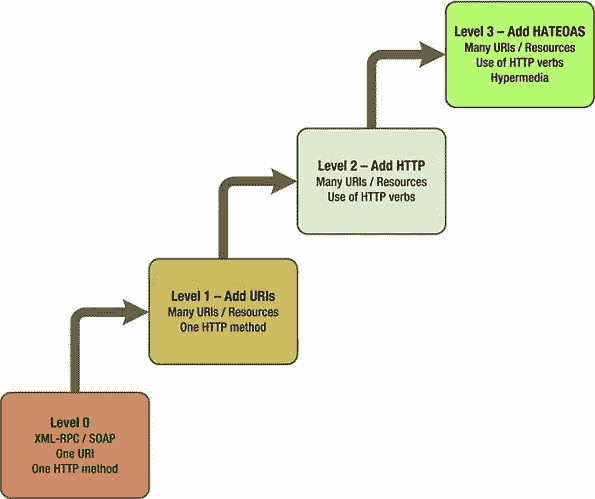

# 如何构建 RESTful API——深入探究 REST APIs

> 原文：<https://itnext.io/how-to-build-a-restful-api-a-deep-dive-into-rest-apis-215188f80854?source=collection_archive---------1----------------------->

通过实用和客观的方法将 REST 概念化

照片由[詹姆斯·庞德](https://unsplash.com/@jamesponddotco?utm_source=medium&utm_medium=referral)在 [Unsplash](https://unsplash.com?utm_source=medium&utm_medium=referral) 拍摄

本文的目标是展示作为 REST 架构基础的 web 架构元素。

REST 不仅仅是构建 API 的最佳实践和语义指南，更是一个混合风格的架构、原则和约束的**!**💁

# REST 和万维网架构

为了更好地理解 REST 是如何工作的，您需要理解一些与 REST 相关的基本 web 架构原则，它们是:

*   资源和表示
*   资源寻址(寻址能力)
*   统一界面
*   无国籍的
*   资源间导航的超链接(超媒体)

## 资源和表示

每当我们向服务器发出请求时，它都是通过统一资源定位符发出的，统一资源定位符是一个东西的 URL，例如产品、照片或主页。用 REST 术语来说，那个“东西”就是所谓的**资源**。

当浏览器请求获取资源时，服务器会发送一个文档作为响应，这可能会根据所请求的内容而有所不同，可能是 HTML 文档、包含所请求图像的二进制文件，或者是 JSON 格式的纯文本。

不管返回的文档是什么类型，我们将这个文档命名为一个资源的**表示。👈❕**

总之，客户永远不会直接看到资源，而是看到它的一个表示，它由一个 URL 标识，一个资源可以包含多个表示。

## 可寻址能力

网络上的一切都是“可寻址的”，这意味着一切都应该有一个引用。每个资源都必须有它自己的 URL，这个 URL 只用于访问它的一个表示。资源的每种不同表示都必须提供它的 URL。

寻址原则只是说每个资源必须有自己的 URL。如果某些东西对你的应用程序很重要，必须有一个惟一的名字和惟一的 URL。

> 尽管有一些常见的误解， **REST 不是关于如何构建或设计 API 路由，**但是理解如何设计 API 路由是非常重要的。在本文的最后，我链接了一个示例 RESTful API 项目，展示了与本文相关的所有内容，以及路线设计考虑事项。

## 统一界面

HTTP 是一个开放的、众所周知的协议，它定义了用户代理与资源和产生资源的服务器交互的标准方式。这些交互基于伴随每个 HTTP 请求的动词(或方法)。

最常见的 HTTP 方法(也称为动词)有:

*   **获取** 用于搜索关于某一特定资源的信息。
*   **POST**用来创建一个新的资源。
*   **放**或
    用于更新或创建新的资源。
*   **删除**
    用于删除服务器上已有的资源。
*   **选项**
    用于标识哪些方法(动词)可以与对给定资源的请求相关联。

## 幂等性和剩余

与其写一个关于 REST 中幂等性的无聊部分，我不如推荐这个解释 Cows 中幂等性的视频——因为它很有趣，我永远也不可能用那种方式解释幂等性！😆

## 无国籍的

HTTP 是无状态协议的事实意味着每个请求都独立于任何先前的请求，并且服务器不需要存储关于客户端的任何状态信息。

## 资源间导航的超链接🙇🤘

超链接允许在应用程序的资源之间导航，并且可以以几种不同的方式创建以引用不同类型的资源，包括那些在 HTML 文档中更常见的资源，例如图像、Javascript 和 CSS 文件。

REST 也利用这种机制在 API 的资源和状态之间建立联系，通常是通过一个名为“link”的超媒体控件，它是服务器返回的一个对象，旁边是所请求资源的表示，其中包含导航到其他相关资源的地址。

> 我知道这听起来有点令人毛骨悚然，但我稍后会更好地解释它。

这里有一个例子可能有用，看看下面的`link`属性。

来自[https://restfulapi.net/hateoas/](https://restfulapi.net/hateoas/)的代码示例

在前面的例子中，服务器返回的响应包含指向雇员资源`10/employess`的超媒体链接，客户机可以遍历这些链接来读取属于该部门的雇员。

上述方法的优点是从服务器返回的超媒体链接驱动应用程序的状态，而不是相反。

> 🎥剧透警报！超媒体的概念通常被称为 **HATEOAS** (超媒体作为应用程序状态的引擎)，简单来说，就是一组与资源相关联的链接，链接应用程序的状态(或页面)。

# 理查森的休息成熟度模型

由 Leonard Richardson 在 2008 年提出的 REST 成熟度模型为 Web API 开发者提供了 REST 实现的三级映射。这个模型从零层开始，用 RPC 风格描述 API，一直到第三层，在第三层添加了超媒体层。

基于这个模型，如果一个 API 是按照 REST 规范开发的，直到第三个成熟度级别，我们可以说这是一个 **RESTful** API。

理查森休息成熟度模型的原始*图*

## HTTP 状态代码

正如您被限制只能使用 HTTP 中可用的动词一样，您也被限制只能为您的服务调用使用一组众所周知的 HTTP 状态代码。

请看下面 REST 应用程序中最常见的 HTTP 状态代码及其含义。🤓

*   200(OK)表示成功。响应**必须根据与服务器上执行的操作相关联的动词返回关于资源**的信息。
*   204(无内容)
    类似于代码 200 (OK)。当**不需要返回关于资源**的信息时必须使用— *我通常喜欢在删除操作*上返回 204。
*   201(已创建)
    资源已创建。获取详细信息的**路径将在响应**“位置”标题**中指明。**
*   400(错误请求)无效请求。客户端必须正确地重新格式化并重做对资源的请求。指示服务器端级别的**业务验证错误。**
*   401(未授权)这表示**发出请求的用户**在应用程序中未通过**身份验证**。
*   403(拒绝访问)表示**用户已通过认证，但未被授权**访问该特定资源。
*   404(未找到)请求的资源未找到**或者调用者无权访问该资源，并且服务器不想透露关于它的细节**。
*   500(服务器错误)服务器上出现意外错误，响应中应包含说明问题的注释。

## 哈特奥斯

想想我们迄今为止已经构建和使用的 API，它们中的大多数都没有告诉我们可以对资源做哪些请求。我如何知道我可以在资源上执行哪些操作，我可以“批准”还是“拒绝”它？有子资源吗？我能得到那些吗？

**超媒体来了！🚀**

超媒体，也称为 HATEOAS — *超媒体作为应用程序状态*的引擎，在资源之间建立连接，并描述可以在给定资源上执行的操作。

> 超媒体是服务器告诉客户机他将来可能会发出什么 HTTP 请求的一种方式。它就像服务器提供的选项菜单，客户可以自由选择。服务器知道会发生什么，但决定将要发生什么的是客户机。

为了阐明超媒体作为应用程序状态引擎的概念，下图说明了添加到服务器提供的资源表示中的超媒体控件的使用，以及应用程序状态之间的转换。

*超媒体作为应用程序状态引擎的实例—* REST in Practice book

# 给我看看代码！

我在 GitHub 上构建了一个示例 RESTful API，其中可以发出一系列 REST 请求来模拟订购比萨饼的基本流程。

该应用程序有两个主要的域实体，分别是*披萨*和*订单*。

您可以通过张贴一些比萨饼并注意诸如位置标题和 HTTP 状态代码之类的细节来开始这个小小的旅程。然后尝试使用新创建的 Pizza id 执行一些订单，并检查服务器响应中的超媒体链接。

虽然它是一个. NET 核心应用程序，但它是在 **Docker** 中运行的，所以你可以运行一些命令，玩一些披萨！

 [## RichardSilveira/RESTful

### RESTful API 示例。这个存储库包含了文章《从 REST 到 RESTful》中使用的源代码——这是一个深入的探讨…

github.com](https://github.com/RichardSilveira/RESTful) 

# 那不是所有的人！

我想写更多关于**休息限制**的内容，但是你会觉得无聊，但是这也是一个重要的话题，做一些快速的研究吧！

我强烈建议您对我构建的 API 感兴趣，关注 HATEOAS 如何工作，**API 如何管理 REST 资源中的状态转换**。

**看看 GitHub、Paypal 等大公司的 REST API**吧。这很有帮助，另外，你将能够非常清楚地理解 REST 是如何工作的。

也研究一下 RESTful API 中的**媒体类型！这是一个伟大而重要的话题！**

> 一个生产就绪且令人敬畏的例子是`[*application/vnd.api+json*](http://www.iana.org/assignments/media-types/application/vnd.api+json)`媒体类型—[https://jsonapi.org/](https://jsonapi.org/)

最后但并非最不重要的一点，也做一些关于 REST APIs 版本控制策略的研究，不要把自己局限于只使用 URI 版本控制，有一些易于应用且有趣的可用选项。下面的 youtube 视频快速展示了几乎所有场景都需要的一些主要版本控制策略。

这就是所有的乡亲们了——*至少目前是这样*！**感谢阅读！**🙌

# 参考资料和有用的链接

菲尔丁，罗伊·托马斯。架构风格和基于网络的软件架构的设计。2000.博士论文。【T2[http://www . ics . UCI . edu/~ fielding/pubs/dissertation/fielding _ dissertation . pdf](http://www.ics.uci.edu/~fielding/pubs/dissertation/fielding_dissertation.pdf)

韦伯，吉姆；SAVAS 的 PARASTATIDIS 伊恩·罗宾逊。**实践中的休息:超媒体与系统架构**。奥莱利媒体公司，2010 年。

阿拉马拉朱，苏布。RESTful Web 服务指南:提高可伸缩性和简单性的解决方案。奥莱利媒体公司，2010 年。

弗兰德斯，琼恩。宁静的。网。奥莱利媒体公司，2009 年。

伦纳德·理查森；鲁比，山姆；汉森海涅梅尔。RESTful Web 服务。奥莱利媒体公司，2013 年。

 [## 理查森成熟度模型

### 最近我一直在读《实践中的休息》的草稿:我的几个同事正在写的一本书…

martinfowler.com](https://martinfowler.com/articles/richardsonMaturityModel.html)  [## HATEOAS 驱动的 REST APIs

### HATEOAS(作为应用程序状态引擎的超媒体)是 REST 应用程序架构的一个约束，它保持…

restfulapi.net](https://restfulapi.net/hateoas/)