# 如何用 S3 和 Lambda 在 15 分钟内构建一个无服务器应用

> 原文：<https://itnext.io/how-to-build-a-serverless-app-with-s3-and-lambda-in-15-minutes-b14eecd4ea89?source=collection_archive---------0----------------------->

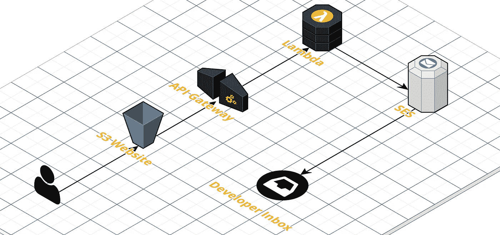

## 让你的静态 S3 网站变得动态的最快方法

> [点击这里在 LinkedIn 上分享这篇文章](http://https%3A%2F%2Fitnext.io%2Fhow-to-build-a-serverless-app-with-s3-and-lambda-in-15-minutes-b14eecd4ea89%3Futm_source%3Dmedium_sharelink%26utm_medium%3Dsocial%26utm_campaign%3Dbuffer)

对于那些使用 [S3](https://aws.amazon.com/s3/) 来驱动他们的 JavaScript 网站的人来说，*这篇教程将教你如何在几分钟内将服务器端的功能——比如处理表单和运行相应的功能——添加到你的 S3 网站上——所有这些都不需要提供、支付或管理任何服务器。*

在许多情况下，S3 只是应用架构的一部分，应用的服务器端运行在其他地方的[弹性计算云(EC2)](https://aws.amazon.com/ec2/) 安装的 EFS(文件系统)上。在大多数情况下，这是设计弹性的、解耦的、可伸缩的 web 应用程序的最佳方法。 但是，有些时候你并不需要那么多 AWS 资源，只是简单的处理一些表单数据。

> 所以这里有一个最快最简单的方法来给你的 S3 网站添加一些服务器端的功能。在这种情况下，将提交的表格发送到您的电子邮件地址。

**免责声明** : **如果你正试图在 S3 建立一个成熟的网络应用，这个教程不适合你。**

*我们将使用的 AWS 工具*:

*   [**【简单存储服务(S3)**](https://aws.amazon.com/s3/)——这是你静态网站的托管地，你所有的 HTML、CSS、JavaScript 和资产都将存放在这里。
*   [**API 网关**](https://aws.amazon.com/api-gateway/) —您的 S3 网站在处理一个表单时会发出一个 API 调用，当这个调用发出到 API 网关时，它会触发一个 Lambda 函数。
*   [**Lambda**](https://aws.amazon.com/lambda/)—Lambda 函数可以做任何您想做的事情，但是在我们的例子中，它只是使用 [AWS 简单电子邮件服务(SES)](https://aws.amazon.com/ses/) 将数据从表单发送到一个电子邮件地址

## 步骤 1:创建您的 API 端点

打开 API 网关，点击**创建新 API**

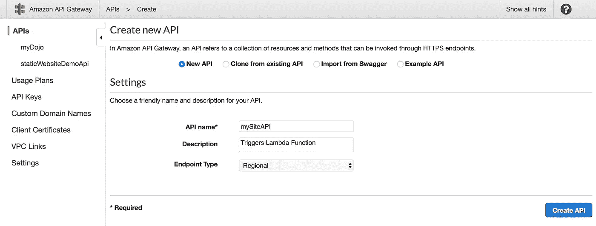

## 步骤 2:选择操作->创建方法

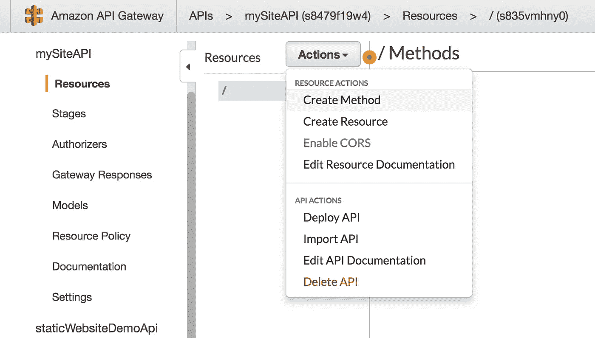

## 步骤 3:选择“过帐”作为方法类型，然后单击复选标记

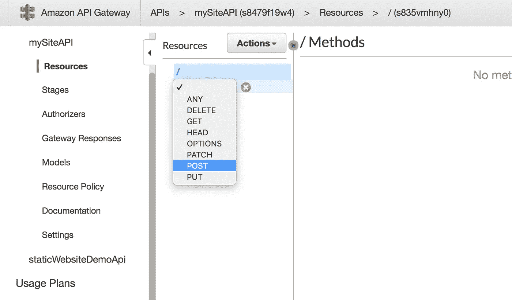

## 步骤 4:选择 Lambda 以及本教程下一部分创建的 Lambda 函数

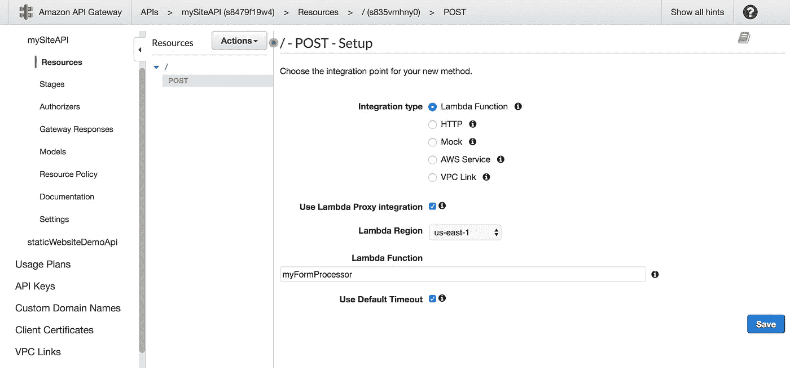

## 步骤 5:授予 API 网关调用 Lambda 的权限

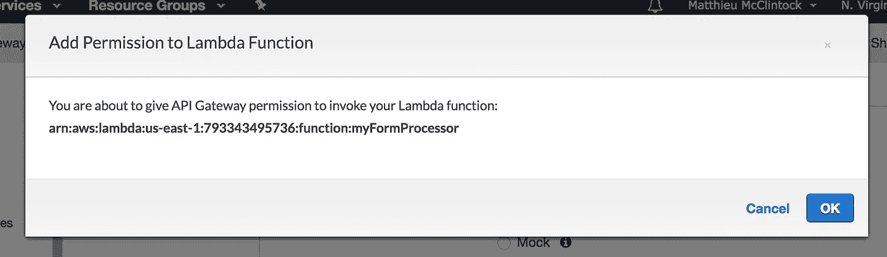

## 步骤 6:单击操作->部署 API

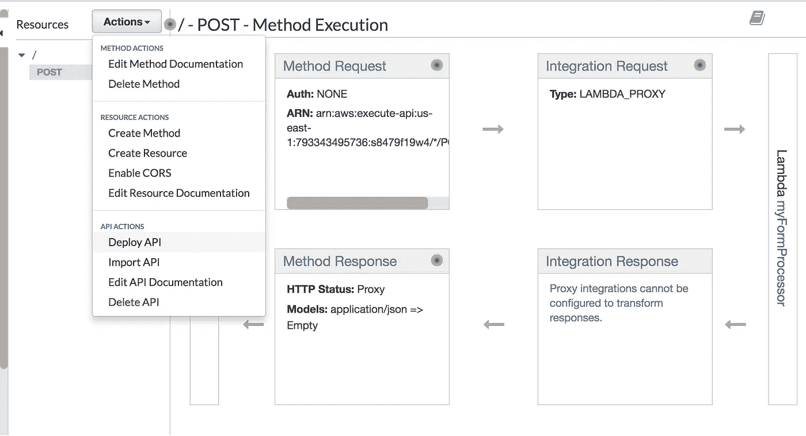

## 步骤 7:选择新阶段并命名您的阶段

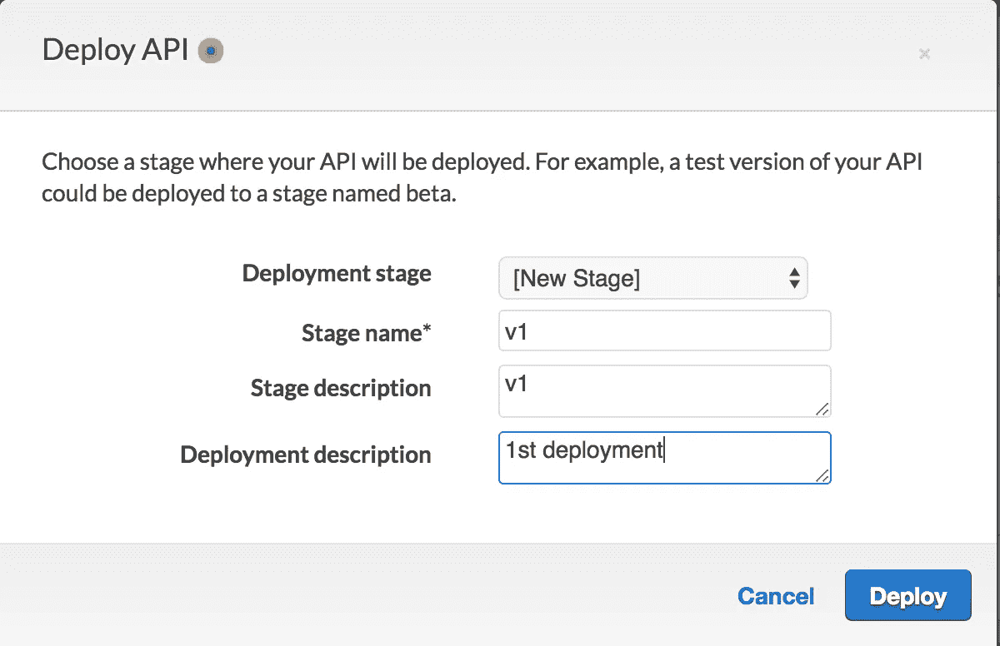

## 步骤 8:现在你有了你的端点 URL！

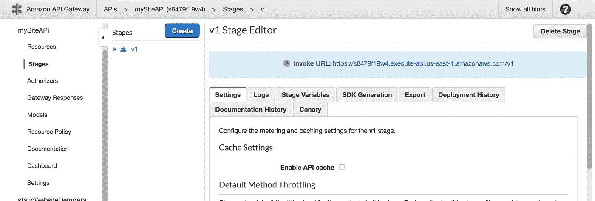

## 步骤 9:不要忘记启用 CORS。现在到拉姆达！

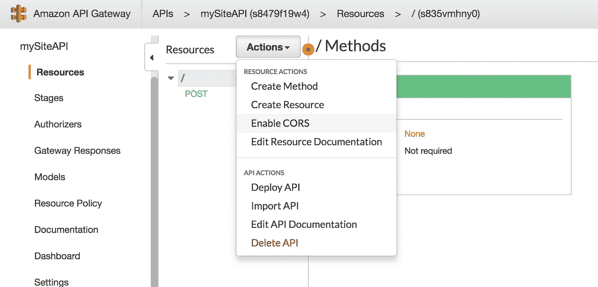

我们刚刚做了什么？在本节中，我们构建了 API，它将允许您以前静态的 S3 网站调用 Lambda 函数。

# 现在是λ时间

## 步骤 1:创建一个 Lambda 函数，选择 hello-world 模板

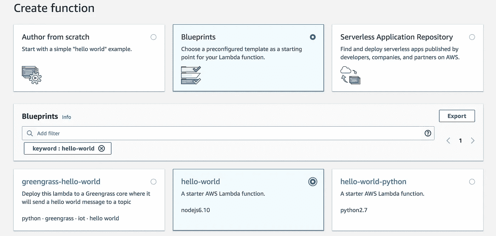

## 第二步:命名你的 Lambda 函数。

在这一步中，您将需要选择或创建一个角色，该角色具有访问 S3、API 网关和 SES 所需的 Lambda 权限。

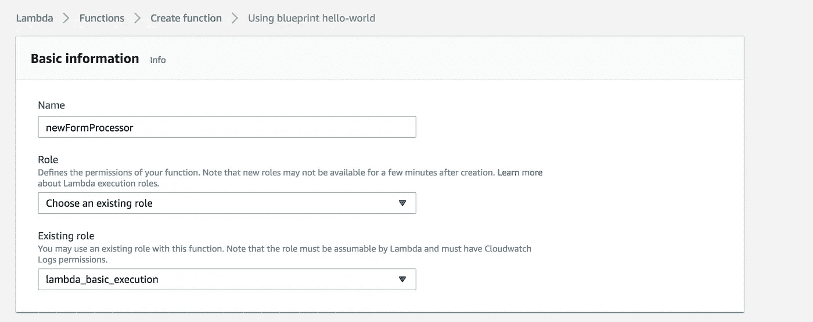

## 第三步:这是现成的 Lambda 代码。还不需要编辑。

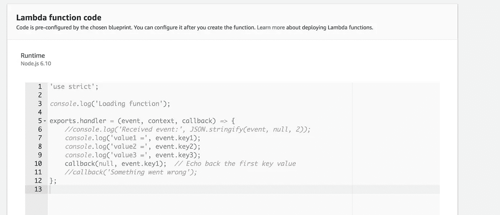

## 步骤 4:创建新的 Lambda 函数

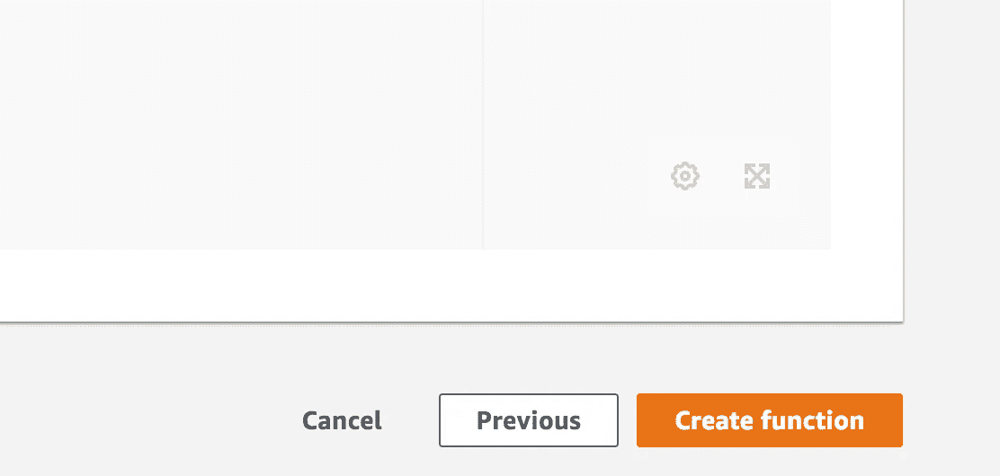

## 步骤 5:删除现有代码并用下面的摘录替换

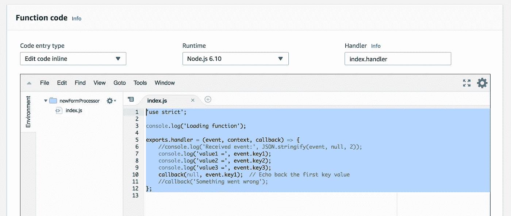

```
var AWS = require('aws-sdk');
var ses = new AWS.SES();var RECEIVERS = ['[you@example.com](mailto:jonny@drdojo.com)'];
var SENDER = 'you[@example.com](mailto:jonny@drdojo.com)'; // ensure 'sender email' is verified in your Amazon SESexports.handler = (event, context, callback) => {
    console.log('Received event:', event);
    sendEmail(event, function (err, data) {
        var response = {
            "isBase64Encoded": false,
            "headers": { 'Content-Type': 'application/json', 'Access-Control-Allow-Origin': '[http://www.example.com'](http://www.drdojo.com') },
            "statusCode": 200,
            "body": "{\"result\": \"Success.\"}"
        };
        callback(err, response);
    });
};function sendEmail (event, done) {
    var data = JSON.parse(event.body);

    var params = {
        Destination: {
            ToAddresses: RECEIVERS
        },
        Message: {
            Body: {
                Text: {
                    Data: 'Name: ' + data.name + '\nEmail: ' + data.email + '\nMessage: ' + data.message,
                    Charset: 'UTF-8'
                }
            },
            Subject: {
                Data: 'Contact Form inquiry: ' + data.name,
                Charset: 'UTF-8'
            }
        },
        Source: SENDER
    }
    ses.sendEmail(params, done);
}
```

***相应替换电子邮件和域名字段。**

## 步骤 6:现在你的 Lambda 函数完成了，它需要一个触发器。

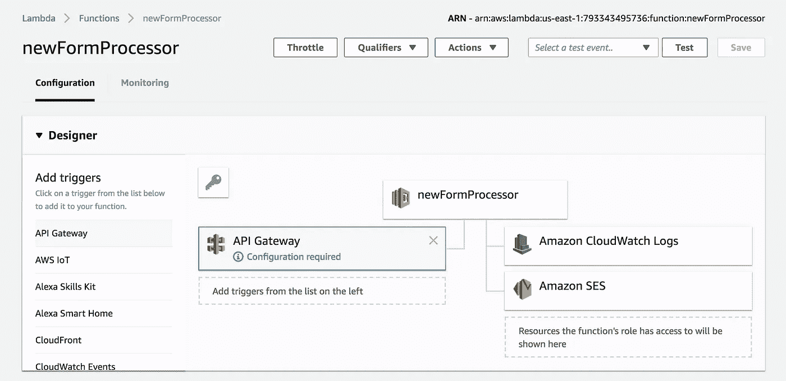

## 第 7 步:单击“需要配置”，选择前面的 API

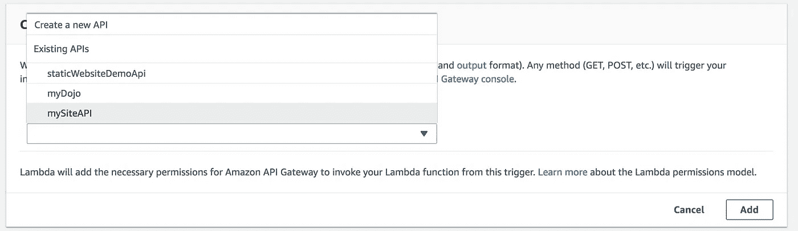

## 步骤 8:选择您的最新部署阶段，然后单击“添加”

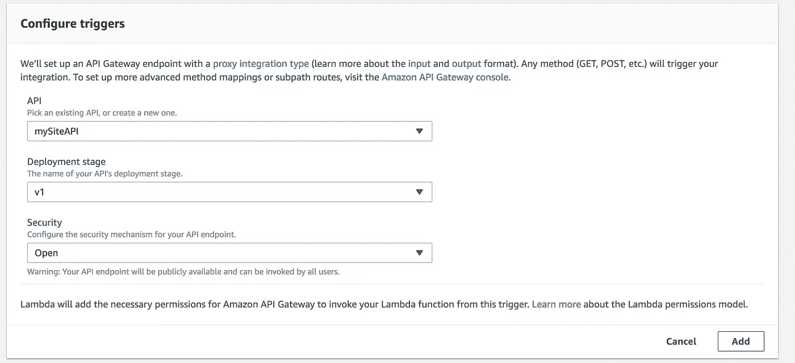

## 第九步:保存你的修改，然后去 S3！

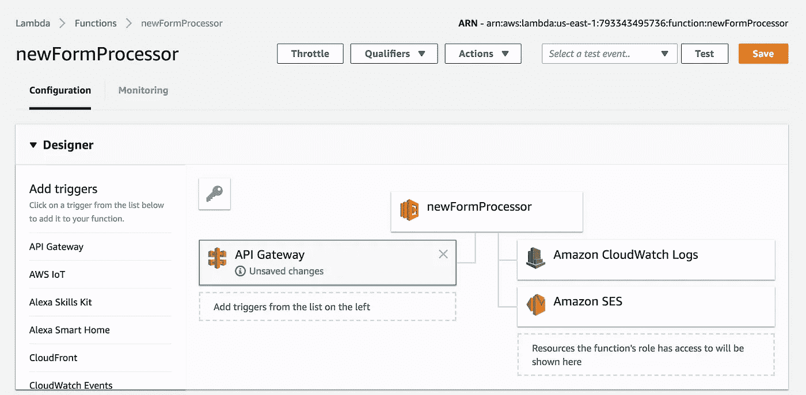

# 现在是 S3 时间！

现在，我们需要更新您的 S3 网站，添加新的动态功能

```
<script src="[https://ajax.googleapis.com/ajax/libs/jquery/2.2.4/jquery.min.js](https://ajax.googleapis.com/ajax/libs/jquery/2.2.4/jquery.min.js)"></script>         
<script type="text/javascript">         
$(document).ready(function() {                      $("#submit").click(function(e) {                 
e.preventDefault();                          
var name = $("#name").val(),                     
email = $("#email").val(),                     
message = $("#message").val();                          
$.ajax({                     
type: "POST",                     
url: '**https://xxxxxxxx.execute-api.us-east-1.amazonaws.com/Done**',                     contentType: 'application/json',      
data: JSON.stringify({                         
'name': name,                         
'email': email,                         
'message': message                     
}),                     
success: function(res){                         
$('#form-response').html('<div class="alert alert-info" role="alert">Welcome to the queue! Your path will begin shortly...</div>');},                     
error: function(){
 $('#form-response').html('<div class="alert alert-info" role="alert">Something went wrong... We are working on it!</div>');                     }}); }) });      
</script><!--THIS IS WHERE DATA IS PULLED FROM S3 TO API TO LAMBDA TO SES--><div class=”form-label-group”> 
<input type=”text” id=”name” class=”form-control” required> 
<label for=”name” class=”control-label”>Name</label> 
</div> 
<div class=”form-label-group”> 
<input type=”text” id=”email” class=”form-control” required> 
<label for=”email” class=”control-label”>Email address</label> </div> 
<div class=”form-label-group”> 
<textarea id=”message” name=”message” rows=”3" class=”form-control” placeholder=”Message”></textarea>
</div> 
<div id=”form-response”></div> 
<button class=”btn btn-lg btn-primary btn-block” id=”submit” type=”submit” style=”background-color:#28547C;”>Request Demo</button>
```

*   **用您的 API 网关端点 url 更新 URL 参数**

如果您使用此特定代码，您可以从您的 S3 网站将提交的表格发送到您指定的电子邮件地址。或者，你可以以它为基础，用 S3 和 Lambda 开发一个很棒的无服务器应用。

在我即将发表的关于 Medium 的无服务器系列文章中，我将对这个例子进行扩展，并向您展示使用 Lambda、API Gateway 和其他 AWS 技术可以在多大程度上扩展 S3。敬请期待！

> 如果您有任何问题、意见或只是感谢帮助，请随意回复、推荐或指出错误(如果您能找到的话)！

[-Matthieu McClintock，AWS 解决方案架构师](http://www.mattmcclintock.com)