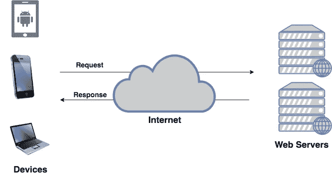
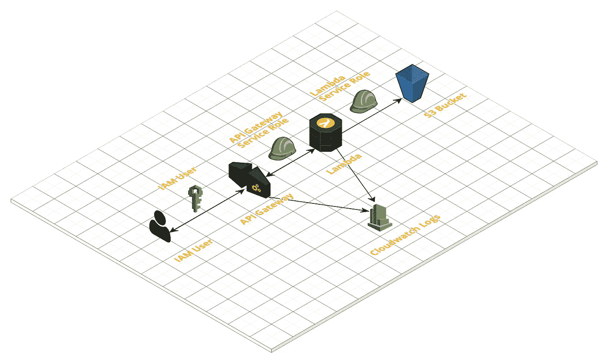
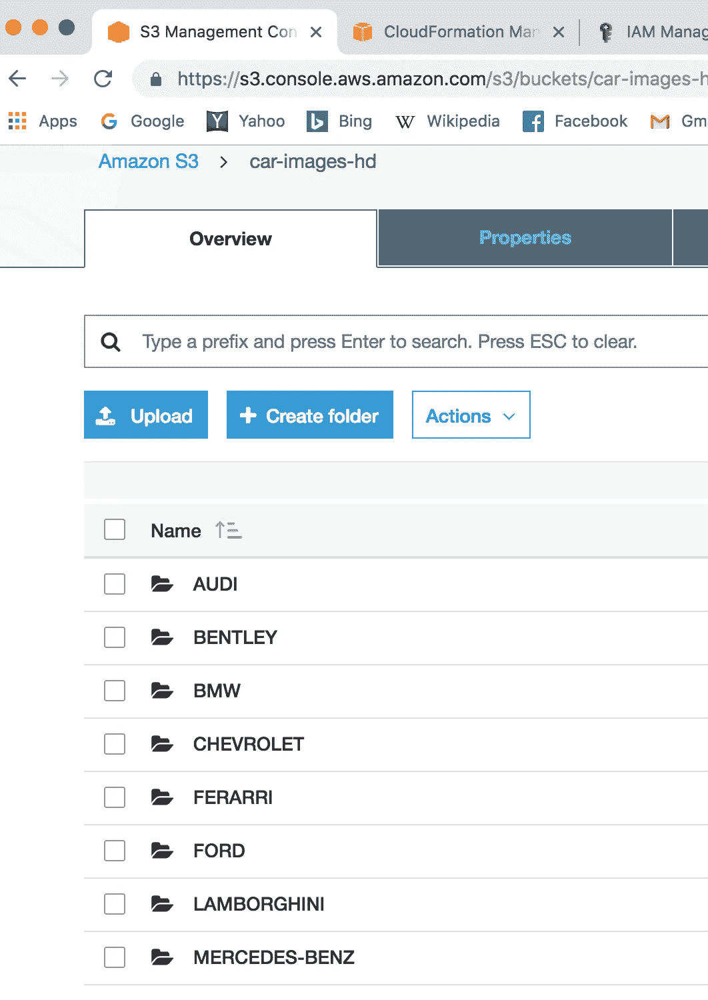
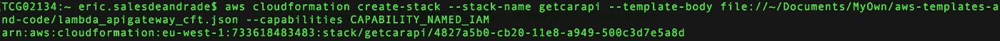
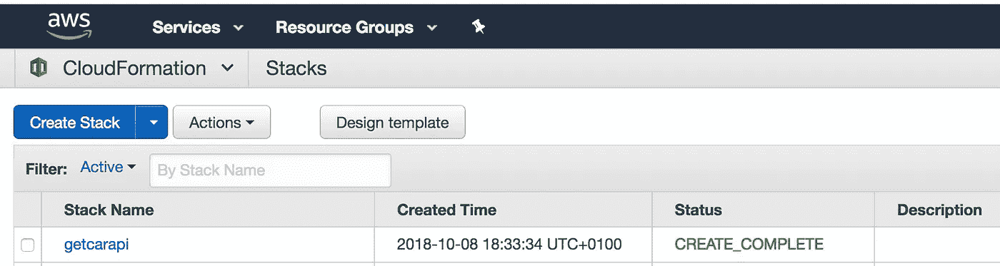
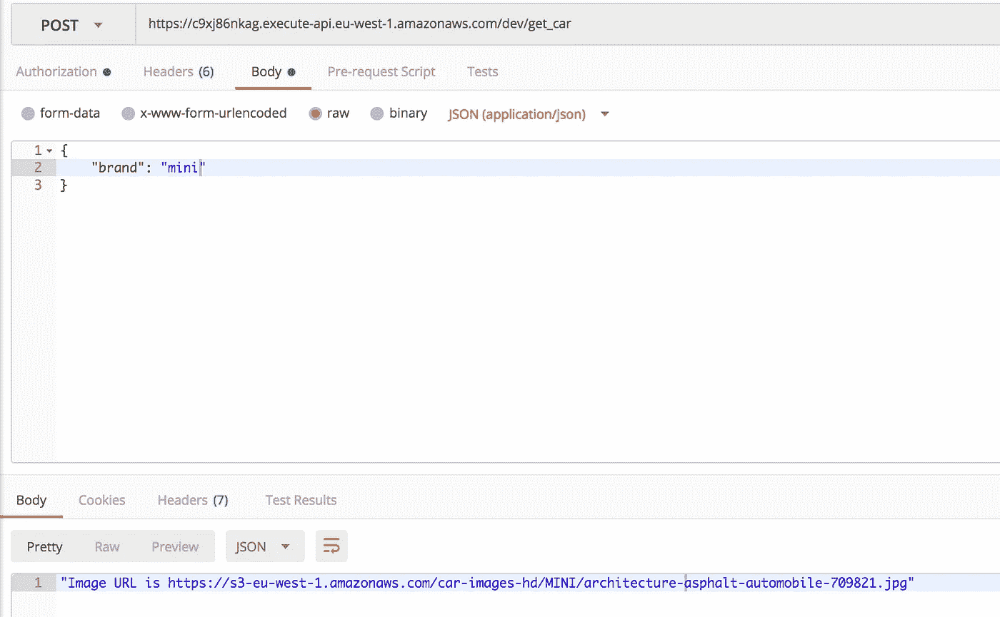
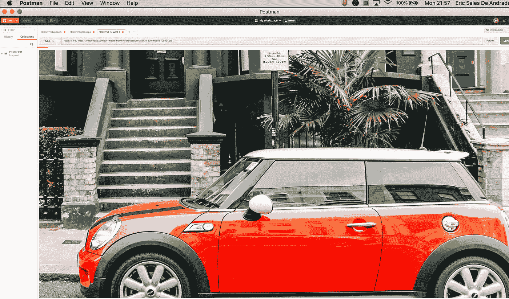

# 如何使用 CloudFormation 构建一个带有 AWS Lambda 和 API 网关的 API

> 原文：<https://itnext.io/how-to-build-an-api-with-aws-lambda-and-api-gateway-using-cloudformation-bd5f9249ac2f?source=collection_archive---------0----------------------->

你可能已经听过 API 这个流行词很多次了。API 代表“应用程序编程接口”。如果你不知道这是什么意思，官方定义如下:

“应用编程接口(API)是一组协议、例程、函数和/或命令，程序员使用它们来开发软件或促进不同系统之间的交互。”—技术百科

*Ref—*[https://www . techopedia . com/definition/24407/application-programming-interface-API](https://www.techopedia.com/definition/24407/application-programming-interface-api)

用非常简单的话来说，这意味着 API 是计算机程序或软件相互共享信息或数据的一种方式。公司软件使用它们与其他公司软件交换信息，甚至在同一公司内交换信息。如今，API 的使用非常广泛，尤其是随着大数据技术和价格合理的云计算的快速普及。

每次你在手机上打开一个应用程序，它最有可能是向另一个软件发出 API 请求。



API 如何工作

在这篇文章中，我将向你展示如何通过 6 个步骤使用亚马逊网络服务(AWS)创建你的第一个 API。您将使用 CloudFormation，这是 Amazon 创建“基础设施即代码(IaC)”的模板语言，这意味着我们可以定义一个模板(在这种情况下是 JSON)来提供构建 API 所需的每个 AWS 资源。

您可以在下面的 AWS 控制台中找到使用 IaC 而不是手动创建资源的好处。

[](https://www.linkedin.com/pulse/cloud-infrastructure-code-why-eric-sales-de-andrade/) [## 云基础设施作为代码？为什么？

### 以下是您应该始终考虑将云基础设施编写为代码(IaC)的 5 个原因。1)再现性…

www.linkedin.com](https://www.linkedin.com/pulse/cloud-infrastructure-code-why-eric-sales-de-andrade/) 

## 所需的技能和知识

这篇文章假设了一些关于 Python，AWS CLI(命令行界面)和 AWS 服务的基本知识主要是 Lambda，API Gateway，CloudFormation，IAM Roles，CloudWatch，Service 和 IAM Roles。

***请注意:作为此次部署的一部分，您可能会产生 AWS 费用。请检查您的免费层利用率，并确保您了解所涉及的 AWS 费用。***

# 步骤 1 设计您的无服务器 API 和架构

在编写任何代码、模板或在控制台中创建资源之前，规划 API 和架构非常重要。

**在这个例子中，你将创建一个 API，当它被调用时，用一个 URL 响应存储在 S3 桶中的汽车图片。**

下面是在[https://cloudcraft.co/](https://cloudcraft.co/)为本教程创建的架构图。



API 架构图(用[https://cloudcraft.co/](https://cloudcraft.co/)创建)

让我们来看看对上述架构的解释

*   S3 桶→用于将汽车图像存储在前缀形式为 <brand>/ <image-name>的桶中。</image-name></brand>
*   Lambda function →该函数将包含基于传递给 API (POST 请求)的参数获取 S3 图像 URL 的代码。
*   API Gateway →带有 POST 方法的 REST API，接受您希望获取图像的汽车的“品牌”名称。
*   IAM 用户→被授权调用此 API 并获取汽车图片 URL 和查看图片的用户。
*   CloudWatch 日志→捕获 Lambda 函数执行和 API 网关调用的日志。
*   Lambda 服务角色→授予 Lambda 访问 S3 存储桶权限的服务角色。
*   API 网关服务角色→授予 API 网关访问权以调用 Lambda 函数的服务角色。

# 步骤 2-创建 S3 存储桶并将内容加载到其中

现在架构已经清晰了，是时候创建一个 S3 桶并将图像上传到其中了。为此，请访问 S3 并点击“创建存储桶”。

注意，您也可以在 CloudFormation 中创建 bucket(因为我们将在下面创建所有其他资源)，但是为了简单起见，我们手动创建了它。

桶名→“汽车-图片-高清”**(请注意这一点)**

以“品牌”名称作为前缀存储的图像(文件夹)。



带有图像的 S3 桶

# 步骤 3 创建云形成模板

如上所述，我们将使用 CloudFormation 创建和提供所有需要的资源。最大的好处是，基础架构可以在任何帐户中轻松地复制任意次数。

我们在上面的模板中创建了以下资源

*   AWS::IAM::Role (Lambda 服务角色)
*   AWS::IAM::Role (API 网关服务角色)
*   AWS::Lambda::函数(Lambda 函数)
*   AWS::API gateway::RestApi(Rest API)
*   AWS::IAM::User (API 调用程序 IAM 用户)
*   AWS::IAM::ManagedPolicy(上述 IAM 用户的托管策略)
*   AWS::Lambda::Permission(API 网关调用 Lambda 函数的权限)
*   AWS::Logs::LogGroup(接受来自 Lambda 函数和 API 网关的日志的日志组)
*   AWS::IAM::Role (CloudWatch 角色)
*   AWS::S3::BucketPolicy(仅向创建的用户授予 get_object 访问权限的存储桶策略)
*   AWS::ApiGateway::帐户(部署 API 网关阶段所需)
*   AWS::ApiGateway::Stage (API 网关阶段)
*   AWS::ApiGateway::Deployment(部署 REST API)

## AWS 云信息资源模板定义

[](https://docs.aws.amazon.com/AWSCloudFormation/latest/UserGuide/aws-template-resource-type-ref.html) [## AWS 资源类型参考- AWS 云信息

### 列出了 AWS CloudFormation 支持的所有 AWS 资源类型的详细参考信息。

docs.aws.amazon.com](https://docs.aws.amazon.com/AWSCloudFormation/latest/UserGuide/aws-template-resource-type-ref.html) 

# 步骤 4 -创建并压缩 Lambda 函数

下面是一个简单的 Lambda 函数，您将使用它从 S3 桶中获取对象 URL。

Lambda 函数的名称已经编码到 CloudFormation 模板的第 78 行中，所以如果您确实要更改 Lambda 函数的名称，请确保更改它和处理程序(在第 80 行)。

压缩 Get_Car.py 文件，并将其作为 Get_Car.zip 上传到 S3 Bucket“car-images-HD”。确保在部署 CloudFormation 模板之前完成此操作，因为 Lambda 函数将使用此 Zip 文件作为其代码。

# 步骤 5—使用 CLI 部署云信息模板

下一步是用 AWS 命令行界面部署 CloudFormation 模板。请确保您已经使用 AWS 配置输入了安全凭据，如访问密钥和安全访问密钥。你可以在下面找到如何做到这一点。

[](https://docs.aws.amazon.com/lambda/latest/dg/setup-awscli.html) [## 设置 AWS 命令行界面(AWS CLI) - AWS Lambda

### 本指南中的所有练习都假设您在帐户中使用管理员用户凭据(adminuser)…

docs.aws.amazon.com](https://docs.aws.amazon.com/lambda/latest/dg/setup-awscli.html) 

根据您存储云形成模板(CFT)的位置，您可以使用下面的命令从终端部署 CFT。

```
aws cloudformation create-stack — stack-name YOURSTACKNAME — template-body file://YOURSTACKLOCATION/FILENAME.json — capabilities CAPABILITY_NAMED_IAM
```

例如我的可以在下面找到

```
aws cloudformation create-stack — stack-name getcarapi — template-body file://~/Documents/MyOwn/aws-templates-and-code/lambda_apigateway_cft.json — capabilities CAPABILITY_NAMED_IAM
```

如果您的命令成功，您应该会看到一个堆栈 ID ARN，如下所示



在 CLI 中创建堆栈

然后登录 AWS 控制台，您应该能够看到现在已经创建了堆栈。



堆栈已创建

如果您的 CFT 由于某种原因未能创建，您应该会看到红色的 ROLLBACK_IN_PROGRESS 消息，在这种情况下，您可以单击堆栈名称来查看错误。删除堆栈，纠正 JSON 中的错误并重新部署。

# 步骤 6—测试您的 API

手指交叉，你已经正确地部署了整个资源栈。现在，您应该能够测试刚刚创建的 API 了。但是首先你需要做两步。

1.  获取 API IAM 用户调用者凭据

单击 IAM →选择用户→选择安全凭据，并记下访问密钥和秘密访问密钥。

2.获取该阶段的 API 端点

转到 API Gateway →找到您的 API →单击 Stages →单击您的 stage 上的下拉菜单→单击 Post 并记下 URL 端点。

现在您已经准备好测试您的 API 了。为此，你可以使用邮递员或任何其他工具。

## 在邮递员中测试

在“授权”选项卡中，

*   选择“AWS 签名”。
*   输入 API 调用方的访问密钥和秘密访问密钥。
*   输入您的 AWS 区域。
*   对于服务名，您可以使用“execute-api”。

现在转到“正文”选项卡，

*   在上面的框中输入 API 端点
*   您可以输入下面的测试有效载荷并点击发送

```
{
 "brand": "mini"
}
```

您应该会收到一个带有 S3 网址的响应(如下所示)



调用 API 网关获取 S3 URL

*   单击图片中的 URL，这将在 Postman 中打开一个新的选项卡，输入相同的 AWS 凭据，然后点击 SEND。您现在应该收到您的图像(响应时间将取决于图像的大小和您的互联网连接)。



图片来自 https://www.pexels.com 的 S3 网址(图片由[提供)](https://www.pexels.com)

现在，您已经成功地创建了您的第一个 API。

https://giphy.com/

# **结论**

*   在本教程中，您理解并使用 AWS S3、Lambda 和 API Gateway 创建了自己的无服务器 API。
*   使用 CloudFormation(或 Terraform 是云不可知的)总是更好，因为它更容易更好地将资源作为代码供应，原因如上所述，主要是部署的速度和方便性。
*   使用无服务器方法有许多优点和缺点，主要集中在响应时间、可伸缩性和成本方面。
*   最重要的是在设计 API 时考虑到可伸缩性，API Gateway 附带了每秒 10，000 个请求的软限制(这意味着您可以调用 AWS 支持来增加它)。Lambda 遭受冷启动问题，这意味着如果你的计算或返回负载非常重，它可能需要一段时间才能执行。

我希望这篇教程对你有所帮助，并且你已经了解了一些 API。请联系我，并通过下面的评论告诉我你喜欢或不喜欢这个帖子的地方。