# 如何构建事件驱动的 ASP.NET 核心微服务架构

> 原文：<https://itnext.io/how-to-build-an-event-driven-asp-net-core-microservice-architecture-e0ef2976f33f?source=collection_archive---------0----------------------->

## 使用 RabbitMQ、C#、REST-API 和实体框架进行异步解耦通信，并最终与集成事件和发布-订阅保持一致

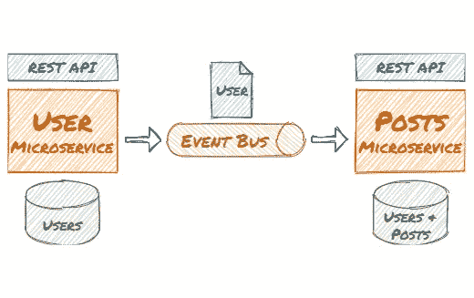

在本指南中，您将**创建两个 c# ASP.NET 核心微服务**。两个微服务都有它们自己的**有界上下文和域模型**。每个微服务都有自己的**数据库和 REST API** 。一个微服务发布另一个微服务消费的**集成事件**。

# 解耦微服务——一个真实的代码示例

该应用程序使用了一个真实世界的例子，用户**可以写文章**。用户微服务允许创建和编辑用户。**在用户域中，用户实体有几个属性**，如名称、邮件等。在 post 域中，还有一个用户，因此 post 微服务可以加载帖子并显示作者，而无需访问用户微服务。post 域中的用户实体简单得多:

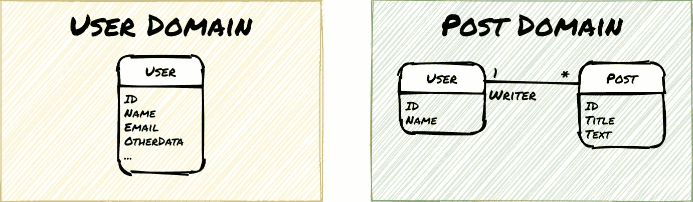

微服务**解耦**并且**异步通信**导致**最终一致性**。这种架构是松散耦合服务(T21)的基础，支持高可伸缩性。微服务通过**实体框架**访问它们的**示例 Sqlite 数据库**，并通过 **RabbitMQ** 交换消息(例如在 Docker 桌面上)。

*工作流程、组件和技术概述图:*

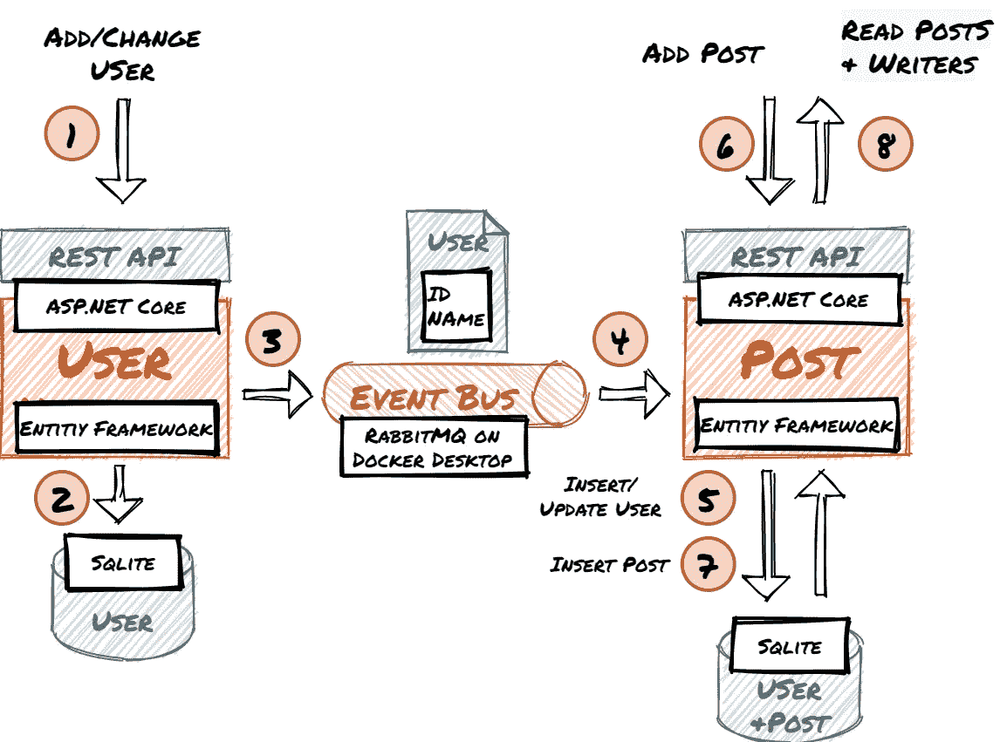

> 本文中的代码和配置不适合生产使用。本指南侧重于概念和组件如何交互。为此，错误处理等。省略。

## 本指南的步骤

1.  创建。网络核心微服务
2.  使用 RabbitMQ 并配置交换和管道
3.  发布和消费微服务中的集成事件
4.  测试工作流程
5.  最后的想法和展望

# 1.创建。网络核心微服务

在本指南的第一部分，您将**创建用户并发布微服务**。您将**添加实体和基本 Web API**。实体将通过实体框架从 **Sqlite 数据库**中**存储和检索。可选地，您可以在浏览器中使用 **Swagger UI** 测试用户微服务。**

## 让我们开始吧。

**用 ASP.NET 和 web 开发工作量安装** [**Visual Studio 社区**](https://visualstudio.microsoft.com/en/vs/community/) (免费)。

**创建一个解决方案**并添加两个 ASP.NET Core 5 Web API 项目“UserService”和“PostService”。禁用 HTTPS 并激活 OpenAPI 支持。

对于这两个项目**，安装以下 NuGet 包**:

*   微软。实体框架工作核心工具
*   微软。EntityFrameworkCore.Sqlite
*   纽顿软件。Json
*   RabbitMQ。客户

## 实现用户服务

创建用户实体:

创建用户服务上下文:

**编辑 Startup.cs** 配置 UserServiceContext 使用 Sqlite 并调用*数据库。EnsureCreated()* 确保数据库包含实体模式:

**创建用户控制器**(它只实现本演示所需的方法):

调试 UserService 项目，它将启动您的浏览器。您可以使用 swagger UI 来测试创建和读取用户是否有效:

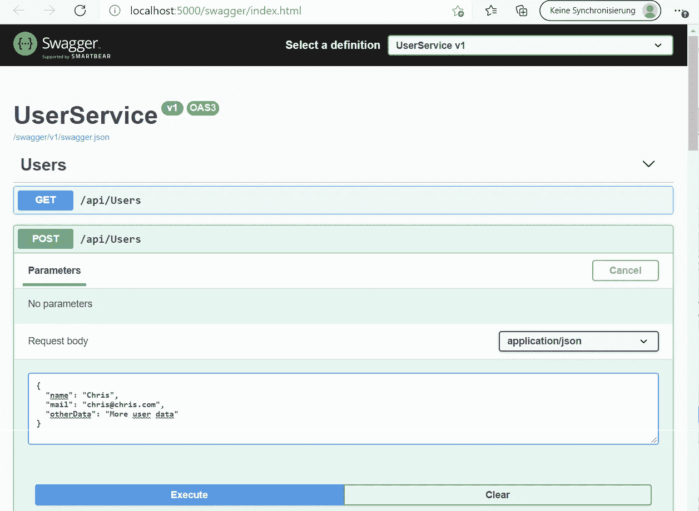

## 实施邮政服务

创建用户和发布实体:

创建 PostServiceContext:

**编辑 startup.cs** 配置 UserServiceContext 使用 Sqlite 并调用*数据库。EnsureCreated()* 确保数据库包含实体模式:

创建后控制器:

目前，您不能插入帖子，因为 PostService 数据库中没有用户。

# 2.使用 RabbitMQ 并配置交换和管道

在本指南的第二部分，您将**让 RabbitMQ 运行**。然后您将**使用 RabbitMQ admin web UI 为应用程序配置交换和管道**。您可以选择使用 admin UI 向 RabbitMQ 发送消息。

*此图显示了用户服务如何向 RabbitMQ 发布消息，以及 PostService 和潜在的其他服务如何使用这些消息:*

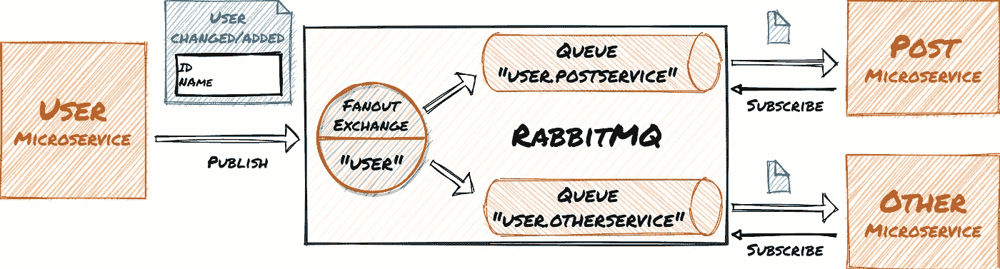

让 RabbitMQ 运行起来最简单的方法就是**安装** [**Docker 桌面**](https://hub.docker.com/editions/community/docker-ce-desktop-windows) 。然后**发出下面的命令**(在控制台窗口的一行中)用 admin UI 启动 RabbitMQ 容器:

```
C:\dev>docker run -d  -p 15672:15672 -p 5672:5672 --hostname my-rabbit --name some-rabbit rabbitmq:3-management
```

**在端口 15672 上打开浏览器**，使用用户名“guest”和密码“guest”登录。使用 web UI**创建一个名为“user”类型的交换**和**两个队列**“user . postservice”和“user.otherservice”。

> 使用“Fanout”类型很重要，这样交换就可以将消息复制到所有连接的队列中。

您还可以使用 web UI 将消息发布到 exchange，并查看它们是如何排队的:

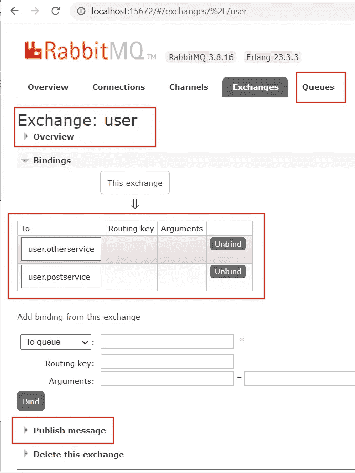

# 3.发布和消费微服务中的集成事件

在指南的这一部分，您将**带上。NET 微服务和 RabbitMQ 一起**。**用户服务发布**事件。 **PostService 使用**事件，而**在其数据库**中添加/更新用户。

**修改用户服务。UserController** 发布用户创建和更新 RabbitMQ 的集成事件:

> 在这些示例中，连接和其他 RabbitMQ 对象没有正确关闭。它们也应该被重用。见[官方 RabbitMQ。NET 教程](https://www.rabbitmq.com/tutorials/tutorial-one-dotnet.html)和[我的后续文章](/the-outbox-pattern-in-event-driven-asp-net-core-microservice-architectures-10b8d9923885)。

**修改(**和*误用* **)后期服务。编程**以订阅集成事件并将更改应用到后期服务数据库:

# 4.测试工作流程

在本指南的最后部分，您将测试整个工作流程:


**本指南最后部分的步骤总结**(您可以通过 Swagger UI 访问服务):

*   调用 UserService REST API，并向用户数据库添加一个用户
*   UserService 将创建一个事件，由 PostService 使用，并将用户添加到 post DB 中
*   访问 PostService REST API 并为用户添加一篇文章。
*   调用 PostService REST API 并从 post 数据库中加载文章和用户
*   调用 UserService REST API 并重命名用户
*   UserService 将创建一个事件，由 PostService 使用并更新 post DB 中的用户名
*   调用 PostService REST API 并从 post 数据库中加载 post 和重命名的用户

> 用户数据库必须为空。如果您在本指南的前面步骤中创建了用户，则可以删除 user.db(在 Visual Studio 资源管理器中)。数据库调用。EnsureCreated()将在启动时重新创建数据库。

**配置两个项目作为服务运行**:

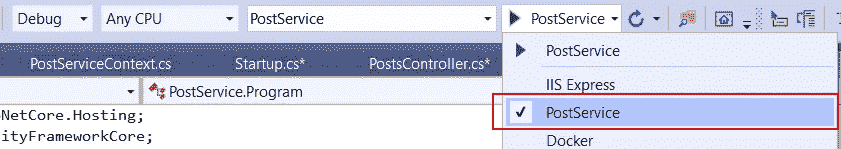

**将 PostService 的 App-URL 更改为另一个端口**(例如 [http://localhost:5001](http://localhost:5001) )，这样两个项目可以并行运行。将解决方案配置为启动两个项目并开始调试:

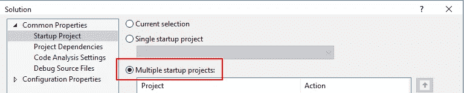

使用 Swagger UI 在用户服务中创建用户:

```
{
 "name": "Chris",
 "mail": "chris@chris.com",
 "otherData": "Some other data"
}
```

在您的环境中，生成的用户 Id 可能会有所不同:

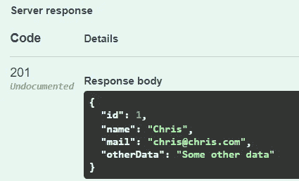

集成事件将用户复制到 PostService:

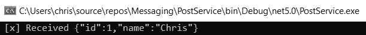

现在，您可以在 PostServive Swagger UI 中创建帖子(使用您的用户 Id):

```
{
  "title": "MyFirst Post",
  "content": "Some interesting text",
  "userId": 1
}
```

阅读所有帖子。用户名包含在结果中:

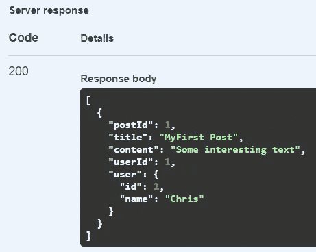

在用户服务 Swagger UI 中更改用户名:

```
{
  "id": 1,
  "name": "My new name"
}
```

然后再次阅读帖子，并查看更改后的用户名:

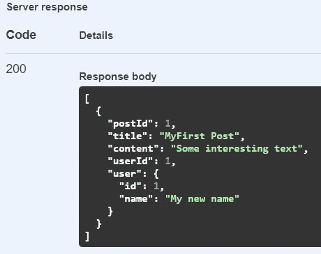

# 5.最后的想法和展望

您为事件驱动的微服务架构创建了**工作基础。**除了数据复制，您还可以将其用于经典的生产者-消费者工作流、传奇等。

请确保**调整代码以在生产环境中使用** : **清理代码**和**应用安全最佳实践。**申请。NET 核心设计模式、错误处理等。

目前，当 RabbitMQ 或微服务崩溃时，消息可能会在边缘情况下丢失。参见我的后续文章 [**如何应用事务性发件箱模式，让应用更有弹性**](/the-outbox-pattern-in-event-driven-asp-net-core-microservice-architectures-10b8d9923885) 。

请参阅我的其他文章，了解如何:

*   [**使用数据库分片并扩展您的应用**](/how-to-use-database-sharding-and-scale-an-asp-net-core-microservice-architecture-22c24916590f)
*   [**将您的 ASP.NET 核心应用程序部署到 Kubernetes，使用 Angular 作为 UI**](https://levelup.gitconnected.com/kubernetes-angular-asp-net-core-microservice-architecture-c46fc66ede44)
*   [**添加 MySql 和 MongoDB 数据库**](/databases-in-a-kubernetes-angular-net-core-microservice-arch-a0c0ae23dca9) 。

如果你有任何问题、想法或建议，请联系我。