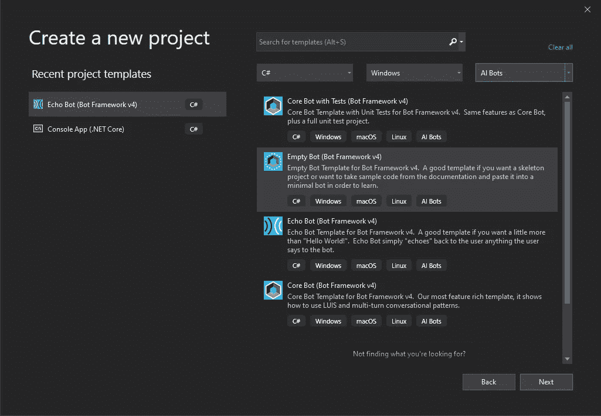
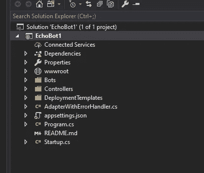
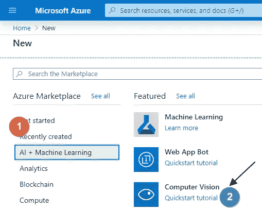
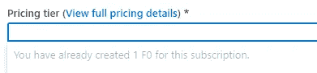
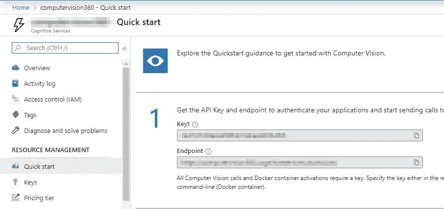
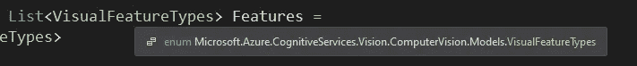
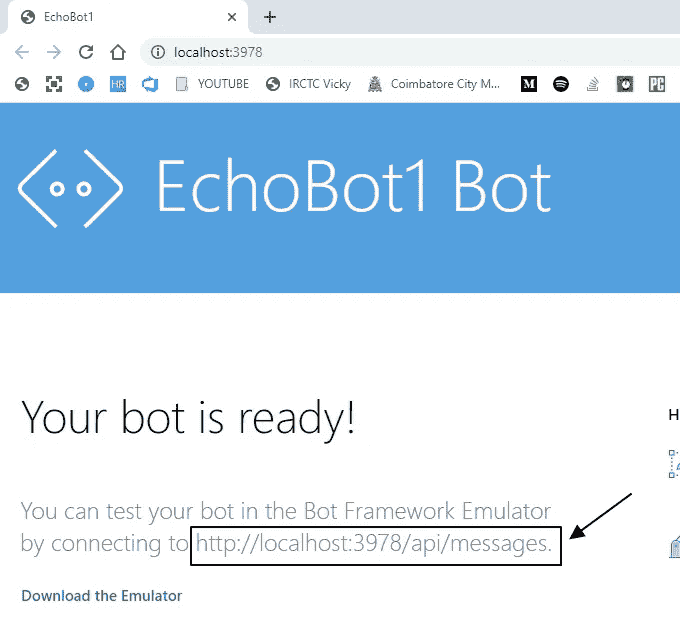
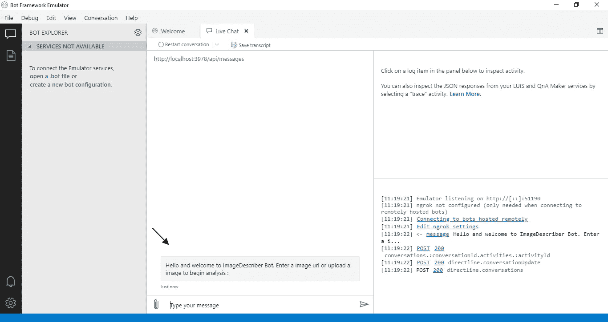
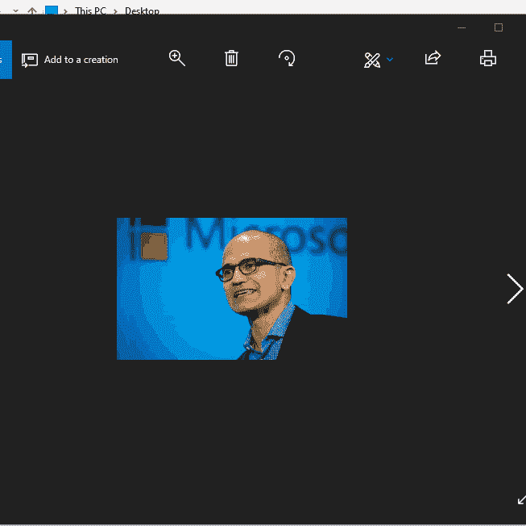
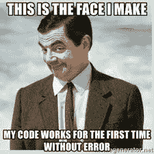

# 如何使用 Microsoft bot 框架构建图像处理器 Bot

> 原文：<https://itnext.io/how-to-build-an-image-processor-bot-using-microsoft-bot-framework-d736919721f8?source=collection_archive---------6----------------------->

最近，围绕机器人和机器学习的炒作需求巨大。最近参加了[全球 Azure 训练营](https://globalai.community/global-ai-bootcamp/)。因为我是一名主持人，我学到了所有这些关于建造机器人的神奇的东西，并与大家分享。

## 先决条件

*   [微软视觉工作室](https://visualstudio.microsoft.com/vs/) ✌️
*   [Azure Bot 框架模拟器](https://github.com/Microsoft/BotFramework-Emulator/blob/master/README.md)🎮
*   Azure 订阅🎆
*   耐心阅读这篇文章🍁

## 目标或项目目标

对我来说，目标是给机器人一个图像或图像 URL，它应该返回特定图像的分析。

## 入门指南

我们去 Visual Studio 创建一个 Bot 框架 V4 项目。



但是等等，你不会马上就有 Bot 框架模板。您需要从[市场](https://marketplace.visualstudio.com/items?itemName=BotBuilder.botbuilderv4)安装用于 Visual Studio 的 Bot Framework v4 SDK 模板。

现在您已经安装了模板，选择它并创建一个 **Echo Bot，**您将拥有一个类似这样的解决方案。



溶液结构

## 探索解决方案

这看起来与. NET 核心 Web API 应用程序的结构相同。它有一个控制器，用于与带有`[Route(“api/messages”)].`的机器人交互，它有一个启动程序，用于注入你的依赖项，还有一个`ErrorHandler` 类。

# EchoBot.cs

如果你看一下 Bots 文件夹下的`EchoBot.cs`，这是实际的 bot 处理和逻辑完成的地方。这里要注意的主要是`OnMessageActivityAsync`和`OnMembersAddedAsync`

## OnMembersAddedAsync

该函数本身的名称表示每当有新成员添加到机器人进行交互时，或者机器人第一次连接时，与用户进行交互。我们先修改一下这个。

```
var welcomeText = “Hello and welcome to ImageDescriber Bot. Enter a image url or upload a image to begin analysis :”;foreach (var member in membersAdded){
  if (member.Id != turnContext.Activity.Recipient.Id)
  await    turnContext.SendActivityAsync(MessageFactory.Text(welcomeText), cancellationToken);
}
```

我把`CreateActivityWithTextAndSpeak`去掉了，改成了上面的样子。它所做的只是欢迎用户。

## OnMessageActivityAsync

这就是我们需要处理图像或 URL 的地方。让我们看看可能性。如果你没有意识到，你可以利用 **Azure 认知服务**来进行这样的人工智能操作。

总是有两种方式与 Azure 服务交互。

*   REST API
*   客户端 SDK

我是一个懒惰的人，所以我不会去探索 REST API 浏览器并找到合适的 API，找到它的头文件，强制参数等等等等..这也是我创建自己的库来与 StackExchange API 交互的原因。它叫做[StackExchange.NET](https://github.com/gethari/StackExchange.NET)，你也可以在 [Nuget](https://www.nuget.org/packages/StackExchange.NET/) 中找到它

## Azure 认知服务 SDK

所以我将在我的项目上安装 Azure Cognitive services SDK 来处理图像。但在此之前，你需要创建一个 Azure 认知服务来做到这一点。

*   打开 Azure 门户并点击添加新资源
*   选择人工智能和机器学习类别，然后点击计算机视觉



给它一个你想要的更好的名字，在选择定价方案时，选择 **F0** 因为它是免费的，它将服务于我们的目的。我们不打算生产，所以免费应该没问题。

**注意:**如果您已经有一个计算机视觉资源，您不能重新创建一个免费的。你可以利用它。



已经存在的资源

## 连接到认知服务

一旦资源创建完成，你可以打开资源，你会发现一个`Key` 和一个`Endpoint`



Azure 认知服务

现在导航回解决方案，打开`appsettings.json`，创建如下 json。复制密钥和端点并粘贴它。

```
{
  “MicrosoftAppId”: “”,
  “MicrosoftAppPassword”: “”,
  “Credentials”: {
    “ComputerVisionKey”: “enter your Key”,
    “ComputerVisionEndpoint”:“enter endpoint URL"
   }
}
```

## 注入凭据

*   创建一个新类，如下所示。

```
public class Credentials {
  public string ComputerVisionKey { get; set; }
  public string ComputerVisionEndpoint { get; set; }
}
```

*   现在打开`Startup.cs`，在`ConfigureServices`方法下添加下面一行。

```
services.Configure<Credentials(Configuration.GetSection(“Credentials”));
```

*   我希望你知道我们是如何从 appsettings.json 获取值的。

## 安装 SDK

*   从 Nuget 包管理器安装`Microsoft.Azure.CognitiveServices.Vision.ComputerVision`。
*   我们将创建一个新的类来使用客户端 sdk 执行操作。

```
public class ImageAnalyzer {
 private readonly string _computerVisionEndpoint;
 private readonly string _computerVisionKey; public ImageAnalyzer(IOptions<Credentials> options {
  _computerVisionKey = options.Value.ComputerVisionKey;
  _computerVisionEndpoint = options.Value.ComputerVisionEndpoint;
 }
}
```

*   我有一个简单的类，其中的构造函数将在运行时自动注入。

## 使用 SDK 进行计算

我们使用的任何 API / SDK 都需要首先经过认证。所以我创造了一个这样的方法

```
public static ComputerVisionClient Authenticate(string endpoint, string key) {
  var client = new ComputerVisionClient(new     ApiKeyServiceClientCredentials(key)) { 
  Endpoint = endpoint };
return client;
}
```

因为我们将要分析一个`Stream`或者一个`URL`，所以我为它创建了两个方法。

```
public async Task<ImageAnalysis> AnalyzeImageAsync(Stream image) {
  var client = Authenticate(_computerVisionEndpoint, _computerVisionKey);
  var analysis = await client.AnalyzeImageInStreamAsync(image, Features);
  return analysis;
  }
}public async Task<ImageAnalysis> AnalyzeUrl(string url){
  var client = Authenticate(_computerVisionEndpoint, _computerVisionKey);
  var result = await client.AnalyzeImageWithHttpMessagesAsync(url, Features);
  return result.Body;
}
```

原来如此。SDK 操作已经完成。需要注意的是，第二个参数在两个客户端调用中都被称为`Features`。这是什么？



所以是 SDK 接受的一个`List<Enums>`。我已经从文档中复制了它。

```
private static readonly List<VisualFeatureTypes> Features = new List<VisualFeatureTypes> {
  VisualFeatureTypes.Categories, 
  VisualFeatureTypes.Description,
  VisualFeatureTypes.Faces,   
  VisualFeatureTypes.ImageType,
  VisualFeatureTypes.Tags
};
```

## 与机器人互动

`ITurnContext<IMessageActivity> turnContext`是主要的东西，包含你与机器人共享的任何东西。看看下面的代码。我把它保持得很简单，以便于理解。

简单来说，下面的代码是

*如果是附件 image = >调用 processImage 方法，否则如果是 url = >调用 url 方法并返回结果*

```
var result = new ImageAnalysis();
if (turnContext.Activity.Attachments?.Count > 0) {
  var attachment = turnContext.Activity.Attachments[0];
  var image = await _httpClient.GetStreamAsync(attachment.ContentUrl); if (image != null) {
 result = await _imageAnalyzer.AnalyzeImageAsync(image);
 }
}
else {
 result = await _imageAnalyzer.AnalyzeUrl(turnContext.Activity.Text);
}
var stringResponse = $”I think the Image you uploaded is a {result.Tags[0].Name.ToUpperInvariant()} and it is {result.Description.Captions[0].Text.ToUpperInvariant()} “;
return stringResponse;
```

## 演示

现在是时候看看这个机器人是否真的工作了。为此，

*   构建解决方案，然后按`F5`。
*   正如先决条件中提到的，我已经安装了 Azure Bot 框架模拟器，让我们打开它。
*   当你打开它时，你会看到这样一个页面



机器人优先交互

正在上传图像。



万岁。任务完成！🔥



完整的解决方案可以从这里的 [Github](https://github.com/gethari/ImageDescriber) 下载

感谢阅读。请继续关注更多博客。