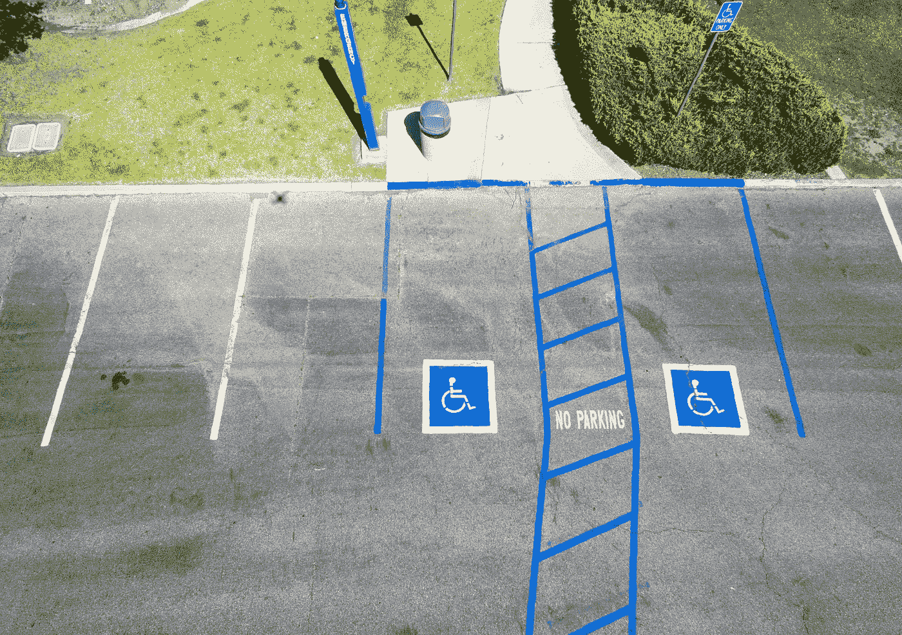
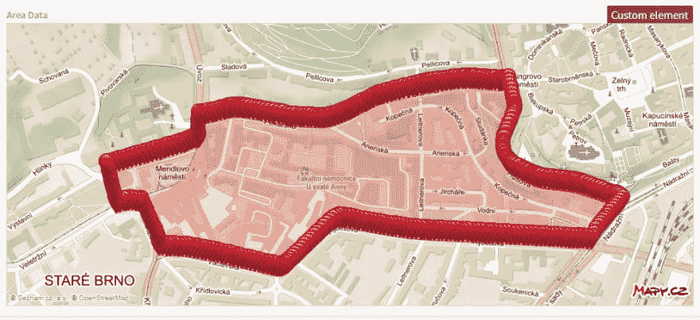
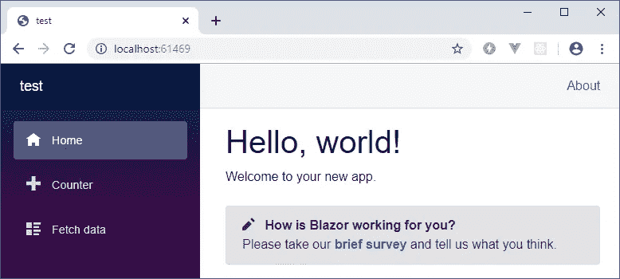

# 如何用 Blazor 建立一个互动 SPA

> 原文：<https://itnext.io/how-to-build-an-interactive-spa-with-blazor-a030bae66b68?source=collection_archive---------4----------------------->

你是. NET 开发者吗？你是不是也有点嫉妒现在 JS 的人创造的美丽的，有反应的温泉？别再嫉妒了，布拉索会帮你的。



我以前做过很多。所以当 JavaScript 在几年前成为后起之秀的时候，我很难过微软并没有真正解决这个问题。随着时间的推移，我找到了进入 Vue.js 的方法，但是像 npm、webpack、bundling、deploying 等东西从一开始就对我来说是一个很大的挑战。今年早些时候，我偶然发现了 Blazor——一个允许开发人员编写的框架。使用 Mono 编译的. NET 代码运行在 Webassembly 上。这意味着它可以在当今所有主流浏览器上运行。此外，使用 Blazor，我能够呆在 Visual Studio(我的舒适区)中，使用与 MVC 完全相同的设计模式。那么，它兑现承诺了吗？

在本文中，我将向您展示如何构建一个客户端 Blazor 应用程序，添加一些功能，使用 NuGet 包，并与 JavaScript 进行通信。

# 是什么项目？

在我居住的城市布尔诺，我们最近有了住宅停车区，很多司机，主要是外国人，在寻找停车位时感到困惑。每个人都害怕道路上的蓝线。因此，我的目标是建立一个简单的应用程序，可以检查游客站在哪里(使用手机 GPS)，并用两句话解释特定地点的规则。可能导航到最近的停车机器。简单、快速、反应灵敏。

# 数据模型

当你建立一个比你的狗的主页更大的网站时，你需要在某个地方组织和存储数据和内容。



开始时，我需要存储以下数据:

*   **停车区** - 停车区名称
    -标记每个停车区的数百个点的坐标(地图中的红色标记)
    -限制
*   **访客限制** - 持续时间—应用规则时
    -描述—规则是什么
*   **居民限制** - 持续时间—适用规则时
    -邻居—允许居民在附近区域停车
*   **停车机器**

总的来说，我们在看 4 个模型(区域、访客限制、居民限制和停车机器)。

我倾向于尽可能使用无头 CMS，因为它不需要任何安装，在云中运行，通过 CDN 提供数据，并具有 REST API 或更好的特性——适用于我使用的平台的 SDK。在任何成熟的无头 CMS(如 Kontent、Contentful 或 ContentStack)中，构建内容类型和所需的层次结构都不是问题。

# 从 Blazor 模板开始

从 Blazor 开始最简单的方法是让`dotnet` 为你克隆一个模板。我的目标是 Blazor 的客户端版本，但是也有用于服务器端(使用 SignalR 与浏览器通信)以及服务器和客户端组合项目的模板。要安装 Blazor 模板，请运行以下命令:

`dotnet new -i Microsoft.AspNetCore.Blazor.Templates::3.1.0-preview3.19555.2`

要克隆模板(客户端)，请使用:

`dotnet new blazorwasm`

这为您提供了基本的项目结构:

**-页面
-共享
-wwwroot
-CSS** index.html
startup . cs

样板文件已经使用了基本的样式表，使网站看起来很漂亮。如果你需要使用你的样式表(像我一样——我的附加样式表在这里是)，把它们放入 css 文件夹，并使用`wwwroot/index.html`中的`<link>`元素引用它们。该文件是 Blazor 呈现的每个页面的主要包装。请确保不要删除`<app>`元素:-)。这就是奇迹发生的地方。



当您运行项目时，应该会看到这个屏幕。如果没有，那么:

*   检查您运行的是最新版本的 Visual Studio 2019 *预览版*，拥有最新版本的。NET Core SDK 和最新版本的 Blazor 模板(看[这里](https://docs.microsoft.com/en-us/aspnet/core/blazor/get-started?view=aspnetcore-3.0&tabs=visual-studio))。
*   该问题可能与链接有关(尤其是当您在输出窗口中看到非描述性错误时)。在这种情况下，要么关闭它(看[这里](https://docs.microsoft.com/en-us/aspnet/core/host-and-deploy/blazor/configure-linker?view=aspnetcore-3.0))或者添加一个链接器配置(看[这里](https://docs.microsoft.com/en-us/aspnet/core/host-and-deploy/blazor/configure-linker?view=aspnetcore-3.0)或者检查[样本配置文件](https://github.com/petrsvihlik/StartBootstrap.Freelancer.Blazor/blob/master/src/Linker.xml))。

# 使用 Blazor 页面和组件创建地图

现在站点正在运行，让我们添加一个带有地图组件的页面。在**页面**文件夹中添加一个新文件 **Map.razor** 。

页面总是包含一个可以访问它们的路径。

```
@page "/map"
```

文件的其余部分是页面的 HTML 标记。

```
<h1>Map</h1>
<div>Location: @Longitude, @Latitude</div>
<Map />
```

你看，我已经在使用 razor 语法和呈现属性值了。属性和方法既可以使用`@code{ //implementation }`块直接在标记中定义(这是 MS 的建议),也可以分离到“代码隐藏”文件中。我更喜欢后者，因为它使代码更具可读性(尤其是如果您计划两个以上的属性和一个方法)。但是，请记住，如果有任何冲突，内联代码优先于单独的文件。

添加一个新文件 **Map.razor.cs** 。Visual Studio 会将该文件以相同的名称放在页面下面。新类需要从 ComponentBase 继承，并定义页面上所有使用的属性。对我来说，那就是经度和纬度。

```
public class MapBase : ComponentBase
{
    public decimal Latitude { get; set; }
    public decimal Longitude { get; set; }
}
```

然后你需要告诉页面后面有一个代码:

`@inherits MapBase`

# 添加地图组件

下一部分是地图组件。在项目的根目录下创建一个文件夹**组件**和一个新文件 **Map.razor** 。在我的例子中，这个文件只包含 HTML 标记。

```
<div class="mapContainer">
  <div id="m"></div>
</div>
```

# 向网站添加地图 JavaScripts

地图还需要一个 JavaScript 来初始化它。该脚本可以在线获得，所以我可以直接引用它，或者将其复制到 **wwwroot/js** 文件夹并引用一个本地副本。我选择了第一个选项，因此我需要将下面几行添加到 **wwwroot/index.html** 中:

```
<script type="text/javascript" src="https://api.mapy.cz/loader.js"></script>
<script type="text/javascript">Loader.load();</script>
```

我不能直接添加脚本到组件中，因为 Blazor 不允许。

接下来，我需要配置和初始化地图。这是一个简单的 JS 代码，定义了地图的初始中心在哪里，以及地图应该有多详细。放置该文件的最佳位置是在 **wwwroot/js** 文件夹中，并从 **wwwroot/index.html** 中引用它，就像其他脚本一样。

`<script type="text/javascript" src="./js/map.js"></script>`

在此找到完整的文件内容[。](https://github.com/ondrabus/dont-park-here-client/blob/master/wwwroot/js/map.js)

# 从 Blazor 调用 JavaScript

初始化的函数需要在组件渲染的时候被 Blazor 调用。这里的问题是 Blazor 在组件的生命周期中多次呈现组件。原因是当访问者与我的站点交互并更改一些数据集时，组件需要对这些更改做出反应。他们需要重新渲染。但是对于地图，我只需要执行一次初始化脚本。`OnAfterRenderAsync`功能覆盖中的布尔参数`firstRender`将使您能够做到这一点。

Blazor 和 JavaScript 之间的通信可以通过 JSRuntime 实现。这是一个简单的服务，可以直接注入到任何组件中。

```
[Inject]
protected IJSRuntime JSRuntime { get; set; } 
```

并且，要执行一个 JavaScript 函数，您需要指定它的名称并为它的参数提供数据(如果它有参数的话)。如果函数返回数据，JSRuntime 可以将它绑定到各自的。NET 数据类型。在我的例子中，`mapInit`不返回任何东西，所以我使用 object。

```
protected override async Task OnAfterRenderAsync(bool firstRender)
{
    if (firstRender)
    {
        await JSRuntime.InvokeAsync<object>("mapInit");
    }
}
```

# 使用 NuGet 包识别 GPS 位置

地图初始化功能包含用于地图居中的固定坐标。那不理想。网站访问者必须知道他们站在哪里(或使用另一个应用程序来找出)，并在地图上点击该点。我能做的是向他们的浏览器要 GPS 坐标。我可以自己实现它，但是当我们可以使用 NuGet 时，为什么要重新发明轮子呢？

我找到了一个[包](https://github.com/AspNetMonsters/Blazor.Geolocation) `AspNetMonsters.Blazor.Geolocation`，它实现了一个`LocationService`。这个服务可以被注入到页面和组件中，它自动处理初始的地理位置查询。但是首先，您需要在`Startup.cs`中注册服务:

```
public void ConfigureServices(IServiceCollection services)
{
    services.AddSingleton<LocationService>();
}
```

我将服务注册为 singleton，这样 Blazor 将为所有请求提供相同的实例。但是，您也可以使用:

*   **AddTransient** —每次都创建新实例
*   **AddScoped** —实例的作用域为当前请求

还有一个 JavaScript 文件需要包含在主体中。在此找到[并添加到**/wwwroot/js/location . js**。像以前一样引用它:](https://github.com/AspNetMonsters/Blazor.Geolocation/blob/master/AspNetMonsters.Blazor.Geolocation/wwwroot/Location.js)

`<script type="text/javascript" src="./js/Location.js"></script>`

这就是服务被注入到**地图**页面的方式:

```
[Inject]
protected LocationService LocationService { get; set; }

protected override async Task OnAfterRenderAsync(bool firstRender)
{
   if (firstRender)
   {
       await JSRuntime.InvokeAsync<object>("mapInit");

       var currentLocation = await LocationService.GetLocationAsync();
       await JSRuntime.InvokeAsync<object>("mapCenter", currentLocation.Latitude, currentLocation.Longitude);
   }
}
```

# 从 JavaScript 调用 Blazor 并添加服务

但是在我将它添加到地图页面之前，让我们看一下列表中的最后一项——从 JavaScript 调用 Blazor 代码。这涵盖了当访问者点击地图上的一个点时的用例。之后，地图应该以该点为中心(由 JavaScript 处理)，并使用新坐标调用 Blazor。Blazor 将对照所有停车区检查新位置，并在必要时重新渲染相应组件(允许/禁止停车)。

`DotNet.invokeMethodAsync('DontParkHere', 'SetLocation', coords.y.toString(10), coords.x.toString(10));`

这段代码将使用两个参数调用`DontParkHere`名称空间中的方法`SetLocation`——两个 GPS 坐标。注意，方法需要是**公共**、**静态**，并用`[JSInvokable]`属性修饰。

但是如果方法是静态的，我们如何将新的坐标放入地图组件，执行检查，并更新前端呢？

让我们首先在 **Services/MapService.cs** 中创建一个服务。该服务将为地图页面中的一个方法保存一个动作委托，每当新的坐标到达时，我们都希望调用该方法。

```
public class MapService
{
    static Action<Location> _callback;

    public void WatchLocation(Action<Location> watchCallback)
    {
        _callback = watchCallback;
    }
}
```

`Location`类型来自之前添加的 NuGet 包。

现在，我们需要添加可从 JavaScript 调用的静态方法。

```
[JSInvokable]
public static void SetLocation(string latitude, string longitude)
{
    var location = new Location
    {
        Latitude = Convert.ToDecimal(latitude),
        Longitude = Convert.ToDecimal(longitude),
        Accuracy = 1
    };

    _callback.Invoke(location);
}
```

并在 Startup.cs 中注册服务，就像我们之前对定位服务所做的那样:

```
public void ConfigureServices(IServiceCollection services)
{
    services.AddSingleton<LocationService>();
    services.AddSingleton<MapService>();
}
```

最后，我可以更新地图页面。我确保注入新服务:

```
[Inject]
protected MapService MapService { get; set; }
```

并添加一个方法，该方法将在每次新坐标到达时处理检查:

```
protected void SetLocation(Location location)
{
    Console.WriteLine($"Check this position: {location.Latitude} {location.Longitude}");
    Latitude = location.Latitude;
    Longitude = location.Longitude;
    StateHasChanged();
}
```

你看，我需要调用`StateHasChanged`来让页面知道它需要重新呈现，因为我改变了底层数据集。在渲染过程中，我将地图服务的委托分配给这个函数:

```
protected override async Task OnAfterRenderAsync(bool firstRender)
{
   if (firstRender)
   {
       MapService.WatchLocation(this.SetLocation);

       await JSRuntime.InvokeAsync<object>("mapInit");

       var currentLocation = await LocationService.GetLocationAsync();
       await JSRuntime.InvokeAsync<object>("mapCenter", currentLocation.Latitude, currentLocation.Longitude);
   }
}
```

经过这些更改后，当您运行项目并访问 URL **/map** 时，您的浏览器应首先要求您共享您的位置(此请求可能会被自动拒绝，因为默认情况下本地 IIS Express 不使用 SSL)。同时，您应该看到地图渲染，每次单击地图，页面都会显示更新的坐标。

# 摘要

在布拉佐上建立一个功能性温泉浴场并没有花很长时间。我花了一段时间来更新我的工作空间，花了一两天时间来理解 Blazor 是如何工作的。那么所花的时间比得上其他任何一个。NET 项目。

我个人喜欢这样一个事实，即我可以在任何地方使用 C#，并坚持我从过去了解的模式。即使您需要使用 JS 组件或者将 Blazor 与 JS 框架相结合，也可以通过 JS 互操作来实现。我现在看到的缺点是第一次加载时的低性能和复杂的调试。总的来说，我很有兴趣看到 Blazor 随着时间的推移变得成熟，我希望它能打破 JS 框架的统治。

查看 GitHub 上的[整体实现](https://github.com/ondrabus/dont-park-here-client/tree/c68e76e5d7a25af59357e247a086ac69e5e5a5cf)。

**系列其他文章:**

*   [#1 大家都在说的这个 Blazor 是什么？](/what-is-this-blazor-everyones-talking-about-34529a3e1419)
*   #2 如何用 Blazor 构建一个交互式 SPA(本文)
*   [#3 利用 Blazor 和地理定位避免停车罚款](/avoiding-parking-fines-with-blazor-and-geolocation-d45a9a831d93)

*原载于 2019 年 12 月 18 日*[*https://dev . to*](https://dev.to/ondrabus_94/how-to-build-an-interactive-spa-with-blazor-4k8n)*。*