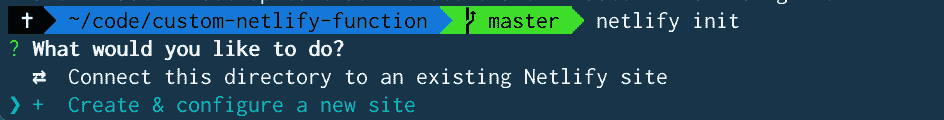
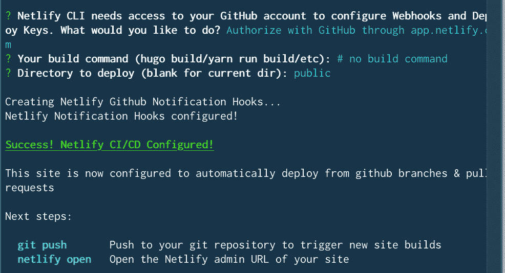
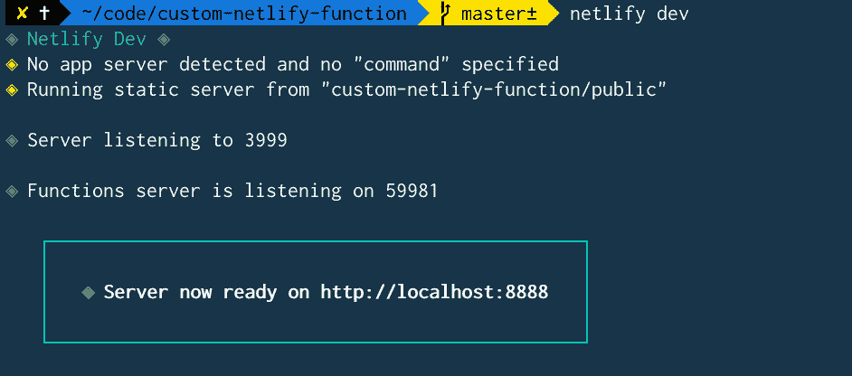
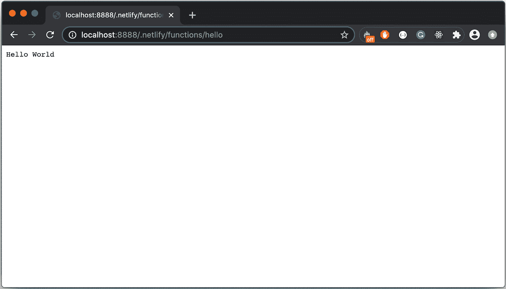
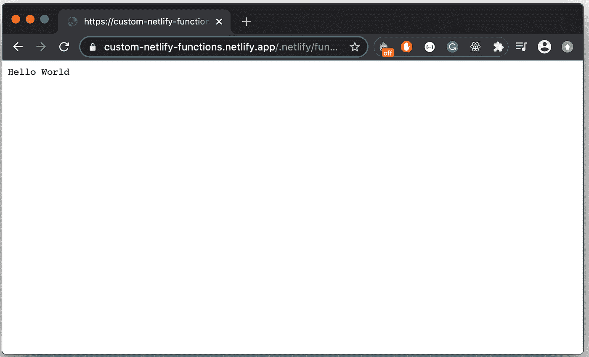
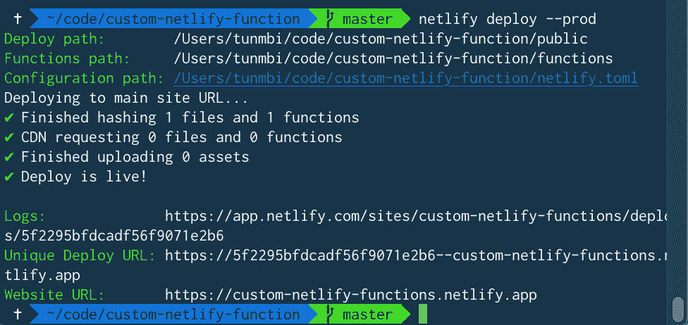

# 如何在网络中构建和部署无服务器功能

> 原文：<https://itnext.io/how-to-build-and-deploy-serverless-functions-to-netlify-d37418f6f7be?source=collection_archive---------2----------------------->


# 介绍

将代码功能的各个部分分离出来，使之独立于其他部分工作，这是一个很好的软件工程实践。因为您的代码基本上是由函数组成的，所以无服务器函数允许您部署这些函数，而不需要管理服务器来运行它们。

在本教程中，我们将学习什么是无服务器函数，如何编写它们，以及如何在几分钟内将它们部署到 Netlify 上。我们还将涉及无服务器功能的其他用途。

# 什么是无服务器功能？

无服务器功能是托管在云基础设施上的功能，并且执行单一目的。只要它有自己的依赖项并能独立运行，它就和你写的其他函数非常相似。它是无服务器的，因为它减轻了您维护服务器和扩展功能的压力。

Netlify 使得编写任何后端任务变得非常容易，并且只需简单的步骤就可以独立地或与项目一起部署它。如果与 GitHub 库链接，您的功能也可以通过一个简单的`git push`命令来部署。这些功能被称为[网络功能](https://www.netlify.com/products/functions/)。

无服务器函数就像 API 端点一样工作

# 让我们构建我们的无服务器函数

# 创建项目文件夹

手动或通过运行`mkdir custom-netlify-functions`创建一个空文件夹。你想用什么名字就用什么名字。这里我使用“自定义网络功能”。

# 用 GitHub 设置 CI/CD

## 用 GitHub 初始化 repo

*   换到文件夹`cd custom-netlify-functions`
*   创建一个 [readme.md](http://readme.md) 文件`touch readme.md`
*   运行`git init`用 Git 库初始化文件夹
*   运行`git add . && git commit -m "initial commit"`添加文件并提交更改。
*   去[github.com/new](http://github.com/new)，创建一个新的回购协议——最好是同名的
*   将本地存储库与远程存储库链接起来，如下所示:`git remote add origin git@github.com:YourGithubName/your-repo-slug.git`
*   运行`git push -u origin master`来推送你的文件

## 安装 Netlify CLI

我们将使用 Netlify CLI，因为它使我们的项目启动和运行变得非常容易`npm install -g netlify-cli`

## 初始化文件夹中的网络生活

如果您没有 netlify 帐户，请[现在创建一个](https://app.netlify.com/signup)

在文件夹内，运行`netlify init`用 netlify 初始化文件夹。



提示符会问你“你想做什么？”，选择“创建和配置新站点”。此选项在您的 netlify 帐户上创建一个新站点。

如果您已经通过验证，它会要求您选择您的团队(Netlify 帐户)。如果你还没有在[netlify.com](http://netlify.com)上认证，它会打开一个浏览器，要求你输入登录凭证。

下一个提示将询问您的网站名称，以及您是否愿意通过 Github 进行认证。对于站点名称，保留与“custom-netlify-functions”相同的名称，并使用 Github 进行验证

这一步将您的 Netlify 帐户和 repo 与您刚刚在 GitHub 上创建的帐户连接起来。

下一个提示。对于“您的构建命令”，只需按回车键。对于要部署到的目录，也要按回车键来使用“.”(当前目录)。



# 让我们编码

为我们的配置创建一个 netlify.toml 文件，并在其中编写以下代码:

```
[build]
    functions = "functions"
```

这段代码告诉 Netlify 它可以在“functions”文件夹中找到我们的函数

创建一个`functions`文件夹，我们将在其中编写我们的函数

在*功能*文件夹中，创建一个名为 hello.js 的文件

您可以通过使用一个以您的文件名结尾的 URL 来访问您的无服务器功能。所以，每个函数都以<name-of-file>结束(没有。js)</name-of-file>

将被调用的无服务器函数必须被命名为`handler`,它采用以下格式的 3 个参数:

```
//hello.js
exports.handler = function (event, context, callback) {}
```

*   `event`参数包含所有标题、查询参数和发布数据
*   `context`参数提供了关于调用无服务器函数的上下文的信息，比如某些用户信息。
*   调用这个无服务器函数时，调用`callback`(可选)参数以返回响应。

回调函数可以返回错误(第一个参数)或响应对象，如下所示:

```
callback(null, {
    "isBase64Encoded": true|false,
    "statusCode": httpStatusCode,
    "headers": { "headerName": "headerValue", ... },
    "body": "..."
})
```

回到我们的 hello.js 函数，像这样更新。我们就用“Hello World”返回一个对象吧。

```
exports.handler = function (event, context, handler) {
    callback(null, { 
       statusCode: 200, 
        body: "Hello World" 
    });
}
```

# 让我们在本地运行我们的函数

从您的终端运行`netlify dev`或`ntl dev`。



> *要在浏览器中访问您的无服务器功能，请使用 URL:* `*<host_url>/.netlify/functions/<function_file_name>*`

通过我们的 hello.js 应用程序，请访问:`[http://localhost:888/.netlify/functions/hello](http://localhost:888/.netlify/functions/hello)`



…就是这样。我们的网络功能。

# 让我们将无服务器功能部署到生产中

Netlify 使得只需一个命令就可以非常容易地部署到生产环境中。

请记住，我们已经将本地回购链接到了 GitHub，还从 GitHub 向我们的 Netlify 帐户发送了 CI/CD。只需运行命令:

*   `git add . && git commit -m "created the first serverless function "`
*   `git push`这将我们的代码提交并推送到 GitHub，由 Netlify 自动获取并部署。



或者，如果您想直接推送至 Netlify。或者您没有设置 CI/CD，请使用以下命令:

*   运行`netlify deploy`部署到草稿
*   运行`netlify deploy --prod`部署到生产



就是这样。无服务器函数(Netlify 函数)可以做后端 API 能做的任何事情。

# 无服务器功能的示例:

*   执行身份验证
*   使用任何邮件服务器 API 发送电子邮件
*   处理付款
*   上传文件
*   连接到外部 API 以执行其他功能
*   连接到数据库以执行 CRUD 操作

…还有更多

# 资源

*   [网络功能](https://docs.netlify.com/functions/overview/)
*   [网络生活](https://www.netlify.com/)
*   [更多网络功能示例代码](https://functions.netlify.com/examples/)

如果你觉得这篇文章有帮助，请留言。如果你有任何困难或问题或更好的方式来写这篇文章或更多的见解，请在 LinkedIn 的 [Twitter](https://twitter.com/hellotunmbi) 、 [Github](https://github.com/hellotunmbi) 或 [Connect 上联系我](https://linkedin.com/in/hellotunmbi)

*原发布于*[*https://hello tumbi . hashnode . dev*](https://hellotunmbi.hashnode.dev/how-to-build-and-deploy-serverless-functions-to-netlify-ckda8hxvz00qqnns13n1h0t0f)*。*

[](https://www.buymeacoffee.com/hellotunmbi)