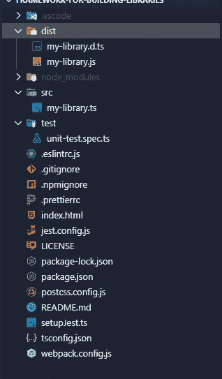
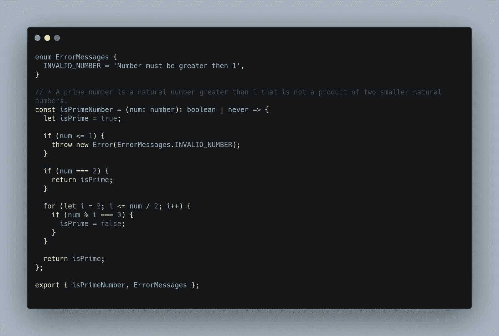
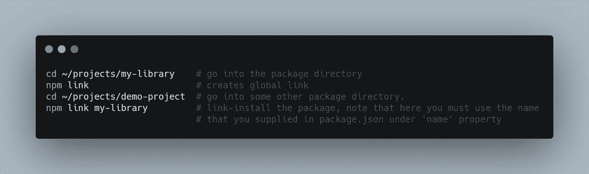

# 如何使用 Webpack 构建和发布 NPM 包

> 原文：<https://itnext.io/how-to-build-and-publish-npm-packages-with-webpack-dea19bb14627?source=collection_archive---------0----------------------->


照片由[潘卡杰·帕特尔](https://unsplash.com/@pankajpatel?utm_source=unsplash&utm_medium=referral&utm_content=creditCopyText)在 [Unsplash](https://unsplash.com/s/photos/npm?utm_source=unsplash&utm_medium=referral&utm_content=creditCopyText) 拍摄

# 序

最近我发表了我的第一个 NPM 包😊这些是我遇到的问题，我是这样解决的。

我的库是滑动事件的事件监听器的底层实现。几年前我第一次编写代码，即使今天有其他解决这个问题的方法，我仍然想对它进行一点改进并将其公开。这样，我也为开源社区带来我的一点点贡献。

尽管额外的特性和包装并没有让我花很长时间去实现它们，但是，我花了同样长的时间才弄明白如何正确地部署它。

我的软件包的当前版本是 **1.0.3** ，这只是因为 **1.0.0** 、 **1.0.1** 和 **1.0.2** 只是失败的版本…

我花了一段时间才弄明白如何导出我的库，并使它既可以在全局范围(窗口)内使用，又可以作为一个模块导入。更不用说 NPM 纲领的特殊性了。

因此，没有任何进一步的讨论，这里是我的整个工作流程，你怎么能做到这一点。

# 食谱

## 一.项目设置

我的前端堆栈对于 web 应用程序来说是有角度的——*我认为 web 应用程序是包含用户生成内容的网站*——对于所有其他的，小脚本或简单的静态内容网站，就像我的个人网站 [georgianstan.ro](https://georgianstan.ro) 一样，我使用 TypeScript、SCSS 和 PUG 以及 Webpack。

我更喜欢这一叠，因为它不仅能让你快速移动，还能帮助你满足一个好的 NPM 套餐的所有要求。

*   如果代码使用`<script src=".."></script>`标签链接，则在全局范围内可用
*   如果代码是一个模块，使用`import`或`require`可用
*   它支持类型脚本

这是一个纯粹的个人问题:

*   如果有任何样式代码(CSS)，那么它由 JavaScript 文件包含和管理；这样，我只需要在我的项目中导入一个文件

为了不让这篇文章毫无理由地变得冗长，我决定将所有代码打包到一个 GitHub 项目中，这个项目是我们试图完成的工作的样板/框架，基于它，我将解释重要的部分😊。

继续并[下载](https://github.com/GeoPablo/framework-for-building-libraries)该库或查看这里的代码示例。



项目结构

文件和文件夹说明:

*   **dist —** 我们代码的分发
*   **src —** 这里我们将为我们的库编写代码
*   **测试—** 我们代码的测试文件夹
*   **。npmignore —** 同**。gitignore，**但是对于 npm 当我们发布我们的包时要忽略哪些文件
*   **index.html—**如果你想在浏览器上手动测试你的代码
*   **postcss.config.js —** 自动化常规 css 操作；默认情况下，它被配置为对 CSS 使用[自动修复程序](https://autoprefixer.github.io/)
*   **jest.config.js** 和**setup Jest . ts—**Jest 的配置规则，用于测试
*   **ts config . JSON—**TypeScript 的配置规则
*   **webpack.config.js —** 我们的代码捆绑器的配置规则

其他的:

*   **.eslintrc.js** ，**。林挺和代码格式的规则**

## 二。NPM 配置

要构建一个有效的 NPM 包，需要在 **package.json** 中添加以下属性:

```
"main": "./dist/my-library.js",
"types": "./dist/my-library.d.ts",
"files": [
    "dist"
],
```

这些属性表示主文件的路径及其数据类型(如果有的话)。

## 三。类型脚本配置

我们知道 **tsconfig.json** 用于配置 TypeScript。为了为您的代码发出类型，您需要做的就是在这个文件中的**compile options**属性内添加以下属性。

```
“declaration”: true
```

## 四。Webpack 配置

对于 Webpack，最重要的配置由以下选项表示:


[此处代码](https://carbon.now.sh/?bg=rgba(171%2C%20184%2C%20195%2C%201)&t=seti&wt=none&l=javascript&ds=true&dsyoff=20px&dsblur=68px&wc=true&wa=true&pv=56px&ph=56px&ln=false&fl=1&fm=Hack&fs=14px&lh=133%25&si=false&es=2x&wm=false&code=%2520%2520target%253A%2520%27web%27%252C%250A%2520%2520entry%253A%2520%257B%250A%2520%2520%2520%2520index%253A%2520%27.%252Fsrc%252Fmy-library.ts%27%252C%250A%2520%2520%257D%252C%250A%2520%2520output%253A%2520%257B%250A%2520%2520%2520%2520path%253A%2520path.resolve(__dirname%252C%2520%27.%252Fdist%27)%252C%250A%2520%2520%2520%2520filename%253A%2520%27my-library.js%27%252C%250A%2520%2520%2520%2520library%253A%2520%27MyLibrary%27%252C%250A%2520%2520%2520%2520libraryTarget%253A%2520%27umd%27%252C%250A%2520%2520%2520%2520globalObject%253A%2520%27this%27%252C%250A%2520%2520%2520%2520umdNamedDefine%253A%2520true%252C%250A%2520%2520%257D%252C)

*   **目标—** 根据您的代码将被使用的环境，使用`web`或`node`
*   **入口—** 我们图书馆的入口点
*   **output.filename —** 分发代码的文件名
*   **output.library —** 这将是要导出的对象的名称

属性 **libraryTarget** 用于指示将使用什么全局对象来挂载库。为了使库构建在浏览器和 Node.js 上都可用，我们使用了 **output.globalObject** 选项来选择`'this'`。`'this'`表示环境的全局对象，在网络浏览器的情况下`'this'`将是对象`window`。

简单地说，如果我们的库代码看起来像这样:



[此处代码](https://carbon.now.sh/?bg=rgba(171%2C%20184%2C%20195%2C%201)&t=seti&wt=none&l=javascript&ds=true&dsyoff=20px&dsblur=68px&wc=true&wa=true&pv=56px&ph=56px&ln=false&fl=1&fm=Hack&fs=14px&lh=133%25&si=false&es=2x&wm=false&code=enum%2520ErrorMessages%2520%257B%250A%2520%2520INVALID_NUMBER%2520%253D%2520%27Number%2520must%2520be%2520greater%2520then%25201%27%252C%250A%257D%250A%250A%252F%252F%2520*%2520A%2520prime%2520number%2520is%2520a%2520natural%2520number%2520greater%2520than%25201%2520that%2520is%2520not%2520a%2520product%2520of%2520two%2520smaller%2520natural%2520numbers.%250Aconst%2520isPrimeNumber%2520%253D%2520(num%253A%2520number)%253A%2520boolean%2520%257C%2520never%2520%253D%253E%2520%257B%250A%2520%2520let%2520isPrime%2520%253D%2520true%253B%250A%250A%2520%2520if%2520(num%2520%253C%253D%25201)%2520%257B%250A%2520%2520%2520%2520throw%2520new%2520Error(ErrorMessages.INVALID_NUMBER)%253B%250A%2520%2520%257D%250A%250A%2520%2520if%2520(num%2520%253D%253D%253D%25202)%2520%257B%250A%2520%2520%2520%2520return%2520isPrime%253B%250A%2520%2520%257D%250A%250A%2520%2520for%2520(let%2520i%2520%253D%25202%253B%2520i%2520%253C%253D%2520num%2520%252F%25202%253B%2520i%252B%252B)%2520%257B%250A%2520%2520%2520%2520if%2520(num%2520%2525%2520i%2520%253D%253D%253D%25200)%2520%257B%250A%2520%2520%2520%2520%2520%2520isPrime%2520%253D%2520false%253B%250A%2520%2520%2520%2520%257D%250A%2520%2520%257D%250A%250A%2520%2520return%2520isPrime%253B%250A%257D%253B%250A%250Aexport%2520%257B%2520isPrimeNumber%252C%2520ErrorMessages%2520%257D%253B%250A)

那么前面的规则将允许我们这样做

**。html** 文件

```
<script src="./dist/my-library.js"></script><script>
   const { isPrimeNumber } = window.MyLibrary;
</script>
```

但是还有这个

**。js** 或**。ts** 文件

```
import { isPrimeNumber } from 'npm-package-name *or* path-to-the-file';
```

你可以在他们的[官方文档页面](https://webpack.js.org/configuration/output/#outputlibrarytarget)上了解更多。

## 动词 （verb 的缩写）发布代码

要发布代码，请打开终端并导航到项目的根文件夹。

第一步是登录 npm

```
npm login
```

此后，您可以使用以下方式提交您的包:

```
npm publish
```

在此之前，请确保您已经构建了代码。为此，您可以使用以下值在 **package.json** 中添加一个*脚本*:

```
"prepublishOnly": "webpack --mode=production",
```

该命令将在运行`npm publish`时执行，但在发布代码之前。

# 额外提示

1.  如果要从 npm 中删除您的软件包，请使用以下命令:

```
npm unpublish [package_name]
```

2.每次部署库的新版本时，请确保从 **package.json** 更新版本

```
"version": "1.0.0", -> "version":"1.0.1"
```

这个三位数版本系统[的详细描述可以在这里](https://angular.io/guide/releases)找到。

3.本地测试

您可以使用这个命令在本地测试您的包:

```
npm link
```

例如



[生](https://carbon.now.sh/?bg=rgba(171%2C%20184%2C%20195%2C%201)&t=seti&wt=none&l=application%2Fx-sh&ds=true&dsyoff=20px&dsblur=68px&wc=true&wa=true&pv=56px&ph=56px&ln=false&fl=1&fm=Hack&fs=14px&lh=133%25&si=false&es=2x&wm=false&code=cd%2520~%252Fprojects%252Fmy-library%2520%2520%2520%2520%2523%2520go%2520into%2520the%2520package%2520directory%250Anpm%2520link%2520%2520%2520%2520%2520%2520%2520%2520%2520%2520%2520%2520%2520%2520%2520%2520%2520%2520%2520%2520%2523%2520creates%2520global%2520link%250Acd%2520~%252Fprojects%252Fdemo-project%2520%2520%2523%2520go%2520into%2520some%2520other%2520package%2520directory.%250Anpm%2520link%2520my-library%2520%2520%2520%2520%2520%2520%2520%2520%2520%2523%2520link-install%2520the%2520package%252C%2520note%2520that%2520here%2520you%2520must%2520use%2520the%2520name%250A%2509%2509%2509%2509%2509%2509%2509%2523%2520that%2520you%2520supplied%2520in%2520package.json%2520under%2520%27name%27%2520property)

总之，我希望这些信息对你有用。我知道如果你是 Webpack 和代码捆绑的初学者，你可能会觉得这篇文章很松散。

为此，你可以看一下[写的文档](https://github.com/GeoPablo/framework-for-building-libraries#readme)，这里以一种更压缩的方式呈现了一系列你可以遵循的步骤。

> 或者，如果你有一些更准确的问题，关于一些不清楚的事情，你可以随时在 twitter 上给我留言😊。