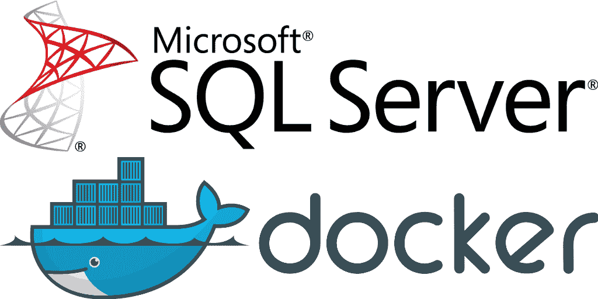

# 如何使用 DACPAC 文件构建和运行 SQL 容器

> 原文：<https://itnext.io/how-to-build-and-run-a-sql-container-using-a-dacpac-file-c7b0d30f6255?source=collection_archive---------2----------------------->



# 介绍

好的，最近我在做一个代码项目，这个项目对 SQL 数据库有很强的依赖性。现在通常我会试着模仿一些东西，添加一些抽象概念等等。但是对于相对简单的服务，我想知道是否有更好的方法来实现这一点。

我正在做的项目已经包含了一个. sqlproj 项目，它生成了一个 dacpac 文件，使开发人员能够轻松地保持他们的本地或远程 SQL 实例同步(如果你对这些概念中的任何一个都不熟悉，请在这里查看[DAC PAC 文档](https://docs.microsoft.com/en-us/openspecs/sql_data_portability/ms-dacpac/c62984e2-0ab5-430d-b0e1-9b38835cc244)和 [sqlproj 文档](https://docs.microsoft.com/en-us/previous-versions/sql/sql-server-data-tools/hh272702(v=vs.103)))。这意味着如果我构建了 sqlproj，我就得到一个 dacpac…但是如何将它部署到容器中呢？

# 从哪里开始

我知道 dockerfiles，也知道 dacpac 文件，但是我如何将这两者结合在一起呢？

基本上，我想要的是一种进行 docker 构建的方法，使用微软为 SQL2019 提供的基础映像，将我的 dacpac 规范放入该数据库，以便创建我的表等，然后在我的机器上准备好容器定义，以便在我需要时随时加速和减速。

幸运的是，我偶然发现了 Ken Muse 关于 Wintellect 的一篇[帖子，虽然它不适合我的用例(因为它是 SQL2017，有一些 bug)，但它确实给了我一个很好的起点。肯获得了巨大的荣誉👏👏👏👏👏](https://www.wintellect.com/devops-sql-server-dacpac-docker/)

# 容器定义

## 分解它

好了，这里有很多步骤，让我来分解一下:

1.  首先，我使用 MSFT 提供的基本 SQL2019 映像
2.  接下来，我将我的权限提升到`root`,使我能够安装一些`apt-get`包
3.  在第 11 行，我转到了`sqlpackage`的 linux 发行版的`aka.ms`链接。如果您不熟悉这个工具，请查看这里的文档，但本质上它是一个 CLI 工具，允许您将 dacpac 部署到 SQL 中。
4.  第 19 行我将 dacpac 文件复制到容器层
5.  第 22–27 行设置了 SQL 容器启动所需的一些默认选项。[更多信息可在此处的文档中找到](https://hub.docker.com/_/microsoft-mssql-server)
6.  第 31+行是真正神奇的地方。
7.  首先，我们启动 sqlserver 进程，等待它通知我们代理已经启动。
8.  接下来，我们调用下载的 sqlpackage cli 二进制文件，告诉它发布到本地主机并使用我们的 dacpac 文件。
9.  Line 33 >整理图像。

## 运行容器

我们可以通过调用以下命令轻松构建并运行该容器:

```
$ podman build ../. --build-arg PASSWORD="<YourStrong@Passw0rd>" -t mydatabase:1.0 --no-cache$ podman run -p 1433:1433 --name sqldb -d mydatabase:1.0
```

我在这里使用`podman`作为我的容器引擎，但是同样的命令也应该在`docker`中完美地工作😃

(请注意，我在这里使用了`--no-cache`标志，因为我遇到了问题，在这里`podman`会缓存`dacpac`文件，而不会注意到它是否已经被更改/重建🙈)

## 我的解决方案和 Ken 的解决方案之间的差异

对于那些对肯写的博客和我的版本之间的差异感兴趣的人:

*   我必须将权限提升到 root，因为没有它 apt-get 就无法工作。我本可以把它们放回去的，但我没有这么做。
*   Ken 使用的`sqlpackage` uri 似乎不想在内置了`netstandard2.0`的 dacpac 的容器中正常运行。它不停地抱怨 openssl 不是正确的版本，把它撞向这个从未修复的链接。
*   对 cli 做了一些整理，使图像变得更小。

# 结论

我真的很喜欢集装箱给我的隔离和保护。尤其是在运行服务测试时，因为我可能会污染我的本地数据库容器，几分钟后将其拆除并重新启动。我还可以预见，将来我会让这些容器在我的构建代理上运行，这样我就不需要在 CI/CD 构建时使用 infra 了。

我希望这能在将来帮助其他人👋

