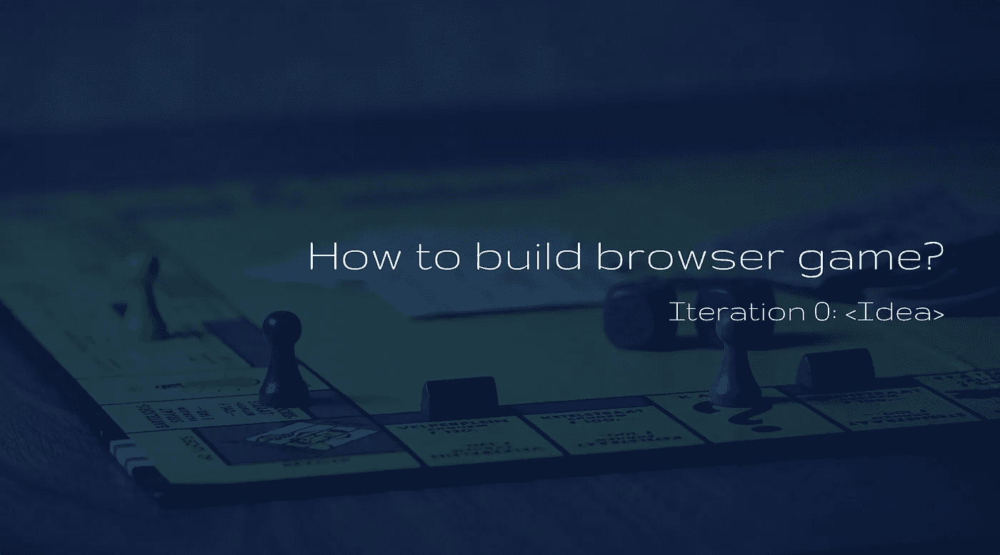

# 如何构建浏览器游戏？[迭代 0]想法

> 原文：<https://itnext.io/how-to-build-browser-game-iteration-0-idea-c0865d125148?source=collection_archive---------2----------------------->

我花了几周时间思考新年决心，因为我承诺自己要写更多，所以我想在 2018 年写些什么。

我的计划是涵盖尽可能多的 IT 技术和非技术领域(特别是 Web 开发),谈论架构、存储、性能等……要涵盖的内容太多了……但最重要的是——我想谈论一些有分量的东西。一些现实的东西。然后我提醒自己多少年前我在编写自己的浏览器游戏。我当时在许多不同的领域面临许多问题，包括后端和前端，所以我决定也许我应该现在就做一个，并经历每一步。这些系列将更多地是“如何做”，而不是 DIY，因为我不会涵盖一步一步开发的所有细节，但我会涵盖它的所有主要方面，我面临的所有问题以及我如何解决它们。

我将经历构建一个在线浏览器游戏的所有领域，这并不意味着我会做得对——这只是我做这件事的方式，但我会尝试解释我所做的每一个选择，这样就不会看起来我只是在指指点点&当然这将让你有能力尽可能多地批评我:)

我们开始吧！

# [迭代 0]> >想法

没有想法，你无法开始任何项目。它不必是完美的形状，但应该给你一个大概的视觉效果。此外，你应该实事求是地估计你的能力、预算和技能，以真正完成这个项目。

因为我对 3D 建模一无所知(我确实玩过 Unity3D 几次，但要制作这样的 3D 游戏，我需要阅读至少 5 本技术书籍，在真正向你展示任何东西之前练习几个月，花大约 1k 购买最少的资产，如 3D 模型、物品等，可能需要聘请 3D 图形设计师，因为否则我会很快停止)。

因此，我将创建一个在线 2D 基于文本的 RPG，但会尝试添加一些非常酷的功能，使其与众不同。我的计划是从“功能”的角度(角色如何获得经验，训练技能等)使这个游戏更加真实，我希望这将增加游戏的“乐趣”！

剧情怎么样？每个游戏都有剧情，应该会让人感兴趣。有很多像这样的幻想 RPG，所以我决定做一些更现实的东西。情节是这样的:

> 2050 年，温室效应不是一个童话，我们使用了大部分地球内部资源，所以我们以一个大“繁荣”结束。在星球核心发生巨大爆炸后，所有大陆都被分割成了小岛。有一个巨大的闪光，幸存下来的人陷入昏迷，但几天后开始“醒来”。你在一个岛上醒来，现在需要生存…

听起来怎么样？也许有点太“黑暗”，但让我们面对它——这个情节开始可以给我们大量的能力来发展故事情节:)

这就是我们的处境。我们有想法，有情节，有热情。现在是技术。我已经用多种语言构建了应用程序，但我觉得自己最喜欢 PHP 和 JS，所以我对应用程序的技术支持将是:

*   PHP 7
*   套接字的 NodeJS & Socket.io
*   前端电抗器

为什么是 ReactJS？因为我不需要完全沉重的 FE 框架，我会用它包装游戏的动态组件+ react 最近很受欢迎，所以让我们一起玩吧，我显然会使用 ES2015 来让事情看起来更好。

对于后端我会使用 Symfony 3 框架，只是因为它会给我们很多开箱即用的东西+我只是喜欢它，所以不要评价我！

因为我们显然将使用套接字进行实时交互——我将使用 NodeJS 作为单独的服务和套接字进行后端。前端 IO。

在我们定义了我们的数据域并了解了我们对数据库的期望之后，我们将在下一篇文章中讨论存储。这将帮助我们了解什么是最佳匹配。

你兴奋吗？我是，让游戏开始吧！

我们期望最终的“产品”是什么？嗯，因为我们不是在开发商业游戏——我会写一些核心文章来涵盖开发这个游戏的一般方面，然后看看你们的参与情况，一旦我不再看到你们有任何兴趣，就完成这些系列，所以如果你觉得我的想法有趣——跟着我，给我一些掌声来激励我！我获得的掌声越多—我构建和编写的速度越快:)

谢谢大家！