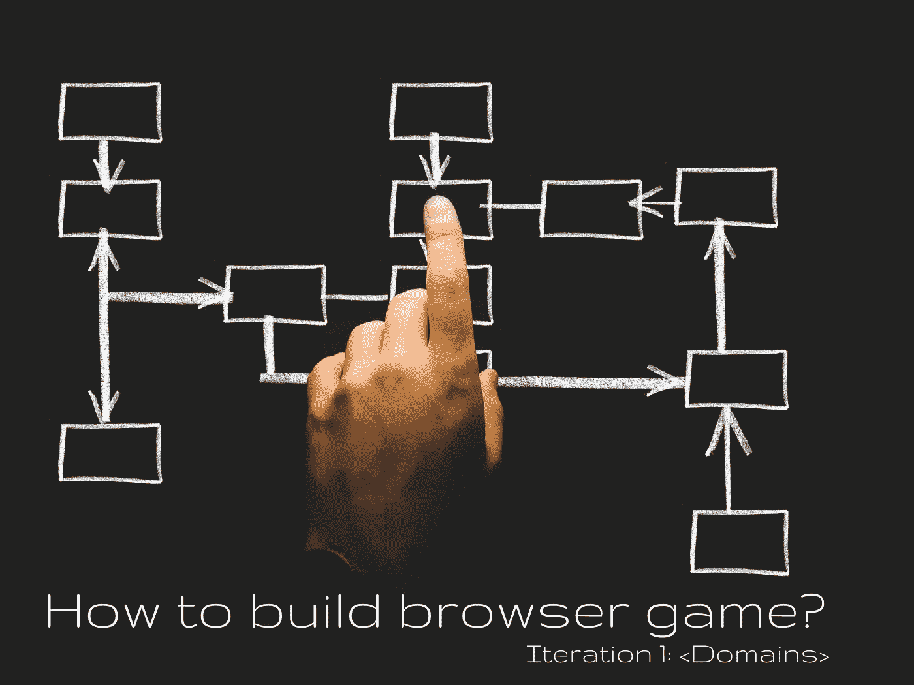
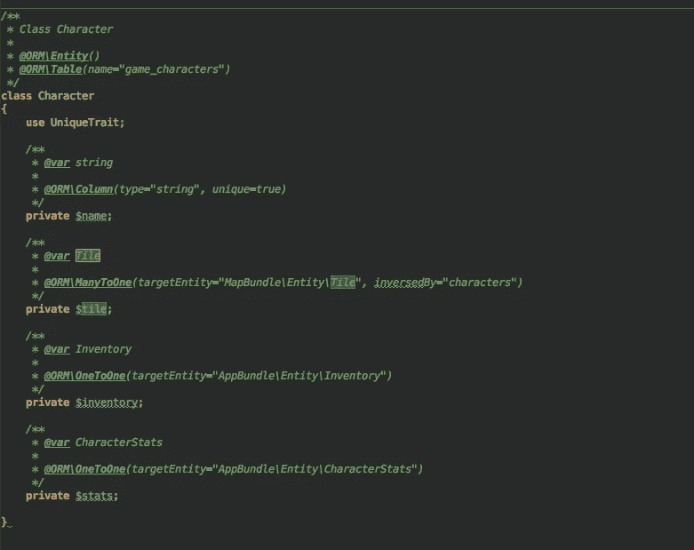
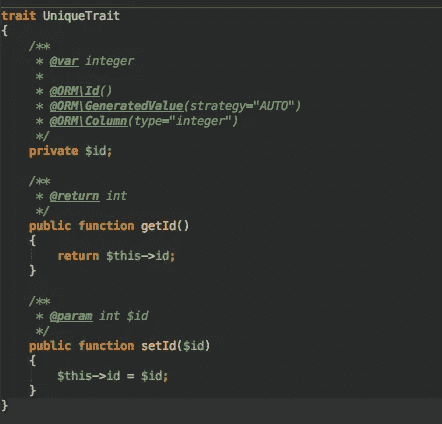

# 如何构建浏览器游戏？[迭代 1]域

> 原文：<https://itnext.io/how-to-build-browser-game-iteration-1-domains-a62fbd9d9fba?source=collection_archive---------0----------------------->

因为这些系列的目标是尽可能多的了解 web 开发的方方面面，尝试新的技术，学习新的有趣的东西。我们将通过创建一个基于文本的浏览器游戏来做到这一点。

如果你还没有读过之前关于这个想法的帖子，这里是:

*   **【迭代 0】Idea**[https://medium . com/@ dmitrykmita/how-to-build-browser-game-Iteration-0-Idea-c 0865d 125148](https://medium.com/@dmitrykmita/how-to-build-browser-game-iteration-0-idea-c0865d125148)

# [迭代 1]> >域

要构建任何应用程序，您必须定义 MVP。如果你不知道 MVP 是什么——它是最小的可行产品，或者用简单的语言来说是最小的可交付产品，这将带来一些价值。我花了一些时间定义了我们的 MVP:

> 我们有一个角色，可以在地图上行走并收集物品。角色已经定义了属性、经验值和等级。角色也有一个物品清单，里面有他所有的物品。他可以把特定的物品放在特定的槽里(穿上)。

就是这样！非常小，非常小的 MVP，这将是我们的基地。然后，我们将不断前进，增强这个游戏。

为了使这个产品的交付更加正确——我将要谈到的每一个特性都将以 BDD 的方式定义。

但是首先，在定义了 MVP 之后，我们需要定义域。我们需要考虑我们将如何储存它们，以及我们将走多远。

我们肯定有字符，地图和项目领域。MVP 有 3 个核心领域。然后我们再深入一点，定义角色、地图和物品的属性。

**人物**

我们的角色将会有默认的属性，比如名字和性别，但是重要的是——统计和库存。我认为我们应该将这些作为独立的领域来分离。因此，如果我们决定在未来增强属性或库存域，我们不需要接触主角。

**地图**

因为我们的地图将是 2D，我们有瓦片，每个瓦片将有 X & Y 坐标。很简单。

**项目**

我想从一开始就做一个非常基本的项目，我们稍后会加强它，所以作为一个起点，它会有名称，类型，图片。

这是我创建的用来定义领域的小图表:

MVP 域

因为我用 Symfony 3 做后端——我也用 Doctrine 做 DB ORM，这让我的日子轻松多了。不久前，我发现定义域很无聊——在不同的域中，相同的属性用于不同的目的。PHP 的问题是你不能从 1 个以上的类扩展，这使得更复杂的继承成为一种痛苦。

因此，对于那些讨厌向实体添加相同字段(如 id、createdAt、updatedAt 等)而不是从其他类扩展(然后映射为“@MappedSuperClass”)的人来说，有一个小技巧——使用 traits！从继承的角度来看，traits 在这种情况下工作得更好，因为您不需要继承抽象对象或逻辑对象，您只需要自动复制粘贴字段。正如我提到的，在 PHP 中你不能继承多于一个类，但是你可以使用任意多的特征，因为它们不处理继承问题。如果你没有使用过 traits，这里有一个 read 的链接，这是 PHP 的一个老特性，但是没有多少人使用它:

 [## PHP 的特质是什么？文化

### PHP 作为编程语言的一个问题是你只能有单一继承。这意味着…

culttt.com](http://culttt.com/2014/06/25/php-traits/) 

这是我的角色实体的一个例子:

没有 Setters & Getters 只是为了更小的截图

如您所见，我创建了 UniqueTrait，它基本上是 Primary Key 的一个实现:

现在我可以在我所有的实体中使用这个特性

从一开始就定义 MVP 和域是非常重要的，因为它可以帮助您:

*   确保你的应用程序不会过于复杂
*   让你对事物的发展有更好的认识
*   减少浪费量
*   创建需要完成的已定义的工作

所以现在我们有了一个为 MVP 项目定义领域的想法。听起来是不是很棒？不管你正在构建什么项目，总是首先定义你的 MVP 和域，这将在将来解决很多问题，并且将有助于在它变成一个包含大量不需要的特性的巨大应用程序之前发布一些东西。

好了，我们暂时就此打住，在下一篇文章中，我们将转向构建简单的用户界面。

我们将讨论 ReactJS，它的主要优点和缺点，所以如果你喜欢新的 JS 技术，我肯定你会发现它很有趣！

希望你喜欢它，并退出继续前进。如果你对这个故事鼓掌/关注/回应，我会非常感激，因为我不想知道你是否觉得它有用/有趣。