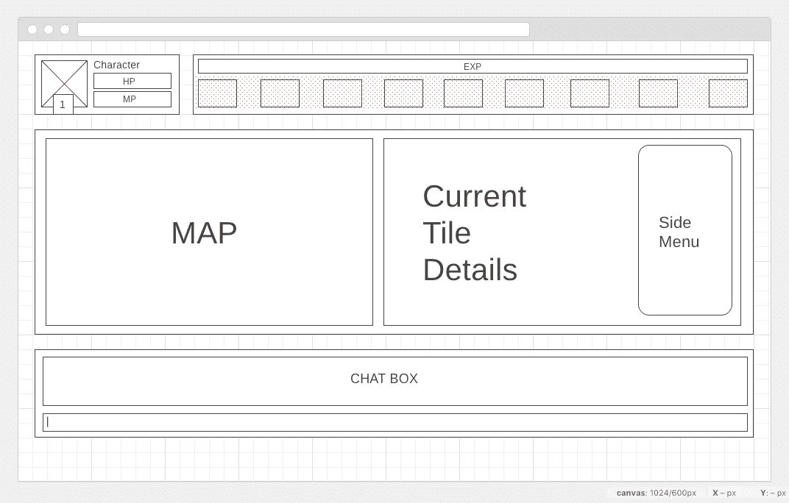
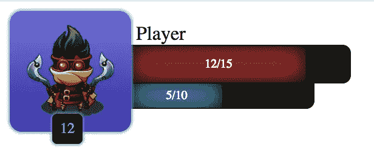

# 如何构建浏览器游戏？[迭代 2]图形用户界面

> 原文：<https://itnext.io/how-to-build-browser-game-iteration-2-gui-6d31dbed8a8f?source=collection_archive---------3----------------------->


[*点击这里在 LinkedIn* 上分享这篇文章](https://www.linkedin.com/cws/share?url=https%3A%2F%2Fitnext.io%2Fhow-to-build-browser-game-iteration-2-gui-6d31dbed8a8f)

因为这些系列的目标是尽可能多的了解 web 开发的方方面面，尝试新的技术，学习新的有趣的东西。我们将通过创建一个基于文本的浏览器游戏来做到这一点。

如果你还没有看过之前的帖子，下面就是:

*   【迭代 0】Idea:[https://medium . com/@ dmitrykmita/how-to-build-browser-game-Iteration-0-Idea-c 0865d 125148](https://medium.com/@dmitrykmita/how-to-build-browser-game-iteration-0-idea-c0865d125148)
*   【迭代 1】Domains:[https://medium . com/@ dmitrykmita/how-to-build-browser-game-Iteration-1-Domains-a 62 FBD 9d 9 FBA](https://medium.com/@dmitrykmita/how-to-build-browser-game-iteration-1-domains-a62fbd9d9fba)

现在是 GUI 的时候了。我不擅长画画，而且，我从来都不是一个超级玩家，所以为这个游戏设计 GUI 确实是一个挑战。我浏览了一些游戏，谷歌了很多，查看了一些游戏开发的资源，并使用伟大的工具[https://wireframe.cc/](https://wireframe.cc/)制作了一个线框



通用 GUI

然后我使用了另一个伟大的工具[https://coolors.co/](https://coolors.co/9381ff-b8b8ff-f8f7ff-ffeedd-ffd8be)进行配色。

现在是反应部分。这将是一个关于如何在 ReactJS 上构建 UI 的基础教程。

我用 webpack 进行捆绑，用 babel 编译 JS。

因此，要使用 react 创建您的前端，您可以使用 react-create-app 服务，或者只需在您的公共文件夹中初始化 npm 项目。在 Symfony 框架的情况下为/web)。

之后，添加一些依赖项:

```
npm install --save babel-core babel-loader babel-preset-es2015 babel-preset-react react react-dom webpack
```

现在我们已经安装了用于捆绑的 webpack、用于编译的 babel 和用于编码的 react。

接下来的事情是指定你将使用哪些 JS 预置，所以创建**。babelrc** 文件，并添加您将使用的文件(在我的例子中是 es2015 和 react jsx):

```
{
  "presets": [
    "react",
    "es2015"
  ]
}
```

太好了，现在 babel 知道如何编译我们的应用程序了。

是时候创建实际的 ui 代码了，于是我又创建了一个文件夹(我把它叫做*库*，不知道为什么，你可以把它叫做 *src* )并添加了一个新文件叫做 Game.js

Game.js 会是我前端的切入点。

为了让 webpack 工作，我在 npm 根文件夹中创建了 **webpack.config.js** 文件，并添加了一些通用代码:

```
**const** path = require('path');

module.exports = {
    entry: './libraries/Game.js',
    output: {
        path: path.join(__dirname, 'dist'),
        filename: 'game.js'
    },
    module: {
        loaders: [
            {
                test: /\.js$/,
                exclude: /node_modules/,
                loader: 'babel-loader'
            }
        ]
    }
};
```

我正在使用 NodeJS **path** 库来简化入口文件的路径。这个模块中的代码非常简单，设置入口文件，设置输出文件以及如何加载模块。

我讨厌通过 node_modules 文件夹运行 webpack，所以我将这个脚本添加到 package.json:

```
"scripts": {
  "test": "echo \"Error: no test specified\" && exit 1",
  **"dev": "webpack -wd"**
},
```

这将在开发模式下运行 webpack，并开始观察任何变化，所以现在我可以简单地运行:

```
npm run webpack
```

它应该会编译您的包。哦，但是它是空的，因为我们的 Game.js 是空的。让我们创建我们的新组件！

正如你所知道的，ReactJS 是基于组件的，它们继承、协作并友好地生活在一起。

要创建组件，您需要使用以下语法(有几种方法，但这被称为最正确的方法):

```
**import** React **from** "react";
**import** ReactDOM **from** "react-dom";

**class** Game **extends** React.Component {

    render() {
        **return** (
            <div>
                <div className="container-fluid">
                    <div className="row">
                        <div className="col-md-12">
                            <CharacterWidget />
                            <HeaderWidget />
                        </div>
                    </div>
                </div>
                <div className="container-fluid">
                    <div className="row">
                        <div className="col-md-6 text-center">
                            <Map />
                        </div>
                        <div className="col-md-6">
                            <MapDetails />
                        </div>
                    </div>
                </div>
                <Inventory />
            </div>
        )
    }
};

**var** mountNode = document.getElementById("game");
**if** (mountNode) {
    ReactDOM.render(<Game />, mountNode);
}
```

React 组件只需要一个名为 render()的方法，它返回这个特定组件的模板。正如你所看到的，我用 bootstrap 创建了一些愚蠢的模板。因为我们使用的是 JSX，所以我们必须使用 className 来代替 class。但是这些***<character widget/><header widget/><Map/><Map details/>***是什么？这些是我们将创建的其他组件。现在，我已经创建了所有这些组件，并把它们作为模板:

```
<div className=”c-character-widget”>Character Widget</div>
<div className=”c-header-widget”>Header Widget</div>
<div className=”c-map”>Map</div>
<div className=”c-map-details”>Map Details</div>
```

正如我提到的 **c-%** 类，让我们来谈谈 css。

我在这个应用程序中使用了 SASS，有 2 种方法捆绑我们的 css。要么我为每个组件单独创建所有 scss 文件，将 scss 文件作为依赖项添加到每个组件，然后将 sass-compiler 添加到 webpack(这是网站的最佳解决方案，因为这样 webpack 将根据组件页面使用情况为每个页面生成所需的样式)，要么创建 main.scss，在其中添加所有组件 scss 文件并创建 1 个捆绑 css(对我来说更好，因为游戏没有很多页面)。

我使用“某种”边界元方法来定义我的 css 类。这是一个带有特定项目将提供的附加功能的模块示例:

```
.c-extra {
  margin-top: 10px;
  .c-extra--title {
    font-size: 13px;
    color: $color-gold-primary;
    text-shadow: 0 0 5px #000;
  }

  .c-extra--item {
    font-size: 12px;
    color: $color-gray-light-primary;

    &.c-extra--item__required {
      color: $color-red-primary;
    }

    .c-extra--item-stat {
      display: inline-block;
      margin-right: 5px;
    }
    .c-extra--item-value {
      display: inline-block;
    }
  }
}
```

这是 jsx 模板:

```
<div className="c-extra">
    <div className="c-extra--title">Extras</div>
    {**this**.props.item.extras.map((item, i) => {
        **return** (
            <div key={i} className="c-extra--item">
                <div className="c-extra--item-stat">
                  {item.attribute}
                </div>
                <div className="c-extra--item-value">
                  {item.value}
                </div>
            </div>
        )
    })}
</div>
```

如你所见，尽管这些类变得有点长——很容易理解组件的结构及其可重用性，如果你把它移到应用程序的任何其他地方——它应该保持不变。组件的思想是无状态的，无论你把它放在哪里，它看起来都应该是一样的。

这是一个非常丑陋，但工作字符部件的例子:



我现在还没有接触数据，因为我们所需要的只是构建 UI，然后我们将继续前进。

我认为这已经足够了，如果你对 ReactJS 组件、sass、webpack 或本文中涉及的任何内容有任何问题，请在下面的评论部分随意提问。

我能说的是——我改变了对 ReactJS 的态度，因为我发现它是一个非常小巧而强大的工具，可以用来构建基于组件的 ui，并使用 VirtualDOM 的所有功能。

在下一篇文章中，我们将谈论地图！