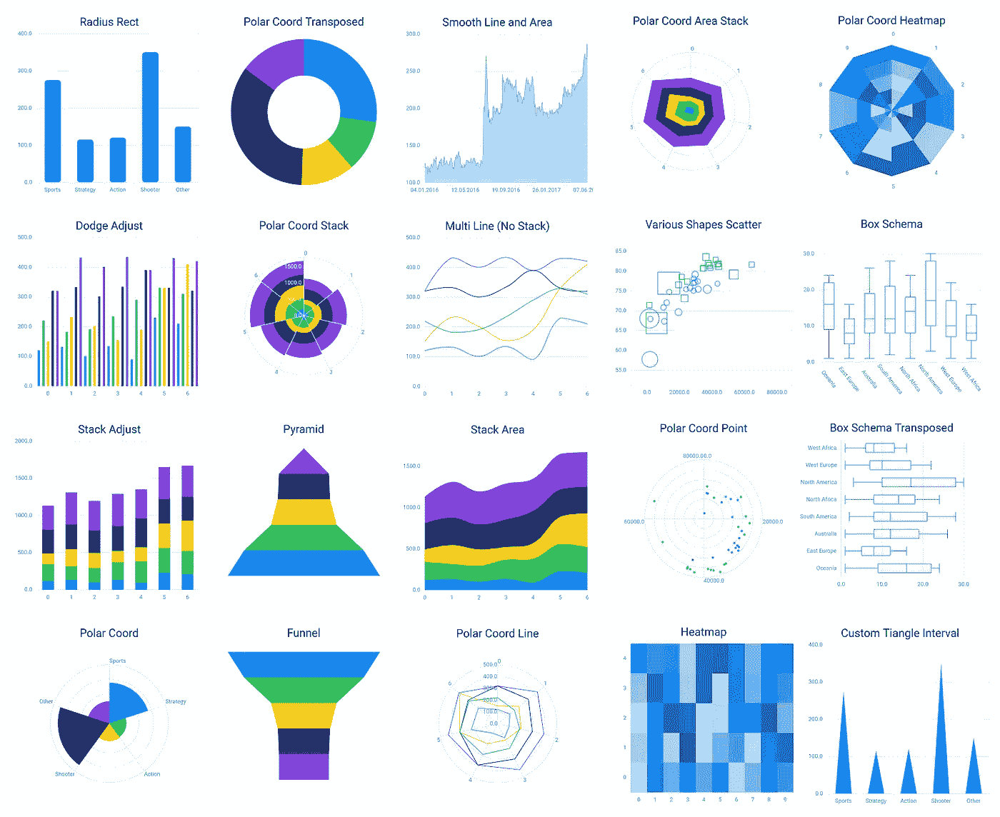
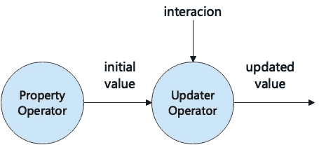
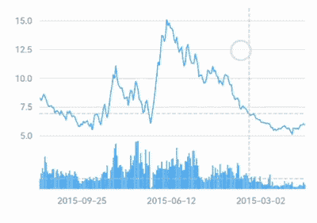

# 如何在 Flutter 中创建交互式图表

> 原文：<https://itnext.io/how-to-build-interactive-charts-in-flutter-e317492d5ba1?source=collection_archive---------1----------------------->



交互在数据可视化中总是很重要。Flutter 制图库 [Graphic](https://github.com/entronad/graphic) 有一个精心设计的交互系统，用于各种交互图表。

这个系统是建立在几个概念之上的，当你学习这些概念时，你会发现在[图形](https://github.com/entronad/graphic)中处理交互非常容易和灵活。有些概念很新颖，但是很直观，容易理解。

本文将介绍这些概念，以帮助您在 Flutter 中使用[图形](https://github.com/entronad/graphic)构建交互式图表。

# 手势

作为一个触摸优先的 GUI 框架，Flutter 中的交互是基于手势的。

手势系统有两层。第一层包含描述指针(例如，触摸、鼠标和触控笔)在屏幕上的位置和移动的原始指针事件。第二层有*手势*，描述由一个或多个指针移动组成的语义动作。请注意，手势不仅包括触摸，还包括多平台上的所有其他指针类型。

由于 [Graphic](https://github.com/entronad/graphic) 是一个小部件级别的可视化库，我们选择手势层作为交互系统的基础。[手势](https://pub.dev/documentation/graphic/latest/graphic/Gesture-class.html)类携带关于手势的信息。主要用于[手势信号](https://pub.dev/documentation/graphic/latest/graphic/GestureSignal-class.html)中

在 Flutter 中广泛使用的处理手势的小工具是[手势检测器](https://api.flutter.dev/flutter/widgets/GestureDetector-class.html)。它在其回调属性中定义了所有的手势类型(像 [onTap](https://api.flutter.dev/flutter/widgets/GestureDetector-class.html) )，开发人员对它们很熟悉。所以[图形](https://github.com/entronad/graphic)继承了这个分类法。[图形](https://github.com/entronad/graphic)的[手势类型](https://pub.dev/documentation/graphic/latest/graphic/GestureType.html)与它们在手势检测器中对应的回调属性具有相同的名称(没有`on`前缀)和含义，例如`GestureType.tap`到`GestureDetector.onTap`。这使得[图形](https://github.com/entronad/graphic)与 Flutter 手势系统保持一致，对开发者友好。

# 信号

为了表示交互，有两个抽象层次:*信号*和*选择*。这两个概念都是指织女星，然而在[图](https://github.com/entronad/graphic)中还是有一些区别的。

[信号在其他一些系统中也被称为“事件”。当用户或外部更改与图表交互时会发出这些事件。它们携带着相互作用的信息。信号主要用于更新器，如](https://pub.dev/documentation/graphic/latest/graphic/Signal-class.html)[rect coord . horizontal range updater](https://pub.dev/documentation/graphic/latest/graphic/RectCoord/horizontalRangeUpdater.html)，或内部触发选择。

虽然名称相同，但[图形](https://github.com/entronad/graphic)中的信号与织女星中的[信号含义不同。在 Vega 中，信号是将可视化参数化的动态变量，这意味着无论是否有交互，它们都会持久地提供值。但是在](https://vega.github.io/vega/docs/signals/)[图形](https://github.com/entronad/graphic)中，信号是交互的化身，所以它们只在被触发时发生，并且携带交互的全部信息，而不仅仅是一个变量值。

除了用于用户交互的[手势信号](https://pub.dev/documentation/graphic/latest/graphic/GestureSignal-class.html)，还有用于影响图表的外部变化的 [ChangeDataSignal](https://pub.dev/documentation/graphic/latest/graphic/ChangeDataSignal-class.html) 和 [ResizeSignal](https://pub.dev/documentation/graphic/latest/graphic/ResizeSignal-class.html) ，也是广义的“交互”。

在内部，不同的信号，无论其种类或发射器，都将由缩减器广播给所有的信号更新器。这使得开发人员可以不受约束地决定更新程序将对哪个信号做出响应。

# 选择

[选择](https://pub.dev/documentation/graphic/latest/graphic/Selection-class.html)是手势驱动的数据查询。它们是信号的结果。当选择被触发时，数据元组变成选中或未选中状态，因此如果定义了`Attr.onSelection`，可能会导致它们的美学属性改变。

[图形](https://github.com/entronad/graphic)中的选择规则主要来源于 Vega-Lite 中的[选择，所以有](https://vega.github.io/vega-lite/docs/selection.html)[inter selection](https://pub.dev/documentation/graphic/latest/graphic/IntervalSelection-class.html)和 [PointSelection](https://pub.dev/documentation/graphic/latest/graphic/PointSelection-class.html) 。

与大多数其他可视化库不同，[图形](https://github.com/entronad/graphic)中的选择是在数据值空间中测试的，而不是通过图形形状交集。指针坐标将被转换成每个维度的数据值，这些值将在数据列表中搜索以找到结果。这种方法更加“数据驱动”，在大数据中的表现优于形状相交测试。

一般来说，信号是原始的，使用起来更灵活，而选择则更简洁，侧重于数据域。

# 更新程序

在[图](https://github.com/entronad/graphic)中，交互如何影响图表的基本思想是，它们不直接向图表提供值，而是更新图表中现有的属性值，并导致反应式呈现。属性值的计算和更新在不同的运算符中，初始值(通常在规范中指明)将被保留:



更新器是根据交互更新属性值的回调函数，如[rect coord . horizontalangeupdater](https://pub.dev/documentation/graphic/latest/graphic/RectCoord/horizontalRangeUpdater.html)或 [Attr.updaters](https://pub.dev/documentation/graphic/latest/graphic/Attr/updaters.html) 。由于有两种交互，相应的也有两种更新器， [SignalUpdater](https://pub.dev/documentation/graphic/latest/graphic/SignalUpdater.html) 和 [SelectionUpdater](https://pub.dev/documentation/graphic/latest/graphic/SelectionUpdater.html) :

```
SignalUpdater<V> = V Function(
  V initialValue,
  V preValue,
  Signal signal
)
​
SelectionUpdater<V> = V Function(
  V initialValue
)
```

# 互动渠道

对于常见的交互情况，上面的特性就足够了。但是我们引入了*交互通道*用于高级用途。

交互通道是与图表进行双向交流的一种方式。你可以通过它输入和输出交互信息。也就是说，您可以手动向图表发出信号或选择，并在信号或选择发生时从图表中得到注意。它使得对交互的控制更加灵活和精确。

为了实现这一点，我们考虑了函数反应式编程(FRP)的思想。幸运的是，Dart 语言内置了[异步流系统](https://dart.dev/tutorials/language/streams)，这是 FRP 的一个简单实现。 [StreamController](https://api.dart.dev/stable/2.18.3/dart-async/StreamController-class.html) 类可以起到交互通道的作用。

图表耦合是展示交互渠道优势的一个很好的领域。想想看，有两个不同的图表，耦合意味着当与一个图表交互时，另一个图表的行为相同，反之亦然。

例如，两个图表分别显示一只股票的价格和成交量，触摸其中一个图表以显示辅助线，另一个应显示相同的内容:



你只需要让两个图表共享同一个手势信号通道，它们就会共享所有手势，没有任何多余的输入输出属性:

```
final priceVolumeChannel = StreamController<GestureSignal>.broadcast();
​
// the price chart
Chart(
  ...
  gestureChannel: priceVolumeChannel,
)
​
// the volume chart
Chart(
  ...
  gestureChannel: priceVolumeChannel,
)
```

另一个例子是两个图表总是选择同一天:


两个元素的共享选择通道将会:

```
final heatmapChannel = StreamController<Selected?>.broadcast();
​
// the above chart
Chart(
  ...
  elements: [PolygonElement(
    selectionChannel: heatmapChannel,
  )]
)
​
// the below chart
Chart(
  ...
  elements: [PolygonElement(
    selectionChannel: heatmapChannel,
  )]
)
```

上面两个例子的完整代码这里是[这里是](https://github.com/entronad/graphic/blob/main/example/lib/pages/interaction_channel_dynamic.dart)。