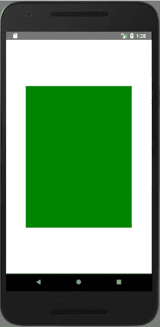
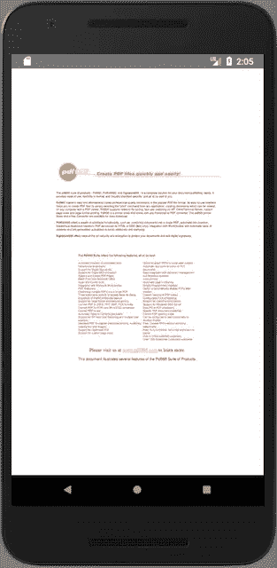

# 如何构建 react-native 桥并获得 PDF 查看器

> 原文：<https://itnext.io/how-to-build-react-native-bridge-and-get-pdf-viewer-44614f11e08e?source=collection_archive---------2----------------------->


[卡斯帕·鲁宾](https://unsplash.com/photos/fPkvU7RDmCo?utm_source=unsplash&utm_medium=referral&utm_content=creditCopyText)在 [Unsplash](https://unsplash.com/search/photos/coding?utm_source=unsplash&utm_medium=referral&utm_content=creditCopyText) 上拍摄的照片

React Native 允许使用 JavaScript 语言构建本地应用程序，并提供大量组件和功能。但有些组件或功能在默认情况下不可用。有时有必要提高某些组件的性能。在这些情况下，可以使用本机实现。

本文描述了如何在 JavaScript 和原生实现之间架起一座桥梁，并提供了一个如何为 React Native 构建 [PDF 查看器](https://www.npmjs.com/package/react-native-view-pdf)以呈现 PDF 文档的示例。

所有源均可在 gitlab 中获得或作为 NPM 包获得:

*   https://www.npmjs.com/package/react-native-view-pdfNPM 包 [react-native-view-pdf](https://www.npmjs.com/package/react-native-view-pdf)
*   Gitlab 来源[rumax/react-native-pdf view【https://github.com/rumax/react-native-PDFView](https://github.com/rumax/react-native-PDFView)[T21](https://github.com/rumax/react-native-PDFView)

先准备一个项目。打开终端并运行:

```
$ create-react-native-app react-native-PDFView
$ cd react-native-PDFView
$ yarn eject
```

检查项目是否有效:

```
$ yarn run android
```

并在 IDE 中打开它。我更喜欢[原子](https://atom.io/)，因此在终端我可以做:

```
$ atom .
```

打开 Android Studio，使用 Java 源代码。

在 Android Studio 中:

*   创建新包`reactlibrary`
*   创建新的 Java 类`PDFView`、`PDFViewManager`和`PDFViewPackage`

根据官方文档，`PDFViewPackage`应该实现`ReactPackage` ，应该添加缺少的`createNativeModules`和`createViewManagers`方法:

```
public class PDFViewPackage implements ReactPackage {
 @Override
 public List<NativeModule> createNativeModules(ReactApplicationContext reactContext) {
 return Collections.emptyList();
 }public List<ViewManager> createViewManagers(ReactApplicationContext reactContext) {
 return Arrays.<ViewManager>asList(new PDFViewManager(reactContext));
 }
}
```

Android Studio 将突出显示一个错误`PDFViewManager cannot be applied to ...`，该错误必须通过实现`PDFViewManager`来修复。

`PDFViewManager`应该扩展`SimpleViewManager<PDFView>`并实现缺失的方法:

*   `getName`哪个应该返回 react 类的名字
*   `createViewInstance`是应该初始化查看器的地方

代码是:

```
public class PDFViewManager extends SimpleViewManager<PDFView> {
 private static final String REACT_CLASS = "PDFView";
 private PDFView pdfView = null;
 private Context context;public PDFViewManager(ReactApplicationContext context) {
 this.context = context;
 }@Override
 public String getName() {
 return REACT_CLASS;
 }@Override
 public PDFView createViewInstance(ThemedReactContext context) {
 if (pdfView == null) {
 pdfView = new PDFView(context);
 }return pdfView;
 }
}
```

错误是`PDFView`应该扩展`View`，这必须通过实现`PDFView`来修复。

PDFView 应该扩展`android.view.View`并且实现非常简单:

```
public class PDFView extends android.view.View {
 private ThemedReactContext context;public PDFView(ThemedReactContext context) {
 super(context);
 this.context = context;
 }
}
```

此时，所有课程都已准备就绪，可以注册`PDFViewPackage`。

在`MainApplication.java`中有`getPackages`方法。在`MainReactPackage`的正下方可以注册`PDFViewPackage`包:

```
@Override
protected List<ReactPackage> getPackages() {
 return Arrays.<ReactPackage>asList(
 new MainReactPackage(),
 new PDFViewPackage()
 );
}
```

Java 初始实现就绪！

在 Atom 中创建一个新文件夹`PDFView`并创建两个文件:

这是主文件，其中需要 PDFView react 本地组件，并且必须定义组件接口:

```
import { requireNativeComponent, ViewPropTypes } from 'react-native';
import PropTypes from 'prop-types';const componentInterface = {
 name: 'PDFView',
 propTypes: {
 ...ViewPropTypes,
 },
};export default requireNativeComponent('PDFView', componentInterface);
```

此时，仅使用`ViewPropTypes`来检查组件是否被正确定义并可以使用。所有其他属性将在以后添加。

该文件是可选的，可用作包装组件，处理错误/加载状态，或使用[流](https://flow.org/)类型等:

```
/* @flow */
import React from 'react';import RNPDFView from './RNPDFView';type Props = {};class PDFView extends React.Component<Props, *> {
 static defaultProps = {};constructor(props: Props) {
 super(props);
 }render() {
 return <RNPDFView {...this.props} />;
 }
}export default PDFView;
```

桥已经准备好，可以导入和使用了:

```
import PDFView from './PDFView/index';...return (
 <View style={styles.container}>
 <PDFView style={styles.pdfView} />
 </View>
);
```

因为它在 Java 中实现了`android.view.View`，所以它也应该表现为一个`View` react-native 组件。这可以通过定义样式来检查:

```
const styles = StyleSheet.create({
 pdfView: {
 height: 400,
 width: 300,
 backgroundColor: 'green',
 },
 ...
```

重启应用程序，你会看到一个绿色矩形，如下所示:



设计组件的样式

实际上，除了属性和回调，这就是桥的全部内容。如果不需要，已经可以用 Java 实现组件了。

要实现 PDF 查看器，有必要了解:

*   *资源* —定义要渲染的资源的字符串值。可以是 url、文件路径或 base64 数据
*   *资源类型* —定义资源类型的字符串值

当然，从本地部分获得一些对 JavaScript 的反馈:

*   *onError* —出错时必须调用的回调函数
*   *onLoad* —加载完成时必须调用的回调函数

在`PDFView/RNPDFView.js`中，用上述属性扩展`componentInterface.propTypes`:

```
const componentInterface = {
 name: 'PDFView',
 propTypes: {
 onError: PropTypes.func,
 onLoad: PropTypes.func,
 resource: PropTypes.string,
 resourceType: PropTypes.string,
 ...ViewPropTypes,
 },
};
```

在`PDFView/index.js`中进行相同的操作，但使用*流量*类型:

```
type Props = {
 onError: (Error) => void,
 onLoad: () => void,
 resource: string,
 resourceType: 'url' | 'base64' | 'file',
};
```

并将方法`onError`定义为只传递来自组件的`nativeEvent`:

```
onError: (error: Error) => void; // Flow type definition
onError(event: any) {
 this.props.onError(event && event.nativeEvent || new Error());
}
```

不要忘记在构造函数中绑定`this`:

```
constructor(props: Props) {
 super(props);
 this.onError = this.onError.bind(this);
}
```

还有搞定`render`的方法:

```
render() {
 const { onError, ...remainingProps } = this.props;
 return <RNPDFView {...remainingProps} onError={this.onError} />;
}
```

还可以定义默认属性来简化组件的使用:

```
static defaultProps = {
 onError: () => {},
 onLoad: () => {},
 resourceType: 'url',
};
```

JavaScript 实现现在已经完成。

切换到`Android Studio`打开`PDFViewManager`类。在这里可以访问`JavaScript`中定义的所有属性。定义`resource`:

```
@ReactProp(name = "resource")
public void setResource(PDFView pdfView, String resource) {
 pdfView.setResource(resource);
}
```

`resourceType`也是一样(回调将在后面实现):

```
@ReactProp(name = "resourceType")
public void setResourceType(PDFView pdfView, String resourceType) {
 pdfView.setResourceType(resourceType);
}
```

PDFView 类中的实现将是:

```
private String resourceType;
private String resource;

public void setResource(String resource) {
 this.resource = resource;
}public void setResourceType(String resourceType) {
 this.resourceType = resourceType;
}
```

在`PDFViewManager`中找到以下方法:

*   `onAfterUpdateTransaction`这是设置所有属性后组件应该呈现的位置:

```
@Override
public void onAfterUpdateTransaction(PDFView pdfView) {
 super.onAfterUpdateTransaction(pdfView);
 pdfView.render();
}
```

*   `onDropViewInstance`这是卸载 React 本地组件时调用的另一个方法。实现可以如下:

```
@Override
public void onDropViewInstance(PDFView pdfView) {
 super.onDropViewInstance(pdfView);
 pdfView.onDrop();
}
```

要使用加载完成错误回调，必须传递此事件。打开`PDFView.java`并定义`loadComplete`和`onError`方法:

```
@Override
public void loadComplete(int numberOfPages) {
 reactNativeEvent("onLoad", null);
}@Override
public void onError(Exception ex) {
 reactNativeEvent("onError", "error: " + t.getMessage());
}
```

并实现`reactNativeEvent`方法。根据官方[文件](http://facebook.github.io/react-native/docs/native-components-android.html)应该是:

```
private void reactNativeEvent(String eventName, String message) {
 WritableMap event = Arguments.createMap();
 event.putString("message", message);
 ReactContext reactContext = (ReactContext) this.getContext();
 reactContext
 .getJSModule(RCTEventEmitter.class)
 .receiveEvent(this.getId(), eventName, event);
}
```

并且在`PDFViewManager`

```
public Map getExportedCustomBubblingEventTypeConstants() {
 return MapBuilder
 .builder()
 .put(
 "onLoad",
 MapBuilder.of("phasedRegistrationNames", MapBuilder.of("bubbled", "onLoad"))
 )
 .put(
 "onError",
 MapBuilder.of("phasedRegistrationNames", MapBuilder.of("bubbled", "onError"))
 )
 .build();
}
```

桥的实现已经准备好了！剩下唯一要做的就是实现`PDFViewer.java`。我使用了 [AndroidPdfViewer](https://github.com/barteksc/AndroidPdfViewer) 实现，最终的解决方案你可以在[gitlab](https://github.com/rumax/react-native-PDFView/blob/master/android/src/main/java/com/reactlibrary/PDFView.java)([https://github.com/rumax/react-native-PDFView](https://github.com/rumax/react-native-PDFView))中找到。

桥和 PDF 查看器的实现已经准备好了。定义您要呈现的文档:

```
<View style={styles.container}>
 <PDFView
 style={styles.pdfView}
 onError={error => console.log('onError', error) }
 onLoad={() => console.log('onLoad') }
 resource="http://www.pdf995.com/samples/pdf.pdf" />
</View>
```

重新加载应用程序，您将获得 PDF 文档，而不是绿色矩形:



PDF 查看器结果

*原载于 2018 年 4 月 24 日*[*【medium.com】*](https://medium.com/@m.rusynyk/how-to-build-react-native-bridge-and-get-pdf-viewer-153109e42948)*。*