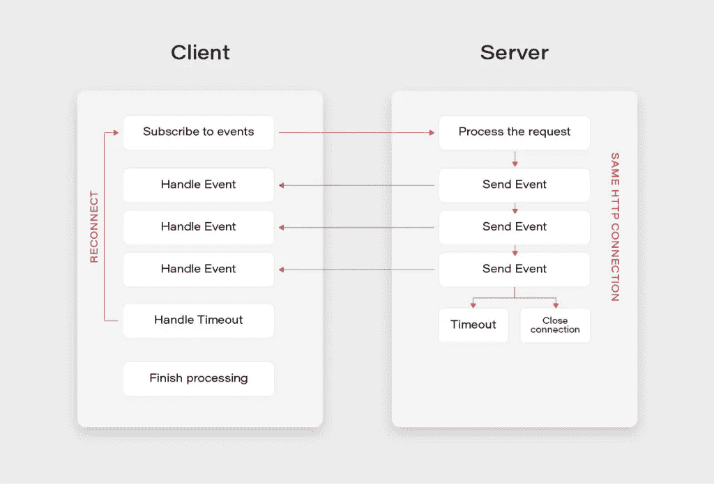
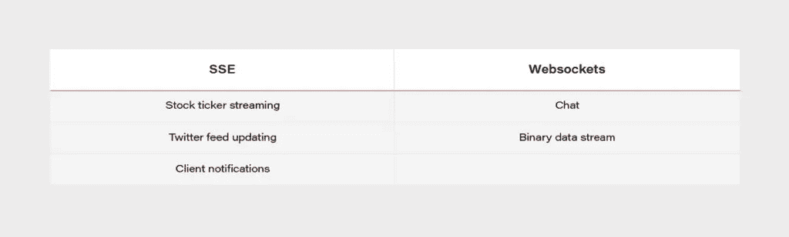

# 如何使用服务器发送事件(SSE)构建实时通知服务

> 原文：<https://itnext.io/how-to-build-real-time-notification-service-using-server-sent-events-sse-5ffd9e27304f?source=collection_archive---------2----------------------->


互联网上的大部分通信直接来自客户端到服务器。客户端通常发送一个请求，服务器响应这个请求。它被称为客户机-服务器模型，在大多数情况下都能很好地工作。但是，在某些情况下，服务器需要向客户端发送消息。在这种情况下，我们有几个选择:我们可以使用短轮询和长轮询、webhooks、websockets 或像 Kafka 这样的事件流平台。然而，还有一种技术，还没有普及到足够的程度，在很多情况下，这种技术非常适合这项工作。这项技术是服务器发送事件(SSE)标准。

# 什么是服务器发送的事件？

**SSE** 定义指出，它是一种 http 标准，允许 web 应用程序处理单向事件流，并在服务器发出数据时接收更新。简单地说，它是一种单向事件流的机制。

**浏览器支持**

目前，除了 Internet Explorer 之外，所有主流浏览器都支持它。

**消息格式**

这些事件只是规范定义格式的 UTF-8 编码文本数据流。这里重要的一点是，该格式定义了 SSE 消息应该具有的字段，但是它并没有强制规定有效负载的特定类型，而是让用户自由选择。

```
{ 
  "id": "message id <optional>",
  "event": "event type <optional>", 
  "data": "event data -plain text, JSON, XML... <mandatory>" 
}
```

# SSE 实施

为了让 SSE 工作，服务器需要告诉客户机响应的内容类型是*文本/事件流*。接下来，服务器接收一个常规的 HTTP 请求，并保持 HTTP 连接打开，直到不再有事件或超时发生。如果超时发生在客户端接收到它期望的所有事件之前，它可以使用内置的重新连接机制来重新建立连接。



**简单端点(通量):**

Spring 中 SSE 端点最简单的实现可以通过以下方式实现:

*   将制作的媒体类型指定为*文本/事件流，*
*   返回 Flux 类型，这是 Java 中事件流的反应式表示。

```
@GetMapping(path = "/stream-flux", produces = MediaType.*TEXT_EVENT_STREAM_VALUE*)public Flux<String> streamFlux() { return Flux.*interval*(Duration.*ofSeconds*(1)) .map(sequence -> "Flux - " + LocalTime.*now*().toString());}
```

**服务器事件类:**

Spring 在 4.2 版中引入了对 SSE 规范的支持以及一个 ServerSentEvent 类。这里的好处是，我们可以跳过*文本/事件流*媒体类型显式规范，并且我们可以添加 id 或事件类型等元数据。

```
@GetMapping("/sse-flux-2")public Flux<ServerSentEvent> sseFlux2() { return Flux.*interval*(Duration.*ofSeconds*(1)) .map(sequence -> ServerSentEvent.*builder*() .id(String.*valueOf*(sequence)) .event("EVENT_TYPE") .data("SSE - " + LocalTime.*now*().toString()) .build());}
```

**SseEmitter 类:**

然而，SSE 的全部功能来自 SseEmitter 类。它允许异步处理和发布来自其他线程的事件。此外，还可以存储对 SseEmitter 的引用，并在后续的客户端调用中检索它。这为构建强大的通知场景提供了巨大的潜力。

```
@GetMapping("/sse-emitter")public SseEmitter sseEmitter() { SseEmitter emitter = new SseEmitter(); Executors.*newSingleThreadExecutor*().execute(() -> { try { for (int i = 0; true; i++) { SseEmitter.SseEventBuilder event = SseEmitter.*event*() .id(String.*valueOf*(i)) .name("SSE_EMITTER_EVENT") .data("SSE EMITTER - " + LocalTime.*now*().toString()); emitter.send(event); Thread.*sleep*(1000); } } catch (Exception ex) { emitter.completeWithError(ex); } }); return emitter;}
```

**客户端示例:**

下面是一个用 Javascript 编写的基本 SSE 客户端示例。它简单地定义了一个 EventSource，并以两种不同的方式订阅消息事件流。

```
// Declare an EventSourceconst eventSource = new ***EventSource***('http://some.url');// Handler for events without an event type specifiedeventSource.onmessage = (e) => { // Do something - event data will be in e.data};// Handler for events of type 'eventType' onlyeventSource.addEventListener('eventType', (e) => { // Do something - event data will be in e.data,});
```

# SSE 与 Websockets

当谈到 SSE 时，由于两种技术在使用上的相似性，它经常被与 Websockets 相比较。

*   两者都能够将数据推送到客户端，
*   Websockets 是双向的— SSE 单向的，
*   在实践中，所有可以用 SSE 完成的，也可以用 Websockets 实现的事情，
*   SSE 可以更容易，
*   SSE 通过简单的 HTTP 连接传输，
*   Websockets 需要全双工连接和服务器来处理协议，
*   一些具有数据包检测功能的企业防火墙在处理 Websockets 时遇到了麻烦——对于 SSE 来说，情况并非如此，
*   SSE 具有 Websockets 在设计上缺少的各种特性，例如，自动重新连接、事件 id，
*   只有 Websockets 可以发送二进制和 UTF-8 数据，SSE 仅限于 UTF-8，
*   SSE 受到最大打开连接数的限制(每个浏览器+域 6 个)。该问题被标记为*不会修复 Chrome 和 Firefox 中的*。

**用例:**



# 通知服务示例:

提供订阅事件和发布事件端点的控制器。

```
@Slf4j@RestController@RequestMapping("/events")@RequiredArgsConstructorpublic class EventController { public static final String *MEMBER_ID_HEADER* = "MemberId"; private final EmitterService emitterService; private final NotificationService notificationService; @GetMapping public SseEmitter subscribeToEvents(@RequestHeader(name =   *MEMBER_ID_HEADER*) String memberId) { *log*.debug("Subscribing member with id {}", memberId); return emitterService.createEmitter(memberId); } @PostMapping @ResponseStatus(HttpStatus.*ACCEPTED*) public void publishEvent(@RequestHeader(name = *MEMBER_ID_HEADER*) String memberId, @RequestBody EventDto event) { *log*.debug("Publishing event {} for member with id {}", event,   memberId); notificationService.sendNotification(memberId, event); }}
```

用于发送事件的服务:

```
@Service@Primary@RequiredArgsConstructor@Slf4jpublic class SseNotificationService implements NotificationService { private final EmitterRepository emitterRepository; private final EventMapper eventMapper; @Override public void sendNotification(String memberId, EventDto event) { if (event == null) { *log*.debug("No server event to send to device."); return; } doSendNotification(memberId, event); }private void doSendNotification(String memberId, EventDto event) { emitterRepository.get(memberId).ifPresentOrElse(sseEmitter -> { try { *log*.debug("Sending event: {} for member: {}", event, memberId); sseEmitter.send(eventMapper.toSseEventBuilder(event)); } catch (IOException | IllegalStateException e) { *log*.debug("Error while sending event: {} for member: {} - exception: {}", event, memberId, e); emitterRepository.remove(memberId); } }, () -> *log*.debug("No emitter for member {}", memberId)); }}
```

总而言之，对于单向数据流来说，服务器发送事件标准是一项伟大的技术，与 Websockets 或分布式流平台等更复杂的方法相比，它通常可以省去我们很多麻烦。

使用服务器发送事件实现的完整通知服务示例可以在我的 github 上找到:[https://github.com/mkapiczy/server-sent-events](https://github.com/mkapiczy/server-sent-events)

# 来源:

*   [https://www.baeldung.com/spring-server-sent-events](https://www.baeldung.com/spring-server-sent-events)
*   [https://www.w3.org/TR/eventsource/](https://www.w3.org/TR/eventsource/)
*   [https://stack overflow . com/questions/5195452/web sockets-vs-server-sent-events-event source](https://stackoverflow.com/questions/5195452/websockets-vs-server-sent-events-eventsource)
*   [https://www . telerik . com/blogs/web sockets-vs-server-sent-events](https://www.telerik.com/blogs/websockets-vs-server-sent-events)
*   [https://simonprickett.dev/a-look-at-server-sent-events/](https://simonprickett.dev/a-look-at-server-sent-events/)

*原载于 2020 年 10 月 14 日*[*【https://grapeup.com】*](https://grapeup.com/blog/how-to-build-real-time-notification-service-using-server-sent-events-sse/)*。*