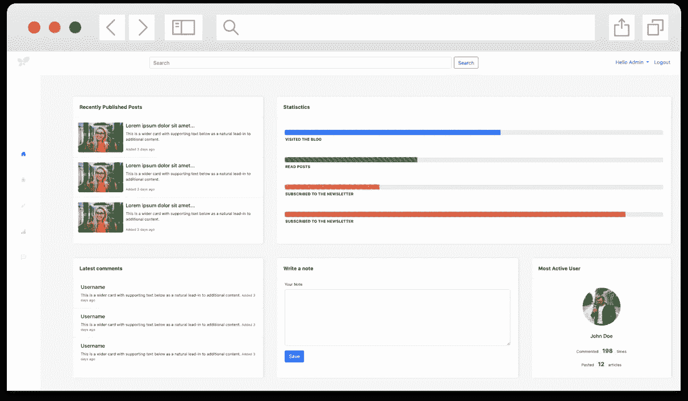

# 如何构建 Bootstrap 5 管理模板？[教程]

> 原文：<https://itnext.io/how-to-build-the-bootstrap-5-admin-template-tutorial-14f074af21ee?source=collection_archive---------2----------------------->


[如何构建 Bootstrap 5 管理模板？](https://www.blog.duomly.com/how-to-build-bootstrap-admin-template-tutorial/)

本帖最初发布于[https://www . blog . duomly . com/how-to-build-bootstrap-admin-template-tutorial/](https://www.blog.duomly.com/how-to-build-bootstrap-admin-template-tutorial/)

# 构建引导管理模板

上周我发表了一篇关于 [Bootstrap 5 的文章，其中我们向你展示了如何构建一个简单的作品集网页](https://www.blog.duomly.com/how-to-crate-simple-web-page-using-bootstrap-5/)，看起来你们中的很多人真的很喜欢它。

这就是为什么今天我决定为你准备一个新的 Bootstrap 教程，我们将一步一步地为博客管理应用程序构建 Bootstrap 5 管理模板。

另外，如果你想用 Bootstrap 4 构建一个仪表板，记得在这里查看我们之前的教程。

对于今天的教程，你将需要三个图像，一个标志，一个用户图像，和一个你喜欢的图像。另外， [Bootstrap 5 文档](https://v5.getbootstrap.com/docs/5.0/components/alerts/)可以帮助理解正在发生的事情。

当然，我有一个视频教程，你可以和我一起看建造过程。所以，如果你喜欢用 Youtube 编码，或者更喜欢先看后读，加入我吧。

如何构建 Bootstrap 5 管理模板？

开始吧！

# 1.如何启动引导模板？

我们已经在上一篇文章中谈到了启动 Bootstrap 项目，但是为了不使它变得复杂，让我们重复这些步骤，这样您就可以记住如何做了。

让我们首先为我们的管理模板创建一个文件夹。在该文件夹中，您需要创建一个简单的`index.html`文件，在那里我们将使用引导文件实现 CDNs。除此之外，我还将添加`styles.css`文件，我们很快就会创建它。

```
<!DOCTYPE>
<html>
  <head>
    <meta charset="UTF-8"/>
    <title>Admin Panel UI</title>
    <!-- CSS only -->
    <link rel="stylesheet" href="https://stackpath.bootstrapcdn.com/bootstrap/5.0.0-alpha1/css/bootstrap.min.css" integrity="sha384-r4NyP46KrjDleawBgD5tp8Y7UzmLA05oM1iAEQ17CSuDqnUK2+k9luXQOfXJCJ4I" crossorigin="anonymous">
    <link rel="stylesheet" href="./styles.css" />
    <!-- JavaScript and dependencies -->
    <script src="https://cdn.jsdelivr.net/npm/popper.js@1.16.0/dist/umd/popper.min.js" integrity="sha384-Q6E9RHvbIyZFJoft+2mJbHaEWldlvI9IOYy5n3zV9zzTtmI3UksdQRVvoxMfooAo" crossorigin="anonymous"></script>
    <script src="https://stackpath.bootstrapcdn.com/bootstrap/5.0.0-alpha1/js/bootstrap.min.js" integrity="sha384-oesi62hOLfzrys4LxRF63OJCXdXDipiYWBnvTl9Y9/TRlw5xlKIEHpNyvvDShgf/" crossorigin="anonymous"></script>
  </head>

  <body></body>
</html>
```

好了，准备好了，让我们在同一个文件夹中创建`styles.css`文件。我们将使用它为我们的管理模板自定义样式。

# 2.如何在 Bootstrap 中建立水平导航？

现在，我们可以开始创建管理模板的第一个元素。在这个项目中，我们将有两个导航，一个水平和一个垂直。

让我们先从创建水平的开始，在 body 标签内，我们添加下面的代码。

```
<!-- Top Nav -->
<nav class="py-3 px-4 navbar navbar-expand-lg auto-hiding-navbar fixed-top">
  <button class="navbar-toggler" type="button" data-toggle="collapse" data-target="#navbarSupportedContent" aria-controls="navbarSupportedContent" aria-expanded="false" aria-label="Toggle navigation">
    <span class="navbar-toggler-icon"></span>
  </button>
  <div class="collapse navbar-collapse d-flex" id="navbarSupportedContent">          
    <form class="search-form d-flex ml-auto mt-1 mb-0">
      <input class="form-control mr-sm-2" type="search" placeholder="Search" aria-label="Search">
      <button class="btn btn-outline-primary my-2 my-sm-0" type="submit">Search</button>
    </form>
    <ul class="navbar-nav ml-auto">
      <li class="nav-item dropdown">
        <a class="nav-link dropdown-toggle" href="#" id="navbarDropdown" role="button" data-toggle="dropdown" aria-haspopup="true" aria-expanded="false">
          Hello Admin
        </a>
        <div class="dropdown-menu" aria-labelledby="navbarDropdown">
          <a class="dropdown-item" href="#">User Settings</a>
          <a class="dropdown-item" href="#">Create New Account</a>
        </div>
      </li>
      <li class="nav-item">
        <a class="nav-link" href="#">Logout</a>
      </li>
    </ul>
  </div>
</nav>  
<!-- End Top Nav   -->
```

很好，我们已经准备好了第一个元素，所以我们需要做一些定制的样式。让我们打开`styles.css`文件，让我们添加几行 CSS。

```
body {
  background: #f6f6f6;
  height: 100vh;
}
nav {
  background-color: white;
}
.search-form {
  width: 50%;
}
```

太好了！现在让我们添加垂直导航。

# 3.如何在 Bootstrap 中添加垂直导航？

在大多数仪表板或管理模板中，垂直菜单是一个非常常见的功能，因此我们将在管理模板中添加一个。

让我们转到`index.html`文件并添加以下代码。

```
<div class="row">
  <!-- Sidebar -->
  <div class="col-1">
    <nav id="sidebar" class="col sidebar">
      <a class="navbar-brand" href="#">
        
      </a>
      <ul class="nav flex-column vertical-nav">
        <li class="nav-item">
          <a class="nav-link active" aria-current="page" href="#">
            <svg width="1em" height="1em" viewBox="0 0 16 16" class="bi bi-house-door-fill" fill="currentColor" >
            <path d="M6.5 10.995V14.5a.5.5 0 0 1-.5.5H2a.5.5 0 0 1-.5-.5v-7a.5.5 0 0 1 .146-.354l6-6a.5.5 0 0 1 .708 0l6 6a.5.5 0 0 1 .146.354v7a.5.5 0 0 1-.5.5h-4a.5.5 0 0 1-.5-.5V11c0-.25-.25-.5-.5-.5H7c-.25 0-.5.25-.5.495z"/>
            <path fill-rule="evenodd" d="M13 2.5V6l-2-2V2.5a.5.5 0 0 1 .5-.5h1a.5.5 0 0 1 .5.5z"/>
            </svg>
          </a>
        </li>
        <li class="nav-item">
          <a class="nav-link" href="#">
            <svg width="1em" height="1em" viewBox="0 0 16 16" class="bi bi-file-post" fill="currentColor" >
              <path fill-rule="evenodd" d="M4 1h8a2 2 0 0 1 2 2v10a2 2 0 0 1-2 2H4a2 2 0 0 1-2-2V3a2 2 0 0 1 2-2zm0 1a1 1 0 0 0-1 1v10a1 1 0 0 0 1 1h8a1 1 0 0 0 1-1V3a1 1 0 0 0-1-1H4z"/>
              <path d="M4 5.5a.5.5 0 0 1 .5-.5h7a.5.5 0 0 1 .5.5v7a.5.5 0 0 1-.5.5h-7a.5.5 0 0 1-.5-.5v-7z"/>
              <path fill-rule="evenodd" d="M4 3.5a.5.5 0 0 1 .5-.5h5a.5.5 0 0 1 0 1h-5a.5.5 0 0 1-.5-.5z"/>
            </svg>
          </a>
        </li>
        <li class="nav-item">
          <a class="nav-link" href="#">
            <svg width="1em" height="1em" viewBox="0 0 16 16" class="bi bi-pencil" fill="currentColor" >
              <path fill-rule="evenodd" d="M11.293 1.293a1 1 0 0 1 1.414 0l2 2a1 1 0 0 1 0 1.414l-9 9a1 1 0 0 1-.39.242l-3 1a1 1 0 0 1-1.266-1.265l1-3a1 1 0 0 1 .242-.391l9-9zM12 2l2 2-9 9-3 1 1-3 9-9z"/>
              <path fill-rule="evenodd" d="M12.146 6.354l-2.5-2.5.708-.708 2.5 2.5-.707.708zM3 10v.5a.5.5 0 0 0 .5.5H4v.5a.5.5 0 0 0 .5.5H5v.5a.5.5 0 0 0 .5.5H6v-1.5a.5.5 0 0 0-.5-.5H5v-.5a.5.5 0 0 0-.5-.5H3z"/>
            </svg>
          </a>
        </li>
        <li class="nav-item">
          <a class="nav-link" href="#">
            <svg width="1em" height="1em" viewBox="0 0 16 16" class="bi bi-bar-chart-line-fill" fill="currentColor" >
            <rect width="4" height="5" x="1" y="10" rx="1"/>
            <rect width="4" height="9" x="6" y="6" rx="1"/>
            <rect width="4" height="14" x="11" y="1" rx="1"/>
            <path fill-rule="evenodd" d="M0 14.5a.5.5 0 0 1 .5-.5h15a.5.5 0 0 1 0 1H.5a.5.5 0 0 1-.5-.5z"/>
            </svg>
          </a>
        </li>
        <li class="nav-item">
          <a class="nav-link" href="#">
            <svg width="1em" height="1em" viewBox="0 0 16 16" class="bi bi-chat-left-dots" fill="currentColor" >
              <path fill-rule="evenodd" d="M14 1H2a1 1 0 0 0-1 1v11.586l2-2A2 2 0 0 1 4.414 11H14a1 1 0 0 0 1-1V2a1 1 0 0 0-1-1zM2 0a2 2 0 0 0-2 2v12.793a.5.5 0 0 0 .854.353l2.853-2.853A1 1 0 0 1 4.414 12H14a2 2 0 0 0 2-2V2a2 2 0 0 0-2-2H2z"/>
              <path d="M5 6a1 1 0 1 1-2 0 1 1 0 0 1 2 0zm4 0a1 1 0 1 1-2 0 1 1 0 0 1 2 0zm4 0a1 1 0 1 1-2 0 1 1 0 0 1 2 0z"/>
            </svg>
          </a>
        </li>
      </ul>
    </nav>
  </div>
  <!-- End Sidebar  -->
```

在本节中，我们使用了引导图标，所以请随意查看引导图标部分。

除此之外，我在这里使用了第一个图像，`logo.png`。

现在，是时候做一些样式来使我们的垂直导航看起来更好了。

```
#sidebar {
  position: fixed;
  top: 0;
  bottom: 0;
  left: 0;
  z-index: 9999;
  box-shadow: -1px 0 0 rgba(0, 0, 0, .1);
  max-width: 10vw;
}

#sidebar .nav-item {
  text-align: center;
  padding: 25px 0;
}

#sidebar .nav-item a {
  color: rgba(0,0,0,.2);
}

#sidebar .nav-item a.active { 
  color: #0d6efd;
}

.vertical-nav {
  margin-top: 20vh;
}

.logo {
  max-height: 30px;
  margin: 15px 25px;
}

a.navbar-brand {
  text-align: center;
  width: 100%;
  display: block;
}
```

太好了，仪表板最重要的元素之一已经准备好了。让我们进入管理模板的主页。

# 4.管理模板中的构建部分

当导航准备好了，我们可以开始计划在我们的管理仪表板的主页中放置什么。

我们将添加两行，五张卡片到我们的管理模板的主页。我们要放入的第一个元素是一张卡片，上面有最近发表的文章。

让我们添加代码。

```
<div class="main col-11">
  <div class="row first-row">
    <div class="col-4">
      <section id="recently-posted">
        <div class="card">
          <div class="card-header">
            Recently Published Posts 
          </div>
          <ul class="list-group list-group-flush">
            <li class="list-group-item">
              <div class="row g-0">
                <div class="col-md-3">
                  
                </div>
                <div class="col-md-9">
                  <div class="card-body">
                    <h6 class="card-title">Lorem ipsum dolor sit amet...</h6>
                    <p class="card-text">This is a wider card with supporting text below as a natural lead-in to additional content.</p>
                    <p class="card-text"><small class="text-muted">Added 3 days ago</small></p>
                  </div>
                </div>
              </div>
            </li>
            <li class="list-group-item">
              <div class="row g-0">
                <div class="col-md-3">
                  
                </div>
                <div class="col-md-9">
                  <div class="card-body">
                    <h6 class="card-title">Lorem ipsum dolor sit amet...</h6>
                    <p class="card-text">This is a wider card with supporting text below as a natural lead-in to additional content.</p>
                    <p class="card-text"><small class="text-muted">Added 3 days ago</small></p>
                  </div>
                </div>
              </div>
            </li>
            <li class="list-group-item">
              <div class="row g-0">
                <div class="col-md-3">
                  
                </div>
                <div class="col-md-9">
                  <div class="card-body">
                    <h6 class="card-title">Lorem ipsum dolor sit amet...</h6>
                    <p class="card-text">This is a wider card with supporting text below as a natural lead-in to additional content.</p>
                    <p class="card-text"><small class="text-muted">Added 3 days ago</small></p>
                  </div>
                </div>
              </div>
            </li>
          </ul>
        </div>
      </section>
    </div>
```

在这段代码中，我们使用了第二张照片，所以记得添加带有您的路径和文件名的照片。

第一个部分在那里，这也是将另一个列添加到包含另一个部分的该行的时间。我们将在所有元素可用后处理样式。

在行`div`内，在`col-4`下面，让我们添加下一个部分——统计。

```
 <div class="col-8">
    <section id="statistics">
      <div class="card">
        <div class="card-header">
          Statisctics
        </div>
          <div class="stats py-3 px-4">
            <div class="py-4">
              <div class="progress">
                <div class="progress-bar progress-bar-striped" role="progressbar" style="width: 57%" aria-valuenow="57" aria-valuemin="0" aria-valuemax="100"></div>
              </div>
              <p class="card-text">Visited the blog</p>
            </div>
            <div class="py-4">
              <div class="progress">
                <div class="progress-bar progress-bar-striped bg-success" role="progressbar" style="width: 35%" aria-valuenow="35" aria-valuemin="0" aria-valuemax="100"></div>
              </div>
              <p class="card-text">Read posts</p>
            </div>
            <div class="py-4">
              <div class="progress">
                <div class="progress-bar progress-bar-striped bg-warning" role="progressbar" style="width: 25%" aria-valuenow="25" aria-valuemin="0" aria-valuemax="100"></div>
              </div>
              <p class="card-text">Subscribed to the newsletter</p>
            </div>
            <div class="py-4">
              <div class="progress">
                <div class="progress-bar progress-bar-striped bg-danger" role="progressbar" style="width: 90%" aria-valuenow="90" aria-valuemin="0" aria-valuemax="100"></div>
              </div>
              <p class="card-text">Subscribed to the newsletter</p>
            </div>
          </div>
      </div>
    </section>
  </div>
```

管理面板的第一行在那里，还没有样式，但我们将跳转到样式，而我们将有所有的元素。

这就是为什么我们需要添加管理模板中缺少的行。

让我们创建第二行，就在第一行标签关闭的时候，让我们添加第三个元素，这是一个带有最新评论的卡片。

```
<div class="row second-row">
  <div class="col-4">
    <section id="recently-commented">
      <div class="card">
        <div class="card-header">
          Latest comments
        </div>
        <ul class="list-group list-group-flush">
          <li class="list-group-item">
            <div class="row g-0">
              <div class="col">
                <div class="card-body">
                  <h6 class="card-title">Username</h6>
                  <p class="card-text">This is a wider card with supporting text below as a natural lead-in to additional content. <small class="text-muted">Added 3 days ago</small></p>
                </div>
              </div>
            </div>
          </li>
          <li class="list-group-item">
            <div class="row g-0">
              <div class="col">
                <div class="card-body">
                  <h6 class="card-title">Username</h6>
                  <p class="card-text">This is a wider card with supporting text below as a natural lead-in to additional content. <small class="text-muted">Added 3 days ago</small></p>
                </div>
              </div>
            </div>
          </li>
          <li class="list-group-item">
            <div class="row g-0">
              <div class="col">
                <div class="card-body">
                  <h6 class="card-title">Username</h6>
                  <p class="card-text">This is a wider card with supporting text below as a natural lead-in to additional content. <small class="text-muted">Added 3 days ago</small></p>
                </div>
              </div>
            </div>
          </li>
        </ul>
      </div>
    </section>
  </div>
</div>
```

另一张卡在那里，所以管理员可以看到博客上的最新评论。

我们还会添加另外两张卡。下一个将是一个简单的表单，可以输入笔记并保存下来以备后用。

因此，仍然在`<div class=„row second-row”>`中，让我们添加另一个包含 section 的列。

```
<div class="col-5">
  <section id="notes-form">
    <div class="card">
      <div class="card-header">
        Write a note
      </div>
      <div class="card-body px-4">
        <form>
          <div class="mb-3">
            <label for="exampleInputPassword1" class="form-label">Your Note</label>
            <textarea rows=7 class="form-control"></textarea>
          </div>
          <button type="submit" class="btn btn-primary">Save</button>
        </form>
      </div>
    </div>
  </section>
</div>
```

现在，我们可以添加最后一个元素，即拥有最活跃用户的卡片。在这张卡片中，我们将使用用户图像和徽章来显示用户在所选时间内的评论数量。

还是在`<div class=„row second-row”>`里面，让我们添加最后一个元素。

```
<div class="col">
  <section id="active-user">
    <div class="card mt-2">
      <div class="card-header">
        Most Active User
      </div>
      <div class="card-body text-center">
        <div class="img-container mb-4">
          
        </div>
        <h6 class="card-title mb-4">John Doe</h6>
        <p class="card-text">Commented <span class="badge bg-light text-dark">198</span> times</p>
        <p class="card-text">Posted <span class="badge bg-light text-dark">12</span> articles</p>
      </div>
    </div>
  </section>
</div>
```

如果所有的元素都在那里，让我们去我们的 styles.css 文件，让我们使它看起来很好！

# 5.造型元素

现在你的管理模板可能看起来有点乱，因为我们需要设置更多的填充、边距和大小！

让我们打开`styles.css`文件，让我们添加几行 CSS 代码。

```
section {
  margin: 10px;
}
.main {
  padding: 2rem;
  padding-top: calc(4rem + 74px)
}
.main .first-row, .main .second-row {
  padding-bottom: 3rem;
}
.main .row .card {
  height: 100%;
}
.card {
  border: 0;
  box-shadow: 2px 0 10px rgba(0, 0, 0, .1);
  max-height: 100%;
}
.card-header {
  background: white;
  font-weight: 700;
  padding: 20px;
}
.card-body {
  padding: 0.5rem;
  font-size: 12px;
}
#recently-posted .card img {
  padding-top: 0.5rem;
}
.stats .card-text {
  padding-top: 5px;
  padding-left: 2px;
  text-transform: uppercase;
  font-weight: 700;
  font-size: 12px;
}
.img-container {
  height: 120px;
  width: 120px;
  text-align: center;
  margin: auto;
  display: block;
  margin-top: 20px;
}
.card-img-top {
  height: 100%;
  width: 100%;
  border-radius: 100%;
}
.badge {
  font-size: 18px;
}
```

瞧啊。我们的管理模板准备好了！它应该是这样的！



# 结论

我们刚刚使用 Bootstrap 5 创建了另一个项目！那么，现在你知道如何建立一个简单的网页，以及如何创建一个管理模板。

如果您没有阅读关于 Bootstrap 5 的第一个教程，在那里您也可以找到这个版本的新功能，请查看这里:

[如何使用 Bootstrap 5 创建一个简单的网页](https://www.blog.duomly.com/how-to-crate-simple-web-page-using-bootstrap-5/)

如果你想看看我们用 Bootstrap 4 做的仪表板，请点击这里:
[如何用 Bootstrap 教程](https://www.blog.duomly.com/bootstrap-tutorial/)构建仪表板

除此之外，请随时加入我们的 Duomly 课程，在这里你可以学习如何建立一个电子商务。


[Duomly —编程在线课程](https://www.duomly.com/?code=lifetime-80)

感谢您的阅读，
来自 Duomly 的安娜