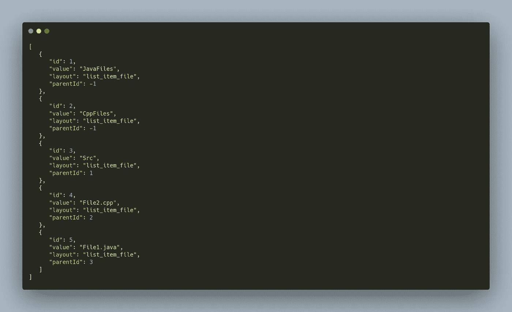
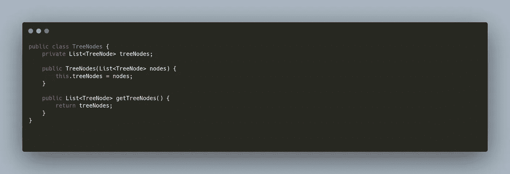
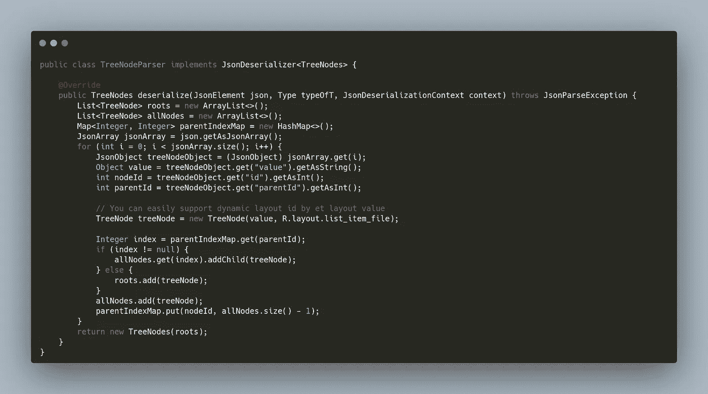
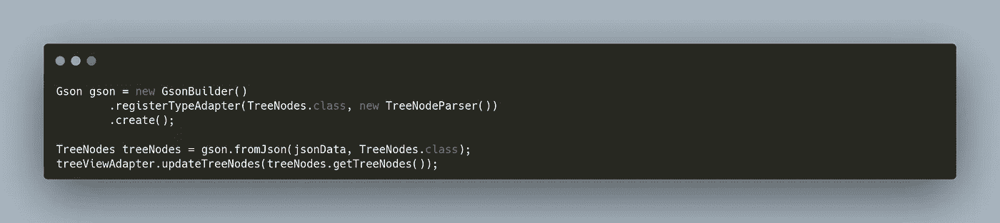
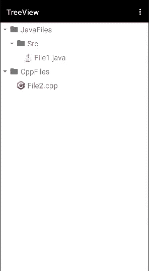

# 如何在 Android 中从 JSON 构建 TreeView

> 原文：<https://itnext.io/how-to-build-treeview-from-json-in-android-9ec342a6205?source=collection_archive---------3----------------------->


大家好，上周我已经介绍了 Android 中的一个新的树形视图实现。在这篇文章中，我将向大家展示如何将 JSON 数据转换成嵌套的树形视图节点。

如果您的数据不在本地，但您将作为 API 响应或从本地字符串接收它们，这种情况会非常有用。在本例中，我们将使用字符串数据作为示例，但如果您从 API 获取数据，同样的代码也可以工作。

第一件事是将 TreeView 和 GSON 库添加到项目中。

```
implementation 'io.github.amrdeveloper:treeview:1.0.0'
implementation 'com.google.code.gson:gson:2.9.0'
```

为 TreeView 准备好您的 XML 布局，不要担心您只需要添加一个 RecyclerView，在文档中您会找到如何定制它，并使它支持 2d 滚动。

```
<androidx.recyclerview.widget.RecyclerView
    android:id="@+id/recycler_view"
    android:layout_width="match_parent"
    android:layout_height="match_parent"/>
```

之后，您需要创建一个 *TreeViewHolderFactory 来将每个视图持有者映射到他的布局*

```
TreeViewHolderFactory factory = (v, layout) -> new FileViewHolder(v);
```

关于自定义视图容器的所有细节和文档都在 TreeView 网站上，在 Github 存储库中有很多例子。

设置 RecyclerView 后，您需要创建一个 TreeViewAdapter 并设置它

```
treeViewAdapter = new TreeViewAdapter(factory); recyclerView.setAdapter(treeViewAdapter);
```

在我们的例子中，想要构建嵌套节点，例如节点 JavaFiles 节点将 Src 作为子节点，Src 将 File1.java 节点作为子节点，所以我们的 json 应该是这样的，你可以扩展它并添加图标、图像等。



现在，我们将创建一个名为 TreeNodes 的类类型，它将保存一个树节点列表。



然后，我们需要创建一个定制的 JsonDeserializer，它可以将我们的 json 数据解析为 TreeNodes，这应该取决于您的响应模式。



然后可以在这里使用 Gson 库获取 TreeNodes 实例，并将其传递给 TreeViewAdapter。



最终的结果将是这样的，但没有图标:D



你可以在 TreeView documentations 网站和 [**Github**](https://github.com/amrdeveloper/treeview) 库上找到本文中的所有代码。

TreeView Github:[**AMR developer/TreeView**](https://github.com/amrdeveloper/treeview)
TreeView 网站:[**Github.io/TreeView**](https://amrdeveloper.github.io/TreeView/)

你可以在: [**GitHub**](https://github.com/amrdeveloper) ， [**LinkedIn**](https://www.linkedin.com/in/amrdeveloper/) ， [**Twitter**](https://twitter.com/amrdeveloper) 上找到我。

享受编程😋。